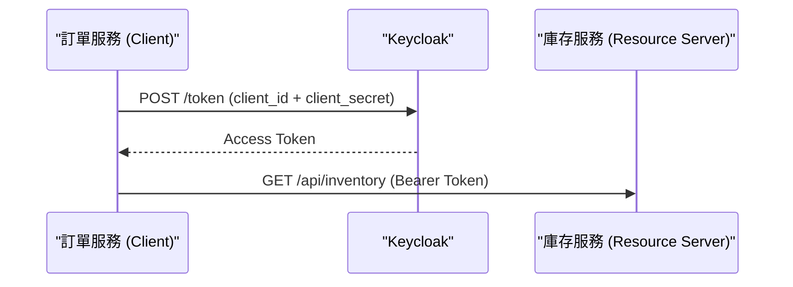
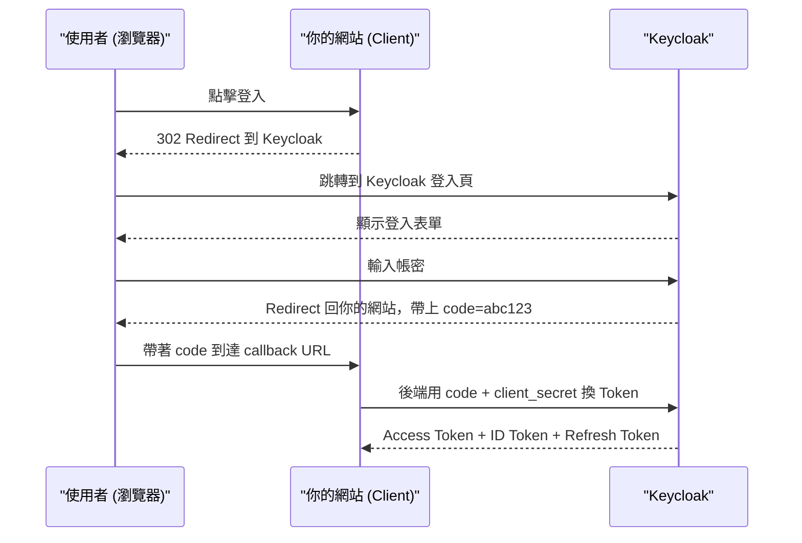
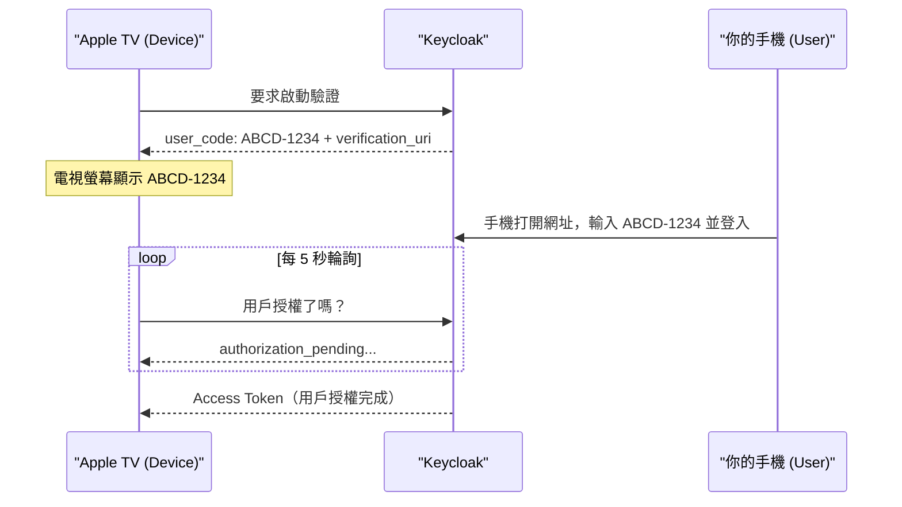

# Keycloak OAuth2 授權流程：核心概念、角色與四種 Grant Type 完整指南

## 目錄
- [1. 為什麼需要 OAuth2](#1-為什麼需要-oauth2)
- [2. OAuth2 與 OIDC 的關係](#2-oauth2-與-oidc-的關係)
    - [2.1. OAuth2：授權協議](#21-oauth2授權協議)
    - [2.2. OIDC：認證補充協議](#22-oidc認證補充協議)
    - [2.3. Access Token vs ID Token](#23-access-token-vs-id-token)
- [3. 四個核心角色](#3-四個核心角色)
    - [3.1. 精確定義](#31-精確定義)
    - [3.2. Client vs Resource Server 的判斷方式](#32-client-vs-resource-server-的判斷方式)
    - [3.3. 三種常見架構對應](#33-三種常見架構對應)
- [4. Grant Type：四種取得 Token 的方式](#4-grant-type四種取得-token-的方式)
    - [4.1. Client Credentials](#41-client-credentials)
    - [4.2. Authorization Code](#42-authorization-code)
    - [4.3. Resource Owner Password Credentials](#43-resource-owner-password-credentials)
    - [4.4. Device Code](#44-device-code)
- [5. SSO 的實現原理](#5-sso-的實現原理)
- [6. 總結：OAuth2 存在的本質原因](#6-總結oauth2-存在的本質原因)

---

## 1. 為什麼需要 OAuth2

想像這個情境：你的網站想讓用戶用 Google 帳號登入，需要知道「這個人是誰」。但你不能要求用戶把 Google 密碼打在你的網站上，因為：

- 你的網站對 Google 來說是外來的第三方，Google 不信任你
- 用戶不應該信任第三方保管他的第一方密碼
- 一旦洩漏，攻擊者可以用該密碼存取用戶在 Google 的所有資料

OAuth2 的解法是：**把用戶「轉交」給 Google 驗證，Google 確認身份後再把授權結果通知回你的網站。你的網站從頭到尾看不到用戶密碼。**

---

## 2. OAuth2 與 OIDC 的關係

### 2.1. OAuth2：授權協議

OAuth2 是一個**授權（Authorization）協議**，它只解決一件事：「這個應用被允許做什麼？」它不在乎登入的是誰，只在乎「這個 Token 有沒有權限」。

### 2.2. OIDC：認證補充協議

OpenID Connect（OIDC）是**蓋在 OAuth2 上面的擴充層**，負責解決「你是誰（Authentication）」這個問題。OIDC 在 OAuth2 的基礎上新增了 ID Token。

```
+-----------------------------+
|  OpenID Connect (OIDC)      |  <- 負責「你是誰」（認證）
|  新增了 ID Token             |
+-----------------------------+
|  OAuth 2.0                  |  <- 負責「你能做什麼」（授權）
|  定義 Access Token 和流程    |
+-----------------------------+
```

Keycloak 同時實作了 OAuth2 與 OIDC，所以執行一次流程，兩個 Token 都能拿到。

### 2.3. Access Token vs ID Token

| | Access Token | ID Token |
|---|---|---|
| 目的 | 授權（能不能用這支 API） | 認證（登入的人是誰） |
| 給誰用 | Resource Server 驗放行 | Client 取得用戶身份資訊 |
| 內容 | 權限範圍（scope）、過期時間 | 用戶名稱、email、sub |

Keycloak 在 Authorization Code Flow 結束後同時回傳兩者：

```json
{
  "access_token": "eyJhbGci...",
  "id_token": "eyJhbGci...",
  "refresh_token": "eyJhbGci...",
  "expires_in": 300
}
```

**Token 驗證方式**：Resource Server 不需要每次都去問 Keycloak。Access Token 是 JWT 格式，內含 Keycloak 的數位簽章，Resource Server 只需拿 Keycloak 的公鑰在本地驗簽即可，不需要發網路請求。

---

## 3. 四個核心角色

### 3.1. 精確定義

| 角色 | 定義 | 白話 |
|---|---|---|
| Resource Owner | 資源的擁有者 | 使用你網站的用戶本人 |
| Client | 主動去 Keycloak 要 Token 的程式 | 你寫的應用（前端或後端） |
| Authorization Server | 負責驗證身份、發放 Token 的服務 | Keycloak（IdP） |
| Resource Server | 收到 Request 後驗證 Token 有效性的程式 | 你寫的被保護 API |

### 3.2. Client vs Resource Server 的判斷方式

判斷角色不是看「前端」或「後端」，而是看**這個程式在這次請求裡做了什麼行為**：

- **有沒有去打 Keycloak 的 `/token` endpoint？** → 有 = 它是 Client
- **有沒有收到 Request 然後去驗證 Token？** → 有 = 它是 Resource Server

同一個程式同時做這兩件事，它就同時扮演兩個角色。

### 3.3. 三種常見架構對應

**架構 A：單體應用**

你的網站同時負責發起登入（Client）和保護 API（Resource Server），兩個角色合一。

**架構 B：前後端分離**

```
使用者 → 前端（Client，去 Keycloak 要 Token）
            → 後端 API（Resource Server，驗 Token）
```

**架構 C：微服務（同時兩種角色）**

```
使用者 → 前端（Client）
            → 訂單服務（Resource Server + Client）
                  → 庫存服務（Resource Server）
```

訂單服務做了兩件事：收到前端的 Token 去驗（Resource Server），同時自己去 Keycloak 換新 Token 打庫存 API（Client）。

---

## 4. Grant Type：四種取得 Token 的方式

Grant Type 描述的是「用什麼方式來證明你有資格拿到這個 Token」，也就是取得 Token 的完整流程。

### 4.1. Client Credentials

**適用場景**：後端服務對後端服務（無真實用戶參與）。

**核心概念**：服務用自己的 `client_id` + `client_secret` 換 Token，概念類似服務帳號的帳密。



**實際 Request：**

```http
POST /realms/my-realm/protocol/openid-connect/token
Content-Type: application/x-www-form-urlencoded

grant_type=client_credentials
&client_id=order-service
&client_secret=super-secret-value
```

**Keycloak 回傳：**

```json
{
  "access_token": "eyJhbGci...",
  "expires_in": 300,
  "token_type": "Bearer"
}
```

**注意事項：**

- `expires_in: 300` 代表 5 分鐘後過期，服務需自行處理 Token 快取與更新
- 此流程**沒有 Refresh Token**，因為 client_secret 本就在手上，直接重新打 `/token` 即可
- Keycloak 設定：建立 Client，Access Type 設為 `confidential`，開啟 `Service Accounts Enabled`

### 4.2. Authorization Code

**適用場景**：網頁應用、Mobile App 的用戶登入（有真實用戶參與）。這也是取得 ID Token 的標準流程。

**核心概念**：用戶被導向 Keycloak 輸入帳密，Keycloak 驗證後回傳一個一次性的 `code`，再由後端用 `code` 換 Token。你的應用從頭到尾看不到用戶密碼。

**為什麼需要 code 這個中間人？**

步驟 5 的 redirect 是走瀏覽器網址列，URL 會出現在瀏覽器歷史、Server log、Referer header。如果 Token 直接放在 URL 裡就等於暴露。`code` 只是一張一次性兌換券，真正的 Token 是在後端對後端悄悄換回來的，不經過瀏覽器。



**換 Token 的 Request：**

```http
POST /realms/my-realm/protocol/openid-connect/token
Content-Type: application/x-www-form-urlencoded

grant_type=authorization_code
&code=abc123
&redirect_uri=https://yourapp.com/callback
&client_id=your-app
&client_secret=your-secret
```

**和 Client Credentials 的關鍵差異：**

| | Client Credentials | Authorization Code |
|---|---|---|
| 有無真實用戶 | 沒有 | 有 |
| 誰發起請求 | 服務本身 | 使用者的瀏覽器 |
| 有 Refresh Token | 沒有 | 有 |
| 會拿到 ID Token | 否 | 是 |

### 4.3. Resource Owner Password Credentials（密碼流）

**適用場景**：第一方（與 Auth Server 同組織開發的）高度信任的應用，例如 Keycloak 官方 Admin CLI。

**核心概念**：用戶把帳密直接交給 Client，Client 拿去換 Token。這違反了 OAuth2「Client 不應拿到用戶密碼」的核心精神。

```http
POST /realms/my-realm/protocol/openid-connect/token

grant_type=password
&client_id=my-app
&client_secret=xxx
&username=john
&password=secret123
```

**重要警告：**

- OAuth2 新版規範（2.1）已**正式移除**此 Grant Type
- Keycloak 預設關閉
- 只要能用 Authorization Code，就不應該用密碼流
- 絕對不能給第三方應用使用

### 4.4. Device Code

**適用場景**：輸入能力受限的裝置，例如 Apple TV、CLI 工具、IoT 裝置。

**核心概念**：裝置拿到一組顯示在螢幕上的短碼（`user_code`），用戶用另一台有瀏覽器的設備（手機）打開網址輸入短碼完成登入。裝置透過輪詢（polling）等待授權完成。



**實際應用例子：** 執行 `gcloud auth login` 時，終端機印出一個網址，你用瀏覽器打開登入，CLI 就自動拿到 Token，這就是 Device Code Flow。

---

## 5. SSO 的實現原理

SSO（Single Sign-On）透過 Keycloak 的集中 Session 機制實現，OIDC 是其底層標準協議。

流程如下：

1. 你登入「系統 A」，瀏覽器被導向 Keycloak 登入頁，輸入帳密
2. Keycloak 驗證成功，在自己的 domain 種下一個 Session Cookie
3. 你去「系統 B」，系統 B 同樣把你導向 Keycloak
4. Keycloak 發現 Session Cookie 還在，不需要再輸入帳密，直接發 Token 回去
5. 系統 B 拿到 Token，你就登入了

**關鍵**：所有系統都信任同一個 Keycloak，Keycloak 替你集中管理那個 Session。

---

## 6. 總結：OAuth2 存在的本質原因

OAuth2 解決的核心問題是：**用戶想透過第一方（Google、Keycloak）登入第三方應用，但不能把第一方的帳密直接打入第三方，以防帳密洩漏。**

透過 OAuth2，第三方應用（Client）可以在用戶授權的前提下，取得被保護資源（Resource Server）的存取權，而整個過程中帳密只在用戶和 Auth Server 之間流動，第三方 Client 永遠看不到。

**四種 Grant Type 選擇原則：**

| Grant Type | 有無用戶 | 推薦使用 |
|---|---|---|
| Client Credentials | 無 | 後端對後端 API |
| Authorization Code | 有 | 網頁、App 登入（主流） |
| Password | 有 | 不推薦，已被棄用 |
| Device Code | 有 | 電視、CLI、IoT |