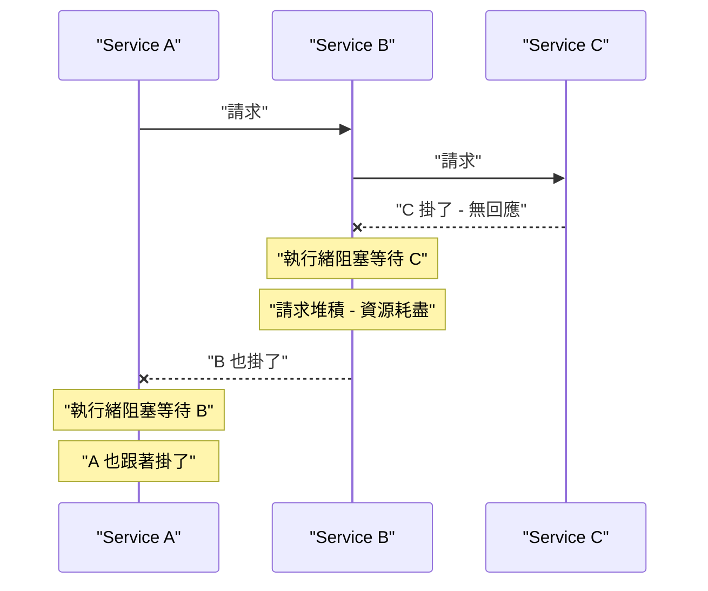
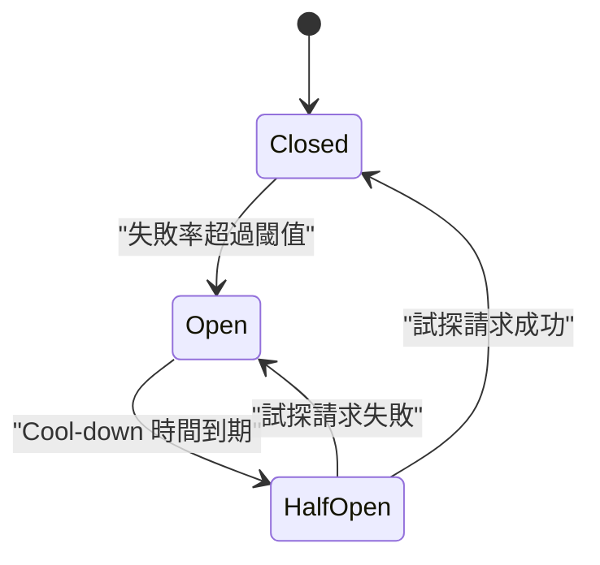
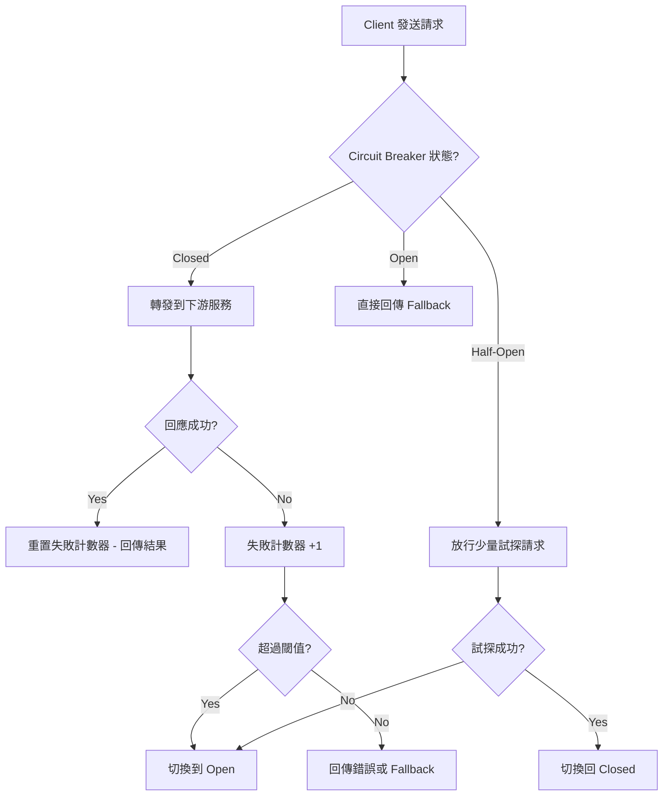
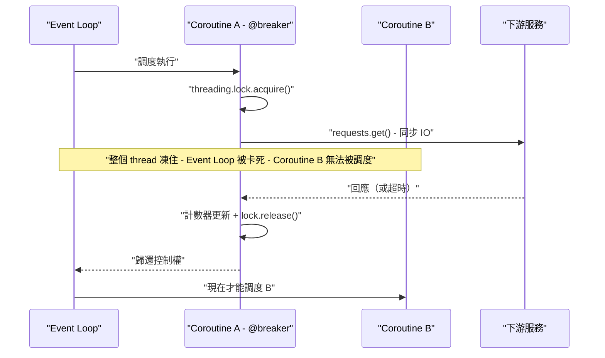
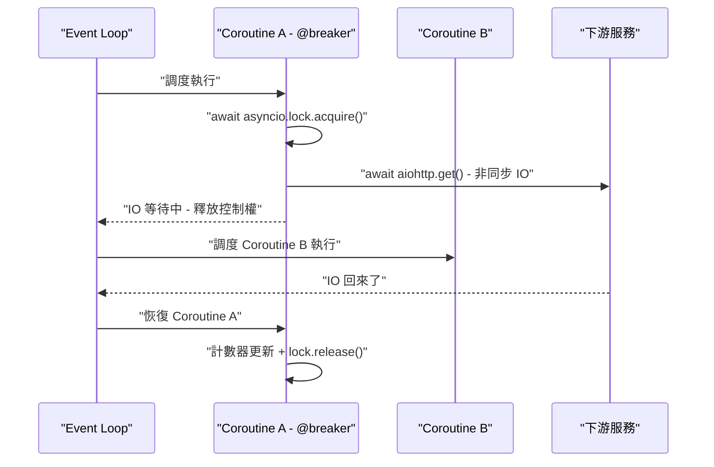
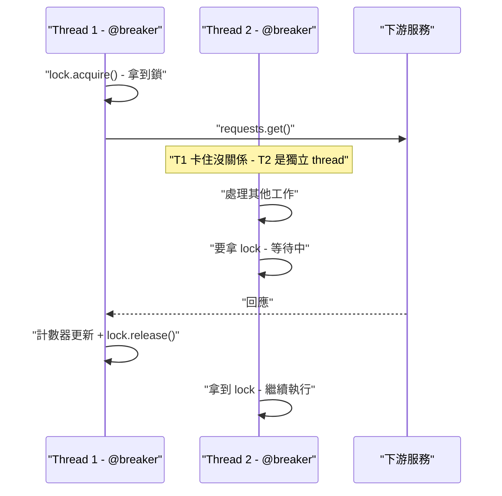

# Circuit Breaker 熔斷器模式：原理、狀態機制與 Python 實作

## 目錄
- [Circuit Breaker 熔斷器模式：原理、狀態機制與 Python 實作](#circuit-breaker-熔斷器模式原理狀態機制與-python-實作)
  - [目錄](#目錄)
  - [1. 問題背景：級聯故障](#1-問題背景級聯故障)
  - [2. Circuit Breaker 核心概念](#2-circuit-breaker-核心概念)
    - [2.1. 三種狀態與狀態轉換](#21-三種狀態與狀態轉換)
    - [2.2. 請求處理流程](#22-請求處理流程)
  - [3. 關鍵參數詳解](#3-關鍵參數詳解)
    - [3.1. Failure Threshold：次數型 vs 比率型](#31-failure-threshold次數型-vs-比率型)
    - [3.2. Timeout 與失敗判定的關係](#32-timeout-與失敗判定的關係)
    - [3.3. Cool-down Period](#33-cool-down-period)
  - [4. Python 實作：pybreaker](#4-python-實作pybreaker)
    - [4.1. 基本用法與完整例外處理](#41-基本用法與完整例外處理)
    - [4.2. 失敗計數是跨請求累積](#42-失敗計數是跨請求累積)
    - [4.3. Circuit Breaker vs Retry 的職責分離](#43-circuit-breaker-vs-retry-的職責分離)
    - [4.4. pybreaker vs aiobreaker：同步與非同步的差異](#44-pybreaker-vs-aiobreaker同步與非同步的差異)
  - [5. 常見實作框架對比](#5-常見實作框架對比)

## 1. 問題背景：級聯故障

在微服務架構中，服務之間存在呼叫鏈。當下游服務掛掉或回應極慢時，上游服務的執行緒會被阻塞等待回應。大量請求堆積後，上游服務自身也會耗盡資源跟著掛掉，接著依賴上游的其他服務也連鎖倒下——這就是級聯故障（Cascading Failure）。



Circuit Breaker 就是為了解決這個問題而生的設計模式，概念源自電氣工程的保險絲：偵測到下游異常時主動"斷開電路"，不再發送請求，立即回傳預設的 fallback 回應，讓上游服務不被拖垮，也給下游喘息時間恢復。

## 2. Circuit Breaker 核心概念

### 2.1. 三種狀態與狀態轉換

Circuit Breaker 本質上是一個狀態機，在三種狀態間循環切換：

**Closed（閉合/正常）**：請求正常通過，同時持續監控失敗率。當失敗次數或失敗率超過設定閾值，切換到 Open。

**Open（斷開/熔斷）**：所有請求直接被攔截，不會送到下游，立即回傳 fallback（錯誤回應、快取資料、預設值等）。經過一段 cool-down 時間後，自動切換到 Half-Open。

**Half-Open（半開/試探）**：放行少量試探性請求到下游。如果試探成功，回到 Closed 恢復正常；如果仍然失敗，退回 Open 繼續等待。



### 2.2. 請求處理流程



## 3. 關鍵參數詳解

| 參數 | 說明 | 典型值 |
|---|---|---|
| Failure Threshold | 觸發熔斷的失敗次數或比率 | 5 次或 50% |
| Timeout | 單次請求超時時間 | 3-5 秒 |
| Cool-down Period | Open 狀態持續時間 | 10-60 秒 |
| Half-Open Max Requests | 試探階段允許的請求數 | 1-3 次 |

### 3.1. Failure Threshold：次數型 vs 比率型

觸發熔斷的閾值有兩種設定方式：

**次數型**：連續失敗 N 次就熔斷。問題在於判斷不穩定——偶爾連續抖幾下就誤斷，但交替失敗（成功、失敗、成功、失敗...）即使失敗率已經 50% 也永遠不會觸發。

**比率型（更常見）**：在一個滑動視窗（sliding window）內計算失敗率，例如"最近 20 次請求中失敗率超過 50% 就熔斷"。這種方式更穩定，因為它看的是整體健康狀況，能容忍偶發的零星錯誤（20 次中偶爾失敗 2-3 次不會觸發），同時又能抓到真正的異常（失敗 11 次 = 55% 就觸發）。

### 3.2. Timeout 與失敗判定的關係

Timeout 本身不會直接把狀態切成 Open。它的角色是定義"什麼算一次失敗"：請求送往下游後，超過 timeout 還沒回應，這次請求就被判定為一次失敗，失敗計數器 +1。累積到閾值後才觸發熔斷。

流程是：請求超時 → 計為一次失敗 → 失敗累積到閾值 → 切換 Open。不是一次超時就直接熔斷。

### 3.3. Cool-down Period

Open 狀態持續 cool-down period 這段時間後，自動轉為 Half-Open，開始放行少量試探請求。這段等待時間是給下游服務恢復的緩衝期。

## 4. Python 實作：pybreaker

Python 標準庫不包含 Circuit Breaker，需要使用第三方套件。最經典的是 `pybreaker`。

### 4.1. 基本用法與完整例外處理

```python
import pybreaker
import requests

breaker = pybreaker.CircuitBreaker(
    fail_max=5,           # 失敗 5 次觸發熔斷
    reset_timeout=30,     # cool-down 30 秒後進入 half-open
)

@breaker
def call_downstream_service():
    response = requests.get("https://some-service/api", timeout=3)
    response.raise_for_status()
    return response.json()

try:
    result = call_downstream_service()
except pybreaker.CircuitBreakerError:
    # 熔斷中，直接走 fallback
    result = {"fallback": True}
except requests.exceptions.RequestException:
    # 一般請求失敗（超時、500 等）
    # pybreaker 已經在背後記了一筆失敗
    result = {"fallback": True}
```

關於 `raise_for_status()` 的作用：`requests.get()` 本身不會因為收到 HTTP 500 就拋例外，只要有收到回應就算"請求完成"。`raise_for_status()` 的職責是檢查狀態碼，2xx 不動作，4xx 和 5xx 則拋出 `HTTPError`。如果不加這行，下游回 500 時 pybreaker 不會記錄失敗，熔斷器等於失效。

例外觸發鏈整理：

- 請求超時 → 拋 `requests.exceptions.Timeout` → pybreaker 計失敗
- 收到 4xx/5xx + `raise_for_status()` → 拋 `HTTPError` → pybreaker 計失敗
- 收到 2xx → 不拋例外 → pybreaker 計成功

### 4.2. 失敗計數是跨請求累積

`breaker` 是一個全域共享的實例，所有經過它的請求共用同一個失敗計數器。在一個 Server 中（單一 process），不管是哪個 Client 打進來的請求，失敗都往同一個計數器累加。

```python
@app.route("/api/data")
def get_data():
    try:
        result = call_downstream_service()
    except pybreaker.CircuitBreakerError:
        result = {"fallback": True}
    except requests.exceptions.RequestException:
        result = {"fallback": True}
    return result
```

```text
14:00:01 - Client A 呼叫 → 下游 500 → RequestException fallback → breaker 記失敗 1
14:00:02 - Client B 呼叫 → 下游 500 → RequestException fallback → breaker 記失敗 2
14:00:03 - Client C 呼叫 → 下游 timeout → RequestException fallback → breaker 記失敗 3
14:00:05 - Client D 呼叫 → 下游 500 → RequestException fallback → breaker 記失敗 4
14:00:06 - Client E 呼叫 → 下游 503 → RequestException fallback → breaker 記失敗 5 → 觸發熔斷
14:00:07 - Client F 呼叫 → breaker 直接攔截 → CircuitBreakerError fallback → 請求根本沒送出
```

Circuit Breaker 保護的粒度是"這台 server 對某個下游服務的整體健康判斷"，不是針對單一 client。前幾個 client 的請求幫忙"探路"踩到失敗，累積到閾值後，後續所有 client 都不用再浪費時間等下游超時，直接拿 fallback。

### 4.3. Circuit Breaker vs Retry 的職責分離

Circuit Breaker 和 Retry 是兩個獨立的關注點：

- **Circuit Breaker**：下游不健康時快速失敗，保護上游不被拖垮
- **Retry**：偶發失敗時自動重試，提高單次呼叫的成功率

pybreaker 不會幫你重試，它只負責"記帳 + 擋請求"。如果需要重試邏輯，額外搭配 `tenacity` 等 retry 套件：

```python
from tenacity import retry, stop_after_attempt, wait_fixed

@breaker
@retry(stop=stop_after_attempt(3), wait=wait_fixed(1))
def call_downstream_service():
    response = requests.get("https://some-service/api", timeout=3)
    response.raise_for_status()
    return response.json()
```

這樣每次呼叫會先重試最多 3 次，3 次都失敗才算 breaker 的一次失敗。兩層各司其職。

### 4.4. pybreaker vs aiobreaker：同步與非同步的差異

pybreaker 內部使用 `threading.Lock` 保護共享狀態（失敗計數器、breaker 狀態），這是一個同步阻塞鎖。在 async 環境（FastAPI / aiohttp）中，只有單一 thread 跑 event loop，`threading.Lock.acquire()` 會直接卡住整個 thread，導致 event loop 凍住，所有其他 coroutine 全部停擺。再加上 pybreaker 搭配的是同步的 `requests.get()`，IO 等待期間也是阻塞的，完全抵銷了 async 架構的優勢。

aiobreaker 使用 `asyncio.Lock`，搭配 `aiohttp` 等非同步 HTTP client。碰到 IO 等待時透過 `await` 把控制權交回 event loop，讓其他 coroutine 可以繼續被調度執行。IO 回來後再恢復執行，拿回 lock 進行計數器更新等 CPU 操作。

**Async 環境 - pybreaker（問題場景）：整個 thread 被凍住**



**Async 環境 - aiobreaker（正確做法）：event loop 自由調度**



**Sync 環境 - pybreaker（多 thread，正常運作）**



總結選擇依據：async 框架（FastAPI / aiohttp）用 aiobreaker，避免同步阻塞摧毀 event loop 的併發能力；sync 框架（Flask / Django + Gunicorn thread workers）用 pybreaker，多 thread 環境下同步鎖完全正常運作。

```python
# pybreaker（同步，搭配 Flask / Django）
@breaker
def call_service():
    response = requests.get("https://api.example.com")
    response.raise_for_status()
    return response.json()

# aiobreaker（非同步，搭配 FastAPI / aiohttp）
@breaker
async def call_service():
    async with aiohttp.ClientSession() as session:
        async with session.get("https://api.example.com") as resp:
            return await resp.json()
```

## 5. 常見實作框架對比

| 語言/層級 | 套件 | 特點 |
|---|---|---|
| Python | pybreaker | 最經典，API 簡潔，純 Circuit Breaker |
| Python | tenacity | 主打 retry，可搭配自訂邏輯實現類似效果 |
| Python (async) | aiobreaker | pybreaker 的 async 版本 |
| Java | Resilience4j | 功能最完整，支援多種 resilience pattern |
| .NET | Polly | .NET 生態主流 |
| Go | sony/gobreaker | 輕量簡潔 |
| Node.js | opossum | Node 生態常用 |
| 基礎設施層 | Istio / Service Mesh | 在 sidecar proxy 層做 Circuit Breaking，不需改應用程式碼 |