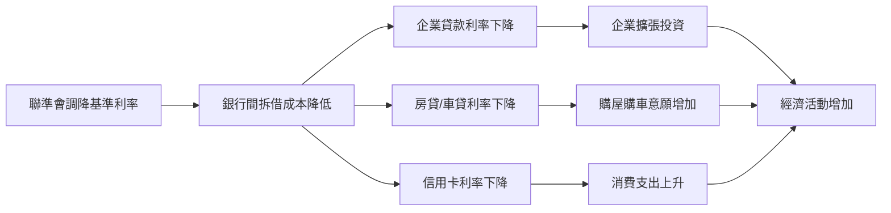
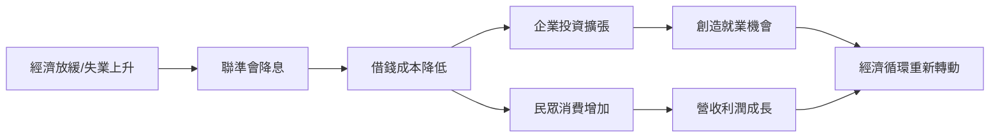
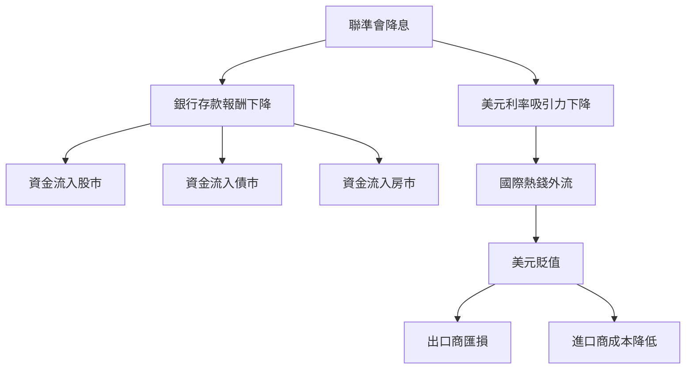
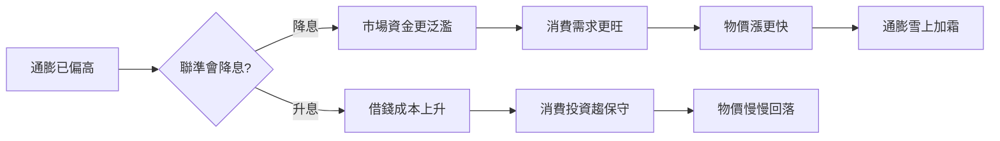
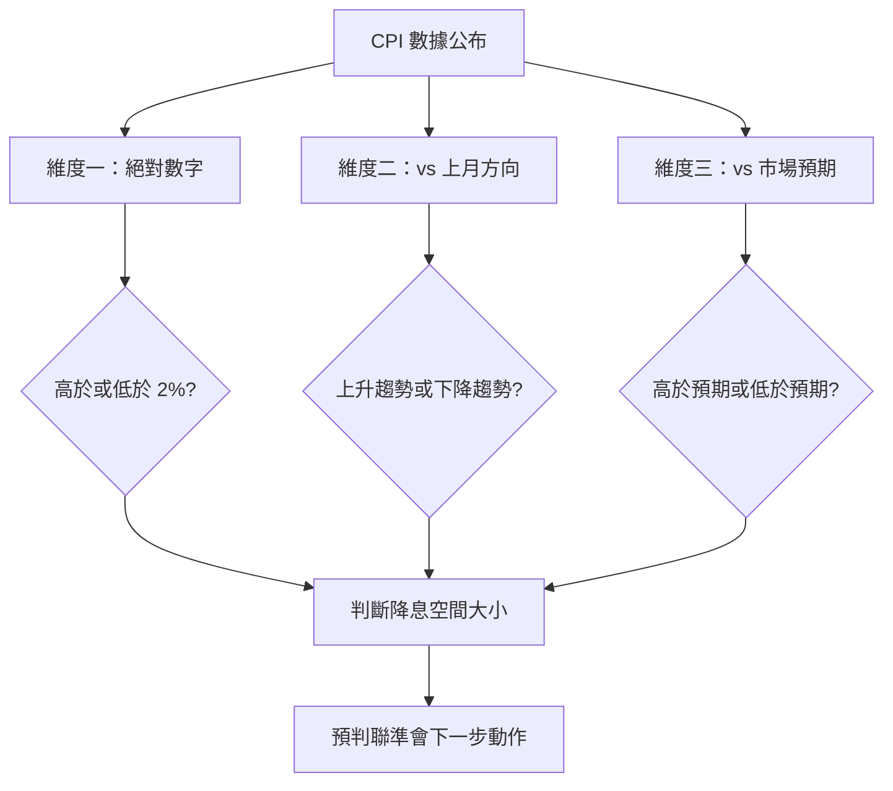

# 聯準會降息機制 — 基準利率、通膨、CPI 與市場影響全解析

## 目錄
- [聯準會降息機制 — 基準利率、通膨、CPI 與市場影響全解析](#聯準會降息機制--基準利率通膨cpi-與市場影響全解析)
  - [目錄](#目錄)
  - [1. 降息的定義與基本原理](#1-降息的定義與基本原理)
    - [1.1. 什麼是基準利率](#11-什麼是基準利率)
    - [1.2. 利率的傳導機制](#12-利率的傳導機制)
  - [2. 聯準會為什麼要降息](#2-聯準會為什麼要降息)
  - [3. 降息對市場的四大影響](#3-降息對市場的四大影響)
    - [3.1. 股市 — 資金搬家效應](#31-股市--資金搬家效應)
    - [3.2. 債券 — 舊券變搶手](#32-債券--舊券變搶手)
    - [3.3. 匯率 — 熱錢追高利率](#33-匯率--熱錢追高利率)
    - [3.4. 房地產 — 月供變少買氣上升](#34-房地產--月供變少買氣上升)
    - [3.5. 四大影響連動關係](#35-四大影響連動關係)
  - [4. 通膨與降息的矛盾關係](#4-通膨與降息的矛盾關係)
    - [4.1. 通膨高企 — 為什麼不能降息](#41-通膨高企--為什麼不能降息)
    - [4.2. 聯準會 2% 通膨目標](#42-聯準會-2-通膨目標)
  - [5. CPI 消費者物價指數](#5-cpi-消費者物價指數)
    - [5.1. CPI 的定義與 Core CPI](#51-cpi-的定義與-core-cpi)
    - [5.2. CPI 區間與降息機率對照](#52-cpi-區間與降息機率對照)
    - [5.3. 讀新聞的三維度判斷法](#53-讀新聞的三維度判斷法)
  - [6. 決策機構 — FOMC](#6-決策機構--fomc)

## 1. 降息的定義與基本原理

### 1.1. 什麼是基準利率

降息是指**中央銀行**調降其制定的**基準利率**。在美國，這個利率稱為 **Federal Funds Rate（聯邦基金利率）**，由聯準會（Fed）決定。聯準會是"銀行的銀行"，一般商業銀行之間互相借錢時，以此利率為基準。

比喻：基準利率就像水龍頭的閥門，降息等於把閥門開大，讓更多的錢（流動性）流入市場。

### 1.2. 利率的傳導機制

基準利率並非直接影響消費者，而是層層傳導：

## 2. 聯準會為什麼要降息

聯準會依法承擔兩大使命：**維持物價穩定** 與 **促進最大就業**，降息是在經濟放緩時使用的工具。核心因果鏈為：

## 3. 降息對市場的四大影響

### 3.1. 股市 — 資金搬家效應

降息前，100 萬放銀行定存年利率 5%，穩拿 5 萬利息。降息後定存降到 2%，只拿 2 萬。投資人轉向股市尋求更高報酬（例如某股票殖利率仍有 3-4%），大量資金湧入推升股價。

企業端同樣受益：原本以 7% 利率借 1 億擴廠，年利息 700 萬。降息後利率 4%，利息僅 400 萬，省下 300 萬直接變成淨利潤，獲利改善帶動股價上漲。

### 3.2. 債券 — 舊券變搶手

去年買了一張公債，票面利率 5%，年配息 5 萬。降息後新公債利率只有 3%，年配息 3 萬。手中"年付 5 萬"的舊券自然搶手，別人願意出更高價格購買 → 債券價格上漲。所以市場預期降息時，投資人會提前買進債券賺價差。

### 3.3. 匯率 — 熱錢追高利率

國際投資人持有 100 萬美元，降息前美國利率 5%，資金停在美國。降息至 2% 後，美日利差縮小，資金可能轉投利率更高的市場（如新興市場 6-7%）。大量"賣美元、買他幣"導致美元貶值。對台灣出口商而言，美元貶值代表美元營收換回台幣時金額縮水。

### 3.4. 房地產 — 月供變少買氣上升

以貸款 800 萬、30 年期為例：

| 情境 | 房貸利率 | 每月月供（約） | 30 年總利息（約） |
|---|---|---|---|
| 降息前 | 4.0% | 38,000 元 | 568 萬 |
| 降息後 | 2.5% | 31,600 元 | 338 萬 |
| 差額 | -1.5% | 每月省 6,400 元 | 省約 230 萬 |

月供降低讓更多人有能力進場，需求增加但供給不變，房價被推高。

### 3.5. 四大影響連動關係

降息像推倒第一張骨牌，資金從低報酬處流向高報酬處：

## 4. 通膨與降息的矛盾關係

### 4.1. 通膨高企 — 為什麼不能降息

"通膨高企"即"通膨率居高不下"。降息讓市場的錢變多，但商品供給短期無法同步增長，太多錢追逐有限商品 → 物價上漲 → 通膨。若通膨已經很嚴重時還降息，等於火沒滅就再澆油：

所以聯準會在通膨高企時不但不降息，反而會**升息**壓制物價。

### 4.2. 聯準會 2% 通膨目標

聯準會認為年通膨率約 2% 是健康經濟的理想水位。高於 2% 太多代表物價漲太快，薪資追不上，民眾購買力縮水。簡化判斷：**通膨高 → 降息機率低（甚至升息）；通膨低 → 降息機率高**。

## 5. CPI 消費者物價指數

### 5.1. CPI 的定義與 Core CPI

**CPI（Consumer Price Index）** 衡量"日常生活花費變貴還是變便宜"。政府追蹤一個包含食物、房租、交通、醫療等項目的"消費籃子"，計算其總花費的月度/年度變化百分比。例如去年籃子花 10,000 元，今年花 10,300 元，CPI 年增率即為 3%。

**Core CPI（核心 CPI）** 剔除食物與能源，因為這兩項波動太大（颱風推升菜價、地緣衝突推升油價），屬短期干擾。聯準會決策時 Core CPI 的參考權重高於總 CPI，更能反映結構性物價趨勢。

另外，聯準會最偏好的指標其實是 **PCE（個人消費支出物價指數）**，但 CPI 每月較早公布，市場將其視為前哨指標來預判政策動向。

### 5.2. CPI 區間與降息機率對照

| CPI 年增率 | 降息機率 | 聯準會動作 | 案例 |
|---|---|---|---|
| > 3.5% | 極低 - 可能升息 | 全力壓制通膨 | 2022-2023 CPI 達 6-9% - 暴力升息至 5.25-5.5% |
| 2.5% - 3.5% | 低 - 觀望 | 按兵不動 | 通膨仍偏高 - 維持利率 |
| 2.0% - 2.5% | 中高 | 開始考慮降息 | 搭配就業轉弱時降息理由更充分 |
| < 2.0% | 高 | 積極降息 | 防止經濟過冷與通縮風險 |

### 5.3. 讀新聞的三維度判斷法

聯準會不只看單月數字，而是看連續趨勢。讀新聞時掌握三個維度：

**範例 A：** CPI 連續數月 3.5% → 3.2% → 2.8% → 2.5%，即使未達 2%，持續下降趨勢讓聯準會有信心開始釋放降息訊號。

**範例 B：** CPI 從 2.4% 突然彈回 2.8%，方向反轉，市場恐慌"降息延後"，股市可能大跌。

## 6. 決策機構 — FOMC

**聯邦公開市場委員會（FOMC）** 負責美國利率決策，由 12 位成員組成（7 位聯準會理事 + 5 位地區聯邦儲備銀行總裁輪值），現任主席為乃偉鮑威爾（Jerome Powell）。FOMC 每年召開 **8 次會議**，綜合評估以下數據做出判斷：

| 數據類型 | 具體指標 | 影響邏輯 |
|---|---|---|
| 通膨 | CPI / Core CPI / PCE | 偏高 → 不降息；趨緩 → 有空間降 |
| 就業 | 非農就業報告 / 失業率 | 就業差 → 降息壓力大 |
| 經濟成長 | GDP 成長率 | 放緩 → 降息刺激需求 |
| 外部環境 | 全球經濟與金融穩定性 | 系統性風險 → 可能緊急降息 |