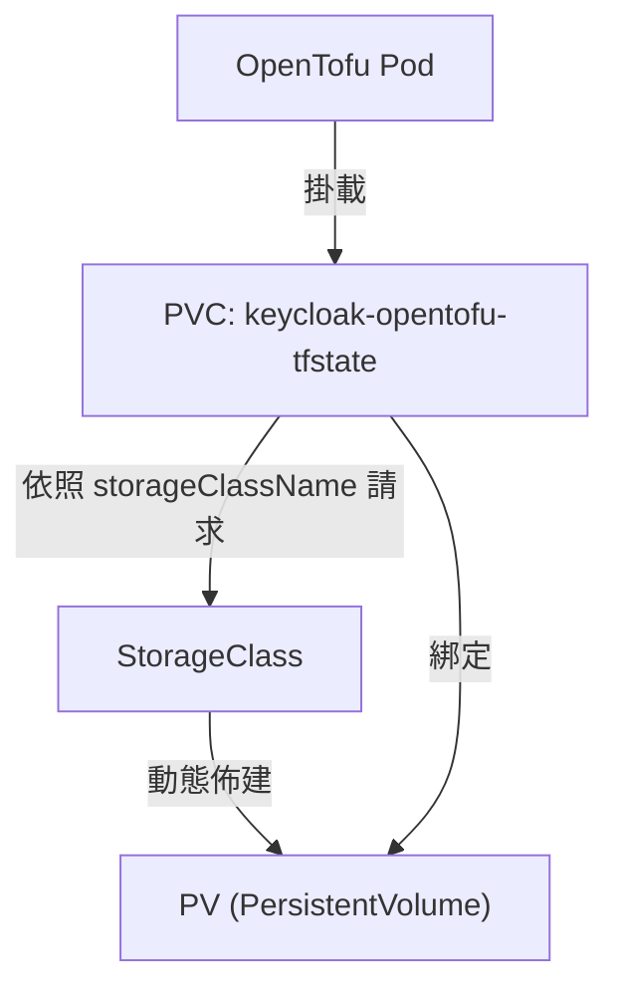
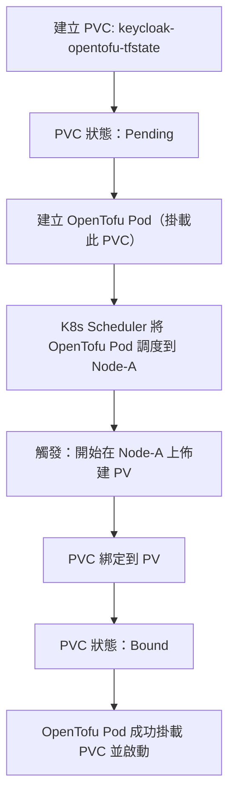
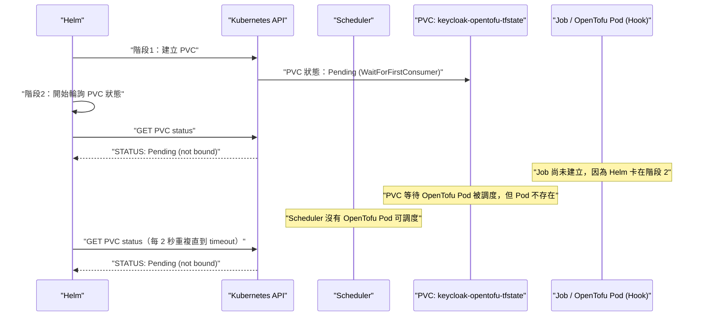
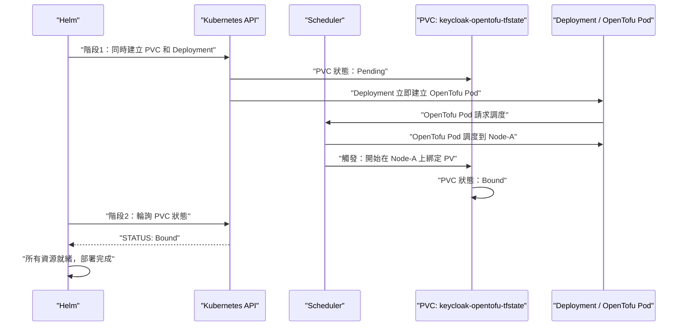
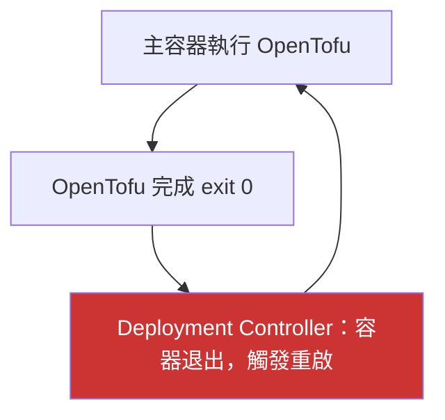
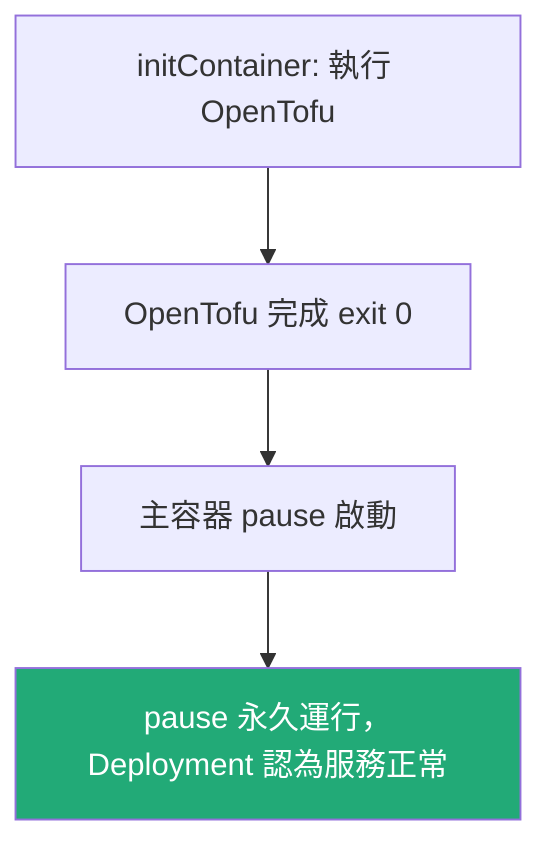

# Kubernetes PVC Not Bound 死鎖診斷：Helm Hook 與 WaitForFirstConsumer 衝突排查指南

## 目錄
- [1. 讀懂錯誤訊息](#1-讀懂錯誤訊息)
    - [1.1. 拆解 Log 格式](#11-拆解-log-格式)
    - [1.2. DBG 是什麼等級？](#12-dbg-是什麼等級)
- [2. 建立心智模型](#2-建立心智模型)
    - [2.1. 資源關係總覽](#21-資源關係總覽)
    - [2.2. WaitForFirstConsumer 綁定機制](#22-waitforfirstconsumer-綁定機制)
- [3. 按步驟 Debug](#3-按步驟-debug)
    - [3.1. 步驟一：確認 PVC 狀態](#31-步驟一確認-pvc-狀態)
    - [3.2. 步驟二：確認是否 WaitForFirstConsumer](#32-步驟二確認是否-waitforfirstconsumer)
    - [3.3. 步驟三：確認是否有 Pod 掛載此 PVC](#33-步驟三確認是否有-pod-掛載此-pvc)
    - [3.4. 步驟四：確認是否使用 Helm Hook](#34-步驟四確認是否使用-helm-hook)
- [4. 根本原因：Helm Hook 死鎖](#4-根本原因helm-hook-死鎖)
    - [4.1. 三個階段如何形成死鎖](#41-三個階段如何形成死鎖)
    - [4.2. 死鎖時序圖](#42-死鎖時序圖)
- [5. 解決方案：改用 Deployment + initContainer](#5-解決方案改用-deployment--initcontainer)
    - [5.1. 方案原理](#51-方案原理)
    - [5.2. 為什麼需要 initContainer + pause？](#52-為什麼需要-initcontainer--pause)
    - [5.3. 正確的 Deployment 配置](#53-正確的-deployment-配置)
- [6. 快速參考](#6-快速參考)
    - [6.1. 錯誤類型對照表](#61-錯誤類型對照表)
    - [6.2. 應急方法比較](#62-應急方法比較)

---

## 1. 讀懂錯誤訊息

### 1.1. 拆解 Log 格式

新手看到以下 log 時，第一步是拆解格式，從中找出要查哪個資源：

```text
2026-03-03 12:57:10 DBG PersistentVolumeClaim is not bound: <namespace>/<pvc-name>
```

| 欄位 | 說明 |
|------|------|
| 時間戳 | 錯誤發生時間 |
| `DBG` | DEBUG 級別（見下方說明） |
| `PersistentVolumeClaim is not bound` | PVC 尚未綁定到任何 PV |
| `<namespace>` | 這個 PVC 所在的 K8s namespace，用來隔離不同專案或環境的資源群組 |
| `<pvc-name>` | 要去查詢的 PVC 資源名稱 |

**立即行動**：從 log 拆出 `<namespace>` 與 `<pvc-name>`，後續所有 `kubectl` 指令都會用到這兩個值。

### 1.2. DBG 是什麼等級？

`DBG` 是 `DEBUG` 的縮寫，代表這是 Helm 在輪詢（polling）資源狀態時輸出的診斷訊息。新手常見誤解是以為 DEBUG 級別不重要可以忽略。實際上在 Helm 部署流程中，這行訊息代表 Helm 正在循環等待 PVC 變成 `Bound` 狀態，每隔 2 秒輸出一次，無限循環直到超時。看到這行訊息重複出現，就是部署已卡住的明確訊號。

| 等級 | 縮寫 | 意義 |
|------|------|------|
| DEBUG | `DBG` | 詳細診斷資訊，通常是內部狀態輪詢 |
| INFO | `INF` | 一般操作資訊 |
| WARNING | `WRN` | 潛在問題，但尚未失敗 |
| ERROR | `ERR` | 已發生錯誤，需要介入 |

---

## 2. 建立心智模型

### 2.1. 資源關係總覽

這個問題涉及兩組 Pod，新手常混淆，必須先區分清楚：

```
Keycloak Pod                                  ← Keycloak 應用本身，與此問題無關
OpenTofu Pod                                  ← 執行 terraform/opentofu 的 Pod
  └── 掛載 PVC (keycloak-opentofu-tfstate)    ← 用來存放 terraform state 檔案
        └── 需要綁定到 PV 才能使用
```

WaitForFirstConsumer 的觸發條件非常具體：必須是「掛載這個 PVC 的 Pod」被 Scheduler 調度，才會觸發綁定。不是任意 Pod，而是 OpenTofu Pod 本身。

PVC、StorageClass、Pod 三者的依賴關係：



- **PVC**：應用程式的「儲存需求單」，聲明需要多大空間、什麼存取模式
- **PV**：實際的儲存空間，可能是雲端磁碟（EBS、GCP PD）或本地磁碟
- **StorageClass**：定義如何動態佈建 PV，以及何時綁定（`volumeBindingMode`）

### 2.2. WaitForFirstConsumer 綁定機制

StorageClass 有兩種綁定模式，這是造成本問題的核心：

| 模式 | 觸發時機 | 適用場景 |
|------|----------|---------|
| `Immediate` | PVC 建立後立即綁定 PV | 網路儲存（EBS、NFS） |
| `WaitForFirstConsumer` | 等到第一個掛載此 PVC 的 Pod 被 Scheduler 調度後才綁定 | 本地儲存、需要節點親和性 |

`WaitForFirstConsumer` 的設計目的是讓 PV 在正確的節點上佈建，避免 Pod 被調度到沒有對應 PV 的節點。觸發流程：



**關鍵**：觸發點是「掛載此 PVC 的 Pod 被調度」，不是任意 Pod，也不是 Pod Running。如果 OpenTofu Pod 不存在，PVC 將永遠停在 `Pending` 狀態。

---

## 3. 按步驟 Debug

拿到 `<namespace>` 和 `<pvc-name>` 後，依序執行以下四個步驟。

### 3.1. 步驟一：確認 PVC 狀態

```bash
kubectl get pvc <pvc-name> -n <namespace>
```

預期輸出（問題情境）：

```text
NAME           STATUS    VOLUME   CAPACITY   ACCESS MODES   STORAGECLASS   AGE
<pvc-name>     Pending                                       gp2            5m
```

- `STATUS = Pending`：PVC 尚未綁定，繼續下一步
- `STATUS = Bound`：PVC 已綁定，問題不在此，需往其他方向排查

### 3.2. 步驟二：確認是否 WaitForFirstConsumer

```bash
kubectl describe pvc <pvc-name> -n <namespace>
```

重點看 `Events` 區段：

```text
Events:
  Type    Reason                Age   From                         Message
  ----    ------                ----  ----                         -------
  Normal  WaitForFirstConsumer  5m    persistentvolume-controller  waiting for first consumer to be created before binding
```

看到 `waiting for first consumer` 就確認是 WaitForFirstConsumer 模式。同時確認 StorageClass 設定：

```bash
# 先取得 storageClassName
kubectl get pvc <pvc-name> -n <namespace> -o jsonpath='{.spec.storageClassName}'

# 再查 StorageClass 設定
kubectl get sc <storageClassName> -o yaml | grep volumeBindingMode
```

預期輸出：

```text
volumeBindingMode: WaitForFirstConsumer
```

### 3.3. 步驟三：確認是否有 Pod 掛載此 PVC

```bash
# 查看是否有 Pod 存在
kubectl get pods -n <namespace>

# 進一步確認哪個 Pod 掛載了這個 PVC
kubectl get pods -n <namespace> -o json | \
  grep -B 10 "<pvc-name>" | grep "name:"
```

- 沒有相關 Pod：沒有任何 Pod 掛載這個 PVC，這就是 PVC 無法觸發綁定的直接原因
- 有 Pod 但狀態是 `Pending`：Pod 還沒被 Scheduler 調度，同樣無法觸發綁定

### 3.4. 步驟四：確認是否使用 Helm Hook

```bash
kubectl get job -n <namespace> -o yaml | grep "helm.sh/hook"
```

有輸出（例如 `helm.sh/hook: post-install,post-upgrade`）就確認使用 Helm Hook。這代表 OpenTofu Pod 是由這個 Job 產生的，而 Job 是 Hook 資源，要等到階段 3 才建立，這就是死鎖的根本原因。

---

## 4. 根本原因：Helm Hook 死鎖

### 4.1. 三個階段如何形成死鎖

Helm install/upgrade 分為三個明確階段。舊方案（Job + Hook）中，OpenTofu Pod 是由 Job 產生的子資源，而 Job 帶有 `helm.sh/hook: post-install` annotation，屬於 Hook 資源。這導致三個階段互相等待，形成死鎖。

**階段 1：PVC 建立，狀態為 Pending**

```yaml
# PVC 配置（非 Hook，階段 1 建立）
apiVersion: v1
kind: PersistentVolumeClaim
metadata:
  name: keycloak-opentofu-tfstate
  # 沒有 helm.sh/hook → 普通資源，階段 1 建立
spec:
  storageClassName: gp2   # volumeBindingMode: WaitForFirstConsumer
  accessModes: [ReadWriteOnce]
  resources:
    requests:
      storage: 1Gi
```

PVC 建立後狀態為 `Pending`，因為 StorageClass 是 `WaitForFirstConsumer`，必須等待掛載此 PVC 的 OpenTofu Pod 被調度後才會綁定。

**階段 2：Helm 輪詢 PVC 狀態，永遠是 Pending**

```text
# Helm 每 2 秒輸出一次，無限循環：
2026-03-03 12:57:10 DBG PersistentVolumeClaim is not bound: <namespace>/keycloak-opentofu-tfstate
2026-03-03 12:57:12 DBG PersistentVolumeClaim is not bound: <namespace>/keycloak-opentofu-tfstate
2026-03-03 12:57:14 DBG PersistentVolumeClaim is not bound: <namespace>/keycloak-opentofu-tfstate
```

Helm 在所有非 Hook 資源都就緒之前不會進入階段 3。PVC 一直是 `Pending`，Helm 永遠卡在這裡。

**階段 3：Hook 無法執行，OpenTofu Pod 無法建立**

```yaml
# Job 配置（舊方案，有 Hook annotation）
apiVersion: batch/v1
kind: Job
metadata:
  name: keycloak-opentofu
  annotations:
    "helm.sh/hook": post-install,post-upgrade   # ← Hook 資源，要等階段 2 完成才執行
    "helm.sh/hook-delete-policy": before-hook-creation
spec:
  template:
    spec:
      containers:
        - name: keycloak-opentofu
          image: opentofu:latest
          volumeMounts:
            - name: tfstate
              mountPath: /tfstate
      volumes:
        - name: tfstate
          persistentVolumeClaim:
            claimName: keycloak-opentofu-tfstate   # ← 掛載 PVC 的就是這個 Pod
```

因為階段 2 永遠無法完成，Hook（Job）永遠不會執行，OpenTofu Pod 永遠不存在，PVC 永遠沒有 Pod 掛載，永遠不會 Bound，死鎖成立。

### 4.2. 死鎖時序圖



---

## 5. 解決方案：改用 Deployment + initContainer

### 5.1. 方案原理

核心思路：**把 Job + Hook 換成普通 Deployment**。Deployment 沒有 `helm.sh/hook` annotation，屬於普通資源，在階段 1 就會建立。Deployment Controller 立即創建 OpenTofu Pod，Pod 被 Scheduler 調度後觸發 PVC 綁定，Helm 在階段 2 即可看到 PVC Bound，死鎖消失。



舊方案與新方案的核心差異：

| 項目 | 舊方案（Job + Hook） | 新方案（Deployment） |
|------|---------------------|---------------------|
| 資源類型 | `batch/v1 Job` | `apps/v1 Deployment` |
| `helm.sh/hook` annotation | `post-install,post-upgrade` | 無 |
| OpenTofu Pod 建立時機 | 階段 3（Hook 執行後） | 階段 1（與 PVC 同時） |
| PVC 綁定結果 | 死鎖，永遠 Pending | 正常，觸發綁定 |

### 5.2. 為什麼需要 initContainer + pause？

改用 Deployment 後，產生新問題：Deployment 預設行為是讓主容器持續運行。如果讓 OpenTofu 直接跑在主容器裡，執行完畢 exit 0 後，Deployment Controller 會認為服務異常並重啟，導致 OpenTofu 反覆執行：



解法是將 OpenTofu 移到 `initContainer`，主容器改用 `pause`（永不退出的佔位容器）：



`pause` 映像（`rancher/mirrored-pause:3.6`）是 Kubernetes 內建的基礎設施容器，幾乎不佔資源，專門用於此類佔位場景。

### 5.3. 正確的 Deployment 配置

```yaml
apiVersion: apps/v1
kind: Deployment
metadata:
  name: keycloak-opentofu
  # 注意：沒有 helm.sh/hook annotation → 普通資源，階段 1 建立
  annotations:
    deployment-time: "{{ now | date \"20060102150405\" }}"
spec:
  replicas: 1
  selector:
    matchLabels:
      app: keycloak-opentofu
  template:
    metadata:
      labels:
        app: keycloak-opentofu
    spec:
      initContainers:
        - name: wait-for-keycloak
          image: curlimages/curl:latest
          # 等待 Keycloak 服務就緒後再執行 OpenTofu
          command: ["sh", "-c", "until curl -s http://keycloak:8080/health; do sleep 5; done"]
        - name: keycloak-opentofu
          image: opentofu:latest
          # OpenTofu 邏輯放在 initContainer，執行完畢後不會重啟
          volumeMounts:
            - name: tfstate
              mountPath: /tfstate
      containers:
        - name: pause
          image: rancher/mirrored-pause:3.6   # 主容器：永不退出的佔位符
      volumes:
        - name: tfstate
          persistentVolumeClaim:
            claimName: keycloak-opentofu-tfstate
```

---

## 6. 快速參考

### 6.1. 錯誤類型對照表

| 錯誤訊息 | PVC 狀態 | 根本原因 | 解決方案 |
|---------|---------|---------|---------|
| `is not bound`（無限循環） | `Pending` | WaitForFirstConsumer + Helm Hook 死鎖，OpenTofu Pod 不存在 | 移除 Hook，改用 Deployment |
| `already in use` | `Bound` | 舊 Pod 仍佔用 PVC（RWO 限制） | Rolling Update（maxSurge=0） |

### 6.2. 應急方法比較

| 方法 | 安全性 | 適用情境 |
|------|--------|---------|
| 等待舊 Pod 刪除後重試 | 安全 | 確認舊 Pod 已完全刪除的情況 |
| 手動刪除 PVC 後重新部署 | 危險，會遺失 tfstate | 僅限測試環境或確認 state 可重建 |
| 升級到包含新方案的 Chart 版本 | 根本解決 | 所有環境，長期方案 |

等待重試的完整指令：

```bash
# 取消當前卡住的部署（Ctrl+C）

# 等待舊 Pod 完全刪除
kubectl wait --for=delete pod -l app=keycloak-opentofu -n <namespace> --timeout=60s

# 重新部署
helm install keycloak ./chart -n <namespace>
```

手動刪除 PVC（謹慎使用，會遺失 terraform state）：

```bash
kubectl delete pvc <pvc-name> -n <namespace>
helm install keycloak ./chart -n <namespace>
```

---

**參考資源**：
- Kubernetes StorageClass volumeBindingMode 說明：https://kubernetes.io/docs/concepts/storage/storage-classes/#volume-binding-mode
- Helm Hooks 官方文件：https://helm.sh/docs/topics/charts_hooks/