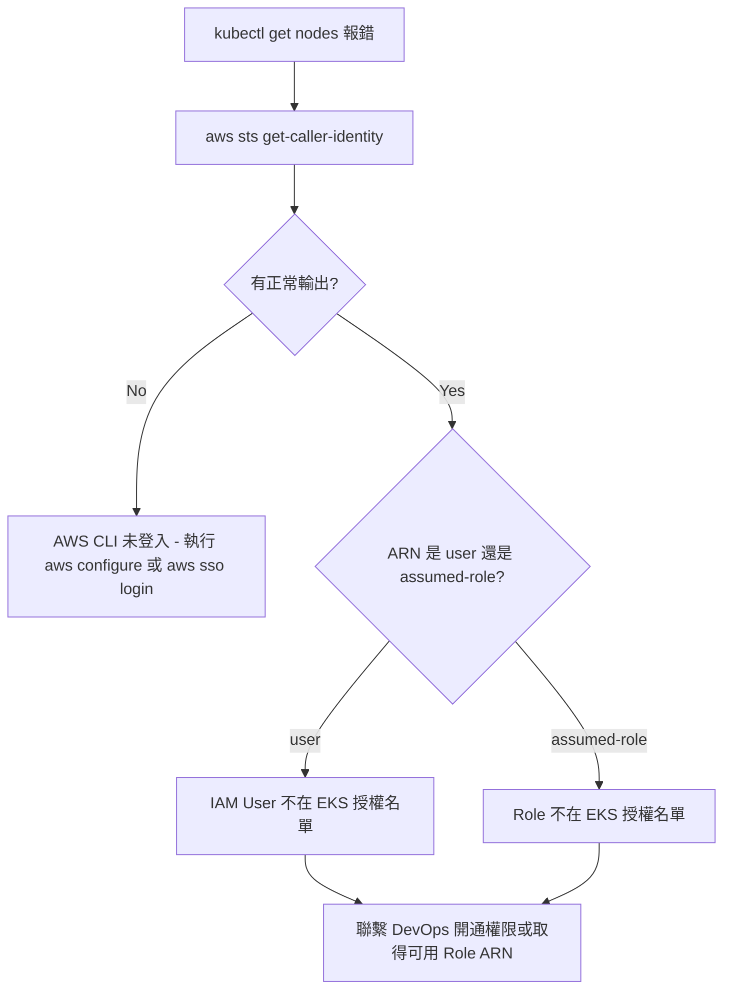
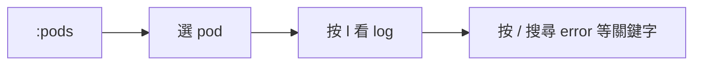
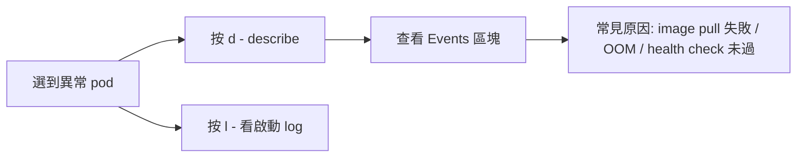
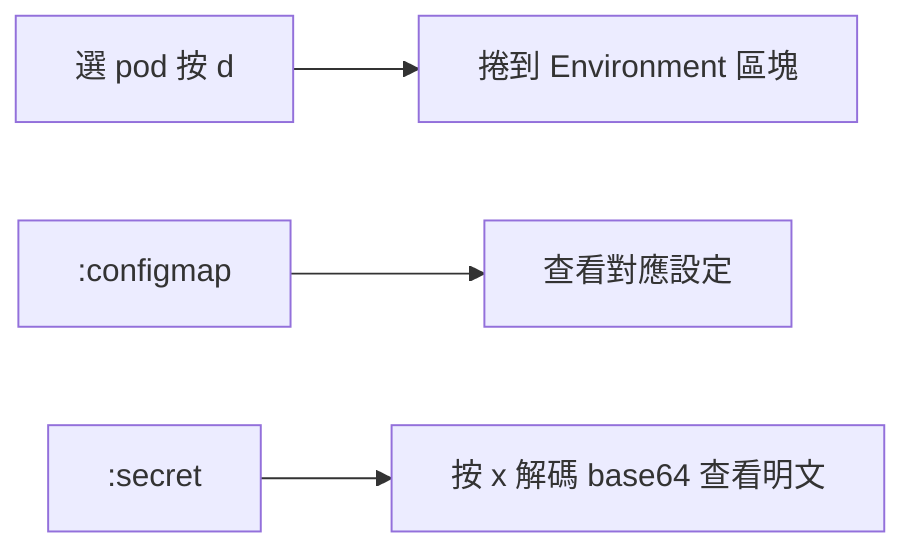
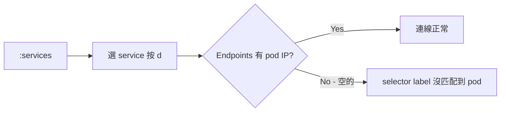

# K9s Kubernetes TUI 管理工具與 EKS 連線實戰

## 目錄
- [1. K9s 概述與安裝](#1-k9s-概述與安裝)
    - [1.1. K9s 是什麼](#11-k9s-是什麼)
    - [1.2. 安裝方式](#12-安裝方式)
    - [1.3. macOS CLT 版本不符問題](#13-macos-clt-版本不符問題)
- [2. kubeconfig 設定與 EKS 連線](#2-kubeconfig-設定與-eks-連線)
    - [2.1. 在 AWS Console 查找 Cluster 名稱與 Region](#21-在-aws-console-查找-cluster-名稱與-region)
    - [2.2. kubeconfig 取得方式](#22-kubeconfig-取得方式)
    - [2.3. 多叢集 kubeconfig 管理與覆蓋風險](#23-多叢集-kubeconfig-管理與覆蓋風險)
- [3. AWS IAM 與 EKS 存取權限機制](#3-aws-iam-與-eks-存取權限機制)
    - [3.1. IAM User vs IAM Role](#31-iam-user-vs-iam-role)
    - [3.2. EKS 叢集授權名單機制](#32-eks-叢集授權名單機制)
    - [3.3. Assume Role 流程與驗證](#33-assume-role-流程與驗證)
    - [3.4. 連線問題排查流程](#34-連線問題排查流程)
- [4. K9s 實戰操作場景](#4-k9s-實戰操作場景)
    - [4.1. 查看 Pod Log 抓 Bug](#41-查看-pod-log-抓-bug)
    - [4.2. 診斷 Pod 啟動失敗](#42-診斷-pod-啟動失敗)
    - [4.3. Shell 進入 Pod 除錯](#43-shell-進入-pod-除錯)
    - [4.4. 檢查環境變數與設定](#44-檢查環境變數與設定)
    - [4.5. 監控資源使用與重啟 Pod](#45-監控資源使用與重啟-pod)
    - [4.6. 檢查 Service 連線與叢集事件](#46-檢查-service-連線與叢集事件)
- [5. K9s 快捷鍵速查表](#5-k9s-快捷鍵速查表)

## 1. K9s 概述與安裝

### 1.1. K9s 是什麼

K9s 是一個終端機介面（TUI）的 Kubernetes 叢集管理工具。它提供類似 Vim 的快捷鍵操作，讓開發者可以即時瀏覽、管理和除錯 K8s 資源，取代反覆手動輸入 `kubectl` 指令的工作流。K9s 會自動讀取 `~/.kube/config` 中的叢集連線資訊來建立連線。

### 1.2. 安裝方式

| 平台 | 安裝指令 |
|---|---|
| macOS | `brew install derailed/k9s/k9s` |
| Linux | `snap install k9s` 或從 GitHub Releases 下載 |
| Windows | `choco install k9s` 或 `scoop install k9s` |

若 macOS 尚未安裝 Homebrew，需先執行：

```bash
/bin/bash -c "$(curl -fsSL https://raw.githubusercontent.com/Homebrew/install/HEAD/install.sh)"
```

### 1.3. macOS CLT 版本不符問題

安裝時若遇到 `Your Command Line Tools (CLT) does not support macOS XX` 錯誤，代表 Xcode Command Line Tools 版本過舊。刪除舊版並重新安裝：

```bash
sudo rm -rf /Library/Developer/CommandLineTools
sudo xcode-select --install
```

系統會跳出安裝視窗，完成後再重新執行 `brew install` 即可。

## 2. kubeconfig 設定與 EKS 連線

### 2.1. 在 AWS Console 查找 Cluster 名稱與 Region

取得 kubeconfig 之前，需要先知道叢集名稱和所在 Region。在 AWS Console 操作：登入後搜尋 EKS 或到 Services - Containers - Elastic Kubernetes Service，左側選單點 Clusters 即可列出該 Region 下所有叢集。

需注意右上角的 Region 選擇（位於帳號名稱旁邊），叢集只會顯示在它所建立的 Region 中。常見 Region 代碼對應：

| 顯示名稱 | CLI 代碼 |
|---|---|
| US East (N. Virginia) | `us-east-1` |
| US West (Oregon) | `us-west-2` |
| Asia Pacific (Tokyo) | `ap-northeast-1` |
| Asia Pacific (Singapore) | `ap-southeast-1` |

若不確定叢集在哪個 Region，可用 CLI 掃描全部：

```bash
for region in $(aws ec2 describe-regions --query "Regions[].RegionName" --output text); do
  echo "--- $region ---"
  aws eks list-clusters --region "$region" --output text
done
```

### 2.2. kubeconfig 取得方式

拿到叢集名稱和 Region 後，依環境執行對應指令，連線資訊會自動寫入 `~/.kube/config`：

**雲端託管叢集：**

| 雲端平台 | 指令 |
|---|---|
| AWS EKS | `aws eks update-kubeconfig --name <cluster-name> --region <region>` |
| GCP GKE | `gcloud container clusters get-credentials <cluster-name> --zone <zone>` |
| Azure AKS | `az aks get-credentials --resource-group <rg> --name <cluster-name>` |

**自建叢集（kubeadm 等）：**

Master node 上會產生 `/etc/kubernetes/admin.conf`，複製到本機：

```bash
mkdir -p ~/.kube
scp user@master-node:/etc/kubernetes/admin.conf ~/.kube/config
```

**團隊提供：** 由 DevOps 或 SRE 提供 kubeconfig 檔案，直接放到 `~/.kube/config`。

驗證連線：

```bash
kubectl cluster-info
kubectl get nodes
```

### 2.3. 多叢集 kubeconfig 管理與覆蓋風險

**雲端 CLI 工具（aws / gcloud / az）** 的 update-kubeconfig 會以 **merge（追加）** 方式寫入，不會覆蓋既有的其他叢集設定。

**自建叢集的 `scp` 指令會整個覆蓋 `~/.kube/config`。** 如果檔案中已有其他叢集資料，必須先備份再手動合併：

```bash
# 備份現有設定
cp ~/.kube/config ~/.kube/config.backup

# 複製自建叢集設定到暫存路徑
scp user@master-node:/etc/kubernetes/admin.conf /tmp/new-kubeconfig

# 合併兩份設定
KUBECONFIG=~/.kube/config:/tmp/new-kubeconfig kubectl config view --merge --flatten > ~/.kube/config.merged

# 確認合併結果無誤後替換
mv ~/.kube/config.merged ~/.kube/config
```

多叢集管理指令：

```bash
# 查看所有 context
kubectl config get-contexts

# 查看目前使用的 context
kubectl config current-context

# 切換到其他 cluster
kubectl config use-context <context-name>
```

在 K9s 內按 `:ctx` 也可以快速切換 context。

## 3. AWS IAM 與 EKS 存取權限機制

### 3.1. IAM User vs IAM Role

AWS IAM（Identity and Access Management）是 AWS 的帳號權限管理系統，核心概念用比喻說明：

**IAM User** 是固定身分，像你在 AWS 大樓裡的員工證。例如 `arn:aws:iam::730335631215:user/tony` 就是名為 tony 的 IAM User。有員工證能進大樓，但不代表每間辦公室都能進。

**IAM Role** 是可以"臨時穿上"的權限外套，像一件寫著"K8s 管理員"的背心。公司建立共用 Role（如 `eks-developer-role`），設定"穿這件背心的人都可以存取 EKS"。IAM User 透過 assume role 臨時取得權限，token 過期後回到原本身分。

Assume Role 的前提是管理員在 Role 的信任政策（Trust Policy）中授權了你，否則會收到 `AccessDenied`。

### 3.2. EKS 叢集授權名單機制

EKS 叢集有獨立的授權名單，即使擁有 IAM User 或 Role，名字不在名單上就無法存取。名單有新舊兩種管理方式：

**aws-auth ConfigMap（舊做法）：** 叢集內部的設定檔，管理員手動編輯加入 IAM ARN。

**EKS Access Entry（新做法）：** 在 AWS Console 的 EKS 頁面上透過 UI 直接加入授權身分。

兩者本質相同：將某個 ARN 加入允許清單並賦予 K8s 角色權限（如 viewer、editor）。

### 3.3. Assume Role 流程與驗證

用 `aws sts get-caller-identity` 驗證目前身分，兩種狀態的 ARN 差異：

| 狀態 | ARN 格式 |
|---|---|
| IAM User 登入 | `arn:aws:iam::730335631215:user/tony` |
| Assume Role 後 | `arn:aws:sts::730335631215:assumed-role/eks-developer-role/tony-session` |

差異在於 `iam` 變成 `sts`、`user` 變成 `assumed-role`，代表處於臨時角色狀態。

使用 Role 存取 EKS：

```bash
aws eks update-kubeconfig --name dataverse-pre-prod-eks --region us-west-2 \
  --role-arn arn:aws:iam::730335631215:role/<role名稱>
```

### 3.4. 連線問題排查流程

當 `kubectl get nodes` 出現 `the server has asked for the client to provide credentials` 錯誤時：



聯繫 DevOps 時建議提供：目的、目標叢集名稱、你的 IAM ARN、完整錯誤訊息。

## 4. K9s 實戰操作場景

### 4.1. 查看 Pod Log 抓 Bug



按 `w` 切換自動換行。多 container 的 pod 按 `l` 後會先選擇 container。按 `Esc` 返回上一層。

### 4.2. 診斷 Pod 啟動失敗

Pod 顯示 `CrashLoopBackOff` 或 `Error` 時：



### 4.3. Shell 進入 Pod 除錯

選 pod 按 `s` 進入 shell（等同 `kubectl exec -it`），可執行 `env`、`curl`、`cat` 等指令。按 `exit` 或 `ctrl-d` 離開。

### 4.4. 檢查環境變數與設定



### 4.5. 監控資源使用與重啟 Pod

`:pods` 畫面直接顯示 CPU / MEM 欄位。按 `shift-c` 依 CPU 排序，`shift-m` 依記憶體排序。

重啟方式有兩種：選 pod 按 `ctrl-d` 刪除（Deployment 自動拉新 pod），或到 `:deployments` 按 `r` 執行 rolling restart。

### 4.6. 檢查 Service 連線與叢集事件



輸入 `:events` 查看叢集所有事件（排程失敗、探針失敗、映像檔拉取失敗等），按 `/` 搜尋特定 pod 名稱過濾。

## 5. K9s 快捷鍵速查表

**資源導覽：**

| 快捷鍵 | 功能 |
|---|---|
| `:pods` | Pod 列表 |
| `:deployments` | Deployment 列表 |
| `:services` | Service 列表 |
| `:configmap` | ConfigMap 列表 |
| `:secret` | Secret 列表 |
| `:events` | 叢集事件 |
| `:ctx` | 切換 cluster context |
| `:ns` 或 `:namespace` | 切換 namespace |
| `0` | 顯示所有 namespace |

**資源操作：**

| 快捷鍵 | 功能 |
|---|---|
| `l` | 查看 log |
| `d` | describe 資源 |
| `s` | shell 進入 pod |
| `e` | 編輯 YAML |
| `x` | 解碼 Secret |
| `r` | restart Deployment |
| `ctrl-d` | 刪除資源 |

**通用操作：**

| 快捷鍵 | 功能 |
|---|---|
| `/` | 搜尋過濾 |
| `w` | 切換自動換行 |
| `shift-c` | 依 CPU 排序 |
| `shift-m` | 依記憶體排序 |
| `Esc` | 返回上一層 |
| `:q` | 離開 K9s |
| `?` | 查看所有快捷鍵 |