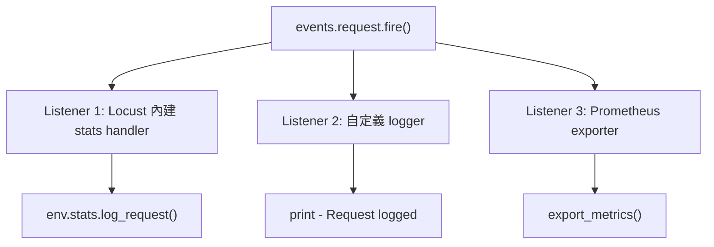
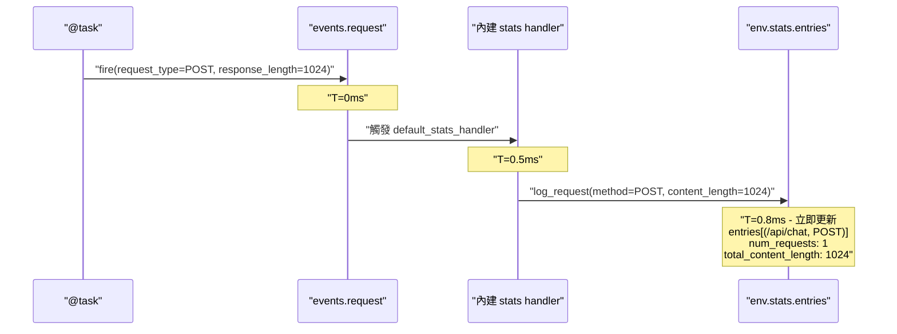
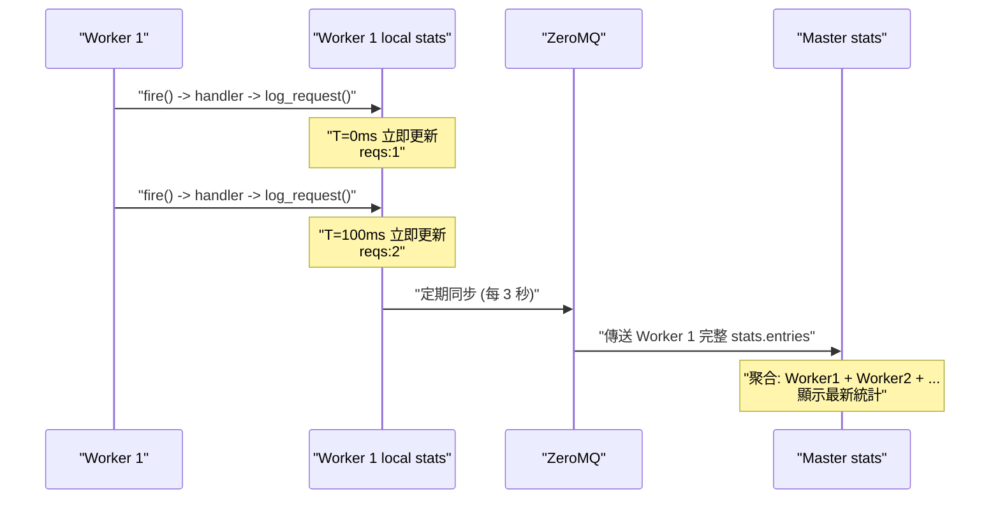
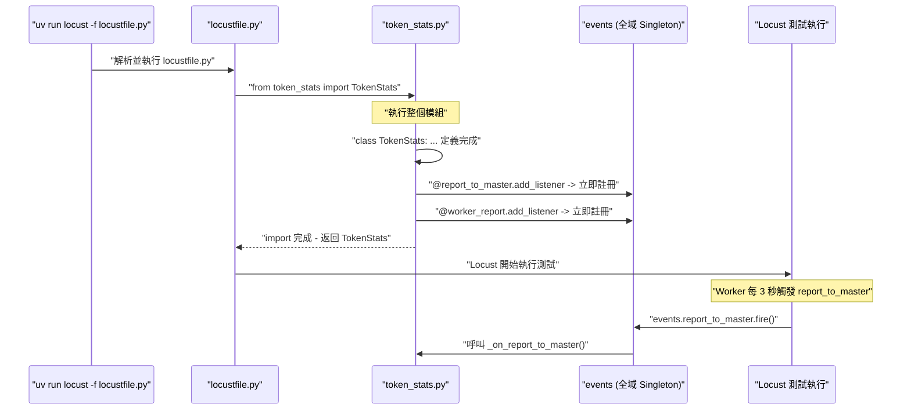
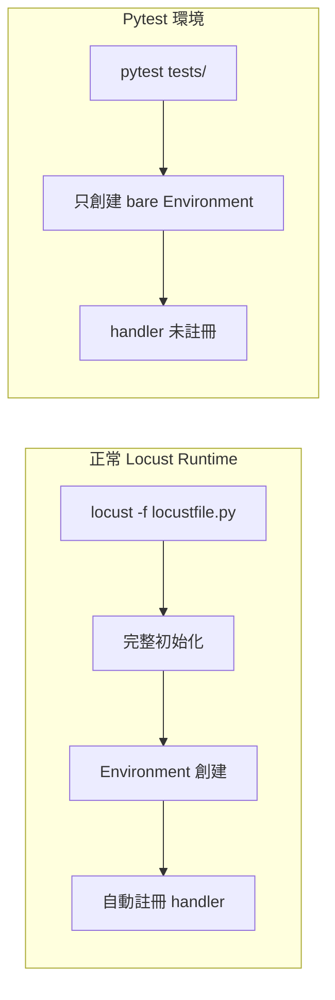

# Locust Event System: 事件鏈路與統計同步機制

## 目錄
- [Locust Event System: 事件鏈路與統計同步機制](#locust-event-system-事件鏈路與統計同步機制)
  - [目錄](#目錄)
  - [1. Event System 底層機制](#1-event-system-底層機制)
    - [1.1. Environment 自動註冊機制](#11-environment-自動註冊機制)
    - [1.2. events.request.fire() vs env.stats.log\_request()](#12-eventsrequestfire-vs-envstatslog_request)
    - [1.3. 單機模式下的完整事件鏈路](#13-單機模式下的完整事件鏈路)
    - [1.4. Multi-Process 模式下的事件鏈路](#14-multi-process-模式下的事件鏈路)
  - [2. EventHook 內部實現與 Decorator 自動註冊](#2-eventhook-內部實現與-decorator-自動註冊)
    - [2.1. EventHook 簡化版原始碼](#21-eventhook-簡化版原始碼)
    - [2.2. Python Import 觸發模組級程式碼執行](#22-python-import-觸發模組級程式碼執行)
    - [2.3. 完整啟動時間軸](#23-完整啟動時間軸)
  - [3. 內建指標在 Multi-Process 下的同步原理](#3-內建指標在-multi-process-下的同步原理)
    - [3.1. 為什麼內建指標能正確匯總](#31-為什麼內建指標能正確匯總)
    - [3.2. 為什麼 Class Variable 無法跨 Process](#32-為什麼-class-variable-無法跨-process)
  - [4. Pytest 環境的 Handler 註冊](#4-pytest-環境的-handler-註冊)
    - [4.1. 為什麼測試需要手動註冊 handler](#41-為什麼測試需要手動註冊-handler)
    - [4.2. 正確的 Fixture 寫法](#42-正確的-fixture-寫法)

## 1. Event System 底層機制

前置知識: 本篇假設你已理解 Locust 的執行模型（gevent 協作式排程、Single/Multi-Process 架構、記憶體隔離）。如果尚未閱讀，請先參考 "Locust 執行模型底層: gevent 協作式排程與 Multi-Process 架構"。

### 1.1. Environment 自動註冊機制

當你創建 Locust Environment 時，Locust 內部會自動註冊一個**內建 stats handler**，負責將事件轉換成統計數據:

```python
from locust.env import Environment
env = Environment(user_classes=[MyUser])
```

Locust 內部自動執行的簡化版邏輯:

```python
class Environment:
    def __init__(self):
        self.stats = RequestStats()

        # 自動註冊內建 stats handler
        def default_stats_handler(**kwargs):
            self.stats.log_request(
                method=kwargs['request_type'],
                name=kwargs['name'],
                response_time=kwargs['response_time'],
                content_length=kwargs['response_length']
            )

        events.request.add_listener(default_stats_handler)
```

這個自動註冊的 handler 是整個統計系統的核心 -- 它將 Event System 的事件 "橋接" 到 Stats 層。

### 1.2. events.request.fire() vs env.stats.log_request()

這兩個 API 是 Locust 統計系統的兩層抽象:

**`events.request.fire()`** 是事件層 -- 發布事件到 Pub/Sub 事件系統，觸發所有已註冊的 listeners:

```python
events.request.fire(
    request_type="POST",
    name="/api/chat",
    response_time=150,
    response_length=1024,
    exception=None,
    context={}
)
```

**`env.stats.log_request()`** 是數據層 -- 直接寫入統計數據，不經過事件系統:

```python
env.stats.log_request(
    method="POST",
    name="/api/chat",
    response_time=150,
    content_length=1024
)
```

兩者的關係是: `fire()` 觸發 listener，listener 內部呼叫 `log_request()`。

| 比較項目 | `events.request.fire()` | `env.stats.log_request()` |
|------|------|------|
| 性質 | 發布事件到事件系統 (Pub/Sub) | 直接寫入統計數據 |
| 觸發對象 | 所有已註冊的 listeners | 無 - 直接操作 `env.stats.entries` |
| Multi-process 支援 | 支援跨 Worker 聚合 | 只在當前 process 生效 |
| 使用場景 | 業務邏輯中記錄請求 | 在 listener 內部實現 / 測試時直接模擬 |



### 1.3. 單機模式下的完整事件鏈路

在單 process 模式下，從 `fire()` 到統計更新是**立即完成**的:



整條鏈路在 1ms 內完成，全部是同步執行。`log_request()` 裡的 `+=` 是純 CPU 操作，gevent 不會在這段期間切換協程，所以不需要 Lock。

### 1.4. Multi-Process 模式下的事件鏈路

Multi-process 模式下多了一個 "定期同步" 的步驟。每個 Worker 內部的事件鏈路跟單機一樣是立即完成的，差別在於 Worker 的本地 stats 需要定期（預設每 3 秒）透過 ZeroMQ 傳送給 Master:



Master 端的聚合邏輯簡化版:

```python
def on_worker_stats_report(msg):
    worker_stats = msg['data']
    for key, stats in worker_stats.items():
        if key not in master_stats:
            master_stats[key] = StatsEntry()
        master_stats[key].num_requests += stats['num_requests']
        master_stats[key].total_content_length += stats['total_content_length']
```

關鍵: ZeroMQ 同步的是**整個 `stats.entries` dict**，不區分哪些是真實請求、哪些是自定義 entry。這個特性會在自定義指標的設計中產生重要影響。

| 階段 | 動作 | 延遲 |
|------|------|------|
| `events.request.fire()` | 觸發 handler | 立即 (<1ms) |
| `env.stats.log_request()` | 更新 Worker 本地 stats | 立即 |
| Worker -> Master 發送 | 透過 ZeroMQ 傳輸 | 定期 (預設 3 秒) |
| Master 聚合 | 合併所有 Worker 數據 | 接收後立即 |

## 2. EventHook 內部實現與 Decorator 自動註冊

### 2.1. EventHook 簡化版原始碼

Locust 的事件系統基於一個簡單的 Pub/Sub 實現。每個事件（如 `report_to_master`、`worker_report`、`request`）都是一個 `EventHook` 實例:

```python
# locust/events.py 簡化版
class EventHook:
    def __init__(self):
        self._listeners = []

    def add_listener(self, func):
        """註冊監聽器，返回原函數（支援作為 Decorator 使用）"""
        self._listeners.append(func)
        return func

    def fire(self, **kwargs):
        """觸發事件，依序呼叫所有已註冊的監聽器"""
        for listener in self._listeners:
            listener(**kwargs)
```

`add_listener` 返回原函數這個設計使其可以作為 Decorator 使用: `@events.report_to_master.add_listener` 等價於先定義函數再呼叫 `events.report_to_master.add_listener(func)`。

### 2.2. Python Import 觸發模組級程式碼執行

一個常見的疑問: `locustfile.py` 中只有 `from token_stats import TokenStats`，為什麼模組底部的 `@events.report_to_master.add_listener` 也會被執行？

這是 Python import 機制的核心行為: **`import` 會執行整個模組的程式碼，無論你只 import 其中的哪一部分**。

```python
# 以下三種寫法都會執行整個 token_stats.py:
from token_stats import TokenStats          # 只取 TokenStats
import token_stats                          # 取整個模組
from token_stats import TokenStats, reset   # 取多個名稱
```

Decorator 的本質是函數呼叫語法糖:

```python
# Decorator 語法
@events.report_to_master.add_listener
def _on_report_to_master(client_id, data):
    ...

# 等價於
def _on_report_to_master(client_id, data):
    ...
_on_report_to_master = events.report_to_master.add_listener(_on_report_to_master)
# add_listener() 在模組載入時立即執行
```

### 2.3. 完整啟動時間軸



Decorator 註冊發生在模組載入階段，遠早於測試開始。`events` 是全域 Singleton，任何模組中的註冊都會影響同一個事件系統。

## 3. 內建指標在 Multi-Process 下的同步原理

### 3.1. 為什麼內建指標能正確匯總

Locust 內建的統計指標（RPS、Latency、num_requests）能正確匯總，是因為它們走的是完整鏈路: `self.client.post()` 內部自動觸發 `events.request.fire()` -> 內建 handler 將數據寫入 Worker 本地 `stats.entries` -> ZeroMQ 定期同步到 Master -> Master 聚合。

### 3.2. 為什麼 Class Variable 無法跨 Process

| 方式 | 是否經過 Event System | Multi-Process 支援 |
|------|------|------|
| `LoadTestUser.total_tokens += x` | 否 - 只修改 local 記憶體 | 不支援 |
| `events.request.fire(...)` | 是 - 走完整事件鏈路 | 支援 |

Class variable 的修改只發生在各 Worker 的 local 記憶體中，沒有經過 Event System，自然不會被 ZeroMQ 同步到 Master。這是設計自定義指標時最常踩的坑。

## 4. Pytest 環境的 Handler 註冊

### 4.1. 為什麼測試需要手動註冊 handler

在正常的 Locust runtime 中，Locust 會做完整初始化，包括自動註冊內建 stats handler。但在 Pytest 環境中，你只是創建了一個 bare `Environment` 物件:



不手動註冊的後果: `events.request.fire()` 會發送事件，但沒有任何 listener 接收，數據不會寫入 stats。

### 4.2. 正確的 Fixture 寫法

手動模擬 Locust 內建的 handler 行為:

```python
@pytest.fixture
def locust_environment():
    env = Environment(user_classes=[DummyUser])

    def log_request_handler(
        request_type, name, response_time, response_length,
        exception, context, **kwargs
    ):
        env.stats.log_request(
            method=request_type,
            name=name,
            response_time=response_time,
            content_length=response_length,
        )

    events.request.add_listener(log_request_handler)
    yield env
    events.request.remove_listener(log_request_handler)  # Cleanup
```

注意: 此 fixture 適用於使用 `events.request.fire()` 的方案。如果自定義指標不經過事件系統（例如直接寫入 class variable），測試時只需呼叫 `reset()` 清理狀態即可。Fixture 結束時必須呼叫 `remove_listener()` 清理，否則 handler 會殘留影響其他測試案例。
