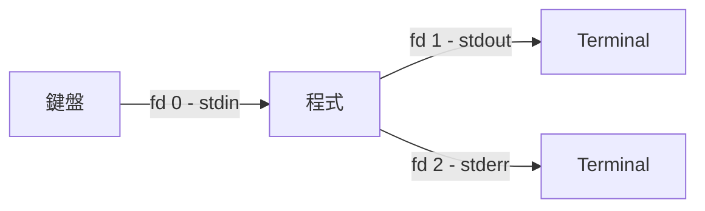

# Linux Standard Streams 與 I/O Redirection 完整指南

## 目錄
- [Linux Standard Streams 與 I/O Redirection 完整指南](#linux-standard-streams-與-io-redirection-完整指南)
  - [目錄](#目錄)
  - [1. Standard Streams 核心概念](#1-standard-streams-核心概念)
    - [1.1. 什麼是 Stream](#11-什麼是-stream)
    - [1.2. 三個標準 Stream](#12-三個標準-stream)
    - [1.3. 為什麼 stdout 與 stderr 要分開](#13-為什麼-stdout-與-stderr-要分開)
  - [2. Redirection 符號拆解](#2-redirection-符號拆解)
    - [2.1. 個別符號的意義](#21-個別符號的意義)
    - [2.2. 組合語法與範例](#22-組合語法與範例)
    - [2.3. \& 有無的差異](#23--有無的差異)
  - [3. 重定向的執行順序](#3-重定向的執行順序)
    - [3.1. 從左到右依序處理](#31-從左到右依序處理)
    - [3.2. 順序反過來的陷阱](#32-順序反過來的陷阱)
  - [4. 重定向的作用範圍](#4-重定向的作用範圍)
    - [4.1. 重定向只作用於它的 Command](#41-重定向只作用於它的-command)
    - [4.2. Pipe 串接多個程式](#42-pipe-串接多個程式)
  - [5. 程式內部指定輸出目的地](#5-程式內部指定輸出目的地)
  - [6. 常見 Redirection 模式](#6-常見-redirection-模式)
  - [7. 實際應用: Locust 測試腳本](#7-實際應用-locust-測試腳本)
    - [7.1. Exit Code 與條件判斷](#71-exit-code-與條件判斷)
    - [7.2. 完整腳本解析](#72-完整腳本解析)

## 1. Standard Streams 核心概念

### 1.1. 什麼是 Stream

Stream 是一條"持續流動的資料通道"，概念上類似水管：程式往管子裡倒資料，管子的另一端接著某個目的地（terminal、檔案、另一個程式）。程式本身不需要知道另一端是誰，它只管往管子裡讀或寫就好。

OS 在每個程式啟動時自動開好三條管道（stdin / stdout / stderr），而 I/O Redirection 的本質就是：在不改程式碼的情況下，把管道的出口或入口從預設位置（鍵盤 / terminal）拔掉，接到別的地方（檔案、`/dev/null`、其他程式）。

### 1.2. 三個標準 Stream

每個程式執行時，OS 自動建立三條標準 stream，各自有固定的 file descriptor 編號：

| Stream 編號 | 名稱 | 資料方向 | 說明 | 預設連接 |
|---|---|---|---|---|
| 0 | stdin | 流進程式 | 標準輸入 | 鍵盤 |
| 1 | stdout | 流出程式 | 標準輸出（正常結果） | Terminal |
| 2 | stderr | 流出程式 | 標準錯誤（診斷/錯誤訊息） | Terminal |

stdout 和 stderr 雖然預設都顯示在 terminal 上看起來一樣，但它們是兩條獨立的管道，可以被分別重定向到不同目的地。



### 1.3. 為什麼 stdout 與 stderr 要分開

如果錯誤訊息也混在 stdout 裡，下游處理會壞掉。假設程式正常輸出合法 JSON `{"status": "ok"}`，但錯誤訊息也走 stdout，重定向後檔案就變成：

```text
Error: connection timeout
{"status": "ok", "data": [1, 2, 3]}
```

JSON parser 讀到第一行就報錯，整個檔案無法解析。但如果錯誤訊息走 stderr，它根本不會進到檔案裡，JSON 保持乾淨。核心價值：讓"程式結果"和"診斷訊息"走不同管道，後續處理不會互相干擾。

## 2. Redirection 符號拆解

### 2.1. 個別符號的意義

**0, 1, 2**：OS 幫程式開好的三條管道的"門牌號碼"。沒寫數字時，`>` 預設是 1（stdout），`<` 預設是 0（stdin）。

**`>`**：輸出重定向，把左邊管道的內容送到右邊的目的地。

**`<`**：輸入重定向，把右邊的來源接到左邊的輸入管道。

**`&`**：最關鍵的符號。`>` 右邊正常接的是檔案名稱，加了 `&` 表示"右邊這個數字不是檔案名，而是另一條管道的編號"。

所有語法都是同一個結構：**起始管道 → 動作 → 目的地**。`>` 左邊是起始管道（省略就是 1），`>` 右邊是目的地（有 `&` 是管道編號，沒 `&` 是檔案名）。

### 2.2. 組合語法與範例

**`> file`（等於 `1> file`）** — stdout 送到檔案：

```bash
echo "hello" > output.txt
cat output.txt   # hello
```

**`< file`（等於 `0< file`）** — stdin 從檔案讀取：

```bash
sort < names.txt   # sort 從檔案讀資料，不是從鍵盤
```

**`2> file`** — stderr 送到檔案：

```bash
ls /不存在的路徑 2> error.txt
# terminal 不顯示錯誤，錯誤被導進 error.txt
```

**`>&2`（等於 `1>&2`）** — 把 stdout 改送到 stderr：

拆解：`1`（stdout）`>`（送到）`&2`（管道 2）。

```bash
#!/bin/bash
echo "正常訊息"                  # 走 stdout
echo "出錯了！" >&2              # 走 stderr
echo "繼續處理"                  # 走 stdout
```

```bash
./script.sh > output.txt
# terminal 顯示：出錯了！         <- stderr 仍在 terminal
# output.txt 內容：正常訊息、繼續處理   <- 只有 stdout 進檔案
```

**`2>&1`** — 把 stderr 送到管道 1 此刻連接的目的地：

拆解：`2`（stderr）`>`（送到）`&1`（管道 1 此刻指向的地方）。

```bash
ls /存在 /不存在 > all.txt 2>&1
# stdout 和 stderr 都進了 all.txt
```

**`&> file`** — Bash 特殊簡寫，stdout 和 stderr 都送到檔案，等價於 `> file 2>&1`：

```bash
ls /存在 /不存在 &> all.txt
# terminal 什麼都不顯示，兩種輸出都進了檔案
```

### 2.3. & 有無的差異

```bash
command 2>&1     # 有 & -> stderr 送到管道 1（stdout）
command 2>1      # 沒 & -> stderr 存到一個叫 "1" 的檔案
```

`&` 的作用就是區分"管道編號"和"檔案名"。

## 3. 重定向的執行順序

### 3.1. 從左到右依序處理

Shell 從左到右依序處理重定向。以 `command > all.txt 2>&1` 為例：

**第一步 `> all.txt`**：管道 1（stdout）接到 `all.txt`。此時管道 2 還指向 terminal。

**第二步 `2>&1`**：管道 2 送到"管道 1 **此刻**指向的地方"。因為第一步已經把管道 1 接到 `all.txt`，管道 2 也跟著進 `all.txt`。

關鍵：`2>&1` 不是"送到 stdout 這個概念"，而是"送到管道 1 此刻連接的目的地"。

### 3.2. 順序反過來的陷阱

```bash
command 2>&1 > all.txt
```

**第一步 `2>&1`**：此時管道 1 還指向 terminal，所以管道 2 綁定到 terminal。

**第二步 `> all.txt`**：管道 1 改接到 `all.txt`，但管道 2 已經綁定 terminal，不受影響。

結果：只有 stdout 進檔案，stderr 還在 terminal。跟預期的"合併"完全不同。這也是為什麼 `&> all.txt` 簡寫比較不容易出錯。

## 4. 重定向的作用範圍

### 4.1. 重定向只作用於它的 Command

每個程式執行時 OS 會幫**那個程式**獨立開三條管道，重定向符號永遠附屬於前面那個 command：

```bash
ls > output.txt          # ls 的管道 1 → output.txt
cat 2> error.txt         # cat 的管道 2 → error.txt
sort < names.txt         # sort 的管道 0 → 從 names.txt 讀
```

### 4.2. Pipe 串接多個程式

用 pipe（`|`）同時運行多個程式時，每個程式各自有獨立的三條管道：

```bash
ls /存在 /不存在 2> error.txt | grep "file"
```

| 管道 | ls | grep |
|---|---|---|
| stdin（0） | 鍵盤（預設） | 接收 ls 的 stdout |
| stdout（1） | 透過 pipe 送給 grep | terminal |
| stderr（2） | error.txt（被 `2>` 重定向） | terminal（預設） |

`2> error.txt` 只影響 `ls`，跟 `grep` 完全無關。

## 5. 程式內部指定輸出目的地

在程式碼內部可以明確指定輸出走哪條 stream：

| 目的地 | Python | Shell Script |
|---|---|---|
| stdout | `print("msg")` | `echo "msg"` |
| stdout（明確） | `print("msg", file=sys.stdout)` | `echo "msg" >&1` |
| stderr | `print("msg", file=sys.stderr)` | `echo "msg" >&2` |

Shell 中的 `echo` 本質是"把文字寫到 stdout 的工具"，大多數 shell 同時有內建版（builtin，不啟動新 process）和獨立程式版（`/bin/echo`），兩者效果一樣。因為 `echo` 預設走 stdout，所以才能搭配 `>&2` 把輸出改送到 stderr。

## 6. 常見 Redirection 模式

| 模式 | 語法 | 用途 |
|---|---|---|
| 安靜模式 | `command &> /dev/null` | 丟棄所有輸出 |
| 只看錯誤 | `command > /dev/null` | 丟棄 stdout - stderr 仍顯示 |
| 合併存檔 | `command > all.txt 2>&1` | 兩者存到同一個檔案 |
| 分別存檔 | `command > output.txt 2> error.txt` | 分開存到不同檔案 |

其中 `/dev/null` 是 Linux 的"黑洞裝置"，任何寫入的資料都會被丟棄。

錯誤訊息要走 stderr 的理由：符合 Unix 哲學（職責分離）、pipe 預設只傳 stdout 不被干擾、CI/CD 可透過 stderr 識別錯誤、結構化資料（JSON/CSV）不被污染。

## 7. 實際應用: Locust 測試腳本

### 7.1. Exit Code 與條件判斷

每個程式結束時會回傳 exit code 給 OS：0 表示成功（`if`/`while` 判定為 true），非 0 表示失敗（判定為 false）。Exit code 和輸出內容是兩件獨立的事，即使用 `&> /dev/null` 把輸出全部丟掉，exit code 仍然不受影響，`if`/`while` 靠的是 exit code 而非輸出內容。

### 7.2. 完整腳本解析

以下腳本綜合運用了 stream 分離、黑洞重定向、exit code 判斷：

```bash
#!/bin/bash

echo "Starting Locust test..."
echo "Users: 100, Spawn rate: 10"

# command -v lsof：查找系統有沒有 lsof
#   找到 → 印出路徑如 /usr/bin/lsof，exit code 0
#   沒找到 → 不印，exit code 1
# &> /dev/null：丟掉輸出，if 靠 exit code 判斷
if command -v lsof &> /dev/null; then
    countdown=15
    # lsof -i :8089：列出占用 port 8089 的 process
    #   有占用 → 印出 process 資訊，exit code 0（繼續等）
    #   沒占用 → 不印，exit code 1（跳出迴圈）
    # &> /dev/null：丟掉輸出，while 靠 exit code 判斷
    while lsof -i :8089 &> /dev/null; do
        if [ "$countdown" -le 0 ]; then
            # 錯誤訊息走 stderr，不會混入正常輸出
            echo "Error: Port 8089 not released after 15s" >&2
            exit 1
        fi
        sleep 1
        countdown=$((countdown - 1))
    done
    # 跳出 while = lsof 回傳 1 = port 沒人占了
fi

echo "Test completed successfully"
```

設計考量：

- `>&2` 讓錯誤訊息走 stderr，執行 `./run_locust_test.sh > results.log` 時錯誤仍顯示在 terminal，不會被靜默吞掉
- `&> /dev/null` 讓檢查過程保持安靜，只在真正出錯時才有訊息
- CI/CD 工具可透過 stderr 和 exit code 正確識別測試失敗