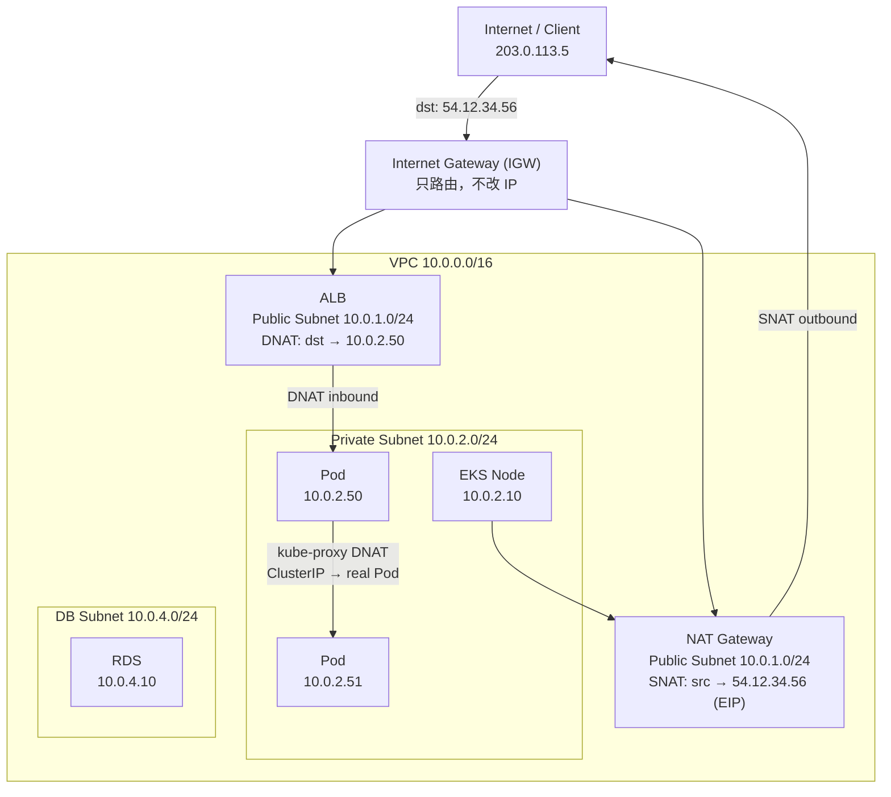

# IPv4、IPv6、VPC、CIDR 與 NAT 核心網路概念：以 K8s/EKS 為例

## 目錄
- [1. 整體架構全覽](#1-整體架構全覽)
- [2. IPv4 與 IPv6](#2-ipv4-與-ipv6)
    - [2.1. IPv4](#21-ipv4)
    - [2.2. IPv6](#22-ipv6)
- [3. CIDR：IP 位址空間的表示法](#3-cidrip-位址空間的表示法)
    - [3.1. Prefix 長度的意義](#31-prefix-長度的意義)
    - [3.2. 為什麼不全用 /32](#32-為什麼不全用-32)
    - [3.3. Subnet 切割實例](#33-subnet-切割實例)
- [4. VPC（Virtual Private Cloud）](#4-vpcvirtual-private-cloud)
- [5. NAT：Network Address Translation](#5-natnetwork-address-translation)
    - [5.1. SNAT vs DNAT](#51-snat-vs-dnat)
    - [5.2. NAT Connection Tracking Table](#52-nat-connection-tracking-table)
    - [5.3. 執行 NAT 的元件](#53-執行-nat-的元件)
- [6. EKS 完整封包路徑](#6-eks-完整封包路徑)
    - [6.1. 外部流量進入 Pod（Inbound）](#61-外部流量進入-podinbound)
    - [6.2. Pod 主動對外（Outbound）](#62-pod-主動對外outbound)
- [7. 地端 K8s 的 NAT 機制](#7-地端-k8s-的-nat-機制)
- [8. 概念總覽對照表](#8-概念總覽對照表)

---

## 1. 整體架構全覽

以下是本篇所有概念在 EKS 場景中的位置關係。從外到內依序為：Internet → IGW → VPC → Subnet → Node → Pod。



概念對應關係一覽：

- IGW は VPC 與 Internet 之間的閘門，本身不改 IP，只負責路由。
- ALB 坐在 Public Subnet，執行 DNAT，把公網 IP 改寫成 Pod IP。
- NAT Gateway 坐在 Public Subnet，執行 SNAT，把 Pod 的私有 IP 改寫成 EIP 對外。
- VPC 是整個私有網路空間，用 CIDR `/16` 定義範圍。
- Subnet 是 VPC 內的功能分區，用 `/24` 定義更小的範圍。
- kube-proxy 在每個 Node 上維護 iptables，執行 ClusterIP → Pod IP 的 DNAT。

---

## 2. IPv4 與 IPv6

### 2.1. IPv4

IPv4 使用 **32 bit** 表示位址，格式為四組十進位數字，例如 `192.168.1.1`。總共能表示 **2^32 = 4,294,967,296（約 43 億）個位址**。由於全球網路設備數量早已超過 43 億，位址嚴重不足，NAT 正是為了緩解此問題而生（讓多台私有設備共用一個公網 IP）。

### 2.2. IPv6

IPv6 使用 **128 bit** 表示位址，分成 8 組，每組 16 bit，用冒號 `:` 隔開，每組用 4 個 hex 字元表示。總共能表示 **2^128 ≈ 3.4 × 10^38 個位址**，幾乎是無限的。

完整格式與縮寫規則：

```
完整版（8 組，每組 4 個 hex）：
2001:0db8:0000:0000:0000:0000:0000:0001

省略規則 1：每組開頭的 0 可以省略
2001:db8:0:0:0:0:0:1

省略規則 2：連續的全 0 組，可以用 :: 縮寫（全址中只能用一次）
2001:db8::1
```

解析 `2001:0db8::1` 的步驟：`::` 代表「補足到 8 組為止的全 0 組」，所以還原結果為：

```
2001:0db8:0000:0000:0000:0000:0000:0001
```

IPv6 原生支援端對端連線，不再需要 NAT。目前實務部署以 IPv4 為主，許多基礎設施採雙棧（dual-stack）並存。

---

## 3. CIDR：IP 位址空間的表示法

CIDR（Classless Inter-Domain Routing）是「批發 IP、方便管理與路由」的機制，格式為 `IP位址/prefix長度`。

### 3.1. Prefix 長度的意義

`/` 後面的數字代表「IP 的前 N 個 bit 是固定的網路位址，剩下的 bit 才是可分配的 host 位址」。

以 `10.0.0.0/16` 為例：

```
二進位：
00001010.00000000.????????.????????
←─── 16 bits 固定（網路部分）───→←── 16 bits 自由（host 部分）──→

位址範圍：10.0.0.0 ~ 10.0.255.255
可用數量：2^16 = 65,536 個位址
```

常見 prefix 對照：

| CIDR | 固定 bits | Host bits | 位址數 | 典型用途 |
|---|---|---|---|---|
| /8 | 8 | 24 | 16,777,216 | 大型企業或 ISP |
| /16 | 16 | 16 | 65,536 | AWS VPC 預設 |
| /24 | 24 | 8 | 256 | 一般 Subnet |
| /32 | 32 | 0 | 1 | 單一主機 / Security Group 規則 |

公式：`可用位址數 = 2^(32 - prefix)`

### 3.2. 為什麼不全用 /32

核心原因是**路由表爆炸問題**。全球有約 43 億個 IPv4 位址，若每個 IP 一條路由規則，骨幹路由器的記憶體會直接爆掉，且每個封包進來都要在 43 億行中查表，速度慢到無法運作。

CIDR 讓一行規則代理整段範圍：

```
沒有 CIDR（/32 世界）：
  10.0.0.1/32 → 往東
  10.0.0.2/32 → 往東
  10.0.0.3/32 → 往東
  ... 重複 43 億行

有了 CIDR：
  10.0.0.0/8    → 往東  （一行代理 16,777,216 個 IP）
  172.16.0.0/12 → 往西
  192.168.0.0/16 → 往南
```

郵遞類比：郵差按「國家 → 城市 → 區 → 門牌」的層級分信，而不是背下全世界每一戶門牌。CIDR prefix 就是郵遞區號，prefix 越短代表越大的區域，一條規則涵蓋越多 IP。

第二個原因是**安全隔離與管理**。切 Subnet 讓你可以對「一整區」設定規則：

```
Security Group 規則：
允許來自 10.0.1.0/24 的流量  ← 整個 Public Subnet 都允許
拒絕來自 10.0.4.0/24 的流量  ← 整個 DB Subnet 都拒絕
```

如果全是 /32，幾百台機器就要幾百條規則，維護上是噩夢。

### 3.3. Subnet 切割實例

`10.0.0.0/16` 的 VPC 可切割成功能分區：

```
10.0.0.0/16  （整個 VPC，65,536 個位址）
├── 10.0.1.0/24  → Public Subnet   （ALB、Bastion、NAT GW，256 個位址）
├── 10.0.2.0/24  → Private Subnet A （EKS Node、Pod，256 個位址）
├── 10.0.3.0/24  → Private Subnet B （另一個 AZ，256 個位址）
└── 10.0.4.0/24  → DB Subnet        （RDS，256 個位址）
```

---

## 4. VPC（Virtual Private Cloud）

VPC 是雲端或虛擬化環境中**你自己的隔離網路空間**。你可以在其中自訂 CIDR block、切割 Subnet（Public / Private）、設定 Route Table、Security Group 與 NACL。

在 AWS 上，EKS cluster 的 Worker Node 跑在 VPC 的 Private Subnet 內，沒有 Public IP，對外流量一律透過 NAT Gateway 出去，外部流量一律透過 ALB 進來。

VPC 內的 IP 是**私有 IP**，對外世界看不見。對外統一用 EIP（Elastic IP）或 NAT Gateway 的公網 IP 代表。

```
對外世界看到的        對內實際分配的
54.12.34.56  ←→  10.0.0.0/16（整個 VPC）
                   ├── 10.0.1.0/24（Public Subnet）
                   ├── 10.0.2.0/24（Private Subnet）
                   └── 10.0.4.0/24（DB Subnet）
```

---

## 5. NAT：Network Address Translation

NAT 就是「改封包 IP header 欄位」這件事。SNAT 和 DNAT 是兩種**獨立操作**，不是兩個綁在一起的 component，可以單獨發生，也可以在同一個封包上先後發生。

### 5.1. SNAT vs DNAT

| | SNAT（Source NAT） | DNAT（Destination NAT） |
|---|---|---|
| 改的欄位 | 封包的來源 IP（src） | 封包的目的 IP（dst） |
| 典型方向 | 私有網路對外發起連線 | 外部流量進入私有網路 |
| AWS 對應 | NAT Gateway（Pod 拉 image 出去） | ALB（流量進 Pod） |
| K8s 對應 | Pod 離開 Node 時 masquerade | kube-proxy ClusterIP → Pod IP |
| 記憶口訣 | 隱藏自己出去 | 導向真正目標 |

以你家電腦連到 Google 為例，同一個路由器先後做兩個方向的操作：

```
送出（SNAT）：
  before:  src 192.168.1.5（私有 IP）  dst 8.8.8.8
  after:   src 61.x.x.x（公網 IP）     dst 8.8.8.8  ← src 被改

回程（反向還原）：
  before:  src 8.8.8.8  dst 61.x.x.x
  after:   src 8.8.8.8  dst 192.168.1.5  ← dst 還原回私有 IP
```

### 5.2. NAT Connection Tracking Table

路由器能把回程封包正確還原，靠的是內部維護的一張 Connection Tracking Table：

```
私有 IP:Port            公網 IP:Port           狀態
192.168.1.5:54321  ↔   61.x.x.x:54321        ESTABLISHED
192.168.1.8:12345  ↔   61.x.x.x:12345        ESTABLISHED
```

每筆連線出去時建立一條記錄，封包回來時查表找到對應的私有 IP 再轉發。這是 NAT 能讓多台私有設備共用一個公網 IP 的核心機制。

### 5.3. 執行 NAT 的元件

SNAT 和 DNAT 是操作，不是 component。同一個元件可以同時執行兩種操作，取決於流量方向和設定規則。

用烹飪類比：「鍋子、微波爐、烤箱」都是能加熱食物的工具，但你不會說「鍋子 = 炒 + 煮」，而是說「鍋子是工具，你可以用它來炒，也可以用它來煮」。同理，路由器、iptables、NAT Gateway 都是「能執行 NAT 的元件」，實際執行 SNAT 還是 DNAT 由流量方向和規則決定。

| 元件 | 典型操作 | 備註 |
|---|---|---|
| iptables | SNAT、DNAT 或兩者 | kube-proxy 依賴此執行 ClusterIP DNAT |
| 家用路由器 | 主要 SNAT | 讓內網設備對外上網 |
| AWS NAT Gateway | 主要 SNAT | 私有網路出去用，名字有誤導性 |
| AWS ALB | DNAT | 外部流量進 Pod |

注意：AWS NAT Gateway 名字有誤導性，它**主要只做 SNAT**。進來的 DNAT 工作是由 ALB 負責，不是 NAT Gateway。

---

## 6. EKS 完整封包路徑

### 6.1. 外部流量進入 Pod（Inbound）

```
[Client 203.0.113.5:54321]
  dst: 54.12.34.56:443
        │
        ↓
[Internet Gateway]
  只做路由，不改任何 IP
        │
        ↓
[ALB（Public Subnet 10.0.1.0/24）]
  DNAT：dst 54.12.34.56 → 10.0.2.50:8080（Pod IP）
  src 203.0.113.5 不變
        │
        ↓
[EKS Pod 10.0.2.50]
  收到封包，src 仍是 203.0.113.5
```

### 6.2. Pod 主動對外（Outbound）

場景：Pod 拉 Docker image 或呼叫外部 API。

```
[EKS Pod 10.0.2.50]
  src: 10.0.2.50（私有 IP）
  dst: 8.8.8.8
        │
        ↓
[NAT Gateway（Public Subnet 10.0.1.0/24）]
  SNAT：src 10.0.2.50 → 54.12.34.56（EIP）
  dst 8.8.8.8 不變
        │
        ↓
[Internet Gateway]
        │
        ↓
[Internet / Docker Hub / Google]
```

---

## 7. 地端 K8s 的 NAT 機制

地端 K8s 使用 iptables（由 kube-proxy 維護）實現 NAT，不依賴雲端托管元件。

**Pod 對外（SNAT / masquerade）：** Pod IP 是私有的（例如 flannel 分配的 `10.244.x.x`），離開 Node 時 iptables 做 masquerade（動態 SNAT），把 src 換成 Node IP。

```
Pod IP 10.244.1.5
  → 離開 Node 時 iptables masquerade
  → src 換成 Node IP 192.168.1.10
  → 對外網看起來是 Node 在發出請求
```

**外部進 Pod（DNAT）：** 透過 NodePort 或 MetalLB，iptables 把目的 IP 改寫為實際 Pod IP。

**K8s 內部 ClusterIP（DNAT）：** ClusterIP 本身不是真實 IP，只是 kube-proxy 在每個 Node 上設的「虛擬位址」。封包打到 ClusterIP 時，iptables 自動 DNAT 到其中一個真實 Pod endpoint：

```
Client Pod
  dst: ClusterIP 10.96.0.1（虛擬，不存在於任何網卡）
        │  iptables DNAT（kube-proxy 維護）
        ↓
  dst: 10.0.2.51:8080（真實 Pod IP）
```

---

## 8. 概念總覽對照表

| 概念 | 一句話定義 | K8s/EKS 對應 |
|---|---|---|
| IPv4 | 32-bit 位址，2^32 = 約 43 億個 | Node IP、Pod IP、EIP |
| IPv6 | 128-bit 位址，2^128 個，幾乎無限 | 雙棧支援中，逐漸普及 |
| CIDR | IP 範圍表示法，/N 代表前 N bit 固定 | VPC /16、Subnet /24 |
| VPC | 雲端上你的隔離私有網路 | EKS cluster 所在的網路空間 |
| Subnet | VPC 內的功能分區 | Public（ALB）/ Private（Node）/ DB |
| IGW | VPC 與 Internet 的閘門，不改 IP | EKS 對外的入口 |
| SNAT | 改來源 IP，私有網路出去用 | NAT Gateway、Pod masquerade |
| DNAT | 改目的 IP，外部流量進來用 | ALB、kube-proxy ClusterIP |
| NAT Gateway | AWS 托管的 SNAT 元件 | Private Subnet 對外出口 |
| kube-proxy | 維護 iptables rules 的 K8s 元件 | ClusterIP DNAT 的執行者 |
| Connection Tracking | NAT 維護的連線對照表 | 讓回程封包能正確還原私有 IP |