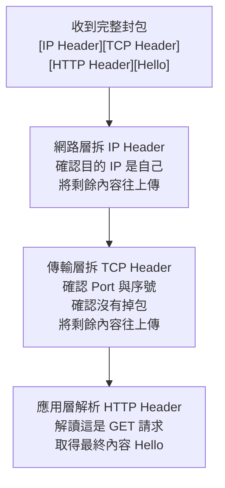
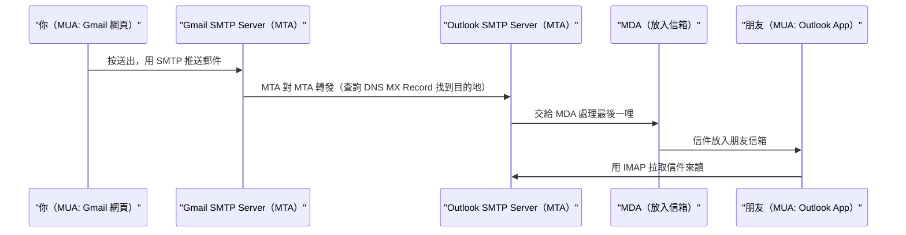

# 網路分層模型與電子郵件傳輸架構：OSI、SMTP 與封包封裝原理

## 目錄
- [1. 協定的本質](#1-協定的本質)
    - [1.1. 什麼是協定](#11-什麼是協定)
    - [1.2. 推送 vs 拉取協定](#12-推送-vs-拉取協定)
- [2. OSI 網路分層模型](#2-osi-網路分層模型)
    - [2.1. 各層職責與比喻](#21-各層職責與比喻)
    - [2.2. 關鍵層的精確定義](#22-關鍵層的精確定義)
- [3. 封包封裝與解封裝原理](#3-封包封裝與解封裝原理)
    - [3.1. 封包的組成](#31-封包的組成)
    - [3.2. 寄件方封裝流程](#32-寄件方封裝流程)
    - [3.3. 收件方解封裝流程](#33-收件方解封裝流程)
    - [3.4. 為什麼應用層叫"解析"而非"解封包"](#34-為什麼應用層叫解析而非解封包)
- [4. SMTP 與電子郵件架構](#4-smtp-與電子郵件架構)
    - [4.1. MUA / MTA / MDA 角色說明](#41-mua--mta--mda-角色說明)
    - [4.2. 完整寄信流程](#42-完整寄信流程)
- [5. 搭配 Keycloak 與 Auth0 的 SMTP 應用](#5-搭配-keycloak-與-auth0-的-smtp-應用)
    - [5.1. Keycloak SMTP 配置](#51-keycloak-smtp-配置)
    - [5.2. Auth0 SMTP 配置](#52-auth0-smtp-配置)

---

## 1. 協定的本質

### 1.1. 什麼是協定

協定就是**雙方事先講好的溝通規則**。就像打電話給客服，雙方都知道要先說「你好」、說明問題、最後說「再見」掛斷——這個固定順序就是一種協定。

網路協定規定了三件事：
- 訊息格式長什麼樣
- 誰先開口、誰後回應
- 出錯時怎麼處理

HTTP、SMTP、FTP 都是協定，跑在相同的底層（TCP/IP）之上，差別只在用途與格式規範。

### 1.2. 推送 vs 拉取協定

| 類型 | 概念 | 實際例子 |
|---|---|---|
| 推送（Push） | A 主動把資料送給 B，不需要 B 來問 | SMTP 寄信、Webhook 通知 |
| 拉取（Pull） | A 主動去問 B 有沒有新資料 | HTTP 瀏覽網頁、IMAP 收信 |

SMTP 是推送協定：你的程式主動把信「推」給對方的 SMTP server，不需要對方來問。

HTTP 是拉取協定：瀏覽器主動去問伺服器「給我這個頁面」，伺服器才回應。

---

## 2. OSI 網路分層模型

### 2.1. 各層職責與比喻

網路通訊被切成數層，每層只負責自己的事，底層不需要知道上層在幹嘛。這種設計讓各層可以獨立替換與升級。

```
第 7 層  應用層      HTTP, SMTP, FTP      ← 你的程式碼在這裡
第 4 層  傳輸層      TCP, UDP             ← 確保資料有送到
第 3 層  網路層      IP                   ← 決定走哪條路
第 2 層  資料鏈結層  Ethernet, Wi-Fi      ← 實體網路卡
```

用「寄快遞」串起三層：

| 層 | 對應快遞場景 |
|---|---|
| 應用層（HTTP/SMTP） | 你填的寄件單格式——收件人欄、品名欄怎麼填，雙方都能看懂 |
| 傳輸層（TCP） | 快遞公司的追蹤系統——確保每個包裹有簽收，沒到就重寄 |
| 網路層（IP） | 物流路線規劃——從台北到高雄要經過哪個轉運站 |

### 2.2. 關鍵層的精確定義

**網路層（IP）：定址與路由，但不保證送達**

IP 給每台機器一個地址（IP address），並決定封包從 A 到 B 要經過哪些節點跳轉。它採「盡力而為」策略，封包可能掉包或亂序，它不管——這也是為什麼需要 TCP。

**傳輸層（TCP）：全程可靠性保障**

TCP 在 IP 的不可靠傳輸之上加了一層保障。三次握手建立連線，傳輸中確認每個封包收到、掉了就重傳、亂序就重組，結束後四次揮手關閉連線。

三次握手：

```
A：我要連線（SYN）
B：好，我準備好了（SYN-ACK）
A：收到，開始傳吧（ACK）
```

注意：握手只是「建立連線」的起點，TCP 的重點是整個傳輸過程的可靠性，而不只是握手本身。

**應用層（HTTP/SMTP）：定義內容的格式與語義**

應用層不是在「拆包裝」，而是在「解讀意義」。HTTP 規定了 request/response 的結構（method、header、body）；SMTP 規定了信封格式（FROM、TO、SUBJECT）。收到資料後是按協定規則解析語義，所以叫「解析」而非「解封包」。

---

## 3. 封包封裝與解封裝原理

### 3.1. 封包的組成

每一層傳輸都會在資料前面貼上自己的 Header（控制資訊），讓對方那一層知道怎麼處理。Header 包含的是純控制資訊，例如地址、序號、Port，與資料本身的語義無關。

### 3.2. 寄件方封裝流程

以 HTTP 傳送 `"Hello"` 為例，從應用層往下，每層都包一層：

```
原始資料：
"Hello"

應用層加上 HTTP Header：
[HTTP Header: GET /index.html, Host: example.com] ["Hello"]

傳輸層加上 TCP Header：
[TCP Header: 來源Port=54321, 目的Port=80, 序號=1] [HTTP Header] ["Hello"]

網路層加上 IP Header：
[IP Header: 來源IP=1.2.3.4, 目的IP=5.6.7.8] [TCP Header] [HTTP Header] ["Hello"]
```

在網路上實際傳輸的封包就是最後這個結構，每層只看自己的 Header，不管裡面裝什麼。

### 3.3. 收件方解封裝流程

收件方從外到內一層一層拆：



每層拆掉自己的 Header 後，把剩下的內容往上丟，不需要知道上層會怎麼用。

### 3.4. 為什麼應用層叫"解析"而非"解封包"

IP 和 TCP 的 Header 是純控制資訊（地址、序號、Port），拆掉後就沒有用了，這才叫「解封包」。

應用層的 HTTP Header 裡裝的是有語義的內容（你在請求什麼、資料格式是什麼、認證 token 是什麼），不是拆掉丟棄，而是讀懂並根據它決定行為，所以叫「解析語義」更精確。

---

## 4. SMTP 與電子郵件架構

### 4.1. MUA / MTA / MDA 角色說明

| 角色 | 全名 | 生活比喻 | 實際例子 |
|---|---|---|---|
| MUA | Mail User Agent | 你手上的信紙和筆（寫信與讀信的工具） | Gmail 網頁、Outlook App、nodemailer |
| MTA | Mail Transfer Agent | 郵局的分揀與轉運系統（負責轉發送達） | SendGrid、AWS SES、Postfix |
| MDA | Mail Delivery Agent | 把信塞進對方家門口信箱的那個人 | Dovecot、Procmail |

### 4.2. 完整寄信流程

場景：你用 Gmail 寄信給一個用 Outlook 的朋友。



收信用的是 IMAP（拉取協定），和 SMTP（推送協定）是兩件完全不同的事。

---

## 5. 搭配 Keycloak 與 Auth0 的 SMTP 應用

### 5.1. Keycloak SMTP 配置

Keycloak 本身不發信，依賴外部 SMTP server。配置路徑：Admin Console → Realm Settings → Email。

```json
{
  "host": "smtp.sendgrid.net",
  "port": "587",
  "from": "no-reply@yourdomain.com",
  "auth": true,
  "user": "apikey",
  "password": "<SENDGRID_API_KEY>",
  "ssl": false,
  "starttls": true
}
```

Keycloak 自動在以下事件觸發寄信：
- 帳號驗證（Email Verification）
- 忘記密碼（Reset Password）
- 登入異常通知

### 5.2. Auth0 SMTP 配置

配置路徑：Dashboard → Branding → Email Provider → Custom SMTP。

```text
Host: smtp.gmail.com
Port: 587
Username: your@gmail.com
Password: <App Password>
```

Auth0 支援的觸發信件類型：
- Verification Email
- Welcome Email
- Change Password
- MFA OTP（email 通道）

注意：Auth0 免費方案每月有 email 數量上限，生產環境建議接 SendGrid 或 AWS SES 避免超額。