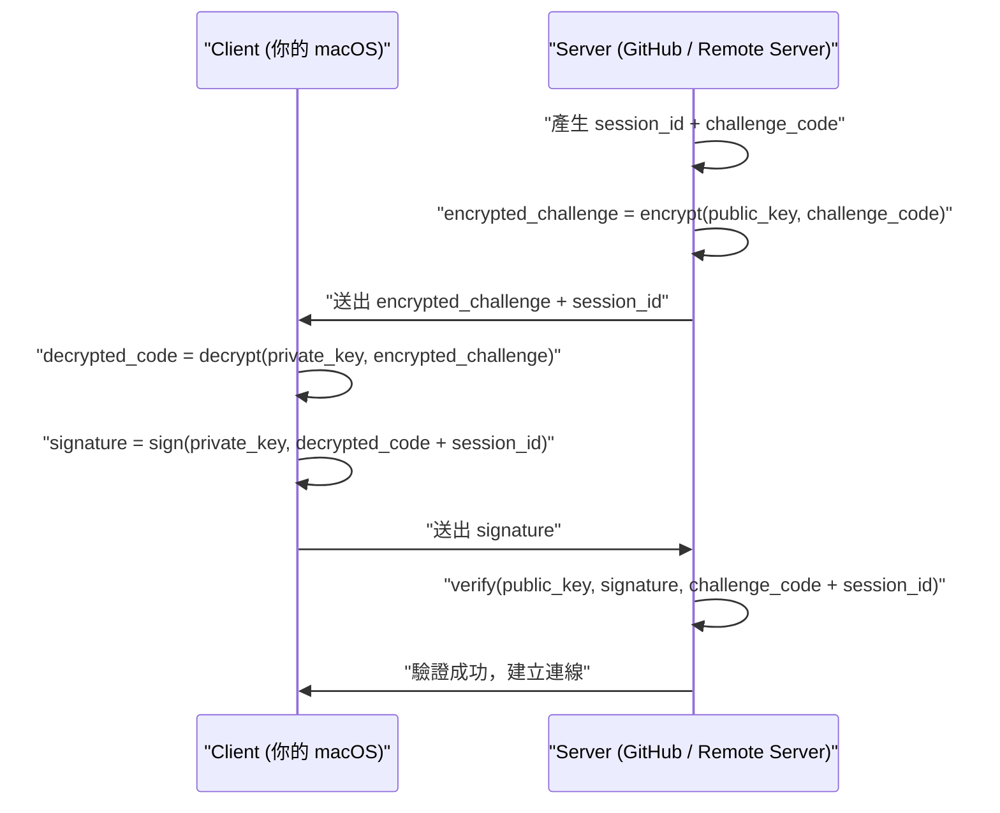

# 非對稱加密：Public Key & Private Key 原理、認證流程與 SSH 實戰

## 目錄
- [1. 核心概念](#1-核心概念)
    - [1.1. 什麼是非對稱加密](#11-什麼是非對稱加密)
    - [1.2. 與對稱加密的差異](#12-與對稱加密的差異)
- [2. 兩大核心功能](#2-兩大核心功能)
    - [2.1. 加密通訊（保密性）](#21-加密通訊保密性)
    - [2.2. 數位簽章（身份驗證與完整性）](#22-數位簽章身份驗證與完整性)
- [3. Challenge-Response 認證流程](#3-challenge-response-認證流程)
    - [3.1. 完整流程拆解](#31-完整流程拆解)
    - [3.2. 為什麼 challenge 要綁 session_id](#32-為什麼-challenge-要綁-session_id)
    - [3.3. 明文 vs 加密 challenge 的差異](#33-明文-vs-加密-challenge-的差異)
- [4. macOS + GitHub SSH 設定](#4-macos--github-ssh-設定)
    - [4.1. 產生 Key Pair](#41-產生-key-pair)
    - [4.2. 上傳公鑰至 GitHub](#42-上傳公鑰至-github)
    - [4.3. 設定 SSH Agent 與 Keychain](#43-設定-ssh-agent-與-keychain)
    - [4.4. 驗證與使用](#44-驗證與使用)
- [5. macOS + Remote Server SSH 實戰](#5-macos--remote-server-ssh-實戰)
    - [5.1. 產生 Key Pair](#51-產生-key-pair)
    - [5.2. 複製公鑰至 Remote Server](#52-複製公鑰至-remote-server)
    - [5.3. 設定 SSH Config 別名](#53-設定-ssh-config-別名)
    - [5.4. 連線測試](#54-連線測試)
    - [5.5. 關閉密碼登入（安全強化）](#55-關閉密碼登入安全強化)

---

## 1. 核心概念

### 1.1. 什麼是非對稱加密

非對稱加密（Asymmetric Cryptography）的核心是一對數學上相關的金鑰，兩把鑰匙功能不同，且無法從公鑰推導出私鑰。

| 金鑰 | 保管方式 | 用途 |
|---|---|---|
| Public Key（公鑰） | 可公開給任何人 | 加密資料 / 驗證簽章 |
| Private Key（私鑰） | 只有擁有者保管 | 解密資料 / 產生簽章 |

兩把鑰匙的運作規則：公鑰加密的內容只有私鑰能解開；私鑰簽名的內容只有公鑰能驗證。

### 1.2. 與對稱加密的差異

對稱加密（Symmetric Cryptography）使用同一把鑰匙進行加密與解密，核心問題在於「金鑰交換問題」：如何安全地把鑰匙傳給對方而不被中間人截取？

非對稱加密透過公開公鑰解決此問題。對方用你的公鑰加密後傳送，中間人即使截取密文也無法解密，因為只有你的私鑰能還原。

---

## 2. 兩大核心功能

### 2.1. 加密通訊（保密性）

流程方向：用對方的公鑰加密，對方用私鑰解密。

```python
encrypted = encrypt(alice_public_key, message)
decrypted = decrypt(alice_private_key, encrypted)
```

使用場景：你想傳機密訊息給 Alice，用 Alice 的公鑰加密，只有 Alice 的私鑰能解開，中間人無從得知內容。

### 2.2. 數位簽章（身份驗證與完整性）

流程方向：用自己的私鑰簽名，對方用你的公鑰驗證。

```python
signature = sign(alice_private_key, document)
is_valid = verify(alice_public_key, signature, document)
```

使用場景：Alice 用私鑰簽名一份文件，任何人用 Alice 的公鑰可驗證「這確實是 Alice 簽的，且內容沒被竄改」。

---

## 3. Challenge-Response 認證流程

SSH 登入使用 Challenge-Response 認證機制，目的是讓伺服器確認對方真的持有對應的私鑰，而不需要傳輸私鑰本身。

### 3.1. 完整流程拆解



各步驟說明：

1. Server 產生隨機的 challenge_code 與 session_id，用存在伺服器上的公鑰加密 challenge_code 後送出
2. Client 用私鑰解密拿回 challenge_code，再將 challenge_code + session_id 一起做數位簽章
3. Client 只傳回 signature，不傳回原始 challenge_code
4. Server 用公鑰驗證 signature，確認身份後建立連線

### 3.2. 為什麼 challenge 要綁 session_id

這是防止 **Replay Attack（重放攻擊）**。攻擊者若錄下某次認證的 signature，重新連線時重送同一個 signature：

```python
# 沒有 session_id
verify(public_key, old_signature, challenge_code)
# => true，攻擊者入侵成功

# 有 session_id
verify(public_key, old_signature, new_challenge + new_session_id)
# => false，每次 session_id 不同，舊簽章無效
```

### 3.3. 明文 vs 加密 challenge 的差異

| 版本 | challenge 傳輸 | 身份驗證 | challenge 保密 | 實際採用 |
|---|---|---|---|---|
| 明文版 | 直接送出 | ✓ | ✗ | OpenSSH 實際採用 |
| 加密版 | 公鑰加密後送出 | ✓ | ✓ | 教學說明用途 |

明文版中中間人可看到 challenge_code，但無法產生有效 signature，身份驗證仍然安全。現代 OpenSSH 採用明文版，因為光靠簽章就已足夠安全。

---

## 4. macOS + GitHub SSH 設定

### 4.1. 產生 Key Pair

```bash
ssh-keygen -t ed25519 -C "your_email@example.com"
```

`-t ed25519` 為現代推薦演算法，比舊版 RSA 更安全且金鑰更短。`-C` 為識別用註解。執行後產生：

```text
~/.ssh/id_ed25519      # 私鑰，絕對不能外洩
~/.ssh/id_ed25519.pub  # 公鑰，上傳至 GitHub
```

建議在 passphrase 步驟設定密碼，作為保護私鑰檔案的額外防線。

### 4.2. 上傳公鑰至 GitHub

```bash
cat ~/.ssh/id_ed25519.pub | pbcopy
```

前往 GitHub → Settings → SSH and GPG keys → New SSH key，貼上公鑰內容並儲存。

### 4.3. 設定 SSH Agent 與 Keychain

```bash
eval "$(ssh-agent -s)"
ssh-add --apple-use-keychain ~/.ssh/id_ed25519
```

建立 `~/.ssh/config`：

```text
Host github.com
  AddKeysToAgent yes
  UseKeychain yes
  IdentityFile ~/.ssh/id_ed25519
```

passphrase 只需輸入一次，macOS Keychain 會記住，之後自動使用。

### 4.4. 驗證與使用

```bash
# 測試連線
ssh -T git@github.com
# Hi username! You've successfully authenticated...

# Clone 使用 SSH 而非 HTTPS
git clone git@github.com:user/repo.git
```

---

## 5. macOS + Remote Server SSH 實戰

適用於任何 Linux 主機，包含 VPS、公司伺服器、雲端 EC2 等。

### 5.1. 產生 Key Pair

若已有 key pair 可跳過此步驟：

```bash
ssh-keygen -t ed25519 -C "your_email@example.com"
```

### 5.2. 複製公鑰至 Remote Server

公鑰需放置於 Remote Server 的 `~/.ssh/authorized_keys`。

**方法 A：用 ssh-copy-id（最簡單）**

```bash
ssh-copy-id -i ~/.ssh/id_ed25519.pub user@remote-server-ip
```

會要求輸入一次密碼，之後自動寫入 server 的 `~/.ssh/authorized_keys`。

**方法 B：手動複製（server 不支援 ssh-copy-id 時）**

```bash
# 本機複製公鑰內容
cat ~/.ssh/id_ed25519.pub | pbcopy

# 用密碼 SSH 進 server
ssh user@remote-server-ip

# 在 server 上執行
mkdir -p ~/.ssh
echo "貼上你的公鑰內容" >> ~/.ssh/authorized_keys
chmod 700 ~/.ssh
chmod 600 ~/.ssh/authorized_keys
```

權限設定非常重要，SSH 會拒絕權限過寬的 authorized_keys，導致 key 登入失敗。

### 5.3. 設定 SSH Config 別名

```bash
open ~/.ssh/config
```

```text
Host myserver
  HostName remote-server-ip
  User ubuntu
  IdentityFile ~/.ssh/id_ed25519
  ServerAliveInterval 60
```

`ServerAliveInterval 60` 每 60 秒送一次心跳封包，防止閒置過久被 server 踢掉連線。

### 5.4. 連線測試

```bash
ssh myserver
# 直接進入，不需輸入密碼
```

### 5.5. 關閉密碼登入（安全強化）

SSH key 設定完成後，強烈建議關閉密碼登入，防止暴力破解：

```bash
sudo nano /etc/ssh/sshd_config
```

找到並修改以下兩行：

```text
PasswordAuthentication no
PermitRootLogin no
```

重啟 SSH 服務套用設定：

```bash
sudo systemctl restart sshd
```

完成後只有持有私鑰的裝置才能登入，密碼暴力破解完全無效。