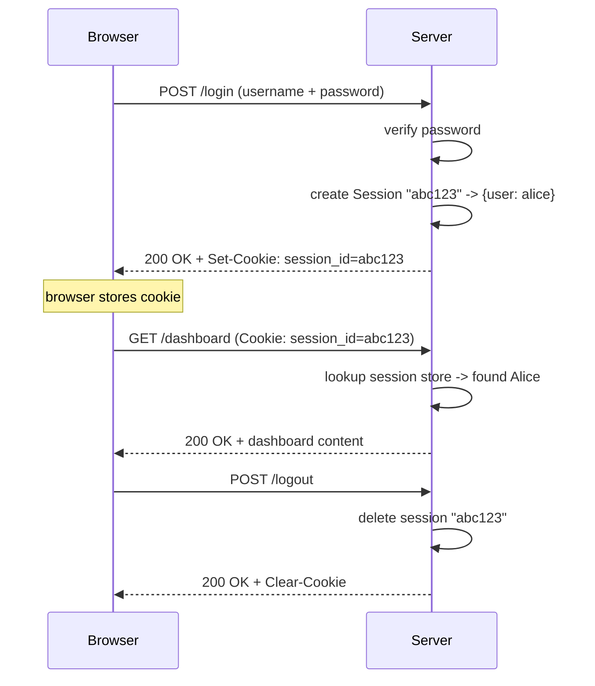
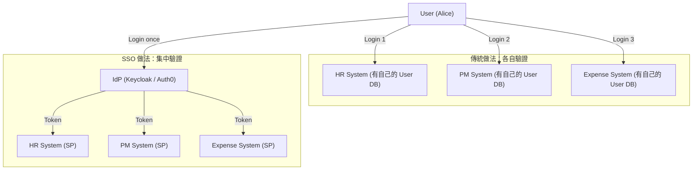
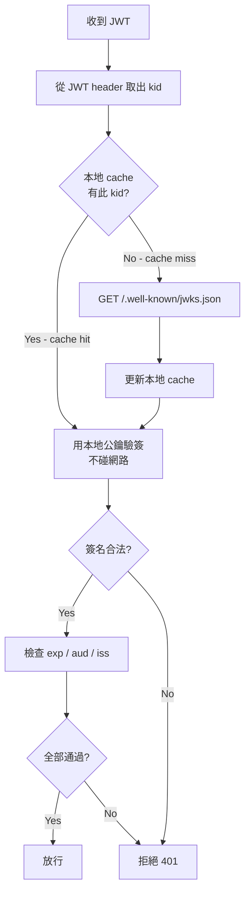
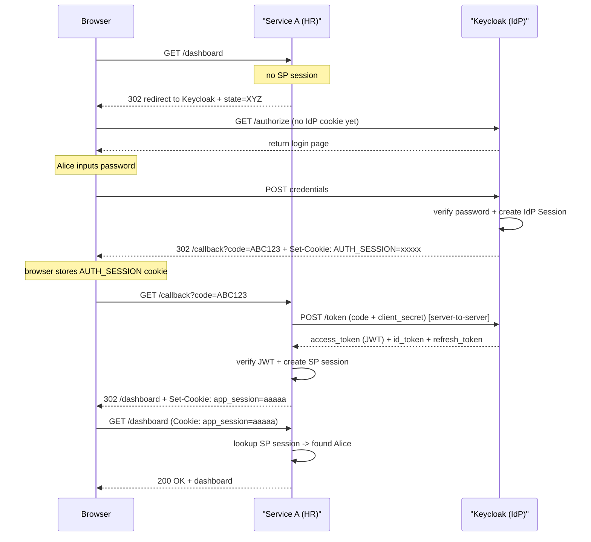
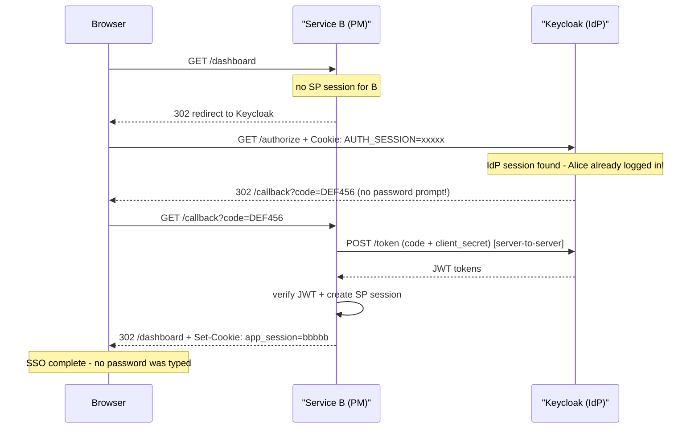
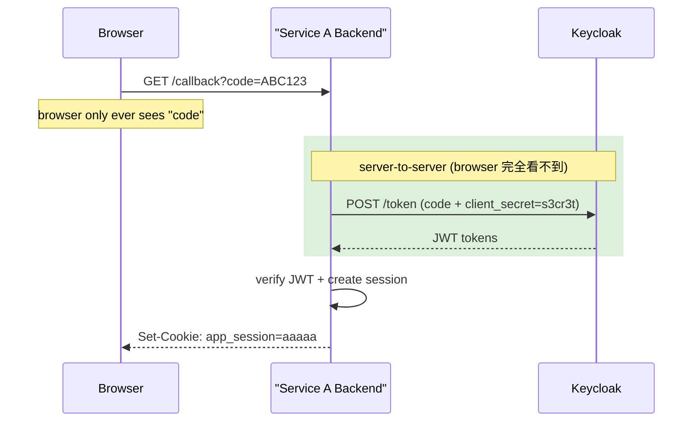
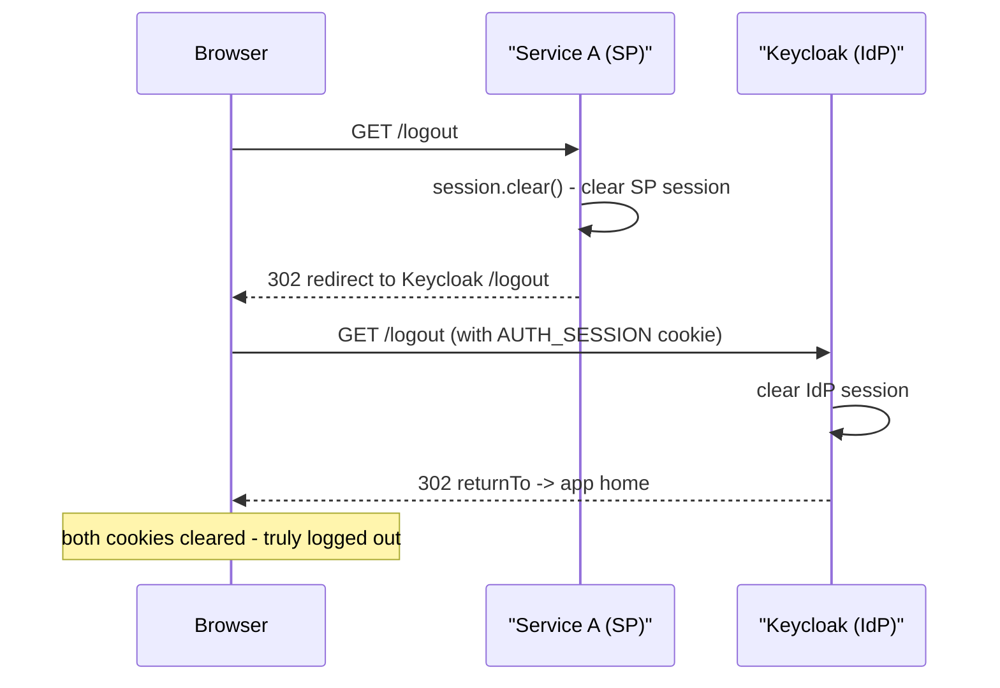
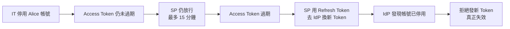

# Web Authentication: Traditional Session vs SSO 完整入門指南

## 目錄
- [Web Authentication: Traditional Session vs SSO 完整入門指南](#web-authentication-traditional-session-vs-sso-完整入門指南)
  - [目錄](#目錄)
  - [1. 背景：HTTP 是無狀態的](#1-背景http-是無狀態的)
  - [2. 傳統 Session / Cookie 登入](#2-傳統-session--cookie-登入)
    - [2.1. Cookie 是什麼](#21-cookie-是什麼)
    - [2.2. Session 是什麼](#22-session-是什麼)
    - [2.3. 傳統登入完整流程](#23-傳統登入完整流程)
    - [2.4. FastAPI 實作範例](#24-fastapi-實作範例)
    - [2.5. 傳統登入的痛點](#25-傳統登入的痛點)
  - [3. SSO 的誕生：解決什麼問題](#3-sso-的誕生解決什麼問題)
    - [3.1. 核心概念](#31-核心概念)
    - [3.2. 角色定義](#32-角色定義)
  - [4. JWT：SSO 的通行證](#4-jwtsso-的通行證)
    - [4.1. JWT 結構](#41-jwt-結構)
    - [4.2. 驗簽原理與 JWKS](#42-驗簽原理與-jwks)
  - [5. OIDC Authorization Code Flow：SSO 完整流程](#5-oidc-authorization-code-flowsso-完整流程)
    - [5.1. 兩層 Session 架構](#51-兩層-session-架構)
    - [5.2. 第一次登入流程](#52-第一次登入流程)
    - [5.3. 第二個服務的登入（SSO 生效）](#53-第二個服務的登入sso-生效)
    - [5.4. 為什麼要 Server-to-Server 交換](#54-為什麼要-server-to-server-交換)
    - [5.5. Logout 流程](#55-logout-流程)
    - [5.6. FastAPI 實作範例](#56-fastapi-實作範例)
  - [6. Token 與 Session 的過期管理](#6-token-與-session-的過期管理)
    - [6.1. 各層有效期](#61-各層有效期)
    - [6.2. 帳號即時撤銷的三種做法](#62-帳號即時撤銷的三種做法)
  - [7. 傳統登入 vs SSO：怎麼選](#7-傳統登入-vs-sso怎麼選)

---

## 1. 背景：HTTP 是無狀態的

在理解 Authentication 之前，需要先知道一個根本問題：**HTTP 協議本身沒有記憶**。每一個 HTTP Request 對 Server 來說都是陌生人。你登入完，下一個 Request 到來，Server 完全不認識你。

```http
GET /dashboard HTTP/1.1
Host: hr.company.com
# Server 看到這個，完全不知道是誰送來的
```

Authentication 要解決的核心問題：**如何讓 Server 在無狀態的協議上，辨識「這個 Request 是已登入的 Alice 發來的」**。

---

## 2. 傳統 Session / Cookie 登入

### 2.1. Cookie 是什麼

Cookie 是存在瀏覽器的一小段純文字，格式就是 `key=value`。最關鍵的特性：**瀏覽器每次發 Request 時，會自動把對應 domain 的 Cookie 放進 Header 帶過去**，不需要任何程式碼主動處理。

Cookie 存在於 **HTTP Header**，不是 Body（payload）：

```http
# Server 叫瀏覽器存 Cookie（Response Header）
HTTP/1.1 200 OK
Set-Cookie: session_id=abc123; HttpOnly; Secure; SameSite=Lax; Max-Age=3600

# 瀏覽器之後每次 Request 自動帶上（Request Header）
GET /dashboard HTTP/1.1
Cookie: session_id=abc123
```

重點：Cookie 只是一個 ID，**它本身不存任何用戶資料**。

### 2.2. Session 是什麼

Session 是存在 **Server 端**的真實資料，以 Cookie 裡的 ID 作為 key。

現實類比：Cookie 是號碼牌，Session Store 是廚房的記事本。

```
Browser Cookie:      session_id = "abc123"   (只是 ID)
                            |
                            v
Server Session Store:
  "abc123" -> { user: "alice", role: "admin", expires: "..." }
```

### 2.3. 傳統登入完整流程



### 2.4. FastAPI 實作範例

```python
# pip install fastapi uvicorn itsdangerous

from fastapi import FastAPI, Request, HTTPException
from starlette.middleware.sessions import SessionMiddleware
from pydantic import BaseModel

app = FastAPI()
app.add_middleware(SessionMiddleware, secret_key="your-secret-key")

USERS = {"alice": "password123", "bob": "qwerty"}

class LoginRequest(BaseModel):
    username: str
    password: str

@app.post("/login")
def login(body: LoginRequest, request: Request):
    if USERS.get(body.username) != body.password:
        raise HTTPException(status_code=401, detail="Invalid credentials")

    # 把用戶資訊寫入 Server-side Session
    request.session["user"] = body.username
    request.session["authenticated"] = True
    # FastAPI 自動在 Response 設 Set-Cookie: session=<signed_value>
    return {"message": f"Welcome {body.username}"}

@app.get("/dashboard")
def dashboard(request: Request):
    if not request.session.get("authenticated"):
        raise HTTPException(status_code=401, detail="Not logged in")
    return {"user": request.session["user"]}

@app.post("/logout")
def logout(request: Request):
    request.session.clear()
    return {"message": "Logged out"}
```

### 2.5. 傳統登入的痛點

假設公司有三個系統：HR、PM、Expense。傳統做法的問題：

| 問題 | 說明 |
|---|---|
| 多次登入 | 每個系統各自登入一次，3 個系統要輸入 3 次密碼 |
| 密碼分散 | 每個系統各自存密碼，任一個被攻破都會洩漏 |
| 帳號難管理 | 員工離職要去每個系統各自停用帳號，容易漏掉 |
| 維運成本高 | 新增系統就要重新開發一套 Auth 邏輯 |

---

## 3. SSO 的誕生：解決什麼問題

SSO（Single Sign-On）的核心思想：

> 引入一個**中心化的身份提供者（Identity Provider）**，用戶只向它證明自己是誰，其他所有系統信任它的背書。

現實類比：公司大樓門禁卡。你刷一次卡進大樓，就能進入任何你有權限的房間，不需要每個房間再刷一次。

SSO 解決了三個核心問題：

**一、密碼集中管理**：SP 全程看不到用戶密碼。密碼只在 IdP 內部流動，即使某個 SP 被攻破，攻擊者拿不到密碼。

**二、一次登入通行**：用戶只需向 IdP 登入一次，IdP 替每個 SP 分別簽發 Token，後續的 Token 交換在背景自動完成，用戶完全無感。

**三、集中帳號控管**：IT 在 IdP 停用帳號，Token 在短暫的有效期窗口後失效，所有服務均受影響，不需要逐一去每個系統砍帳號。

### 3.1. 核心概念



### 3.2. 角色定義

**IdP（Identity Provider）**：身份提供者，負責驗證用戶身份、管理帳號、簽發 Token。常見實作：Keycloak（自架）、Auth0（SaaS）、Okta。

**SP（Service Provider）**：服務提供者，也叫 RP（Relying Party）。就是你的 HR、PM 等應用系統。它們不驗密碼，只驗 IdP 簽發的 Token。

---

## 4. JWT：SSO 的通行證

JWT（JSON Web Token）是 IdP 簽發給 SP 的通行證，結構分三段，用 `.` 隔開。

### 4.1. JWT 結構

```json
// Header（演算法與 Key ID）
{
  "alg": "RS256",
  "typ": "JWT",
  "kid": "key-2024-v2"
}

// Payload（用戶資訊）
{
  "sub":   "alice@company.com",
  "name":  "Alice Chen",
  "email": "alice@company.com",
  "roles": ["hr:read", "pm:write"],
  "iss":   "https://auth.company.com",
  "aud":   "hr.company.com",
  "exp":   1716000000,
  "iat":   1715996400
}

// Signature = RS256(base64(header) + "." + base64(payload), IdP 私鑰)
```

`aud`（Audience）欄位非常重要：HR 系統的 Token，`aud = hr.company.com`。PM 系統收到這個 Token 應該**直接拒絕**，因為 aud 不是自己。Token 不是「一個通吃所有服務」的萬用鑰匙。

### 4.2. 驗簽原理與 JWKS

SP 驗證 JWT 不需要每次詢問 IdP，而是透過**公鑰驗簽**：IdP 用私鑰簽名 Token，SP 用 IdP 的公鑰驗證簽名是否合法。IdP 把公鑰暴露在 JWKS Endpoint：

```
GET https://auth.company.com/.well-known/jwks.json

{
  "keys": [
    {
      "kty": "RSA",
      "kid": "key-2024-v2",
      "use": "sig",
      "n":   "xjf3k...",
      "e":   "AQAB"
    }
  ]
}
```

SP 啟動時把這份 key set 快取在本地，收到 JWT 時的驗簽流程：



---

## 5. OIDC Authorization Code Flow：SSO 完整流程

### 5.1. 兩層 Session 架構

SSO 場景下，瀏覽器同時存在兩層互相獨立的 Session：

| | 誰建立 | Cookie domain | 代表什麼 |
|---|---|---|---|
| IdP Session | Keycloak / Auth0 | auth.company.com | 你在 IdP 登入過 |
| SP Session | HR / PM 等 App | hr.company.com 等 | 你在這個 App 登入過 |

瀏覽器根據 domain 嚴格隔離 Cookie。完整登入後，Alice 的瀏覽器有：

```
auth.company.com   ->  AUTH_SESSION=xxxxx  (IdP session)
hr.company.com     ->  app_session=aaaaa   (HR SP session)
pm.company.com     ->  app_session=bbbbb   (PM SP session)
```

### 5.2. 第一次登入流程



### 5.3. 第二個服務的登入（SSO 生效）



### 5.4. 為什麼要 Server-to-Server 交換

這個設計模式叫 Authorization Code Flow，核心目的是保護 `client_secret`。

**user credentials** 是 Alice 的帳號密碼，向 IdP 證明「你是你」。**client_secret** 是 HR System 向 Keycloak 註冊時拿到的密鑰，向 Keycloak 證明「跟你換 Token 的真的是 HR System，不是別人偽裝的」。



如果沒有 code，直接把 JWT 放在 redirect URL 裡（舊的 Implicit Flow，現已廢棄），會有三個問題：Token 出現在瀏覽器歷史記錄、Token 透過 Referer Header 洩漏給第三方網站、無法驗證接收方身份。`code` 單獨沒有任何價值，必須搭配只有 SP backend 才有的 `client_secret` 才能換到 Token。

### 5.5. Logout 流程

Logout 必須清除兩層 Session。只清 SP session 是不夠的——IdP cookie 還在，下次點登入會立刻自動登入成功。



### 5.6. FastAPI 實作範例

```python
# pip install fastapi uvicorn authlib httpx starlette

from fastapi import FastAPI, Request
from fastapi.responses import RedirectResponse
from starlette.middleware.sessions import SessionMiddleware
from authlib.integrations.starlette_client import OAuth

app = FastAPI()
app.add_middleware(SessionMiddleware, secret_key="your-app-secret")

oauth = OAuth()

# Keycloak 設定
oauth.register(
    name="keycloak",
    client_id="hr-system",
    client_secret="s3cr3t",
    # OIDC discovery URL，Authlib 自動找 /authorize /token /jwks.json
    server_metadata_url=(
        "https://keycloak.company.com/realms/myrealm"
        "/.well-known/openid-configuration"
    ),
    client_kwargs={"scope": "openid profile email"},
)

# Auth0 的話只換這一行：
# server_metadata_url="https://YOUR_DOMAIN.auth0.com/.well-known/openid-configuration"


@app.get("/login")
async def login(request: Request):
    redirect_uri = "https://hr.company.com/callback"
    return await oauth.keycloak.authorize_redirect(request, redirect_uri)


@app.get("/callback")
async def callback(request: Request):
    # Authlib 自動處理 server-to-server 換 token 與 JWT 驗簽
    token = await oauth.keycloak.authorize_access_token(request)
    userinfo = token["userinfo"]
    # { "sub": "alice@...", "name": "Alice Chen", "email": "alice@..." }

    # 建立 SP 自己的 session，之後不需要再碰 Keycloak
    request.session["user"] = {
        "id":    userinfo["sub"],
        "name":  userinfo["name"],
        "email": userinfo["email"],
    }
    return RedirectResponse("/dashboard")


@app.get("/dashboard")
async def dashboard(request: Request):
    user = request.session.get("user")
    if not user:
        return RedirectResponse("/login")
    return {"message": f"Hello {user['name']}"}


@app.get("/logout")
async def logout(request: Request):
    request.session.clear()  # 步驟一：清 SP session

    # 步驟二：通知 Keycloak 清 IdP session
    # 缺少此步驟則 IdP cookie 仍在，下次 /login 會立刻自動登入
    keycloak_logout = (
        "https://keycloak.company.com/realms/myrealm"
        "/protocol/openid-connect/logout"
        "?redirect_uri=https://hr.company.com"
    )
    return RedirectResponse(keycloak_logout)
```

---

## 6. Token 與 Session 的過期管理

### 6.1. 各層有效期

SSO 場景下有四種壽命不同的 Token / Session：

| | 典型有效期 | 過期後發生什麼 |
|---|---|---|
| Access Token (JWT) | 5 ~ 15 分鐘 | SP 用 Refresh Token 換新的，用戶無感 |
| Refresh Token | 幾小時 ~ 幾天 | 過期要重新走完整登入流程 |
| SP Session | 30 分鐘 ~ 幾小時 | 被 redirect 回 IdP，若 IdP session 還在則不需輸入密碼 |
| IdP Session | 8 ~ 24 小時 | 下次訪問 IdP 需重新輸入密碼 |

最常見的情境：**SP session 過期，但 IdP session 還活著**。用戶被 redirect 到 IdP，IdP 認出 Cookie，自動發新 code 回來，整個過程用戶完全無感，看不到任何登入畫面。

### 6.2. 帳號即時撤銷的三種做法

JWT 是 stateless 的，SP 驗簽只看簽名和 `exp`，不會問 IdP「這個 token 還有效嗎」。所以停用帳號後不會立刻失效：



若需要更即時的撤銷，有三種方案：

**Token Introspection（即時查詢）**：SP 每次收到 Token 都打一個 API 問 IdP 是否有效。失效即時，但每個 Request 多一次 HTTP call，IdP 成為效能瓶頸。

**Revocation List（黑名單）**：IdP 維護一份黑名單，SP 定期同步（例如每分鐘）。比 Introspection 輕量，但有短暫的同步延遲窗口。

**短 exp + Refresh Token（最常見）**：Access Token 有效期設很短（5 ~ 15 分鐘），靠 Refresh Token 換新。停用後最多等一個 Access Token 有效期就自然斷線。

| | 失效速度 | SP 複雜度 | IdP 壓力 |
|---|---|---|---|
| 短 exp + Refresh Token | 分鐘級 | 低 | 低 |
| Revocation List | 秒 ~ 分鐘 | 中 | 中 |
| Token Introspection | 即時 | 高 | 高 |

---

## 7. 傳統登入 vs SSO：怎麼選

| 情境 | 建議 |
|---|---|
| 個人專案、單一服務、early-stage startup | 傳統 Session 登入，簡單夠用 |
| 公司內部多個系統（HR、PM、ERP 等） | SSO，員工只需一組帳號 |
| 對外多產品平台 | SSO，統一用戶體驗 |
| 需要接第三方登入（Login with Google） | OIDC，你是 SP，Google 是 IdP |
| 法規要求集中帳號管控（金融、醫療） | SSO 幾乎是強制要求 |

現實中大多數有規模的公司是**混合的**：內部系統用 Keycloak 做 SSO，對外 API 用 JWT，某些老系統還跑著傳統 session，全部並存。