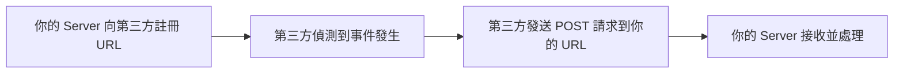
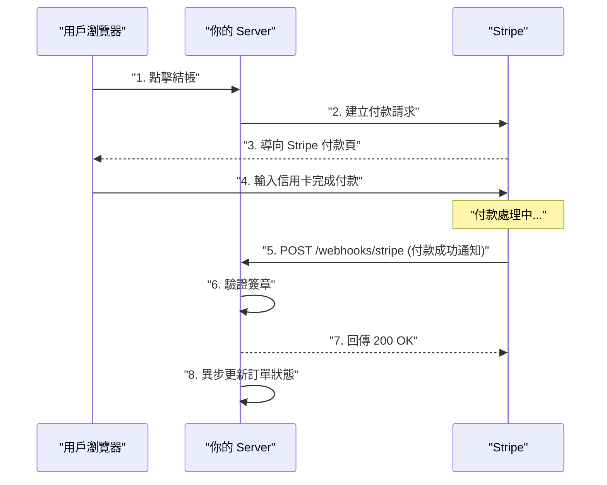
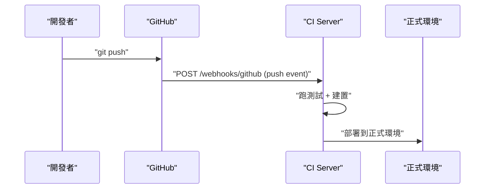
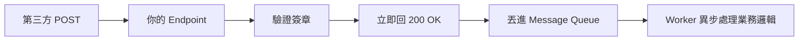
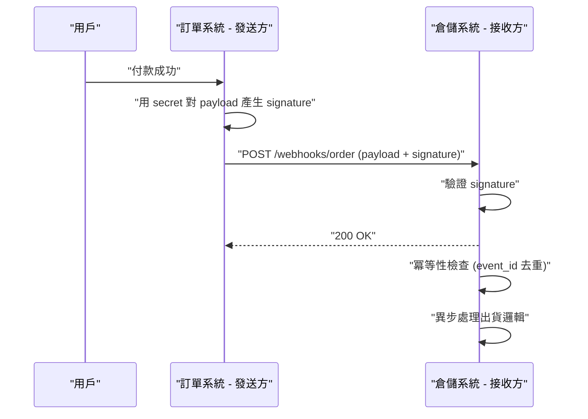

# Webhook 機制完整解析 - 從原理到實作與安全性實踐

## 目錄
- [Webhook 機制完整解析 - 從原理到實作與安全性實踐](#webhook-機制完整解析---從原理到實作與安全性實踐)
  - [目錄](#目錄)
  - [1. Webhook 解決什麼問題](#1-webhook-解決什麼問題)
  - [2. Webhook 是什麼](#2-webhook-是什麼)
    - [2.1. 核心概念](#21-核心概念)
    - [2.2. 一句話定義](#22-一句話定義)
    - [2.3. Webhook 的組成](#23-webhook-的組成)
  - [3. Webhook 運作流程](#3-webhook-運作流程)
    - [3.1. 註冊階段](#31-註冊階段)
    - [3.2. 觸發與通知階段](#32-觸發與通知階段)
    - [3.3. 雙方角色定義](#33-雙方角色定義)
  - [4. 常見使用場景](#4-常見使用場景)
  - [5. 安全考量](#5-安全考量)
    - [5.1. 簽章驗證 Signature Verification](#51-簽章驗證-signature-verification)
    - [5.2. 冪等性 Idempotency](#52-冪等性-idempotency)
    - [5.3. 快速回應與異步處理](#53-快速回應與異步處理)
    - [5.4. HTTPS 與 IP 白名單](#54-https-與-ip-白名單)
  - [6. 完整實作範例 Python](#6-完整實作範例-python)
    - [6.1. 架構總覽](#61-架構總覽)
    - [6.2. 發送方實作](#62-發送方實作)
    - [6.3. 接收方實作](#63-接收方實作)
  - [7. 延伸 — Circuit Breaker 在 Webhook 中的應用](#7-延伸--circuit-breaker-在-webhook-中的應用)

---

## 1. Webhook 解決什麼問題

現代後端架構中，服務之間很少完全獨立運作。一個業務流程往往跨越多個系統——例如用戶在你的電商網站付款，付款處理是 Stripe 負責，訂單狀態更新是你的 server 負責，出貨通知又是倉儲系統的事。

這就產生一個核心問題：**當 A 系統發生了某件事，B 系統怎麼即時知道並做後續處理？**

以 "付款完成後通知倉儲出貨" 為例，有兩種思路：

**Polling（B 主動問 A）：** 倉儲系統每隔 30 秒呼叫 Stripe API 問 "這筆訂單付了沒？"，大部分時候得到的回應都是 "還沒"，直到終於問到 "付了" 才開始出貨。這有兩個根本問題：

| 問題 | 說明 |
|---|---|
| 浪費資源 | 大部分 polling 請求得到的回應是 "沒有新事件"，等於白打 |
| 延遲高 | 若每 30 秒 poll 一次，最差情況要等 30 秒才得知事件發生。提高頻率可降低延遲，但資源浪費更嚴重 |

**Webhook（A 主動通知 B）：** 倉儲系統預先給 Stripe 一個 URL，Stripe 在付款完成的當下主動打這個 URL 通知倉儲系統，倉儲系統收到後立刻開始出貨。事件發生才通知，零浪費、近乎即時。

Webhook 就是後者的標準實現方式。

適用判斷原則：只要是 "A 系統發生了資料或狀態更新，B 系統需要即時知道並做後續處理" 的場景，就適合使用 Webhook。如果 B 只是偶爾想查資料、不需要即時反應，用 API 主動查詢即可。

---

## 2. Webhook 是什麼

### 2.1. 核心概念

Webhook 的核心是**反轉通知方向**。傳統 Polling 是你主動去問對方 "有沒有新消息？"，Webhook 則是你先留一個 URL 給對方，有事時對方主動打這個 URL 通知你。

用生活類比：Polling 就像你每 5 分鐘打電話問餐廳 "我的餐好了嗎？"；Webhook 就像你留電話給餐廳，餐好了他們打給你。

具體來說：你的 Server 提供一個公開的 URL endpoint，第三方服務在事件發生時對這個 URL 發送 HTTP POST 請求（帶著事件資料），你的 Server 收到後驗證來源、處理業務邏輯、回傳 200 OK。

### 2.2. 一句話定義

**白話版：** 你留電話給對方，有事他打給你，不用你一直打去問。

**工程版：** 事件驅動的 HTTP 回呼機制——服務端在特定事件發生時，主動對預先註冊的 URL 發送 POST 請求以推送資料。

### 2.3. Webhook 的組成

Webhook 是**整個機制**，而不是單指一個 URL。它涵蓋了完整的流程：



日常溝通中，工程師常把接收端的 URL 也簡稱為 "webhook"（例如 "把你的 webhook 貼給我"），但嚴格來說 URL 只是 webhook 機制中的一個組成元素。類似大家說 "打個 API" 其實是指 "發一個 HTTP 請求到某個 API endpoint"。

---

## 3. Webhook 運作流程

### 3.1. 註冊階段

"註冊" 就是把你的 URL 告訴對方，讓對方知道事件發生時要往哪裡發通知。通常有兩種方式：

**手動註冊：** 到第三方後台（例如 Stripe Dashboard）在設定頁面填入你的 URL 並儲存。

**API 註冊：** 用程式呼叫對方提供的註冊 endpoint：

```bash
POST https://api.stripe.com/v1/webhook_endpoints
{
  "url": "https://yoursite.com/webhooks/stripe",
  "events": ["payment_intent.succeeded", "payment_intent.failed"]
}
```

這段程式碼做了三件事：POST 到 Stripe 的 webhook 註冊 endpoint (`https://api.stripe.com/v1/webhook_endpoints`)，註冊你的 webhook URL (`https://yoursite.com/webhooks/stripe`)，並聲明哪些事件發生時要打這個 URL。

你也可以針對不同事件註冊不同 URL（例如付款事件和退款事件分開），或全部打同一個 URL 由 server 內部根據事件類型分流處理，這是架構設計上的選擇。

### 3.2. 觸發與通知階段

以電商串接 Stripe 付款為例：



步驟 5 就是 Webhook 發生的地方。Stripe 主動對你預先註冊的 URL 發送一個 POST 請求，Body 裡帶著這筆交易的 JSON 資料（金額、狀態、訂單 ID 等）。注意步驟 7 和 8 的順序：先回 200 OK 給 Stripe，再異步處理業務邏輯，避免處理時間過長導致 Stripe timeout 並重試。

### 3.3. 雙方角色定義

**第三方服務（事件發送方）：**
- 在事件發生時，把資料打包成 HTTP POST 送到你註冊的 URL
- 附帶簽章（signature）讓你驗證來源真實性
- 若你的 server 沒回 2xx，通常會自動重試（retry）

**你的 Server（事件接收方）：**
- 提供一個公開可達的 endpoint URL
- 收到請求後依序：驗證來源真實性、回傳 200 OK、異步處理業務邏輯
- 必須快速回應，耗時任務丟到背景處理（message queue），否則對方會 timeout 並重試

---

## 4. 常見使用場景

| 場景 | 發送方 | 接收方 | 觸發事件 |
|---|---|---|---|
| 支付通知 | Stripe / PayPal | 你的電商 Server | 付款成功/失敗/退款 |
| CI/CD 觸發 | GitHub / GitLab | Jenkins / CI Server | git push / merge |
| 聊天機器人 | Slack / Discord / LINE | 你的 Bot Server | 用戶發送訊息 |
| CMS 內容更新 | Strapi / Contentful | 前端建置服務 | 文章發布/修改 |
| 監控告警 | Datadog / PagerDuty | Slack 或自動擴容服務 | CPU 異常/服務故障 |

以 CI/CD 為例的流程：



---

## 5. 安全考量

Webhook endpoint 是公開的 URL，任何人都可以對它發 POST 請求，因此安全處理至關重要。

### 5.1. 簽章驗證 Signature Verification

目的：確認請求確實來自合法的發送方，而非偽造。

**運作原理（不是加密解密，是簽章比對）：**

1. 你在第三方後台註冊 webhook 時，對方給你一個 **webhook secret**（只出現一次，你存在自己的環境變數中）
2. 發送方每次發 webhook 時，用這個 secret 對 payload 做 HMAC-SHA256 運算，產生 signature 放在 HTTP header 送過來
3. 你的 server 用**本地存的同一把 secret** 對收到的 payload 做同樣運算，比對結果是否一致

關鍵：secret 從你自己的環境變數讀取，不是從請求裡傳進來的。只有你和發送方知道這把 secret，偽造者無法算出正確的 signature。

```python
import hmac
import hashlib
import os

def verify_signature(payload: bytes, signature: str) -> bool:
    """用本地 secret 重新計算簽章並比對"""
    secret = os.environ["WEBHOOK_SECRET"]  # 從環境變數讀取，不是從請求來的
    expected = hmac.new(
        secret.encode(),
        payload,
        hashlib.sha256
    ).hexdigest()
    return hmac.compare_digest(expected, signature)
```

如果不做簽章驗證，任何人都可以偽造一個 "付款成功" 的請求打你的 server，系統就會誤以為真的收到錢。

### 5.2. 冪等性 Idempotency

核心概念：**同一個操作執行一次和執行多次，結果必須一樣。**

為什麼需要：網路不可靠。假設 Stripe 發了 "付款成功" webhook，你的 server 處理完了，但回 200 OK 時網路斷了，Stripe 沒收到回應就認為失敗並重發同一筆通知。如果不做去重，就會出現訂單被標記付款成功兩次、發兩次貨、扣兩次庫存等問題。

做法：用發送方提供的唯一事件 ID（event_id）做去重。

```python
def handle_webhook(event):
    event_id = event["event_id"]

    # 先查這個事件是否已處理過
    if db.exists("processed_events", event_id):
        return 200  # 已處理，直接回 OK，不做任何事

    # 未處理過，執行業務邏輯
    update_order_status(event)
    send_confirmation_email(event)

    # 標記已處理
    db.insert("processed_events", event_id)

    return 200
```

不管發送方重送幾次，你只會處理一次。實務上 `processed_events` 用 Redis 或資料庫儲存，而非記憶體中的 set。

### 5.3. 快速回應與異步處理

大多數第三方有 timeout 限制（通常 5-30 秒），超時會當作失敗並重試。因此收到 webhook 後應先回 200 OK，再把實際業務丟到 message queue 背景處理。



### 5.4. HTTPS 與 IP 白名單

**HTTPS：** Webhook URL 必須使用 `https://`，防止傳輸過程被中間人竊聽或竄改 payload。

**IP 白名單（進階）：** 部分服務會公布發送 webhook 的 IP 範圍，你可以在防火牆層級只允許這些 IP 存取 webhook endpoint，多一層防護。

---

## 6. 完整實作範例 Python

場景：訂單系統付款成功後，透過 webhook 通知倉儲系統出貨。

### 6.1. 架構總覽



### 6.2. 發送方實作

```python
import hmac
import hashlib
import requests
import json
import uuid
from datetime import datetime

WEBHOOK_SECRET = "your-shared-secret-key"
WEBHOOK_URL = "http://localhost:8001/webhooks/order"

def generate_signature(payload: bytes) -> str:
    """用 secret 對 payload 產生 HMAC-SHA256 簽章"""
    return hmac.new(
        WEBHOOK_SECRET.encode(),
        payload,
        hashlib.sha256
    ).hexdigest()

def send_webhook(order_id: str, amount: float):
    """付款成功後發送 webhook 通知倉儲系統"""
    payload = {
        "event_id": str(uuid.uuid4()),   # 唯一事件 ID，給接收方做冪等用
        "event_type": "order.paid",
        "timestamp": datetime.utcnow().isoformat(),
        "data": {
            "order_id": order_id,
            "amount": amount,
            "status": "paid"
        }
    }

    payload_bytes = json.dumps(payload).encode()
    signature = generate_signature(payload_bytes)

    response = requests.post(
        WEBHOOK_URL,
        data=payload_bytes,
        headers={
            "Content-Type": "application/json",
            "X-Webhook-Signature": signature   # 簽章放 header 不放 body
        },
        timeout=10  # 避免對方掛了卡住 thread
    )

    print(f"Webhook 回應: {response.status_code}")

# 模擬付款成功
send_webhook("ORD-001", 1500.00)
```

重點說明：`event_id` 由發送方產生，每筆事件唯一，接收方靠此做去重。`signature` 放在 header 而非 body，讓接收方可先驗證再解析內容。`timeout=10` 防止對方服務故障時你的 thread 被卡死。

### 6.3. 接收方實作

```python
from flask import Flask, request, jsonify
import hmac
import hashlib

app = Flask(__name__)

WEBHOOK_SECRET = "your-shared-secret-key"
processed_events = set()  # 實務上用 Redis 或 DB 存

def verify_signature(payload: bytes, signature: str) -> bool:
    """驗證簽章是否合法"""
    expected = hmac.new(
        WEBHOOK_SECRET.encode(),
        payload,
        hashlib.sha256
    ).hexdigest()
    return hmac.compare_digest(expected, signature)

@app.route("/webhooks/order", methods=["POST"])
def handle_order_webhook():
    # Step 1: 驗證簽章
    signature = request.headers.get("X-Webhook-Signature", "")
    if not verify_signature(request.data, signature):
        return jsonify({"error": "Invalid signature"}), 401

    # Step 2: 立即回 200 OK
    # (實務上會先將 event 丟進 message queue 再回 200)

    # Step 3: 解析 payload
    event = request.get_json()
    event_id = event["event_id"]

    # Step 4: 冪等性檢查
    if event_id in processed_events:
        return jsonify({"message": "Already processed"}), 200

    # Step 5: 處理業務邏輯
    if event["event_type"] == "order.paid":
        order = event["data"]
        print(f"準備出貨: 訂單 {order['order_id']}，金額 {order['amount']}")

    # Step 6: 標記已處理
    processed_events.add(event_id)

    return jsonify({"message": "OK"}), 200

if __name__ == "__main__":
    app.run(port=8001)
```

接收方的處理順序：**驗簽章 -> 回 200 OK -> 冪等檢查 -> 業務邏輯 -> 標記已處理**。驗簽章放最前面，簽章不對後面全部不用做，直接擋掉。實務上 Step 3-6 會丟進 message queue 由 worker 異步處理，Flask handler 只負責驗簽章和回 200。

---

## 7. 延伸 — Circuit Breaker 在 Webhook 中的應用

Circuit Breaker（斷路器）是一個獨立的設計模式，不是專門配合 webhook 的。核心概念：當你呼叫的下游服務一直失敗時，暫時停止呼叫，避免連鎖崩潰（cascading failure），就像家裡的電路跳閘自動斷開保護整個電路。

**在 Webhook 場景中的應用（站在發送方角度）：**

當你是 webhook 發送方，對方的 server 掛了：

- **沒有 Circuit Breaker：** 每筆事件都傻傻發請求、等 timeout、重試，大量 thread 被卡住，最終拖垮你自己的系統
- **有 Circuit Breaker：** 連續失敗 N 次後自動斷開，暫停發送，事件先存到 queue，等一段時間再試探，對方恢復才繼續

簡單說：保護你自己不要被對方的故障拖下水。如果你只是接收方（如前面 Stripe 的例子），retry 邏輯是 Stripe 負責的，你不需要自己實作 Circuit Breaker。
