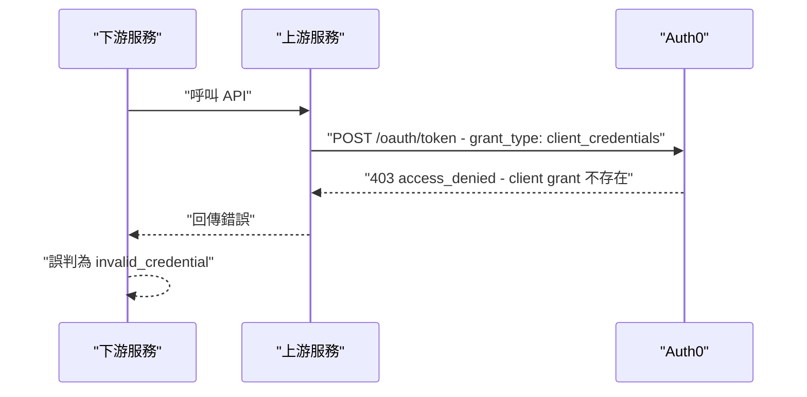

# Auth0 Client Credentials Flow - access_denied 403 排查與修復

> Updated: 2026-03-09 21:10


## 目錄
- [1. 問題情境與錯誤現象](#1-問題情境與錯誤現象)
    - [1.1. 錯誤 Log 範例](#11-錯誤-log-範例)
    - [1.2. 時間關聯分析](#12-時間關聯分析)
- [2. 根本原因分析](#2-根本原因分析)
    - [2.1. 錯誤層級判斷](#21-錯誤層級判斷)
    - [2.2. 完整錯誤鏈推導](#22-完整錯誤鏈推導)
    - [2.3. 關鍵技術概念](#23-關鍵技術概念)
- [3. 解決方案 - Auth0 Dashboard 操作](#3-解決方案---auth0-dashboard-操作)
    - [3.1. 進入 API 設定頁面](#31-進入-api-設定頁面)
    - [3.2. 授權 Client](#32-授權-client)
    - [3.3. 選擇 Scopes](#33-選擇-scopes)
- [4. 驗證方式](#4-驗證方式)
    - [4.1. cURL 測試](#41-curl-測試)
    - [4.2. 重新測試呼叫端](#42-重新測試呼叫端)
- [5. 補充說明](#5-補充說明)
    - [5.1. 授權類型對比](#51-授權類型對比)
    - [5.2. Token 作用範圍](#52-token-作用範圍)
    - [5.3. 常見錯誤對照](#53-常見錯誤對照)

## 1. 問題情境與錯誤現象

當服務 A（下游呼叫端）呼叫服務 B（上游 API）時，若上游服務本身的 Auth0 token 取得流程設定有誤，下游會收到表象錯誤（如 `invalid_credential`），而非真正的根本原因。這種多層服務錯誤傳遞是 Auth0 M2M 整合中的常見陷阱。

### 1.1. 錯誤 Log 範例

**下游服務（表象錯誤）**：

```text
ERROR - {"type":"client_error","errors":[{"code":"invalid_credential","detail":"Invalid user credentials, please try again with the correct one.","attr":null}]}
```

**上游服務（根本原因）**：

```text
DEBUG - Auth0 HTTP Error - Status: 403, Response:
{
  "error": "access_denied",
  "error_description": "Client \"<YOUR_CLIENT_ID>\" is not authorized to access resource server \"<YOUR_API_IDENTIFIER>\". You need to create a \"client-grant\" associated to this API."
},
URL: https://<YOUR_TENANT>.us.auth0.com/oauth/token/
```

### 1.2. 時間關聯分析

多層服務架構中，不同服務的 Log 可能存在時區差異。分析時需將所有時間戳記統一轉換為 UTC，再比對事件順序。常見陷阱是將時區換算後的相同時間點誤判為兩個不同事件。

## 2. 根本原因分析

### 2.1. 錯誤層級判斷

| Log 來源 | 錯誤碼 | 層級 | 說明 |
|---------|--------|------|------|
| 下游服務 | `invalid_credential` | 表象 | 上游回傳錯誤被誤判為憑證問題 |
| 上游服務 | `access_denied` + 403 | 根本原因 | Auth0 在 token 發放階段拒絕請求 |

關鍵判斷點：HTTP 403 代表"認證成功但授權失敗"，而非 401 的"未認證"。這代表 `client_id`/`client_secret` 本身正確，問題出在授權層（client grant 未建立）。

**Log 中的關鍵欄位解讀**：

| 關鍵字 | 意義 | 推導 |
|--------|------|------|
| `Status: 403` | Forbidden | 認證通過但授權失敗，非憑證錯誤 |
| `URL: .../oauth/token/` | Token 請求階段 | 尚未取得 token 就被拒絕 |
| `Client "<CLIENT_ID>"` | 特定 client | 問題出在此 client 的授權設定 |
| `resource server "<API_IDENTIFIER>"` | 目標 API | Client 試圖存取此 audience |
| `create a "client-grant"` | 解決方向 | Auth0 錯誤訊息直接指出修復路徑 |

### 2.2. 完整錯誤鏈推導



上游服務向 Auth0 請求 token 時的請求體格式：

```json
{
  "client_id": "<YOUR_CLIENT_ID>",
  "client_secret": "<YOUR_CLIENT_SECRET>",
  "audience": "<YOUR_API_IDENTIFIER>",
  "grant_type": "client_credentials"
}
```

Auth0 收到後查詢是否存在對應的 client grant。若不存在，直接回傳 403，不發放任何 token。

### 2.3. 關鍵技術概念

**audience（受眾）** 是 API Resource Server 的唯一識別符，代表一組 API endpoints 的集合。例如一個 `https://your-domain.com/api/` 的 audience 可能涵蓋 `/users`、`/roles`、`/permissions`、`/organizations` 等多個子路徑，token 帶有此 audience 才能存取這些 endpoints。

**client grant** 是 M2M 授權機制的核心，控制哪些 client 可以取得存取特定 audience 的 token。沒有 client grant，即使 `client_id`/`client_secret` 完全正確，Auth0 也會拒絕發放 token。

**直觀比喻**：`/oauth/token` 是售票口（任何人都可以排隊），`audience` 是演唱會名稱（你想買哪場的票），`client grant` 是購票資格（你是否有資格買這場的票）。錯誤情境即是：Client 去售票口要買特定場次，但售票口查詢後發現其沒有購票資格 → 403 拒絕。

## 3. 解決方案 - Auth0 Dashboard 操作

### 3.1. 進入 API 設定頁面

1. 開啟 `https://manage.auth0.com/` 並登入，切換到對應 tenant
2. 左側選單 → **Applications** → **APIs**
3. 依 "Identifier" 欄位找到對應的 API Resource Server
4. 點進 API 詳細頁面

### 3.2. 授權 Client

1. 切換到 **"Machine to Machine Applications"** tab
2. 找到對應的 Client（依 Application 名稱或 Client ID 確認）
3. 確認目前狀態為 **Unauthorized**（切換開關在 OFF）
4. 點擊切換開關 OFF → ON
5. 彈出 scope 選擇視窗，繼續下一步

### 3.3. 選擇 Scopes

Scope 提供細粒度權限控制，決定 token 可執行的操作範圍。建議策略：先授予足夠權限確保服務正常運作，後續依最小權限原則（Principle of Least Privilege）收斂。

```text
管理用戶與角色場景（寬鬆初始設定）：
☑ read:users
☑ update:users
☑ create:users
☑ delete:users
☑ read:roles
☑ update:roles
☑ read:permissions
☑ update:permissions

僅驗證或查詢場景（最小權限）：
☑ read:users
☑ read:roles
```

點擊 **"Update"** 或 **"Authorize"** 完成授權。

## 4. 驗證方式

### 4.1. cURL 測試

修復後可直接用 cURL 驗證 token 是否能正常取得：

```bash
curl -X POST https://<YOUR_TENANT>.us.auth0.com/oauth/token \
  -H "Content-Type: application/json" \
  -d '{
    "client_id": "<YOUR_CLIENT_ID>",
    "client_secret": "<YOUR_CLIENT_SECRET>",
    "audience": "<YOUR_API_IDENTIFIER>",
    "grant_type": "client_credentials"
  }'
```

**成功回應**：

```json
{
  "access_token": "eyJhbGciOiJSUzI1NiIsInR5cCI6IkpXVCJ9...",
  "scope": "read:users update:users read:roles",
  "expires_in": 86400,
  "token_type": "Bearer"
}
```

**失敗回應（修復前）**：

```json
{
  "error": "access_denied",
  "error_description": "Client \"<YOUR_CLIENT_ID>\" is not authorized..."
}
```

### 4.2. 重新測試呼叫端

修復後重新執行原本失敗的 API 呼叫，下游服務不應再出現 `invalid_credential` 錯誤。若仍出現，需進一步排查 scope 是否足夠（參考 §5.3 的 `insufficient_scope`）。

## 5. 補充說明

### 5.1. 授權類型對比

| 類型 | 使用場景 | Flow Type | Token 請求者 |
|------|---------|-----------|-------------|
| Machine to Machine | Server-to-Server 通訊 | client_credentials | Backend Service |
| User Access | 用戶登入授權 | authorization_code | Frontend + User |

本類問題屬於 Machine to Machine（M2M）場景，使用 Client Credentials Flow，整個流程無需用戶介入，適用於後端服務間的自動化通訊。

### 5.2. Token 作用範圍

取得特定 audience 的 token 後，可存取該 audience 下所有 endpoints，具體操作權限由 scopes 控制。Token 預設有效期為 24 小時（86400 秒），可在 Auth0 API 設定中調整。Token 格式為 JWT，可至 `https://jwt.io` 解碼查看 payload 內容，重點欄位包含 `aud`（audience）、`scope`（已授予的權限）、`exp`（過期時間）。

### 5.3. 常見錯誤對照

| HTTP Status | Error Code | 原因 | 解法 |
|-------------|------------|------|------|
| 401 | unauthorized | client_id 或 secret 錯誤 | 檢查環境變數是否正確設定 |
| 403 | access_denied | 缺少 client grant | 在 Auth0 Dashboard 建立授權（本文解法） |
| 403 | insufficient_scope | Token scopes 不足 | 在既有 client grant 中增加所需 scopes |
| 429 | rate_limit | 請求過於頻繁 | 實作 retry with exponential backoff 或 token caching |