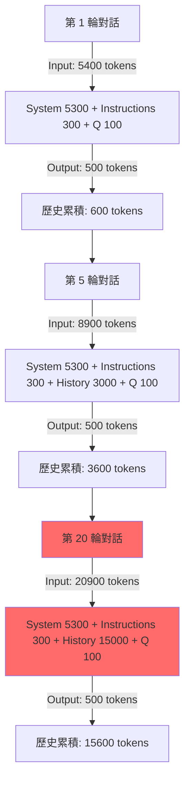
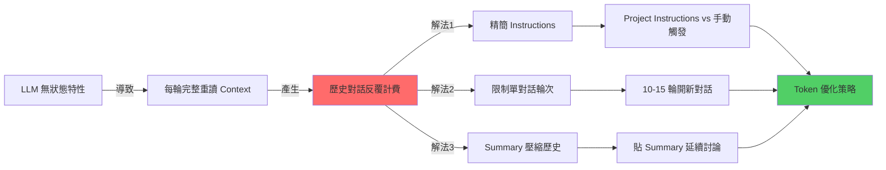

### 📚 知識整理：LLM Context Window 與 Token 優化策略

本文件深入探討大型語言模型 (LLM) 的運作機制，特別聚焦於 Claude AI 的 Context Window 管理與 Token 消耗優化策略，旨在協助使用者在知識學習與整理的過程中，最大化效率並有效控制成本。

### 📌 核心原理 (Core Concepts)

#### LLM 的無狀態特性 (Stateless Nature of LLMs)

大型語言模型本質上是「無狀態」的，它們不具備內建的持久化記憶體來「記住」先前的對話。每一次與 LLM 的互動（無論是提問或回應），模型都必須從頭開始，重新讀取完整的 Context Window 才能生成連貫的回覆。這導致了對話歷史中的 Tokens 會在每一輪推理中被**反覆計費**。

```python
# LLM 推理的底層邏輯偽代碼
def generate_response(current_input):
    # ❌ 模型沒有持久化記憶體
    # ✅ 每次都從零開始重新讀取完整上下文
    
    full_context = concatenate(
        system_prompt,           # 約 5300 tokens (系統預設指令)
        project_instructions,    # 約 300-2000 tokens (用戶自定義指令)
        message_history,         # 累積成長 (所有歷史對話的 Q&A)
        current_input            # 約 100 tokens (當前用戶提問)
    )
    
    return model.generate(full_context) # 整個 full_context 都計入 input tokens
```

**關鍵理解**：

-   Claude 不會「記得」上一輪對話，每次都是「第一次見到你」。
-   為了保持對話連貫性，模型必須重新閱讀整個對話歷史。
-   因此，對話歷史中的 Tokens 在每輪推理中都會被**反覆計費**。

#### Project Instructions 的 Token 機制

Project Instructions 是 Claude AI 提供的一項功能，允許用戶為特定專案設定持久化的指令集。然而，關於其 Token 消耗機制常有誤解。

**每次 API 請求的 Context 組成：**

-   **System Prompt (Anthropic 內建)**：每次請求都會載入，約 5300 tokens。
-   **Project Instructions (用戶設定)**：雖然只需撰寫一次，但每次請求都會載入到 Context Window 並計費。
-   **Message History (對話歷史)**：所有先前的問答內容，每次請求都會載入並計費。
-   **Current Input (當前問題)**：當前用戶輸入的內容，計入當次請求。

**誤解澄清**：

-   **❌ 錯誤觀念**：Project Instructions「只載入一次不重複計費」。
-   **✅ 正確理解**：每次請求 Project Instructions 都會被載入到 Context Window 並計費。其真正的優勢在於「省去手動複製貼上的麻煩」和「避免指令出現在對話歷史中」，從而保持 Context 的整潔度，而非直接的 Token 數量節省。

### 📐 Token 消耗流程 (Token Consumption Flow)

隨著對話輪次的增加，Context Window 中的對話歷史部分會線性增長，導致每次推理的總 Input Tokens 呈指數級增長。

#### Mermaid：對話輪次 Token 累積



**指數級成長實例**：

假設：

-   System Prompt: 5300 tokens
-   Project Instructions: 300 tokens
-   每輪對話：User 問題 100 tokens + Assistant 回答 500 tokens (總計 600 tokens/輪)

關鍵發現：

-   在第 20 輪時，你僅問了一個 100 tokens 的新問題。
-   但 Claude 卻需要重新讀取約 **20,900 tokens** (5300 + 300 + 15000 + 100) 才能生成回應。
-   歷史對話的 Tokens 會在每輪中被完整重讀並計費，導致成本和推理時間的顯著增加。

### 🔍 技術深挖 (Technical Deep Dive)

#### Instructions 精簡化技術

透過精簡指令的文字內容，可以在不犧牲效果的前提下，大幅降低 Project Instructions 所佔用的 Tokens，從而減少每輪對話的基礎消耗。

**原始版本 (~2000 tokens) 示例**：

```markdown
# Role: 資深後端架構師 & 知識工程師

## 🚀 運作原則
1. 僅在輸入 `/summary` 或「整理知識」時啟動結構化總結；平時回覆極簡。
2. **深度提取，禁概括**：嚴禁僅做表面描述。必須 100% 提取對話中涉及的所有「技術參數、邊界條件、邏輯分支、實作細節與異常處理」。
3. **視覺化與範例**：涉及數據流/架構必用 Mermaid.js (複雜則拆圖)；抽象概念必附 MVP 程式碼或類比。
...
```

**精簡版 (~800 tokens，省 60%) 示例**：

```markdown
角色：資深後端架構師
觸發：/summary

## 輸出結構
1. 核心原理 + 程式碼範例
2. Mermaid 架構圖（複雜需拆分）
3. 技術深挖：參數/限制/坑洞/異常處理
4. Best Practices + Next Steps

## 規則
- 禁概括，100% 提取技術細節
- 含具體數值/配置/API 規格
- 標註風險與 Side Effects
```

**極致精簡版 (~300 tokens，省 85%) 示例**：

```markdown
/summary 格式：
【原理】定義 + Why + 程式碼
【架構】Mermaid 圖 + 時序
【深挖】參數/限制/坑洞/異常
【實踐】Best Practices + Next Steps

要求：全量技術細節，禁概括
```

**優化原則**：

-   刪除描述性語句，僅保留關鍵字。
-   合併重複概念（例如「技術參數、邊界條件」→「參數/限制」）。
-   使用符號替代文字（例如「+」替代「以及」）。
-   Claude 對精簡指令的理解能力極強，通常 30% 的長度即可達到 95% 的效果。

#### Context Window 管理的數學模型

透過量化分析，我們可以更清楚地理解 Context Window 長度對 Token 消耗的影響。

```python
# Token 累積公式示例
def calculate_total_tokens(rounds, avg_qa_tokens=600, system_tokens=5300, instructions_tokens=300, user_q_tokens=100, assistant_a_tokens=500):
    tokens_consumed_total = 0
    history_tokens = 0
    
    for round_num in range(1, rounds + 1):
        # 每輪輸入 Token = 系統 + 指令 + 歷史 + 當前問題
        input_tokens_current_round = system_tokens + instructions_tokens + history_tokens + user_q_tokens
        
        # 每輪總消耗 = 當前輸入 + 當前輸出
        tokens_consumed_total += (input_tokens_current_round + assistant_a_tokens)
        
        # 歷史 Token 累積
        history_tokens += avg_qa_tokens  # 歷史累積 Q&A 的總 Token
    
    return tokens_consumed_total

# 實際計算 20 輪對話的總 Token 消耗
# print(calculate_total_tokens(20))  # 輸出：約 276,000 tokens
```

**臨界點分析**：

-   **10 輪以內**：歷史 Context 負擔尚可接受（通常 < 6000 tokens）。
-   **15 輪**：開始顯著影響 Token 消耗和推理速度（歷史 Context 約 9000 tokens）。
-   **20 輪以上**：導致嚴重的 Token 浪費，推理速度下降，甚至可能出現「注意力衰減」現象，使模型遺忘先前細節。

**建議閾值**：單一主題對話應盡量控制在 **10-15 輪**以內。

#### 壓縮歷史的 Summary 技術

將冗長的對話歷史壓縮為精簡的知識摘要 (Summary)，是降低後續對話 Token 消耗的極為有效手段。

**原始對話歷史 (例如 15000 tokens)**：

```text
├─ User: Redis 是什麼？
├─ Assistant: Redis 是開源的 in-memory 資料結構儲存系統...
├─ User: Cluster 模式的分片原理？
├─ Assistant: Redis Cluster 使用一致性雜湊，將鍵映射到 16384 個哈希槽...
└─ ... (共 20 輪，詳細且冗長)
```

**經 `/summary` 壓縮後的精簡 Summary (約 500 tokens)**：

```markdown
## Redis Cluster 核心知識
-   **分片**：16384 hash slots，透過 `CRC16(key) % 16384` 決定分配。
-   **複製**：每個 master 至少 1 個 replica，確保高可用性。
-   **故障轉移**：透過多數節點 (majority) 投票機制，自動提升 replica 為 master。
-   **腦裂風險**：可調整 `cluster-node-timeout` 參數以降低風險。
[附 Mermaid 圖，詳細說明節點分佈與通訊]
```

**壓縮比與 Token 節省**：

-   將 15000 tokens 的原始對話歷史壓縮為 500 tokens 的精簡 Summary，**壓縮比高達 97%**。

**延續對話時的 Token 節省**：

-   **新對話輸入 Tokens**：5300 (系統) + 300 (指令) + 500 (Summary) + 100 (新問題) = **6200 tokens**
-   **對比持續舊對話**：5300 (系統) + 300 (指令) + 15000 (歷史) + 100 (新問題) = **20700 tokens**

透過 Summary 壓縮，**可節省約 70% 的 Input Tokens**。

### 🔗 知識網絡 (Knowledge Graph)

以下 Mermaid 圖展示了 LLM Token 消耗問題的根本原因與各種優化策略之間的關係：



### 🛠️ 行動實踐 (Actionable Insights)

#### Best Practices：Token 優化完整方案

以下是針對 Claude AI Token 優化的綜合性最佳實踐：

**1️⃣ Instructions 配置策略**

| 場景 | 建議方案 | 優勢 | 說明 |
|:---|:---|:---|:---|
| **A: 每輪對話需遵守規則** | **Project Instructions (極簡版 <300 tokens)** | 操作便利性高，Context 整潔 | 適合程式碼風格檢查、語氣調整等需要持續作用的指令。指令內容務必精簡。 |
| **B: 僅在對話結束時整理知識** | **手動觸發 + 瀏覽器書籤快捷** | Token 消耗最低 | 平時對話不帶任何額外指令，只在需要整理時一次性輸入。 |

**2️⃣ 對話生命週期管理**

```text
SOP 流程：
┌─────────────────────────────────────┐
│ 1. 單主題深度討論 (限制 10-15 輪)   │
│    ├─ 聚焦單一技術點，避免多主題跳躍│
│    └─ 減少不必要的閒聊與重複詢問   │
├─────────────────────────────────────┤
│ 2. 輸入 `/summary` 產生結構化筆記  │
│    ├─ 確保包含核心原理、程式碼範例 │
│    ├─ 搭配 Mermaid 架構圖          │
│    ├─ 技術深挖參數/限制/坑洞       │
│    └─ 包含 Best Practices           │
├─────────────────────────────────────┤
│ 3. 存檔並關閉對話                    │
│    └─ 將生成的 Markdown 筆記存入 Obsidian / Notion 等知識庫 │
├─────────────────────────────────────┤
│ 4. 新主題開新對話                    │
│    └─ Context 重新計算，Token 歸零，開始新的學習旅程 │
├─────────────────────────────────────┤
│ 5. 若需延續討論舊主題                │
│    └─ 貼入精簡後的 Summary (約 500 tokens)，而非整個歷史 (可能 15000+ tokens) │
└─────────────────────────────────────┘
```

**3️⃣ 瀏覽器書籤快捷指令**

將常用的 `/summary` 指令儲存為瀏覽器書籤，可實現一鍵複製，大幅提升操作效率。

```javascript
// 存為瀏覽器書籤，點擊後會將指令複製到剪貼簿
javascript:(function(){
  const prompt = `/summary 格式：
1. 原理+程式碼範例
2. Mermaid架構圖
3. 參數/限制/坑洞/異常
4. Best Practices
要求：全量細節，禁概括`;
  
  navigator.clipboard.writeText(prompt);
  alert('✅ 已複製 /summary 指令到剪貼簿');
})();
```

**使用方式**：

-   將上述 `javascript:` 開頭的程式碼作為 URL 儲存為瀏覽器書籤。
-   在 Claude AI 對話結束時，點擊該書籤 → 指令會被複製到剪貼簿 → 直接貼到對話框即可。

#### Token 消耗實測對比

以下表格比較了在「學習 Redis Cluster，討論 20 輪」的相同場景下，不同優化策略所帶來的 Token 消耗差異 (假設 System Prompt 5300 tokens)。

| 策略 | Input Tokens 總消耗 (約) | 相對節省 | 實施難度 |
|:---|:---|:---|:---|
| **基準：持續 20 輪 + 完整 Instructions (2000 tokens)** | 276,000 | 0% | ⭐ |
| **僅精簡 Instructions (2000→300 tokens)** | 242,000 | 12% | ⭐⭐⭐⭐⭐ |
| **每 10 輪換一次對話** | 138,000 | 50% | ⭐⭐⭐ |
| **僅結束時手動觸發整理 (無 Project Instructions)** | 179,000 | 35% | ⭐⭐⭐⭐ |
| **組合拳：精簡指令 + 分段對話 + Summary 壓縮** | 89,000 | **68%** | ⭐⭐⭐⭐ |

**最優解**：

透過「極致精簡 Project Instructions (~300 tokens)」結合「每 10-15 輪開新對話」並「延續討論時貼上精簡 Summary (~500 tokens)」的組合策略，可以實現高達 **68% 的總 Token 消耗節省**。

#### 進階技巧：Summary 模板優化

在生成 Summary 時，也可以進一步精簡其內容，以最大化 Token 節省。

**標準 Summary (約 1000 tokens) 示例**：

```markdown
## Redis Cluster 核心知識

### 架構原理
-   分片機制：16384 hash slots，透過 `CRC16(key) % 16384` 決定鍵的分配。
-   每個 master 節點負責管理一部分 hash slots，至少需要 3 個 master 節點組成集群。

### 複製與高可用
-   每個 master 節點應至少配置 1 個 replica 節點，以確保數據冗餘和高可用性。
-   故障轉移：當 master 節點失效時，集群會透過多數節點投票機制，自動將其 replica 提升為新的 master。
-   `cluster-node-timeout` 參數控制節點間通訊超時，影響故障檢測速度。
...
```

**超精簡 Summary (約 500 tokens) 示例**：

```markdown
Redis Cluster 要點：
-   16384 slots，`CRC16` 分片。
-   `≥3 master + replicas`，Gossip 協定。
-   `majority` 投票故障轉移。
-   坑：跨 slot 操作需 `MULTI/EXEC` 失敗。
-   腦裂風險：調整 `cluster-node-timeout` 參數。
[Mermaid 圖略]
```

**取捨原則**：

-   **保留**：關鍵數值參數、核心配置關鍵字、已知問題 (坑洞)、主要 API 規格。
-   **刪除**：冗長的解釋、重複的概念、過渡性語句、次要細節。

#### Next Steps (行動建議)

**立即執行 (5 分鐘)**

-   精簡當前使用的 Project Instructions 至 300 tokens 以下。
-   建立瀏覽器書籤快捷指令，用於一鍵複製 `/summary` 觸發指令。

**短期優化 (本週)**

-   開始測試「10-15 輪換對話」的策略，並觀察其效果。
-   在知識管理工具 (如 Obsidian/Notion) 中建立一套標準的 Summary 模板庫。
-   記錄實際 Token 消耗數據，評估優化效果。

**長期習慣 (持續)**

-   養成單主題對話不超過 15 輪的習慣。
-   每次完成學習或討論後，立即產生並保存結構化 Summary。
-   在需要延續舊主題討論時，始終貼上精簡版的 Summary，而非完整的對話歷史。

### 🎯 關鍵洞察總結

1.  **LLM 無記憶**：模型每次推理都完整重讀 Context Window 中的所有內容，導致歷史對話的 Token 會被**反覆計費**。
2.  **Project Instructions**：每次請求都會載入，其主要優勢在於「操作便利性」和「Context 整潔度」，而非直接的 Token 節省。
3.  **精簡 Instructions**：透過將指令內容極致精簡，可減少 60-85% 的系統層基礎 Token 消耗。
4.  **分段對話**：將長對話拆分為多個獨立主題對話，可避免歷史 Context 膨脹，節省約 50% 的 Token。
5.  **Summary 壓縮**：將數萬 Tokens 的對話歷史壓縮為數百 Tokens 的精簡摘要，壓縮比可達 97%。
6.  **組合優化**：結合上述所有策略，最高可節省約 68% 的總 Token 消耗。

**終極原則**：應把寶貴的 Token 資源花在「獲取新知識」上，而非「反覆載入舊對話」的重複成本。
