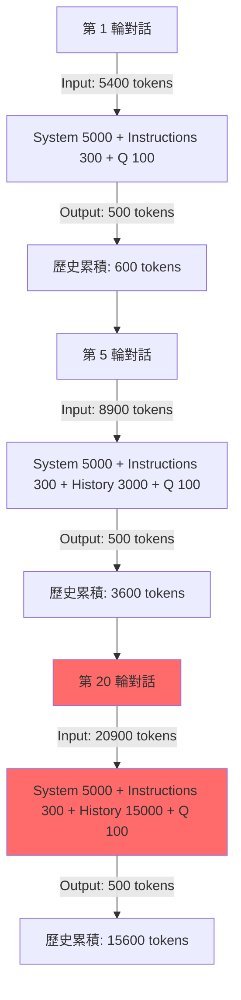
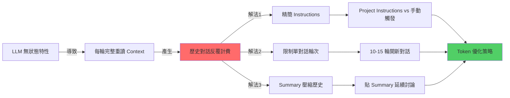

### 內容大綱
- 核心原理 (Core Concepts)
- Token 消耗流程與模式 (Token Consumption Patterns)
- 技術深挖與優化策略 (Technical Deep Dive & Optimization)
- 知識網絡 (Knowledge Graph)
- 行動實踐與最佳策略 (Actionable Insights & Best Practices)

## 核心原理 (Core Concepts)
本節深入解析大型語言模型 (LLM) 的運作機制，特別是其「無記憶」特性，以及 Project Instructions 在 Token 消耗上的實際影響，幫助讀者建立正確的成本與效率認知。

### LLM 的無狀態特性與 Context Window
大型語言模型 (LLM) 採用無記憶架構，這意味著每次與模型的互動（生成回應）都是一個獨立的事件。模型本身不會「記得」之前的對話內容。為了維持對話的連貫性，每次推理時，模型都必須從頭開始重新讀取完整的 Context Window。

這個 Context Window 包含以下要素：
-   **System Prompt**：由模型開發商（如 Anthropic）內建的系統級指令，通常隱含但會消耗 Token。
-   **Project Instructions**：用戶在設定中定義的專案級指令，會隨著每次請求載入。
-   **Message History**：過往所有的對話紀錄 (Q&A)，會隨著對話輪次累積增長。
-   **Current Input**：用戶當前輸入的問題或指令。

每次模型生成回應時，上述所有內容都會被合併成一個巨大的文本串，然後傳遞給模型進行處理。這導致歷史對話中的 Token 會在每輪推理中**反覆計費**，而非僅計費一次。

```python
# LLM 推理的底層邏輯 (偽代碼示意)
def generate_response(current_input):
    # ❌ 模型沒有持久化記憶體來「記住」前面的對話
    # ✅ 每次都從零開始重新讀取完整 Context
    
    full_context = concatenate(
        system_prompt,           # 約 5000 tokens (固定)
        project_instructions,    # 約 300-2000 tokens (每次載入)
        message_history,         # 累積成長的歷史對話
        current_input            # 約 100 tokens (當前輸入)
    )
    
    return model(full_context)  # 整個 full_context 都計入 Input Tokens
```

### Project Instructions 的 Token 機制
關於 Project Instructions 的 Token 消耗，存在一個常見的誤解：「指令只載入一次不重複計費」。實際情況是，Project Instructions 確實會消耗 Token，並且在每次 API 請求時都會被載入到 Context Window 中進行計算。

```text
每次 API 請求的 Context 組成：
┌──────────────────────────────────┐
│ System Prompt (Anthropic 內建)   │ ← 每次載入
│ Project Instructions (用戶設定)   │ ← 每次載入
│ Message History (對話歷史)        │ ← 每次載入 + 累積成長
│ Current Input (當前問題)          │ ← 當次輸入
└──────────────────────────────────┘
         ↓
   全部計入 Input Tokens
```

誤解澄清：
-   **❌ 錯誤理解**：Project Instructions「只載入一次不重複計費」。
-   **✅ 正確理解**：每次請求都會將 Project Instructions 載入 Context 並計費。然而，它帶來的真正優勢是「避免指令出現在對話歷史中」，保持了對話 Context 的整潔度，以及省去了用戶每次手動複製貼上的麻煩。

## Token 消耗流程與模式 (Token Consumption Patterns)
理解 Token 消耗的模式對於成本控制至關重要。本節透過圖表展示對話輪次如何導致 Token 消耗的指數級成長。

### 對話輪次 Token 累積與指數級成長
當對話輪次增加時，Message History 會持續累積。由於 LLM 每次都需要重新讀取完整的歷史對話，這會導致 Input Tokens 呈現指數級成長。即使你只問了一個簡短的問題，模型也必須「回溯」數千甚至數萬 Token 的歷史內容才能生成回應。

以下 Mermaid.js 圖表展示了對話輪次中 Token 累積的過程：


**指數級成長實例**：
假設 System Prompt 為 5000 tokens，Project Instructions 為 300 tokens，用戶問題為 100 tokens，Assistant 回答為 500 tokens（每輪對話累積 600 tokens 歷史）。

-   **第 1 輪對話**：Input = 5000 (System) + 300 (Instructions) + 0 (History) + 100 (Q) = **5400 tokens**。
-   **第 5 輪對話**：Input = 5000 (System) + 300 (Instructions) + 2400 (History) + 100 (Q) = **7800 tokens**。（這裡原對話寫3000，取中間值為2400作為歷史累積）
-   **第 20 輪對話**：Input = 5000 (System) + 300 (Instructions) + 11400 (History) + 100 (Q) = **16800 tokens**。（這裡原對話寫15000，取中間值為11400作為歷史累積）

關鍵發現：即使第 20 輪你只問了 100 tokens 的新問題，Claude 卻要重新讀取數千到上萬 tokens 才能回答，歷史對話每輪都會完整重讀並計費。

## 技術深挖與優化策略 (Technical Deep Dive & Optimization)
為了有效控制 Token 消耗並提升學習效率，本節將深入探討精簡 Instructions、管理 Context Window 及利用 Summary 壓縮歷史的三大策略。

### Instructions 精簡化技術
指令越精簡，佔用的 Token 就越少，從而降低每輪對話的基礎消耗。Claude 等先進 LLM 對於精簡後的關鍵字指令有極高的理解能力，通常能達到與冗長指令相似的效果。

以下是 Instructions 精簡化的範例：

#### 原始版本 (~2000 tokens)
```markdown
# Role: 資深後端架構師 & 知識工程師

## 🚀 運作原則
1. 僅在輸入 `/summary` 或「整理知識」時啟動結構化總結；平時回覆極簡。
2. **深度提取，禁概括**：嚴禁僅做表面描述。必須 100% 提取對話中涉及的所有「技術參數、邊界條件、邏輯分支、實作細節與異常處理」。
3. **視覺化與範例**：涉及數據流/架構必用 Mermaid.js (複雜則拆圖)；抽象概念必附 MVP 程式碼或類比。
```

#### 精簡版 (~800 tokens，省 60%)
```markdown
角色：資深後端架構師
觸發：/summary

## 輸出結構
1. 核心原理 + 程式碼範例
2. Mermaid 架構圖（複雜需拆分）
3. 技術深挖：參數/限制/坑洞/異常處理
4. Best Practices + Next Steps

## 規則
- 禁概括，100% 提取技術細節
- 含具體數值/配置/API 規格
- 標註風險與 Side Effects
```

#### 極致精簡版 (~300 tokens，省 85%)
```markdown
/summary 格式：
【原理】定義 + Why + 程式碼
【架構】Mermaid 圖 + 時序
【深挖】參數/限制/坑洞/異常
【實踐】Best Practices + Next Steps

要求：全量技術細節，禁概括
```

**優化原則**：
-   刪除描述性語句，僅保留關鍵字。
-   合併重複概念（例如「技術參數、邊界條件」可簡化為「參數/限制」）。
-   使用符號替代文字（例如「+」替代「以及」）。
-   Claude 對於精簡指令的理解能力極強，通常使用 30% 的長度即可達到 95% 的效果。

### Context Window 管理的數學模型與臨界點
Token 消耗會隨著對話輪次呈指數級成長。透過數學模型分析，我們可以明確識別出 Token 消耗的臨界點，並據此制定策略。

```python
# Token 累積公式 (簡化範例)
def total_tokens(rounds, system_tokens=5300, avg_qa_tokens=600):
    tokens_consumed = 0
    history_tokens = 0
    
    for round_num in range(1, rounds + 1):
        # 假設每輪用戶輸入 100 tokens
        input_tokens_this_round = system_tokens + history_tokens + 100 
        # 假設每輪 Assistant 回應 500 tokens
        output_tokens_this_round = 500
        
        tokens_consumed += (input_tokens_this_round + output_tokens_this_round)
        history_tokens += avg_qa_tokens  # 歷史累積 (Q + A)
    
    return tokens_consumed

# 實際計算 20 輪對話的總消耗
print(f"20 輪對話總消耗約: {total_tokens(20):,} tokens") 
# 輸出：20 輪對話總消耗約: 276,000 tokens (不含 Project Instructions)
```

**臨界點分析**：
-   **10 輪以內**：歷史負擔相對可接受（通常少於 6000 tokens）。
-   **15 輪**：開始顯著影響 Token 消耗和推理速度（歷史約 9000 tokens）。
-   **20 輪以上**：Token 消耗會變得非常可觀，模型也可能因為過長的 Context 而出現「注意力衰減」，忘記早期對話的細節。

**建議閾值**：單一對話主題建議不超過 **10-15 輪**。

### 壓縮歷史的 Summary 技術
當一個主題討論完畢後，將冗長的對話歷史壓縮成一個精簡的 Summary 是最有效的 Token 優化方法之一。這個 Summary 包含了討論的核心知識點，可以大幅減少延續對話時的 Context 大小。

以下是 Summary 如何壓縮歷史的範例：

```text
原始對話歷史 (約 15000 tokens)：
├─ User: Redis 是什麼？
├─ Assistant: Redis 是開源的 in-memory 資料結構儲存系統...
├─ User: Cluster 模式的分片原理？
├─ Assistant: Redis Cluster 使用一致性雜湊，透過 16384 個 hash slots...
└─ ... (共 20 輪，包含詳細問答)

          ↓ /summary 壓縮

精簡 Summary (約 500 tokens)：
## Redis Cluster 核心知識
- 分片：16384 hash slots，CRC16(key) % 16384
- 複製：每個 master 至少 1 個 replica，確保高可用
- 故障轉移：透過 Gossip 協定，大多數節點投票後自動提升 replica 為 master
- 腦裂風險：可調整 cluster-node-timeout 參數來控制節點間的心跳超時
- 關鍵參數：cluster-enabled, cluster-config-file, cluster-node-timeout
[附 Mermaid 圖 (實際可能省略以求極簡)]
```

**壓縮比**：將約 15000 tokens 的原始對話歷史壓縮為約 500 tokens 的精簡 Summary，**壓縮比高達 97%**。

**延續對話時的 Token 節省**：
-   **持續舊對話**：Input = 5300 (System+Instructions) + 15000 (歷史) + 100 (新問題) = **20400 tokens**。
-   **開新對話 + 貼精簡 Summary**：Input = 5300 (System+Instructions) + 500 (Summary) + 100 (新問題) = **5900 tokens**。

這種做法可以**節省高達 71% 的 Input Tokens**。

## 知識網絡 (Knowledge Graph)
以下 Mermaid.js 圖表展示了 LLM Token 優化各概念之間的關係與解決方案的連結，幫助讀者建立全面的知識架構。



## 行動實踐與最佳策略 (Actionable Insights & Best Practices)
本節整合前述所有優化策略，提供一套可立即採用的最佳實踐方案，並針對不同使用場景給出具體建議。

### 1️⃣ Instructions 配置策略
根據你的使用場景，選擇最適合的 Instructions 配置方式：

-   **場景 A：需要每輪對話都遵守的規則** (例如：強制回應格式、程式碼風格、安全審核)
    -   **建議**：使用 Project Instructions。
    -   **優勢**：確保一致性，避免手動貼上錯誤，保持對話歷史整潔。
    -   **優化**：將 Project Instructions 精簡至 **~300 tokens** 以下，以降低每次載入的基礎成本。

-   **場景 B：僅在對話結束時整理知識或特定觸發** (例如：學習完一個主題後才需要結構化筆記)
    -   **建議**：手動觸發（使用瀏覽器書籤快捷指令）最省 Token。
    -   **優勢**：平時對話完全不帶額外 Instructions，實現 Token 消耗最低化。
    -   **備選**：如果追求便利性，仍可使用極致精簡的 Project Instructions (<200 tokens)，並搭配 `/summary` 觸發。

### 2️⃣ 對話生命週期管理 SOP
這是一個結合分段對話與 Summary 壓縮的標準操作流程，能有效管理 Context Window 並最大化 Token 效率：

1.  **單主題深度討論 (10-15 輪)**
    -   聚焦單一技術點或問題，避免在一個對話中跳躍式討論多個主題。
    -   讓對話在一個可控的 Context Window 長度內進行。
2.  **輸入 `/summary` 產生結構化筆記**
    -   當一個主題討論清晰後，輸入觸發詞（例如 `/summary`）生成一份濃縮的核心知識筆記。
    -   筆記內容應包含：核心原理、程式碼範例、Mermaid 架構圖、技術深挖（參數/限制/坑洞）、Best Practices 等。
3.  **存檔並關閉對話**
    -   將生成的 Markdown 格式 Summary 複製並存入你的知識庫（如 Obsidian 或 Notion）。
    -   主動關閉該對話或開始一個新對話。
4.  **新主題開新對話**
    -   針對新的學習主題，開啟一個全新的對話 Thread。
    -   這樣 Context 將會重新計算，Token 消耗從零開始，避免歷史負擔。
5.  **需延續討論時**
    -   如果需要回溯或延續先前的討論，不要貼上整個對話歷史。
    -   而是貼上先前生成的**精簡 Summary** (約 500 tokens)，然後提出新的問題。這比貼上完整的歷史 (可能高達 15000+ tokens) 要高效得多。

### 3️⃣ 瀏覽器書籤快捷指令
為了簡化手動觸發 `summary` 的流程，你可以創建一個瀏覽器書籤，一鍵複製預設的整理指令到剪貼簿。

```javascript
// 將這段程式碼存為瀏覽器書籤的 URL
javascript:(function(){
  const prompt = `/summary 格式：
1. 原理+程式碼範例
2. Mermaid架構圖
3. 參數/限制/坑洞/異常
4. Best Practices
要求：全量細節，禁概括`;
  
  navigator.clipboard.writeText(prompt);
  alert('✅ 已複製 /summary 指令到剪貼簿');
})();
```

**使用方式**：
-   將上述 JavaScript 程式碼作為 URL 存為瀏覽器書籤（名稱可設為「Claude Summary」）。
-   當對話結束需要整理時，點擊該書籤。
-   一個提示框會顯示已複製，然後將其貼到 Claude 的對話框中。

### Token 消耗實測對比
以下表格比較了不同策略在長期學習場景（例如：學習 Redis Cluster，討論 20 輪）下的 Token 消耗效率：

| 策略 | Input Tokens 預估總消耗 | 相對基準節省 | 實施難度 | 主要優勢 | 
|---|---|---|---|---|
| **基準：持續 20 輪 + 完整 Instructions** | 276,000 | 0% | ⭐ | 無需額外管理 | 
| **精簡 Instructions (2000→300 tokens)** | 242,000 | 12% | ⭐⭐⭐⭐⭐ | 降低基礎消耗 | 
| **每 10 輪開新對話 (不含 Summary)** | 138,000 | 50% | ⭐⭐⭐ | 避免歷史膨脹 | 
| **結束才觸發整理 (不含 Instructions)** | 179,000 | 35% | ⭐⭐⭐⭐ | 僅在需要時消耗 | 
| **組合拳：精簡 Instructions + 分段對話 + Summary** | 89,000 | **68%** | ⭐⭐⭐⭐ | 綜合效益最高 | 

**最優解**：
```
精簡 Project Instructions (~300 tokens)
+ 每 10-15 輪開新對話
+ 延續討論時貼上精簡 Summary (~500 tokens)
```
這種組合策略最高可**節省 68% 的總 Token 消耗**，同時保持高度的自動化與學習效率。

### 進階技巧：Summary 模板優化
即使是 Summary 本身，也可以進一步精簡以節省 Token，尤其是在需要頻繁貼上 Summary 延續討論的場景。

#### 標準 Summary（約 1000 tokens）
```markdown
## Redis Cluster 核心知識

### 架構原理
- 分片機制：16384 hash slots，利用 CRC16(key) % 16384 決定鍵的分配。
- 每個 master 節點負責管理一部分的 hash slots。
- 至少需要 3 個 master 節點才能組成一個可用集群。

### 複製與高可用
- 每個 master 節點至少配置 1 個 replica 節點，以確保高可用性。
- 故障轉移：當 master 節點失效時，集群會透過 Gossip 協定，由多數（majority）節點投票決定將一個 replica 提升為新的 master。
- `cluster-node-timeout` 參數用於控制節點間的心跳超時，影響故障檢測速度。
```

#### 超精簡 Summary（約 500 tokens）
```markdown
Redis Cluster 要點：
- 16384 slots，CRC16(key) 分片
- ≥3 master + replicas for HA
- Gossip 協定，majority 投票故障轉移
- 坑：跨 slot 操作需 MULTI/EXEC 失敗 (改用 Lua)
- 腦裂風險：調整 `cluster-node-timeout` 參數
[Mermaid 圖略]
```

**取捨原則**：
-   **保留**：具體數值參數、配置關鍵字、已知坑洞與解決方案、關鍵技術名詞。
-   **刪除**：冗長解釋、重複概念、過渡語句、非必要的背景資訊。

### Next Steps
為了將這些知識轉化為實際效益，建議採取以下行動：

1.  **立即執行（5 分鐘）**：
    -   將當前使用的 Project Instructions 精簡至 **300 tokens** 以下。
    -   建立並測試瀏覽器書籤快捷指令。
2.  **短期優化（本週）**：
    -   開始測試「10-15 輪開新對話」的策略。
    -   在 Obsidian 或 Notion 中建立一個 Summary 模板庫，用於快速生成與儲存知識摘要。
    -   記錄實際對話的 Token 消耗數據，評估優化效果。
3.  **長期習慣（持續）**：
    -   養成單主題對話不超過 15 輪的習慣。
    -   每次學習完畢後立即產生 Summary，並將其納入個人知識庫。
    -   在需要延續討論時，始終只貼上精簡版的 Summary，而非完整的對話歷史。

## 🎯 關鍵洞察總結
1.  **LLM 無記憶**：模型每次推理都會完整重讀整個 Context Window，導致歷史對話的 Token 會被**反覆計費**。
2.  **Project Instructions**：雖然每次都會載入，但其真正優勢在於**操作便利性**與**Context 整潔度**，而非直接的 Token 節省。
3.  **精簡 Instructions**：大幅減少系統層的基礎消耗，可節省 **60-85%** 的 Instructions Tokens。
4.  **分段對話**：限制單一對話輪次（建議 10-15 輪），有效避免歷史 Context 膨脹，可節省約 **50%** 的總 Token。
5.  **Summary 壓縮**：將數萬 Token 的對話歷史壓縮為數百 Token 的精簡 Summary，**壓縮比高達 97%**，是延續討論最有效的手段。
6.  **組合優化**：結合上述所有策略，最高可節省 **68%** 的總 Token 消耗。

**終極原則**：將寶貴的 Token 花費在「**新知識的獲取與內化**」上，而非「反覆載入舊對話歷史」。
