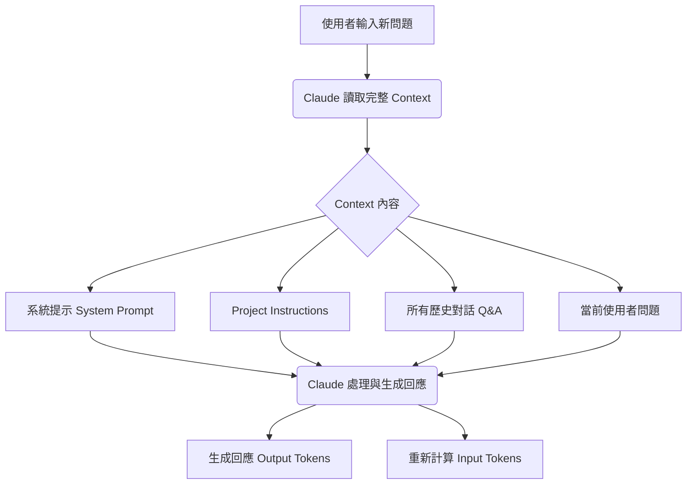

# Claude LLM Token 優化策略：深度知識內化與成本效益分析

> Updated: 2026-02-15 12:03


## 目錄
- [1. 前言與常見誤解](#1-前言與常見誤解)
  - [1.1. Project Instructions 的真實消耗](#11-project-instructions-的真實消耗)
  - [1.2. 「省」的真正意義](#12-省的真正意義)
- [2. 核心優化策略](#2-核心優化策略)
  - [2.1. 策略一：精簡 Project Instructions](#21-策略一精簡-project-instructions)
    - [2.1.1. 精簡前後對比](#211-精簡前後對比)
    - [2.1.2. 極致精簡版示例](#212-極致精簡版示例)
  - [2.2. 策略二：有效控制 Context 視窗](#22-策略二有效控制-context-視窗)
    - [2.2.1. Context 視窗的運作機制](#221-context-視窗的運作機制)
    - [2.2.2. LLM 推理與 Token 消耗真相](#222-llm-推理與-token-消耗真相)
    - [2.2.3. LLM 無狀態特性](#223-llm-無狀態特性)
    - [2.2.4. 最佳實踐工作流](#224-最佳實踐工作流)
    - [2.2.5. Token 消耗對比分析](#225-token-消耗對比分析)
- [3. 綜合優化方案與實踐](#3-綜合優化方案與實踐)
  - [3.1. 組合拳：精簡 Instructions + 分段對話](#31-組合拳精簡-instructions--分段對話)
  - [3.2. 操作 SOP](#32-操作-sop)
- [4. 額外輔助技巧](#4-額外輔助技巧)
  - [4.1. 書籤快捷指令](#41-書籤快捷指令)
- [5. 結論與最佳實踐 Checklist](#5-結論與最佳實踐-checklist)

---

<a name="1-前言與常見誤解"></a>
# 1. 前言與常見誤解

在大型語言模型 (LLM) 的應用中，有效管理 `tokens` 是提升效率、降低成本與保持對話品質的關鍵。許多使用者對於 `Project Instructions` 的運作方式存在誤解，認為它能減少 `tokens` 消耗。本章將釐清這些常見誤解，並為後續的優化策略奠定基礎。

<a name="11-project-instructions-的真實消耗"></a>
## 1.1. Project Instructions 的真實消耗

儘管 `Project Instructions` 提供了便利性，但它們並非「只載入一次」或「不消耗 `tokens`」。實際上，**每次使用者發送請求時，`Project Instructions` 都會被重新加入到 `context window` 中**，並計入 `input tokens`。這意味著：

*   **消耗 `input tokens`**: `Project Instructions` 的內容會直接增加每次對話的 `input tokens` 消耗。
*   **佔用 `context window` 空間**: 即使使用者未直接輸入，這些指令依然佔用寶貴的 `context window` 空間。

<a name="12-省的真正意義"></a>
## 1.2. 「省」的真正意義

原始描述中提及的「減少了訊息往返產生的重複消耗」容易引起誤解。這裡的「重複消耗」**並非指 `token` 數量的減少**，而是聚焦於以下兩個方面的「節省」：

1.  **省去手動操作**
    *   無需每次複製貼上指令，避免手動操作的繁瑣。
    *   減少因遺漏或貼錯版本指令而導致的問題。
2.  **避免指令出現在對話歷史中**
    *   使用 `Project Instructions` 可以讓對話歷史保持整潔，只保留實際的問答內容。
    *   避免手動貼上指令時，LLM 回應「好的，我會遵循...」等無意義的確認訊息佔用對話歷史，進而減少後續輪次需要載入的歷史 `tokens`。

    ```plain text
    ❌ 手動貼上指令的對話歷史：
    User: [2000 字指令]
    Assistant: 好的，我會遵循這些指令。
    User: 實際問題
    Assistant: ...
    (後續對話需要載入這些指令及確認訊息)

    ✅ 使用 Project Instructions 的對話歷史：
    User: 實際問題
    Assistant: ...
    (對話歷史更為乾淨，只保留實際問答)
    ```

<a name="2-核心優化策略"></a>
# 2. 核心優化策略

基於對 `LLM token` 消耗機制的理解，以下是兩項最為有效的核心優化策略。

<a name="21-策略一精簡-project-instructions"></a>
## 2.1. 策略一：精簡 Project Instructions

即使 `Project Instructions` 會計入 `tokens`，其內容的精簡化依然能顯著減少每次請求的基礎消耗。重點在於刪除冗餘的描述性廢話，只保留關鍵指令和關鍵字。

<a name="211-精簡前後對比"></a>
### 2.1.1. 精簡前後對比

以下為原始指令與精簡後指令的 `token` 消耗對比：

```markdown
❌ 原版 Project Instructions (~2000 tokens)
你是資深後端架構師與知識工程師。
僅在輸入 /summary 或「整理知識」時啟動結構化總結；平時回覆極簡。
深度提取，禁概括：嚴禁僅做表面描述。必須 100% 提取對話中涉及的所有技術參數、邊界條件與實作細節。

✅ 精簡版 Project Instructions (~800 tokens，節省約 60%)
角色：資深後端架構師
觸發：/summary

輸出要求：
1. 核心原理 + 程式碼範例
2. Mermaid 架構圖（複雜拆分）
3. 技術深挖：參數/限制/坑洞/異常處理
4. Best Practices

規則：
- 禁概括，100% 提取細節
- 含具體數值/配置/API 規格
- 標註風險與 Side Effects
```

<a name="212-極致精簡版示例"></a>
### 2.1.2. 極致精簡版示例

對於 `Project Instructions`，可以進一步壓縮到極致，只保留最核心的指令，例如用於觸發特定輸出格式。

```markdown
/summary 格式：
【原理】定義 + Why + 程式碼範例
【架構】Mermaid 圖 + 時序說明
【深挖】參數/限制/坑洞/異常
【實踐】Best Practices + Next Steps

要求：全量技術細節，禁概括
```

**效果評估**：
*   原版 `~2000 tokens`
*   極致精簡版 `~300 tokens`
*   **總體節省約 85% 的 `Project Instructions tokens`**。

<a name="22-策略二有效控制-context-視窗"></a>
## 2.2. 策略二：有效控制 Context 視窗

`LLM` 的 `token` 消耗會隨著對話輪次呈指數級成長，因為每次 `LLM` 處理請求時，都會重新讀取完整的對話歷史。有效控制 `context window` 是最關鍵的優化點。

<a name="221-context-視窗的運作機制"></a>
### 2.2.1. Context 視窗的運作機制

`LLM` 的 `context window` 是指模型在生成回應時能讀取的所有輸入內容，包括：
*   **系統提示 (System Prompt)**
*   **`Project Instructions`** (如果有設定)
*   **所有歷史對話** (Previous User Queries + Previous Assistant Responses)
*   **當前使用者輸入 (Current User Input)**

<a name="222-llm-推理與-token-消耗真相"></a>
### 2.2.2. LLM 推理與 Token 消耗真相

每次 `LLM` 產生回應，都需要將上述所有內容作為一個**完整的上下文**傳遞給模型進行推理。



**Token 消耗明細：**
*   **Input Tokens**: 每次請求都會計算 `系統提示` + `Project Instructions` + `所有歷史對話` + `當前輸入` 的總和。
*   **Output Tokens**: 僅計算 `Claude` 本次回應所生成的文字 `tokens`。

<a name="223-llm-無狀態特性"></a>
### 2.2.3. LLM 無狀態特性

`LLM` 本身是**無狀態 (stateless)** 的，它並沒有內建的「記憶體」來儲存之前的對話內容。每次互動都是獨立的，為了保持對話的連貫性，使用者界面或應用程式必須將完整的對話歷史作為上下文重新傳遞給 `LLM`。

```python
# 偽代碼示意：LLM 無狀態的運作模式
def generate_response(system_prompt, project_instructions, all_previous_messages, current_input):
    """
    LLM 每次生成回應，都需要重新讀取完整的上下文。
    """
    full_context = (
        system_prompt +
        project_instructions +
        all_previous_messages +  # ← 每次都必須重新傳遞所有歷史對話
        current_input
    )
    
    # 模型根據 full_context 進行推理並生成回應
    response = model.predict(full_context) 
    return response

# 示例：對話輪次的 token 累積
# 第 1 輪: full_context = (system + instructions + Q1 + A1)
# 第 2 輪: full_context = (system + instructions + Q1 + A1 + Q2 + A2)
# 第 N 輪: full_context = (system + instructions + sum(Qi + Ai for i=1 to N-1) + QN)
```

這解釋了為什麼歷史對話的 `tokens` 會被反覆計費，並且隨著對話輪次增加，`Input Tokens` 會呈指數級成長。

<a name="224-最佳實踐工作流"></a>
### 2.2.4. 最佳實踐工作流

為了有效控制 `context window` 的長度並降低 `token` 成本，推薦以下工作流：

```mermaid
sequenceDiagram
    participant User
    participant Claude

    User->>Claude: 1. 單主題對話 (例如討論 Redis Cluster)
    loop 深度問答 (10-15 輪)
        User->>Claude: User Query N
        Claude-->>User: Assistant Response N
    end
    User->>Claude: 2. 輸入 /summary
    Claude-->>User: 產生結構化筆記 (Markdown)

    User->>User: 3. 存檔並關閉對話 (複製 summary 至 Obsidian / Notion)
    User->>Claude: 4. 新主題開新對話 (例如討論 Kafka)
    activate Claude
    Note over User,Claude: Context 重新計算，Token 歸零
    deactivate Claude

    alt 若需延續 Redis Cluster 討論
        User->>Claude: 5. 貼上前次精簡 summary (約 500 tokens)
   + 新問題: 如何處理腦裂問題？
        Claude-->>User: 根據 summary 和新問題生成回應
    end
```

<a name="225-token-消耗對比分析"></a>
### 2.2.5. Token 消耗對比分析

假設：
*   `System Prompt` + `精簡版 Project Instructions` 約 `5300 tokens`
*   單輪 `User` 問題約 `100 tokens`
*   單輪 `Assistant` 回答約 `500 tokens`
*   精簡版 `summary` 約 `500 tokens`

| 場景                | 描述                                                                  | `Input Tokens` 計算                                                                                                | `Input Tokens` 總計 | 說明                                           |
| :------------------ | :-------------------------------------------------------------------- | :----------------------------------------------------------------------------------------------------------------- | :------------------ | :--------------------------------------------- |
| **❌ 持續對話**    | 第 20 輪，歷史對話累積 `15000 tokens` (`(100+500)*19 + 100`)             | `5300` (系統+指令) + `15000` (歷史) + `100` (當前問題)                                                            | `20400`             | 歷史對話被完整重複計費，成本高昂且效率低落。 |
| **✅ 開新對話 + 貼 `summary`** | 第 20 輪後開新對話，將歷史對話壓縮為 `500 tokens` 的 `summary` 作為背景 | `5300` (系統+指令) + `500` (`summary`) + `100` (當前問題)                                                           | `5900`              | 將歷史壓縮為精華，極大降低 `token` 消耗。      |

**通過「開新對話 + 貼 `summary`」策略，可以節省約 71% 的 `Input Tokens`。**

`Context Window` 不僅僅是容量限制 (例如 `Claude` 的 `200K context window`)，它還直接影響：
1.  **`Token` 成本**: 每次重新計費歷史對話。
2.  **推理速度**: `Context` 越長，模型生成回應的時間越長。
3.  **注意力衰減 (Attention Decay)**: 太長的 `context` 可能會讓模型「忘記」前面的一些細節。

<a name="3-綜合優化方案與實踐"></a>
# 3. 綜合優化方案與實踐

最有效的 `token` 優化是將上述兩項策略結合運用。

<a name="31-組合拳精簡-instructions--分段對話"></a>
## 3.1. 組合拳：精簡 Instructions + 分段對話

*   **`Project Instructions` (極簡版 `~300 tokens`)**
    ```markdown
    # Project Instructions（極簡版 ~300 tokens）
    /summary 輸出：
    1. 原理 + 程式碼
    2. Mermaid 圖
    3. 參數/限制/坑洞
    4. Best Practices
    要求：全量細節，禁概括
    ```
*   **分段對話策略**
    *   單一主題的討論在 `10-15` 輪對話後，即時產生 `/summary`。
    *   存檔 `summary` 後，開啟一個新的對話 `thread` 進行新的主題討論。
    *   若需回溯或延續舊主題，僅貼上精簡版的 `summary` (例如 `500 tokens`) 作為背景，而非完整的歷史對話 (可能數千甚至上萬 `tokens`)。

<a name="32-操作-sop"></a>
## 3.2. 操作 SOP

1.  **平時對話**: 可以完全不帶 `Project Instructions`，或僅使用極簡版。
2.  **主題討論完畢**: 輸入 `/summary`，讓 `Claude` 生成結構化筆記。
3.  **存檔並切換對話**: 建議每 `10-15` 輪對話就開啟一個新的 `thread`，並將前一個 `thread` 的 `summary` 筆記存入知識庫 (如 `Obsidian` / `Notion`)。
4.  **延續討論**: 如需延續之前的討論，將相關的精簡版 `summary` 貼入新對話作為背景，再提出新的問題。

<a name="4-額外輔助技巧"></a>
# 4. 額外輔助技巧

<a name="41-書籤快捷指令"></a>
## 4.1. 書籤快捷指令

為了方便快速輸入 `/summary` 觸發指令，可以將其製作成瀏覽器書籤 `(Bookmarklet)`。

```javascript
javascript:(function(){
  const text = `/summary 格式：
1. 原理+程式碼
2. Mermaid圖
3. 參數/限制/坑洞
4. Best Practices
全量細節，禁概括`;
  navigator.clipboard.writeText(text);
  alert('已複製到剪貼簿');
})();
```

將上述 `JavaScript` 程式碼存為瀏覽器書籤的 `URL`，點擊後即可一鍵將預設的 `/summary` 指令複製到剪貼簿，方便隨時貼上。

<a name="5-結論與最佳實踐-checklist"></a>
# 5. 結論與最佳實踐 Checklist

LLM 每次推理都會「重新閱讀整本書」，而不是「記得上次讀到哪裡」。因此，有效的 `token` 管理是長期使用 LLM 的關鍵。

**最佳實踐 Checklist：**
*   ✅ **單主題討論完就開新對話** (以 `10-15` 輪為限)。
*   ✅ **使用 `/summary` 壓縮歷史對話** (將 `15000 tokens` 的歷史壓縮為 `500 tokens` 的精華)。
*   ✅ **延續討論時只貼精簡版 `summary`** (而非整個對話歷史)。
*   ✅ **精簡 `Project Instructions`** (減少每次請求的系統層基礎消耗)。