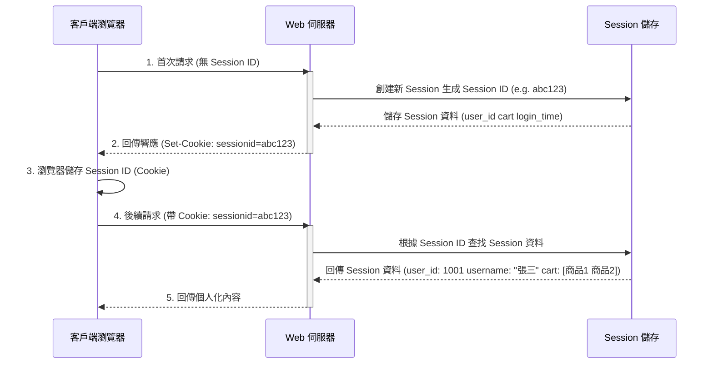

# HTTP Session 管理機制與安全性實踐

> Updated: 2026-02-14 23:01

# HTTP Session 管理機制與安全性實踐

## 1. 定義 (Definition)
HTTP Session 是一種在伺服器端 (Server-side) 儲存用戶狀態資訊的機制。它為每個連線的用戶創建一個臨時且獨立的儲存空間，用來在多個 HTTP 請求之間追蹤並保持用戶的特定狀態，從而克服 HTTP 協定無狀態 (Stateless) 的本質限制。

## 2. 核心原理 (Core Principles)
HTTP 協定本身設計為無狀態，每個請求都是獨立且互不相關的。伺服器在處理完請求後不會記憶任何關於用戶的資訊。然而，現代 Web 應用需要追蹤用戶的連續行為（例如登入狀態、購物車內容）。HTTP Session 的存在正是為了解決這個核心問題。

其運作原理如下：
1.  **首次請求與 Session 創建**：當用戶第一次訪問 Web 應用時，伺服器會為該用戶創建一個唯一的 Session，並生成一個獨特的 Session ID。
2.  **Session ID 傳遞**：這個 Session ID 通常會透過 HTTP Cookie 的形式，在伺服器響應中傳送給客戶端瀏覽器。
3.  **後續請求**：之後，客戶端瀏覽器會自動將這個 Session ID 包含在後續的每個 HTTP 請求中，發送給伺服器。
4.  **狀態識別與維護**：伺服器接收到請求後，會根據請求中的 Session ID 查找並加載其對應的伺服器端 Session 資料，從而識別用戶身份，並使用或更新該用戶的狀態資訊。

## 3. 實作流程 (Implementation Flow)
以下是 HTTP Session 的典型運作流程圖解，說明了客戶端與伺服器之間的互動：

**運作步驟說明：**
1.  **首次請求**：用戶第一次訪問網站，瀏覽器發送請求至伺服器，此時請求頭中不包含 Session ID。
2.  **創建 Session**：伺服器接收到請求後，判斷沒有 Session ID，便會創建一個新的 Session 物件，生成一個唯一的 Session ID (例如 abc123)，並將用戶相關的初始資料儲存到伺服器端的 Session 儲存中。隨後，伺服器會在響應頭中包含 `Set-Cookie: sessionid=abc123`，將 Session ID 發送給瀏覽器。
3.  **儲存 Cookie**：瀏覽器接收到響應後，會將 Session ID 以 Cookie 的形式儲存在本地，通常其生命週期與瀏覽器會話綁定或設置了過期時間。
4.  **後續請求**：從此以後，瀏覽器在每次向同一網站發送請求時，都會自動在其請求頭中帶上儲存的 Session ID (即 `Cookie: sessionid=abc123`)。
5.  **識別用戶**：伺服器接收到帶有 Session ID 的請求後，會根據該 ID 從 Session 儲存中檢索對應的 Session 資料。一旦成功匹配，伺服器便能識別出用戶身份及其狀態，並根據這些資訊處理請求，回傳個人化或連續性內容。

## 4. 使用場景與替代方案 (Usage Scenarios & Alternatives)

### 適合使用 Session 的場景：
*   **用戶登入狀態管理**：記錄用戶是否已登入、用戶 ID、權限等資訊。
*   **購物車功能**：在用戶完成購買前，暫存用戶選購的商品清單。
*   **多步驟表單**：在填寫複雜表單時，保存各步驟的臨時數據。
*   **用戶偏好設定**：儲存語言選擇、主題設定等臨時性用戶偏好。
*   **防止 CSRF 攻擊**：透過在 Session 中儲存 CSRF token 並在表單中驗證來增強安全性。
*   **臨時數據緩存**：如搜尋結果的分頁資訊，避免每次請求都重新查詢。

### 不適合使用 Session 的場景：
*   **無狀態 API (如 RESTful API)**：這類 API 通常偏好使用 JWT 等 Token-based 認證機制，強調無狀態設計。
*   **需要跨域共享的資料**：Session 通常綁定在單一域名或需要額外配置才能跨域共享。
*   **高併發與分散式系統**：大規模或高併發環境下，Session 會增加伺服器記憶體負擔，且難以在多台伺服器間同步（需要引入分散式 Session 儲存解決方案，如 Redis/Memcached）。
*   **長期儲存的資料**：永久性數據應存入資料庫而非 Session，Session 應主要用於臨時狀態。

### 現代替代方案：
隨著技術發展，許多場景開始採用以下方案：
*   **JWT (JSON Web Token)**：用於無狀態 API 認證，Token 本身包含用戶資訊並經簽名，無需伺服器端儲存。
*   **LocalStorage / SessionStorage**：在客戶端瀏覽器儲存資料，適用於不需要伺服器驗證的輕量級資料。
*   **Redis / Memcached**：作為分散式 Session 儲存，解決傳統 Session 在多伺服器環境下的同步問題，實現高可用和可擴展性。

## 5. 風險控管與最佳實踐 (Risk Control & Best Practices)
儘管 HTTP Session 是 Web 應用中不可或缺的一部分，但其安全性與效能也需要仔細考量。

### 主要風險：
*   **Session Hijacking (會話劫持)**：攻擊者竊取有效的 Session ID，冒充合法用戶。
*   **Session Fixation (會話固定)**：攻擊者在用戶登入前提供一個固定的 Session ID 給用戶，一旦用戶登入，攻擊者就能使用該 ID 訪問用戶會話。

### 最佳實踐：
*   **強固 Session ID**：使用足夠長度、隨機且不可預測的 Session ID。
*   **安全傳輸**：始終透過 HTTPS/SSL 傳輸 Session ID，防止中間人攻擊竊聽。
*   **Cookie 安全標誌**：為 Session Cookie 設定 `HttpOnly` (防止 XSS 攻擊讀取 Cookie) 和 `Secure` (只透過 HTTPS 發送) 標誌。
*   **適當的生命週期管理**：設定合理的 Session 超時時間，並在用戶登出時立即銷毀 Session。
*   **Session ID 輪替**：在用戶成功登入後，重新生成新的 Session ID，以防止 Session Fixation 攻擊。
*   **伺服器端驗證**：始終在伺服器端驗證 Session ID 的有效性，並對所有透過 Session 儲存的敏感數據進行加密或適當處理。
*   **分散式 Session 策略**：對於高併發和分散式系統，考慮使用 Redis 或 Memcached 等集中式儲存來管理 Session，確保跨多伺服器的一致性與擴展性。
*   **CSRF 防護**：結合 Session 使用 CSRF token，以防止跨站請求偽造攻擊。