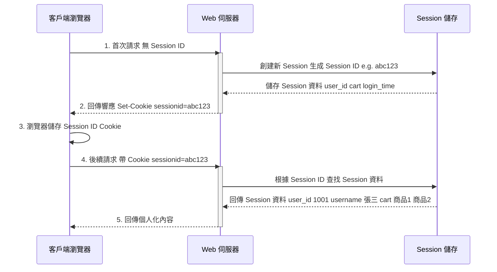

# HTTP Session 管理機制：深度解析與安全實踐

> Updated: 2026-02-15 00:44

## 目錄
- [1. 定義](#1-定義)
- [2. 核心原理](#2-核心原理)
- [3. 實作流程與圖解](#3-實作流程與圖解)
- [4. 使用場景與替代方案](#4-使用場景與替代方案)
  - [4.1 適合使用 Session 的場景](#41-適合使用-session-的場景)
  - [4.2 不適合使用 Session 的場景](#42-不適合使用-session-的場景)
  - [4.3 現代替代方案](#43-現代替代方案)
- [5. 風險控管與安全性最佳實踐](#5-風險控管與安全性最佳實踐)
  - [5.1 主要風險](#51-主要風險)
  - [5.2 最佳實踐](#52-最佳實踐)

---

## 1. 定義

**HTTP Session** 是一種**伺服器端 (Server-side)** 用戶狀態管理機制。它為每個連接的用戶創建一個臨時且獨立的儲存空間，旨在**跨多個 HTTP 請求之間追蹤並保持用戶的特定狀態**，從而克服 HTTP 協定**無狀態 (Stateless)** 的本質限制。

## 2. 核心原理

HTTP 協定本質上是無狀態的，這意味著每個請求都被視為獨立事件，伺服器在處理完畢後不會記憶任何用戶資訊。然而，現代 Web 應用如電子商務網站或社交媒體平台，要求能夠追蹤用戶的連續行為和登入狀態。HTTP Session 的核心價值即是解決這個問題，為無狀態的 HTTP 建立狀態連結。

其運作原理概述如下：

1.  **首次請求與 Session 創建**：當用戶第一次訪問 Web 應用時，伺服器會為該用戶分配一個唯一的 Session，並生成一個獨特的 Session ID。
2.  **Session ID 傳遞**：這個 Session ID 通常會透過 HTTP 響應頭中的 `Set-Cookie` 字段，以 **HTTP Cookie** 的形式傳送給客戶端瀏覽器。
3.  **後續請求**：之後，客戶端瀏覽器會自動在後續的每個 HTTP 請求頭中包含這個 Session ID（透過 `Cookie` 字段），發送給伺服器。
4.  **狀態識別與維護**：伺服器接收到請求後，會根據請求中的 Session ID 查找並加載其對應的伺服器端 Session 資料。這樣一來，伺服器就能識別用戶身份，並使用或更新該用戶的特定狀態資訊。

## 3. 實作流程與圖解

以下是 HTTP Session 典型的運作流程圖解，說明了客戶端與伺服器之間的互動機制：

運作步驟說明：

1.  **首次請求**：用戶（客戶端瀏覽器）第一次訪問網站時，發送 HTTP 請求至 Web 伺服器。此時，請求頭中通常不包含任何 Session ID。
2.  **創建 Session 與 ID 分發**：伺服器接收到請求後，檢測到沒有 Session ID，便會執行以下操作：
    *   創建一個新的 Session 物件，並生成一個全局唯一的 Session ID（例如 `abc123`）。
    *   將與用戶相關的初始數據（如登入狀態、語言偏好等）儲存到伺服器端的 Session 儲存中（例如記憶體、檔案系統或資料庫）。
    *   在 HTTP 響應頭中添加 `Set-Cookie: sessionid=abc123`，將 Session ID 作為 Cookie 發送給瀏覽器。
3.  **瀏覽器儲存 Cookie**：瀏覽器接收到響應後，會將這個包含 Session ID 的 Cookie 儲存在本地。此 Cookie 通常設置為會話級 (session-scoped) 或具有特定過期時間。
4.  **後續請求攜帶 Session ID**：從此以後，當用戶在同一網站內進行導航或發送其他請求時，瀏覽器會自動在其 HTTP 請求頭中帶上之前儲存的 Session ID Cookie（例如 `Cookie: sessionid=abc123`）。
5.  **伺服器識別與處理**：伺服器接收到帶有 Session ID 的請求後，會執行以下操作：
    *   根據請求頭中的 Session ID，從其 Session 儲存中檢索對應的 Session 資料。
    *   一旦成功匹配，伺服器便能識別出用戶身份及其當前狀態。
    *   根據這些狀態資訊處理請求（例如顯示個人化頁面、更新購物車），並回傳相應的內容給客戶端。

## 4. 使用場景與替代方案

### 4.1 適合使用 Session 的場景：

*   **用戶登入狀態管理**：記錄用戶是否已登入、用戶 ID、權限等級等敏感和關鍵狀態信息。
*   **購物車功能**：在用戶完成購買前，暫存用戶選購的商品清單和數量。
*   **多步驟表單**：在填寫複雜的多頁面表單時，保存各步驟的臨時數據，直到最終提交。
*   **用戶偏好設定**：儲存語言選擇、主題設定等臨時性用戶偏好，以便在會話期間提供一致的體驗。
*   **防止 CSRF (Cross-Site Request Forgery) 攻擊**：透過在 Session 中儲存 CSRF token，並在每個表單提交時進行驗證，以增強安全性。
*   **臨時數據緩存**：例如搜尋結果的分頁資訊，避免每次請求都重新查詢資料庫，提高性能。

### 4.2 不適合使用 Session 的場景：

*   **無狀態 API (如 RESTful API)**：這類 API 設計哲學強調無狀態性，通常偏好使用 JWT (JSON Web Token) 等 Token-based 認證機制，以實現更簡潔、可擴展的設計。
*   **需要跨域共享的資料**：傳統的 HTTP Session 通常綁定在單一域名下。若要實現跨域共享，需要額外的配置或更複雜的解決方案。
*   **高併發與分散式系統**：在大規模或高併發環境下，傳統的伺服器端 Session 會增加伺服器記憶體負擔。若應用部署在多台伺服器上，Session 同步會是一個挑戰，需要引入複雜的**分散式 Session 儲存解決方案**（如 Redis 或 Memcached）。
*   **長期儲存的資料**：Session 主要用於臨時性狀態數據。永久性數據，如用戶個人資料、訂單記錄等，應當存入後端資料庫，而非 Session 中。

### 4.3 現代替代方案：

隨著 Web 技術的演進，針對特定場景出現了更優或更適合的替代方案：

*   **JWT (JSON Web Token)**：主要用於**無狀態 API 認證與授權**。JWT Token 本身包含用戶資訊，並經數位簽名，可由客戶端儲存。伺服器無需在內部儲存用戶會話狀態，減少了伺服器負擔，特別適用於分散式系統和移動應用。
*   **LocalStorage / SessionStorage**：這兩種是 HTML5 提供的**客戶端瀏覽器儲存機制**。它們適用於儲存不需要伺服器驗證的輕量級、非敏感資料，例如用戶介面偏好、本地緩存等。
    *   `LocalStorage` 數據無過期時間，除非手動清除。
    *   `SessionStorage` 數據在瀏覽器會話結束時清除。
*   **Redis / Memcached**：作為**分散式 Session 儲存**的常見解決方案。它們是高性能的記憶體資料庫/緩存系統，可以解決傳統 Session 在多伺服器環境下的同步、高可用和可擴展性問題，使得多個應用伺服器可以共享和訪問 Session 數據。

## 5. 風險控管與安全性最佳實踐

儘管 HTTP Session 是 Web 應用中管理用戶狀態的基礎，但其安全性與效能需要仔細規劃和實施。

### 5.1 主要風險：

*   **Session Hijacking (會話劫持)**：攻擊者透過竊取合法用戶的 Session ID，冒充該用戶進行操作。常見的竊取方式包括：
    *   **中間人攻擊 (Man-in-the-Middle Attack)**：在不安全的 HTTP 連接中竊聽通信。
    *   **XSS (Cross-Site Scripting) 攻擊**：惡意腳本從用戶瀏覽器中讀取 Session Cookie。
    *   **Session ID 暴力猜測**：若 Session ID 不夠隨機或長度不足，攻擊者可能透過暴力破解猜測出有效的 ID。
*   **Session Fixation (會話固定)**：攻擊者在用戶登入前，誘使或強制用戶使用一個由攻擊者預先設定好的固定 Session ID。一旦用戶使用該 ID 成功登入，攻擊者便能利用這個已知的 Session ID 訪問用戶會話。

### 5.2 最佳實踐：

為確保 HTTP Session 的安全性和穩定性，應遵循以下策略：

1.  **強固 Session ID**：
    *   生成足夠長度、高熵、隨機且不可預測的 Session ID。避免使用容易猜測的模式（如遞增數字或用戶名相關信息）。
    *   使用**加密安全的偽隨機數生成器 (CSPRNG)** 來生成 Session ID。
2.  **安全傳輸 (HTTPS)**：
    *   始終透過 **HTTPS/SSL** 傳輸 Session ID。這可以加密客戶端與伺服器之間的通信，有效防止中間人攻擊 (MiTM) 竊聽 Session ID。
3.  **Cookie 安全標誌**：
    *   `HttpOnly` 標誌：為 Session Cookie 設定 `HttpOnly` 屬性。這將阻止客戶端腳本（如 JavaScript）訪問 Cookie，從而大幅降低 XSS 攻擊讀取 Session ID 的風險。
    *   `Secure` 標誌：為 Session Cookie 設定 `Secure` 屬性。這將確保瀏覽器只在透過 HTTPS 安全連接時才發送此 Cookie，防止 Session ID 在非加密連接中洩露。
    *   `SameSite` 標誌：根據需求設定 `SameSite=Lax` 或 `SameSite=Strict`，可以有效防範部分 CSRF 攻擊，限制跨站請求攜帶 Cookie 的行為。
4.  **適當的生命週期管理**：
    *   設定合理的 **Session 超時時間 (Expiration Time)**。對於敏感操作，應設置較短的空閒超時時間，以減少 Session 被劫持後攻擊者利用的時間窗。
    *   在用戶明確登出時，立即在伺服器端**銷毀 Session**，並使對應的 Session ID 失效。
5.  **Session ID 輪替 (Rotation)**：
    *   在用戶成功登入（或權限升級）後，應**重新生成並發送新的 Session ID**。這可以有效防止 Session Fixation 攻擊，因為即使攻擊者預先提供了 Session ID，登入後該 ID 也會失效。
6.  **伺服器端驗證與敏感數據處理**：
    *   始終在伺服器端驗證 Session ID 的有效性，例如檢查其是否已過期或被銷毀。**絕不信任來自客戶端的任何 Session 數據**。
    *   對所有透過 Session 儲存的敏感數據（如個人身份信息、權限設置）進行適當的**加密、脫敏或只儲存非敏感引用**，而非直接儲存明文數據。
7.  **分散式 Session 策略**：
    *   對於高併發和分散式系統，考慮使用 **Redis 或 Memcached 等集中式儲存**來管理 Session。這不僅能解決多伺服器間的 Session 同步問題，還能提高 Session 管理的性能與可擴展性。
8.  **CSRF 防護**：
    *   結合 Session 使用 **CSRF token**。每次用戶請求涉及狀態改變的操作時，伺服器生成一個唯一的 CSRF token 並儲存在 Session 中，同時將其嵌入到表單或請求參數中。伺服器在接收請求時驗證提交的 token 是否與 Session 中的匹配，以確保請求的合法性。