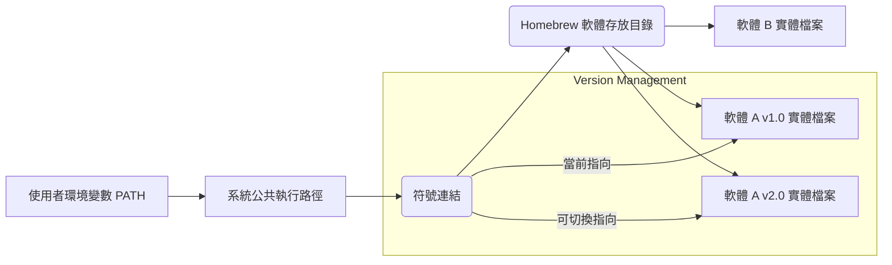
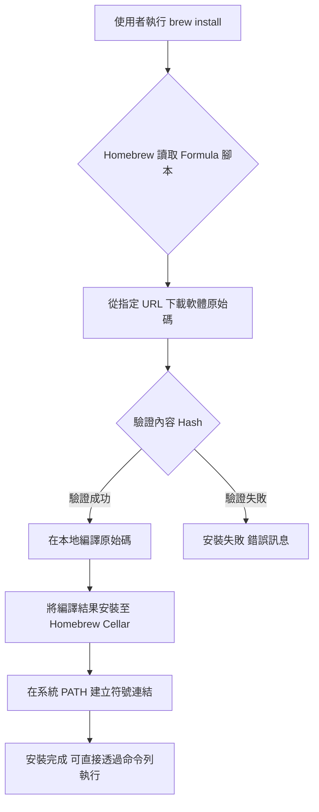
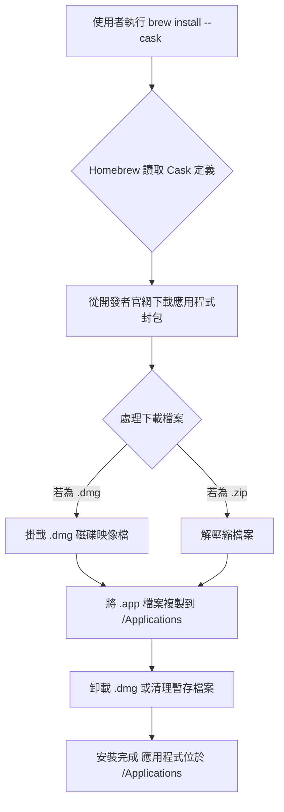

# Homebrew 軟體包管理工具：原理、實踐與管理

> Updated: 2026-02-15 01:18


Homebrew 作為 macOS 和 Linux 上的套件管理工具，旨在極大簡化軟體的安裝與管理流程。無論是圖形使用者介面 (GUI) 的應用程式（如 Google Chrome, Discord），還是命令列介面 (CLI) 的開發工具（如 Git, Node.js），Homebrew 都提供了一站式的解決方案，省去了繁瑣的官方網站搜尋與手動安裝步驟。

## 目錄
*   [1. 核心概念：Homebrew 運作原理](#1-核心概念homebrew-運作原理)
    *   [1.1. 路徑管理：實體檔案與符號連結 (Symlink)](#11-路徑管理實體檔案與符號連結-symlink)
    *   [1.2. 設計優勢](#12-設計優勢)
*   [2. 軟體分類：Formula 與 Cask](#2-軟體分類formula-與-cask)
    *   [2.1. Formula：命令列工具](#21-formula命令列工具)
    *   [2.2. Cask：圖形化應用程式](#22-cask圖形化應用程式)
*   [3. 實戰操作](#3-實戰操作)
    *   [3.1. 安裝 Homebrew](#31-安裝-homebrew)
    *   [3.2. 軟體安裝範例](#32-軟體安裝範例)
*   [4. 常用管理指令速查表](#4-常用管理指令速查表)
*   [5. 參考資料](#5-參考資料)
*   [6. 其他相關](#6-其他相關)

## <a id="1-核心概念homebrew-運作原理"></a>1. 核心概念：Homebrew 運作原理

Homebrew 透過一套精巧的機制來管理系統上的軟體，其核心在於「分層管理」與「符號連結」。

### <a id="11-路徑管理實體檔案與符號連結-symlink"></a>1.1. 路徑管理：實體檔案與符號連結 (Symlink)

Homebrew 會將所有安裝的軟體檔案存放於一個專屬的「實體存放目錄」（通常位於 `/opt/homebrew` 或 `/usr/local/Cellar`），並在系統的公共執行路徑（如 `/usr/local/bin`）中建立指向這些實體檔案的「符號連結」（Symbolic Link，簡稱 Symlink）。當系統執行軟體時，實際上是透過公共路徑的 Symlink 找到 Homebrew 管理的實體檔案。



### <a id="12-設計優勢"></a>1.2. 設計優勢

這種設計帶來了多項關鍵優勢：

*   **版本控制彈性**：
    *   Homebrew 允許在「實體存放區」同時安裝並保存軟體的多個版本（例如 Python 3.10 與 Python 3.12）。
    *   使用者可以透過調整「符號連結」所指向的目標，輕鬆地在不同版本之間進行切換，而無需移除舊版本或處理衝突。
*   **純淨卸載**：
    *   傳統軟體安裝往往會在系統各處留下殘留檔案，例如 `.plist` 設定檔或暫存檔，導致卸載不徹底。
    *   藉由 Homebrew，軟體的核心檔案都集中管理，只需刪除實體目錄及其相關的符號連結，即可實現 100% 的純淨卸載，避免系統累積不必要的垃圾。

## <a id="2-軟體分類：formula-與-cask"></a>2. 軟體分類：Formula 與 Cask

Homebrew 將其管理的軟體分為兩大類，以適應不同類型的應用程式：

### <a id="21-formula命令列工具"></a>2.1. Formula：命令列工具

*   **對象**：主要用於安裝沒有圖形使用者介面 (GUI)，需要在終端機中執行的命令列工具、函式庫或程式語言運行環境。
*   **例子**：`git` (版本控制系統), `wget` (網路下載器), `python` (程式語言環境), `node` (Node.js 運行環境)。
*   **背後原理**：每個 Formula 都是一個 **Ruby 腳本**。當你執行 `brew install <formula>` 時，Homebrew 會：
    1.  讀取 Formula 腳本，從指定的原始碼儲存庫下載軟體原始碼。
    2.  對下載的內容進行驗證（通常是透過 Hash 檢查，確保完整性與安全性）。
    3.  根據腳本指令，將原始碼在本地進行編譯、建構，使其成為系統可執行的二進位檔案。
    4.  將編譯好的檔案安裝到 Homebrew 的專屬存放路徑。
    5.  在系統的公共執行路徑建立指向該軟體實體檔案的符號連結。



*   **範例**：
    ```bash
    brew install git
    brew install python
    ```

### <a id="22-cask圖形化應用程式"></a>2.2. Cask：圖形化應用程式

*   **對象**：用於安裝具有圖形使用者介面的 macOS 應用程式，這些應用程式通常以 `.dmg` 磁碟映像檔或 `.app` 應用程式包形式發布，原本需要手動拖曳安裝。
*   **例子**：`google-chrome` (網頁瀏覽器), `visual-studio-code` (程式碼編輯器), `spotify` (音樂播放器), `slack` (通訊軟體)。
*   **背後原理**：Cask 更像是簡化版的自動化安裝腳本。當你執行 `brew install --cask <cask>` 時，Homebrew 會：
    1.  從開發者指定的官方下載源直接抓取預先封裝好的 `.dmg`、`.zip` 或 `.app` 等應用程式檔案。
    2.  自動掛載 `.dmg` 檔案（如果適用）。
    3.  將 `.app` 檔案複製到 macOS 的標準應用程式目錄 `/Applications`。
    4.  自動卸載 `.dmg` 檔案（如果適用）。
    5.  完成應用程式的安裝，使其像手動安裝一樣出現在 Launchpad 或應用程式資料夾中。



*   **範例**：
    ```bash
    brew install --cask google-chrome
    brew install --cask visual-studio-code
    ```

## <a id="3-實戰操作"></a>3. 實戰操作

### <a id="31-安裝-homebrew"></a>3.1. 安裝 Homebrew

打開終端機 (Terminal) 應用程式，並複製貼上 Homebrew 官方網站提供的安裝指令。此指令會自動下載並執行安裝腳本。

```bash
/bin/bash -c "$(curl -fsSL https://raw.githubusercontent.com/Homebrew/install/HEAD/install.sh)"
```

安裝過程中，系統可能會要求輸入使用者密碼以授權相關操作。安裝完成後，Homebrew 會提示是否需要設定 `PATH` 環境變數，確保 `brew` 命令可以在任何路徑下執行。

### <a id="32-軟體安裝範例"></a>3.2. 軟體安裝範例

根據您要安裝的軟體類型，選擇對應的指令：

*   **安裝命令列工具 (Formula)**：
    ```bash
    brew install <軟體名稱>
    # 範例：安裝 Git
    brew install git
    # 範例：安裝 Node.js
    brew install node
    ```

*   **安裝圖形化應用程式 (Cask)**：
    ```bash
    brew install --cask <應用程式名稱>
    # 範例：安裝 Google Chrome
    brew install --cask google-chrome
    # 範例：安裝 Visual Studio Code
    brew install --cask visual-studio-code
    ```

## <a id="4-常用管理指令速查表"></a>4. 常用管理指令速查表

以下是一些 Homebrew 日常維護中最常用的指令，建議收藏以備不時之需：

*   **搜尋軟體**：`brew search <關鍵字>`
*   **查看軟體資訊**：`brew info <軟體名稱>`
*   **更新 Homebrew 本身**：`brew update`
*   **升級所有已安裝軟體**：`brew upgrade`
*   **升級特定軟體**：`brew upgrade <軟體名稱>`
*   **卸載軟體 (Formula)**：`brew uninstall <軟體名稱>`
*   **卸載軟體 (Cask)**：`brew uninstall --cask <應用程式名稱>`
*   **清理舊版本軟體及暫存檔**：`brew cleanup`
*   **列出所有已安裝的 Formula**：`brew list`
*   **列出所有已安裝的 Cask**：`brew list --cask`
*   **檢查系統問題**：`brew doctor`

## <a id="5-參考資料"></a>5. 參考資料

*   [Homebrew 官方網站 (繁體中文)](https://brew.sh/index_zh-tw)

## <a id="6-其他相關"></a>6. 其他相關

*   **Homebrew Bundle**：利用 `brew bundle` 指令可以將所有已安裝的 Formula 和 Cask 記錄到一個 `Brewfile` 中。這在更換新電腦或重新設置開發環境時非常有用，只需執行 `brew bundle` 即可快速還原所有配置好的軟體，確保開發環境的一致性。
