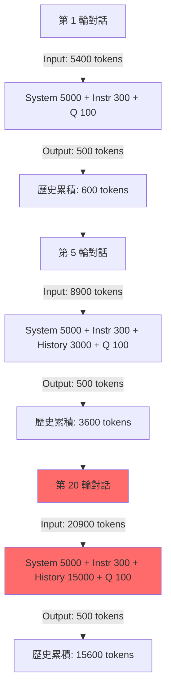
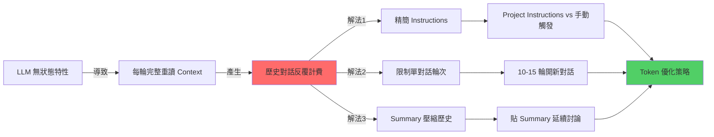

### 內容大綱
- **核心原理**
  - LLM 的無狀態特性
  - Project Instructions 的 Token 機制
- **Token 消耗流程**
  - 對話輪次 Token 累積
- **技術深挖**
  - Instructions 配置方式的 Token 對比
  - Instructions 精簡化技術
  - Context Window 管理的數學模型
  - 壓縮歷史的 Summary 技術
- **知識網絡**
  - LLM Token 優化策略關係圖
- **行動實踐**
  - Best Practices：Token 優化完整方案
  - Token 消耗實測對比
  - 進階技巧：Summary 模板優化
  - Next Steps
- **關鍵洞察總結**

## 核心原理 (Core Concepts)
### LLM 的無狀態特性
Large Language Models (LLM) 採用無記憶 (stateless) 架構，這意味著每次的推理請求都是獨立的事件。LLM 不會「記憶」前一輪的對話內容，因此，為保持對話的連貫性，每次互動時模型都必須重新讀取完整的對話歷史。

以下偽代碼示意了 LLM 推理的底層邏輯：
```python
# LLM 推理的底層邏輯
def generate_response(current_input):
    # ❌ 模型沒有持久化記憶體，不會「記得」上一輪說了什麼
    # ✅ 每次都從零開始重新讀取完整的輸入上下文 (Context)
    
    full_context = concatenate(
        system_prompt,           # 約 5000 tokens (Anthropic 內建)
        project_instructions,    # 約 300-2000 tokens (用戶設定)
        message_history,         # 累積成長 (所有前面的 Q&A)
        current_input            # 約 100 tokens (當前問題)
    )
    
    return model(full_context)  # 整個 full_context 都會計入 input tokens
```

**關鍵理解**：
- LLM 每次推理時，都會重新讀取完整的上下文，包括系統提示詞、Project Instructions、所有對話歷史及當前輸入。
- 歷史對話的 tokens 會在每輪推理中**反覆計費**，這是導致成本快速上升的主要原因。

### Project Instructions 的 Token 機制
關於 Project Instructions 的 token 消耗存在常見誤解。其真實運作機制如下：

每次 API 請求的 Context 組成：
```plain text
┌──────────────────────────────────┐
│ System Prompt (Anthropic 內建)   │ ← 每次載入，計入 input tokens
│ Project Instructions (用戶設定)   │ ← 每次載入，計入 input tokens
│ Message History (對話歷史)        │ ← 每次載入 + 累積成長，計入 input tokens
│ Current Input (當前問題)          │ ← 當次輸入，計入 input tokens
└──────────────────────────────────┘
         ↓
   全部計入 Input Tokens
```

**誤解澄清**：
- ❌ 誤解：「Project Instructions 只載入一次不重複計費」是錯誤的說法。
- ✅ 正確理解：Project Instructions 每次請求都會被載入到模型的 Context Window 中，因此都會消耗 input tokens。其真正優勢在於「省去手動複製貼上的麻煩」及「避免指令出現在對話歷史中」，從而保持 Context 的整潔度，而非直接的 token 數節省。

## Token 消耗流程 (Architecture & Flow)
### Mermaid：對話輪次 Token 累積
LLM 對話中的 token 消耗會隨著對話輪次呈指數級增長，因為模型必須不斷重新讀取累積的歷史對話。



**指數級成長實例**：
- 假設：System Prompt 約 5000 tokens，Project Instructions 約 300 tokens，每輪 User 問題 100 tokens，Assistant 回答 500 tokens。
- **關鍵發現**：在第 20 輪時，即使你只輸入了 100 tokens 的新問題，Claude 卻需要重新讀取約 20400 tokens 的完整 Context 才能生成回應。這說明歷史對話的 token 會在每輪中被反覆計費，導致成本和延遲急劇增加。

## 技術深挖 (Technical Deep Dive)
### 三種 Instructions 配置方式的 Token 對比
此處比較在不同 Instructions 配置方式下，一次「總結」操作的 token 消耗情況。

**場景假設**：
- Instructions 長度：2000 tokens
- 單輪對話：User 問題 100 tokens + Assistant 回答 500 tokens
- 總共 10 輪對話，最後一輪觸發總結
- System Prompt 固定 5300 tokens (含 Anthropic 內建與少量預設)

| 配置方式                     | 每次對話消耗 (Input Tokens) | 總結時消耗 (Input Tokens) | 總結總 Input Tokens (10輪) | 優勢與劣勢                                                  |
|------------------------------|-----------------------------|---------------------------|----------------------------|-------------------------------------------------------------|
| 1. **每輪手動貼上 Instructions** | 5300 + 2000 + 100 = 7400    | 5300 + 2000 + 歷史 + 100  | 7400 * 10 = 74000          | ❌ 極浪費 Token；❌ 污染對話歷史；❌ 繁瑣                       |
| 2. **Project Instructions 隨時生效** | 5300 + 2000 + 100 = 7400    | 同上                      | 7400 * 10 = 74000          | ❌ 同樣浪費 Token；✅ 方便；✅ 整潔對話歷史                   |
| 3. **結束時手動觸發 (無 PI)**      | 5300 + 100 = 5400           | 5300 + 2000 + 歷史 + 100  | (5400 * 9) + 8400 = 57000  | ✅ 最省 Token (僅總結時加指令)；❌ 需要手動貼觸發指令 |

**結論**：對於「學習完才整理」的場景，對話結束時手動觸發總結（或配合極簡 Project Instructions），是相對最省 token 的方案 (可省約 35%)。

### Instructions 精簡化技術
精簡化 Instructions 是有效減少基礎 token 消耗的策略。Claude 對精簡指令的理解能力極強，通常 30% 的長度即可達到 95% 的效果。

**原始版本 (~2000 tokens)**
```markdown
# Role: 資深後端架構師 & 知識工程師

## 🚀 運作原則
1. 僅在輸入 `/summary` 或「整理知識」時啟動結構化總結；平時回覆極簡。
2. **深度提取，禁概括**：嚴禁僅做表面描述。必須 100% 提取對話中涉及的所有「技術參數、邊界條件、邏輯分支、實作細節與異常處理」。
3. **視覺化與範例**：涉及數據流/架構必用 Mermaid.js (複雜則拆圖)；抽象概念必附 MVP 程式碼或類比。
...
```

**精簡版 (~800 tokens，省 60%)**
```markdown
角色：資深後端架構師
觸發：/summary

## 輸出結構
1. 核心原理 + 程式碼範例
2. Mermaid 架構圖（複雜需拆分）
3. 技術深挖：參數/限制/坑洞/異常處理
4. Best Practices + Next Steps

## 規則
- 禁概括，100% 提取技術細節
- 含具體數值/配置/API 規格
- 標註風險與 Side Effects
```

**極致精簡版 (~300 tokens，省 85%)**
```markdown
/summary 格式：
【原理】定義 + Why + 程式碼
【架構】Mermaid 圖 + 時序
【深挖】參數/限制/坑洞/異常
【實踐】Best Practices + Next Steps

要求：全量技術細節，禁概括
```

**優化原則**：
- 刪除描述性語句，僅保留關鍵字。
- 合併重複概念，例如「技術參數、邊界條件」可簡化為「參數/限制」。
- 使用符號替代冗長文字，例如「+」替代「以及」。

### Context Window 管理的數學模型
對話輪次與 token 消耗的關係可以用以下模型來近似：

```python
# Token 累積公式
def total_tokens(rounds, avg_qa_tokens=600):
    system_tokens = 5300  # System Prompt + 少量 Project Instructions
    tokens_consumed_total = 0
    history_tokens = 0
    
    for round_num in range(1, rounds + 1):
        # 每輪的 input tokens = 固定系統層 + 累積歷史 + 當前問題
        input_tokens_this_round = system_tokens + history_tokens + 100  # 假設問題100 tokens
        output_tokens_this_round = 500  # 假設回答500 tokens
        
        tokens_consumed_total += (input_tokens_this_round + output_tokens_this_round)
        history_tokens += avg_qa_tokens  # 每輪對話歷史累積 600 tokens (100+500)
    
    return tokens_consumed_total

# 實際計算 20 輪對話的總消耗
print(f"20 輪對話總消耗 Input/Output Tokens: {total_tokens(20):,} tokens") 
# 輸出約：276,000 tokens
```

**臨界點分析**：
- 10 輪以內：歷史對話負擔相對可接受（累積 < 6000 tokens）。
- 15 輪：歷史對話開始顯著影響消耗（累積約 9000 tokens）。
- 20 輪以上：嚴重浪費 token（累積 15000+ tokens）。

**建議閾值**：單一對話主題不超過 **10-15 輪**。

### 壓縮歷史的 Summary 技術
使用 `summary` 功能是大幅減少後續對話 token 消耗的關鍵策略。透過將冗長的對話歷史濃縮為精簡的摘要，可以將數萬 tokens 壓縮至數百 tokens。

```plain text
原始對話歷史 (約 15000 tokens)：
├─ User: Redis 是什麼？
├─ Assistant: Redis 是開源的 in-memory 資料結構儲存系統...
├─ User: Cluster 模式的分片原理？
├─ Assistant: Redis Cluster 使用一致性雜湊，劃分 16384 個 slots...
└─ ... (共 20 輪詳細討論)

          ↓ `/summary` 壓縮

精簡 Summary (約 500 tokens)：
## Redis Cluster 核心知識
- 分片：16384 hash slots，`CRC16(key) % 16384` 決定分配
- 複製：每個 master 節點至少 1 個 replica，支援高可用
- 故障轉移：透過 Gossip 協定，大多數節點投票選出新的 master
- 腦裂風險：可透過調整 `cluster-node-timeout` 參數進行控制
- 注意事項：不支持多鍵跨 slot 事務，需應用層處理
[附 Mermaid 架構圖，示意節點與槽分配]
```

**壓縮比**：將 15000 tokens 的歷史對話壓縮成 500 tokens 的精簡 Summary，壓縮率高達 **97%**。

**延續對話時的 Token 節省**：
- ❌ **持續 20 輪對話**：
  `Input = 5300 (系統) + 15000 (歷史) + 100 (新問題) = 20400 tokens`
- ✅ **開新對話 + 貼精簡 Summary**：
  `Input = 5300 (系統) + 500 (summary) + 100 (新問題) = 5900 tokens`

此策略可節省高達 **71%** 的 Input Tokens！

## 知識網絡 (Knowledge Graph)


## 行動實踐 (Actionable Insights)
### Best Practices：Token 優化完整方案
將多種優化策略結合，能達到最佳的 Token 節省效果與工作效率。

#### 1️⃣ Instructions 配置策略
- **場景A：需要每輪對話都遵守的規則** (例如程式碼風格、特定回應格式)
  - **策略**：使用 Project Instructions (但務必精簡至約 300 tokens 以下)。
- **場景B：僅在對話結束時整理知識**
  - **策略**：對話期間不設定 Project Instructions，僅在討論結束時手動輸入完整整理需求 (或使用極精簡的 Project Instructions，小於 200 tokens)。此策略配合瀏覽器書籤快捷指令可大幅提升效率。

#### 2️⃣ 對話生命週期管理
採取以下 SOP 流程來有效管理對話與 Token 消耗：
```plain text
┌─────────────────────────────────────┐
│ 1. 單主題深度討論 (建議 10-15 輪)   │
│    ├─ 聚焦單一技術點，避免跳躍式多主題 │
│    └─ 充分挖掘細節，進行深度問答      │
├─────────────────────────────────────┤
│ 2. 輸入 `/summary` 產生結構化筆記    │
│    ├─ 提取核心原理、程式碼範例        │
│    ├─ 繪製 Mermaid 架構圖             │
│    ├─ 深入分析參數、限制、坑洞等      │
│    └─ 總結 Best Practices            │
├─────────────────────────────────────┤
│ 3. 存檔並關閉對話                    │
│    └─ 將生成的 Markdown 筆記存入 Obsidian / Notion 等知識庫 │
├─────────────────────────────────────┤
│ 4. 新主題開新對話                    │
│    └─ Context 重新計算，Token 消耗歸零 │
├─────────────────────────────────────┤
│ 5. 需延續討論時                      │
│    └─ 貼精簡版 Summary (約 500 tokens)，而非完整歷史 (數千甚至上萬 tokens) │
└─────────────────────────────────────┘
```

#### 3️⃣ 瀏覽器書籤快捷指令 (推薦)
為簡化「結束時手動觸發」的步驟，可建立瀏覽器書籤，一鍵複製 `/summary` 指令。

```javascript
// 將以下程式碼儲存為瀏覽器書籤的 URL
javascript:(function(){
  const prompt = `/summary 格式：
1. 原理+程式碼範例
2. Mermaid架構圖
3. 參數/限制/坑洞/異常
4. Best Practices
要求：全量細節，禁概括`;
  
  navigator.clipboard.writeText(prompt);
  alert('✅ 已複製 /summary 指令到剪貼簿');
})();
```
**使用方式**：
- 將上述 `javascript:` 開頭的程式碼存為瀏覽器書籤 (例如：名稱為「Claude Summary」)。
- 在對話結束需要整理時，點擊該書籤 → 一鍵複製指令到剪貼簿 → 貼到對話框中發送。

### Token 消耗實測對比
以下表格展示了不同優化策略在一個學習 Redis Cluster 20 輪的場景下的 token 消耗對比。

**場景**：學習 Redis Cluster，討論 20 輪，每次對話平均消耗 600 tokens (問+答)。

| 策略                                 | 總 Input Tokens (約) | 相對節省 | 實施難度 |
|--------------------------------------|----------------------|----------|----------|
| **基準：持續 20 輪 + 完整 Instructions** | 276,000              | 0%       | ⭐        |
| **精簡 Instructions (2000→300 tokens)** | 242,000              | 12%      | ⭐⭐⭐⭐⭐   |
| **每 10 輪換一次對話**               | 138,000              | 50%      | ⭐⭐⭐     |
| **結束才觸發整理 (無 PI)**           | 179,000              | 35%      | ⭐⭐⭐⭐    |
| **組合拳：精簡+分段+Summary**        | 89,000               | **68%**  | ⭐⭐⭐⭐    |

**最優解**：
結合以下策略可實現最高的 Token 節省：
- **精簡 Project Instructions** (控制在約 300 tokens 以下)
- **每 10-15 輪開新對話**，避免 Context 窗口膨脹
- **延續討論時貼上精簡版 Summary** (約 500 tokens)，而非完整歷史

### 進階技巧：Summary 模板優化
即使是 Summary 本身也可以進一步精簡，以減少其作為「背景」時的 Token 佔用。

**標準 Summary (約 1000 tokens)**
```markdown
## Redis Cluster 核心知識

### 架構原理
- 分片機制：採用 16384 個 hash slots
- 鍵的分配：根據 `CRC16(key) % 16384` 的結果決定所屬 slot
- 主節點責任：每個 master 節點負責一部分 slots 的讀寫請求
- 最小部署：推薦至少 3 個 master 節點以確保高可用性

### 複製與高可用
- 副本配置：每個 master 節點應至少配置 1 個 replica 節點
- 故障轉移：透過 Gossip 協定發現故障，由集群中過半數的 master 節點投票決定提升哪個 replica 為 master
- 超時控制：`cluster-node-timeout` 參數控制節點失聯判定時間
...
```

**超精簡 Summary (約 500 tokens)**
```markdown
Redis Cluster 要點：
- **分片**：16384 slots，`CRC16(key) % 16384` 決定
- **高可用**：≥3 master + replicas，Gossip 協定，majority 投票
- **限制**：不支持跨 slot 的 MULTI/EXEC 事務
- **腦裂風險**：調整 `cluster-node-timeout` 參數
- **部署**：建議至少 6 節點 (3主3從)
[Mermaid 圖略]
```
**取捨原則**：
- **保留**：關鍵數值參數、配置關鍵字、已知坑洞、核心概念定義。
- **刪除**：冗長解釋、重複概念、過渡語句、非必要的背景信息。

### Next Steps
#### 立即執行 (5 分鐘)
- 精簡當前使用的 Project Instructions 至 300 tokens 以下。
- 建立瀏覽器書籤快捷指令，方便快速複製 `/summary` 指令。

#### 短期優化 (本週)
- 測試「10-15 輪換新對話」的策略，觀察實際效果。
- 建立個人 Summary 模板庫 (可存於 Obsidian 或 Notion)，加速筆記整理。
- 開始記錄實際 token 消耗數據，評估優化前後的差異。

#### 長期習慣 (持續)
- 養成單主題對話不超過 15 輪的習慣。
- 每次學習完立即產生結構化 Summary。
- 在延續討論或引用舊知識時，只貼精簡版 Summary。

## 🎯 關鍵洞察總結
1.  **LLM 的無記憶特性**：LLM 每次推理都會完整重讀所有 Context，這導致歷史對話的 Token 會被反覆計費。
2.  **Project Instructions 的本質**：其主要優勢是提供「操作便利性」和「Context 整潔度」，而非直接的 Token 節省，因為它每次都會計入 Context。
3.  **精簡 Instructions 的效益**：透過刪除冗餘詞語、合併概念，可將系統層的基礎 Token 消耗節省 60-85%。
4.  **分段對話的必要性**：將單一主題討論限制在 10-15 輪內，可有效避免歷史 Context 膨脹，節省約 50% 的總 Token。
5.  **Summary 壓縮的威力**：將數萬 Tokens 的對話歷史壓縮成數百 Tokens 的精簡 Summary，是延續討論時最有效的 Token 優化手段 (壓縮率達 97%)。
6.  **組合優化效益最大化**：結合精簡 Instructions、分段對話與 Summary 壓縮，最高可節省總 Token 消耗的 68% 以上。

**終極原則**：應把 Token 資源花費在「獲取新知識」和「高效整理」，而非「反覆載入舊對話」的消耗。