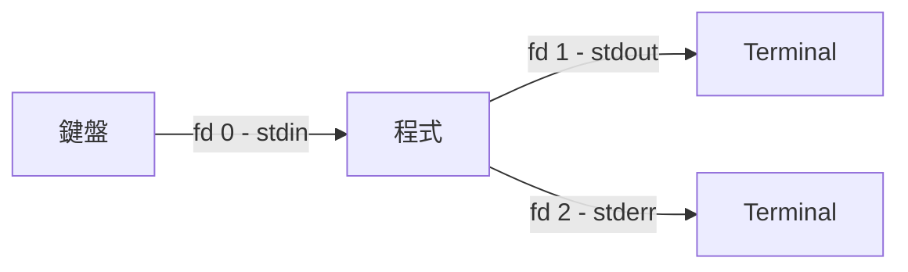

# Linux Standard Streams 與 I/O Redirection 完整指南

> Updated: 2026-02-26 21:13


## 目錄
- [1. Standard Streams 核心概念](#1-standard-streams-核心概念)
    - [1.1. 什麼是 Stream](#11-什麼是-stream)
    - [1.2. 三個標準 Stream](#12-三個標準-stream)
    - [1.3. 為什麼 stdout 與 stderr 要分開](#13-為什麼-stdout-與-stderr-要分開)
- [2. I/O Redirection 語法](#2-io-redirection-語法)
    - [2.1. 基本重定向語法](#21-基本重定向語法)
    - [2.2. 關鍵差異: 2> 與 >&2](#22-關鍵差異-2-與-2)
- [3. 程式內部指定輸出目的地](#3-程式內部指定輸出目的地)
    - [3.1. Python](#31-python)
    - [3.2. Shell Script](#32-shell-script)
- [4. 實際應用範例](#4-實際應用範例)
    - [4.1. 分離正常輸出與錯誤訊息](#41-分離正常輸出與錯誤訊息)
    - [4.2. Locust 測試腳本中的應用](#42-locust-測試腳本中的應用)
- [5. 常見 Redirection 模式](#5-常見-redirection-模式)
- [6. 為什麼錯誤訊息要用 stderr](#6-為什麼錯誤訊息要用-stderr)

## 1. Standard Streams 核心概念

### 1.1. 什麼是 Stream

Stream 是一條"持續流動的資料通道"，概念上類似水管：程式往管子裡倒資料，管子的另一端接著某個目的地（terminal、檔案、另一個程式）。程式本身不需要知道另一端是誰，它只管往管子裡讀或寫就好。

OS 在每個程式啟動時自動開好三條管道（stdin / stdout / stderr），而 I/O Redirection 的本質就是：在不改程式碼的情況下，把管道的出口或入口從預設位置（鍵盤 / terminal）拔掉，接到別的地方（檔案、`/dev/null`、其他程式）。

### 1.2. 三個標準 Stream

每個程式執行時，OS 自動建立三條標準 stream，各自有固定的 file descriptor 編號：

| Stream 編號 | 名稱 | 資料方向 | 說明 | 預設連接 |
|---|---|---|---|---|
| 0 | stdin | 流進程式 | 標準輸入 | 鍵盤 |
| 1 | stdout | 流出程式 | 標準輸出（正常結果） | Terminal |
| 2 | stderr | 流出程式 | 標準錯誤（診斷/錯誤訊息） | Terminal |

stdin 是輸入管道，資料從外部流進程式；stdout 和 stderr 都是輸出管道，資料從程式流出。三條都是管道，差別在於資料流方向與用途。

stdout 和 stderr 雖然預設都顯示在 terminal 上看起來一樣，但它們是兩條獨立的管道，可以被分別重定向到不同目的地。



### 1.3. 為什麼 stdout 與 stderr 要分開

最實際的原因：如果錯誤訊息也混在 stdout 裡，下游處理會壞掉。

假設程式正常輸出是合法 JSON：

```json
{"status": "ok", "data": [1, 2, 3]}
```

如果錯誤訊息也走 stdout，重定向後檔案內容就變成：

```text
Error: connection timeout
{"status": "ok", "data": [1, 2, 3]}
```

JSON parser 讀到第一行 `Error: connection timeout` 就會直接報錯，因為這不是合法的 JSON 語法，整個檔案無法被解析。但如果錯誤訊息走 stderr，它根本不會進到 `result.json` 裡，JSON 保持乾淨。

這就是分開兩條 stream 的核心價值：讓"程式結果"和"診斷訊息"走不同管道，後續處理（存檔、pipe、自動化）不會互相干擾。

## 2. I/O Redirection 語法

### 2.1. 基本重定向語法

Redirection 就是改變 stream 的連接目的地，以下是所有常用語法：

| 語法 | 說明 | 範例 |
|---|---|---|
| `> file` | stdout 重定向到檔案（覆寫） | `ls > output.txt` |
| `>> file` | stdout 重定向到檔案（附加） | `echo "log" >> output.txt` |
| `2> file` | stderr 重定向到檔案 | `ls /not_exist 2> error.txt` |
| `>&2` | 將當前輸出改為送到 stderr | `echo "Error" >&2` |
| `2>&1` | 將 stderr 重定向到 stdout（合併） | `command > all.txt 2>&1` |
| `&> file` | stdout 和 stderr 都重定向到檔案 | `command &> all.txt` |
| `< file` | stdin 從檔案讀取而非鍵盤 | `sort < names.txt` |

### 2.2. 關鍵差異: 2> 與 >&2

這兩個語法方向相反，容易混淆：

`2> file` 是在**執行命令時**使用，把程式產生的 stderr 存到檔案：

```bash
ls /not_exist 2> error.log
# 程式的 stderr 輸出被重定向到 error.log
```

`>&2` 是在**程式碼/腳本內部**使用，把這行原本走 stdout 的輸出改為走 stderr：

```bash
echo "This is an error" >&2
# echo 預設輸出到 stdout，加上 >&2 後改為輸出到 stderr
```

簡單記法：`2>` 是"接住 stderr"，`>&2` 是"送去 stderr"。

## 3. 程式內部指定輸出目的地

### 3.1. Python

```python
import sys

# 輸出到 stdout（預設）
print("Normal message")

# 明確輸出到 stdout
print("Normal message", file=sys.stdout)

# 輸出到 stderr
print("Error message", file=sys.stderr)
```

### 3.2. Shell Script

```bash
#!/bin/bash

# 輸出到 stdout（預設）
echo "Normal message"

# 明確輸出到 stdout（少用，因為是預設行為）
echo "Normal message" >&1

# 輸出到 stderr
echo "Error message" >&2
```

跨語言對照：

| 目的地 | Python | Shell Script |
|---|---|---|
| stdout | `print("msg")` | `echo "msg"` |
| stdout（明確） | `print("msg", file=sys.stdout)` | `echo "msg" >&1` |
| stderr | `print("msg", file=sys.stderr)` | `echo "msg" >&2` |

## 4. 實際應用範例

### 4.1. 分離正常輸出與錯誤訊息

給定以下腳本，其中錯誤訊息透過 `>&2` 走 stderr：

```bash
#!/bin/bash
echo "Starting process..."
echo "Processing file 1..."
echo "Error: File 2 not found" >&2
echo "Process completed"
```

不同重定向方式的結果：

| 執行方式 | Terminal 顯示 | 檔案內容 |
|---|---|---|
| `./script.sh` | 全部四行都顯示 | 無檔案 |
| `./script.sh > output.txt` | 只顯示 `Error: File 2 not found` | output.txt 含三行正常輸出 |
| `./script.sh 2> error.txt` | 顯示三行正常輸出 | error.txt 含一行錯誤訊息 |
| `./script.sh > output.txt 2> error.txt` | Terminal 不顯示任何東西 | 兩個檔案分別存放 |

### 4.2. Locust 測試腳本中的應用

在實際專案中，Locust 測試腳本使用 `>&2` 確保錯誤訊息不會混入正常輸出：

```bash
if command -v lsof &> /dev/null; then
    countdown=15
    while lsof -i :8089 &> /dev/null; do
        if [ "$countdown" -le 0 ]; then
            echo "Error: Port 8089 not released after 15s" >&2
            exit 1
        fi
        sleep 1
        countdown=$((countdown - 1))
    done
fi
```

設計考量：錯誤訊息走 stderr，所以當使用者執行 `./run_locust_test.sh > results.log` 時，錯誤訊息仍會顯示在 terminal 提醒開發者，不會被靜默吞掉。同時 CI/CD 工具也能透過 stderr 正確識別測試失敗。

## 5. 常見 Redirection 模式

以下是實務中最常用的四種模式：

| 模式 | 語法 | 用途 |
|---|---|---|
| 安靜模式 | `command > /dev/null 2>&1` 或 `command &> /dev/null` | 丟棄所有輸出 |
| 只看錯誤 | `command > /dev/null` | 丟棄 stdout - stderr 仍顯示在 terminal |
| 合併存檔 | `command > all.txt 2>&1` | stdout 和 stderr 存到同一個檔案 |
| 分別存檔 | `command > output.txt 2> error.txt` | 兩種輸出分開存到不同檔案 |

其中 `/dev/null` 是 Linux 的"黑洞裝置"，任何寫入的資料都會被丟棄。

## 6. 為什麼錯誤訊息要用 stderr

將錯誤訊息輸出到 stderr 而非 stdout 是 Unix 哲學的核心實踐，有四個實際理由：

**符合 Unix 哲學**：stdout 承載程式的正常輸出（資料、計算結果），stderr 承載診斷訊息（錯誤、警告）。兩者職責分離，各司其職。

**方便管道操作**：管道（pipe）預設只傳遞 stdout，所以 `./script.sh | grep "success"` 只會處理正常輸出，錯誤訊息不會混入管道干擾下游程式，而是直接顯示在 terminal。

**自動化工具容易識別**：CI/CD 系統可以分別捕捉 stdout 和 stderr，根據 stderr 是否有內容判斷程式是否出錯，而不需要去 parse 正常輸出的內容。

**保持輸出格式乾淨**：當正常輸出是結構化資料（JSON、CSV、XML）時，任何非預期的錯誤文字混入都會破壞格式，導致下游 parser 失敗。stderr 分流確保結構化輸出不被污染。