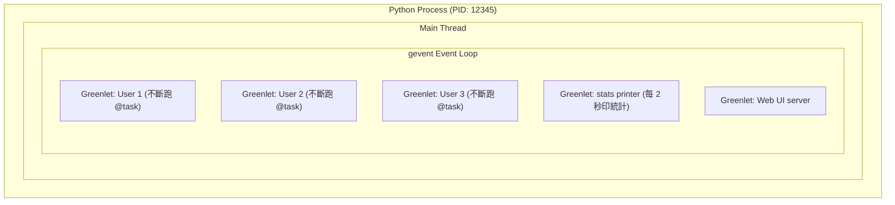
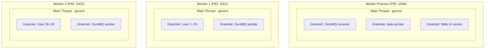
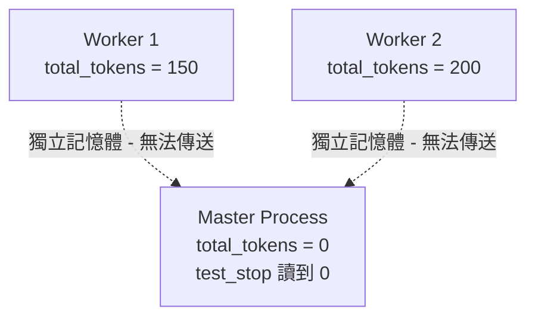

# Locust 執行模型底層: gevent 協作式排程與 Multi-Process 架構

> Updated: 2026-02-27 10:42


## 目錄
- [Locust 執行模型底層: gevent 協作式排程與 Multi-Process 架構](#locust-執行模型底層-gevent-協作式排程與-multi-process-架構)
  - [目錄](#目錄)
  - [1. Process / Thread / Greenlet 的關係](#1-process--thread--greenlet-的關係)
    - [1.1. Python 啟動時發生什麼](#11-python-啟動時發生什麼)
    - [1.2. Locust Single Process 的完整層次](#12-locust-single-process-的完整層次)
  - [2. 協作式排程 vs 搶占式排程](#2-協作式排程-vs-搶占式排程)
    - [2.1. 兩種排程模型的核心差異](#21-兩種排程模型的核心差異)
    - [2.2. Locust 內建統計不需要 Lock 的原因](#22-locust-內建統計不需要-lock-的原因)
    - [2.3. 什麼情況下會觸發協程切換](#23-什麼情況下會觸發協程切換)
  - [3. Multi-Process 架構與記憶體隔離](#3-multi-process-架構與記憶體隔離)
    - [3.1. 完整架構圖](#31-完整架構圖)
    - [3.2. 記憶體隔離: Class Variable 的陷阱](#32-記憶體隔離-class-variable-的陷阱)
    - [3.3. Master 與 Worker 的職責分工](#33-master-與-worker-的職責分工)
  - [4. test\_stop 的觸發時機](#4-test_stop-的觸發時機)

## 1. Process / Thread / Greenlet 的關係

### 1.1. Python 啟動時發生什麼

Python 啟動一個 `.py` 檔案時，OS 建立一個 process，裡面自動有一個 main thread:

```
python app.py
└── OS 建立 1 個 Process (PID: 12345)
    └── 自動包含 1 個 Main Thread
        └── 程式碼從第一行開始跑
```

除非你自己用 `threading.Thread()` 或 `multiprocessing.Process()` 去建立新的，否則就只有這一個 process 加一個 thread。

### 1.2. Locust Single Process 的完整層次

Locust Single Process 模式下: 一個 Python process，一個 main thread，裡面用 gevent 跑多個 greenlets。每個 User instance 就是一個 greenlet:



Greenlet 不是 OS thread 也不是 process，而是 gevent 在 Python 層面實現的輕量級協程，OS 完全看不到。一個 process 可以輕鬆跑上千個 greenlets。`test_start` / `test_stop` 這些 listener 也在同一個 main thread 裡被呼叫，所有東西都住在同一個 thread 裡。

## 2. 協作式排程 vs 搶占式排程

### 2.1. 兩種排程模型的核心差異

gevent 的協程是**協作式 (cooperative)** 排程，跟 OS thread 的搶占式排程完全不同:

| 排程模型 | 切換時機 | 純 CPU 操作會被打斷嗎 |
|------|------|------|
| OS Thread (搶占式) | OS 隨時可以中斷 | 會，任意兩行之間都可能被切走 |
| gevent Greenlet (協作式) | **只在 I/O 時主動讓出** | 不會，純 CPU 一路跑完 |

協程只有在遇到 I/O 操作（`socket.send()`、`time.sleep()`、`gevent.sleep()` 等）時才會**主動交出控制權**。純 CPU 的程式碼會一路跑完，不會被中斷。

### 2.2. Locust 內建統計不需要 Lock 的原因

Locust 內建的 `log_request()` 裡面全是純 CPU 操作:

```python
# Locust 內建 stats 更新 (簡化版)
def log_request(self, ...):
    self.num_requests += 1                     # 純 CPU
    self.total_response_time += response_time   # 純 CPU
    self.total_content_length += content_length  # 純 CPU
```

因為 gevent 是協作式排程，這三行之間不會有任何協程切換（沒有 I/O），所以整段程式碼對 gevent 來說是一個不可分割的執行區塊。多個 User greenlets 雖然並發執行，但統計更新不會互相干擾:

```
User 1 greenlet: 發 HTTP request (I/O) -> 等待回應 (交出控制權)
User 2 greenlet: 發 HTTP request (I/O) -> 等待回應 (交出控制權)
User 1 greenlet: 收到回應 -> log_request() 裡的 += (純 CPU，不被切換) -> 完成
User 2 greenlet: 收到回應 -> log_request() 裡的 += (純 CPU，不被切換) -> 完成
```

### 2.3. 什麼情況下會觸發協程切換

以下操作會讓 gevent 切換到其他協程:

- 網路 I/O: `socket.send()`, `socket.recv()`, `requests.get()`
- 明確讓出: `gevent.sleep()`, `time.sleep()`（被 gevent monkey-patch 後）
- 文件 I/O: `open().read()`, `logging` 寫檔案

以下操作**不會**觸發切換:

- 變數賦值: `x = 100`
- 算術運算: `total += delta`
- 字串操作: `s = f"result: {x}"`
- 記憶體內的資料結構操作: `dict[key] = value`, `list.append()`

## 3. Multi-Process 架構與記憶體隔離

### 3.1. 完整架構圖

單一 Python process 受限於 GIL (Global Interpreter Lock)，無法真正平行利用多核 CPU。`--processes N` 啟動多個獨立 Python process:



每個 Worker 可以視為一個獨立的 Single Process，各自有自己的 gevent event loop。假設設定 100 Users、4 Workers，Master 會平均分配每個 Worker 約 25 個 User greenlets。Total Users = sum(每個 Worker 的 greenlets)。

### 3.2. 記憶體隔離: Class Variable 的陷阱

Python 每個 process 擁有**獨立的記憶體空間**。在 Multi-Process 模式下，class variable 的修改只存在於各自的 process 中:



Worker 各自累加自己的 `total_tokens`，但 Master 從未執行 `@task`，所以 Master 上的值永遠是 0。要把數據從 Worker 傳到 Master，必須透過 Locust 的事件系統（ZeroMQ 通訊）。

### 3.3. Master 與 Worker 的職責分工

所有進程都會載入 locustfile.py 並執行模組級程式碼（包含 Decorator 註冊），但各角色實際執行的邏輯由 `isinstance(environment.runner, WorkerRunner)` 守衛來區分:

**Master Process (協調者):**

- 執行 `@events.test_start.add_listener` -- 負責初始化邏輯
- 執行 `@events.test_stop.add_listener` -- 負責 export 最終報告
- 執行 `@events.worker_report.add_listener` -- 接收並聚合 Worker 數據
- 不執行 `@task` 方法

**Worker Process (實際執行者):**

- 執行 `@task` 方法 -- 發送 HTTP 請求並收集結果
- 執行 `@events.report_to_master.add_listener` -- 定期發送數據給 Master
- 觸發 `test_start` / `test_stop` -- 但透過 WorkerRunner 檢查跳過實際邏輯

WorkerRunner 守衛的典型寫法:

```python
@events.test_stop.add_listener
def export_custom_stats(environment, **kwargs):
    if isinstance(environment.runner, WorkerRunner):
        return  # Worker 直接跳過
    # 以下只有 Master 會執行
```

## 4. test_stop 的觸發時機

當你按下 `Ctrl+C`（CLI 模式）或在 Web UI 點 Stop 時，Locust 的停止流程是:

1. 通知所有 User greenlets 停止（等待進行中的 request 完成）
2. 所有 User greenlets 結束後，觸發 `test_stop` listener

所以 `test_stop` 觸發時，已經沒有 User 在跑 `@task` 了，不存在並發讀寫的問題。

在 Multi-Process 模式下: Master 先通知所有 Worker 停止 -> Worker 各自停止 User greenlets 並回報完畢 -> Master 上觸發 `test_stop`。
