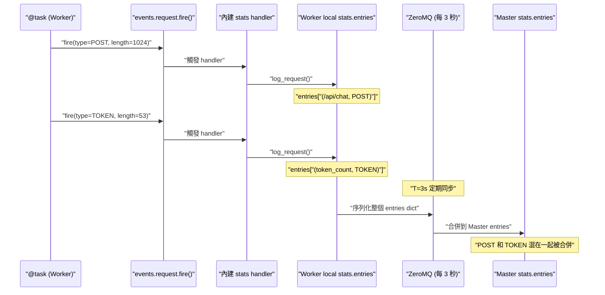
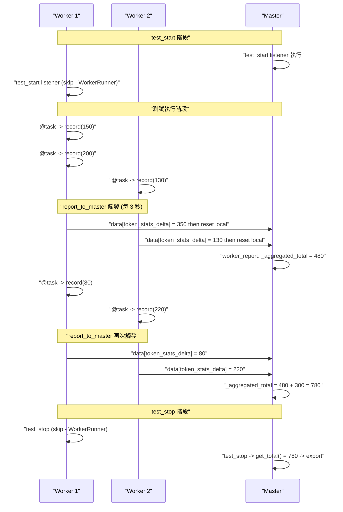

# Locust 自定義指標跨進程聚合: 虛擬 Stats Entry 到 report_to_master

> Updated: 2026-02-27 10:42


## 目錄
- [Locust 自定義指標跨進程聚合: 虛擬 Stats Entry 到 report\_to\_master](#locust-自定義指標跨進程聚合-虛擬-stats-entry-到-report_to_master)
  - [目錄](#目錄)
  - [1. 虛擬 Stats Entry 方案](#1-虛擬-stats-entry-方案)
    - [1.1. 核心概念](#11-核心概念)
    - [1.2. Stats Entry Key 結構](#12-stats-entry-key-結構)
    - [1.3. environment.stats.entries 的詳細結構](#13-environmentstatsentries-的詳細結構)
    - [1.4. 為什麼選用 response\_length](#14-為什麼選用-response_length)
    - [1.5. TokenStats 模組實作](#15-tokenstats-模組實作)
    - [1.6. 資料流: 從 fire() 到 Master 聚合](#16-資料流-從-fire-到-master-聚合)
    - [1.7. 為什麼不需要自己管 Lock](#17-為什麼不需要自己管-lock)
  - [2. 虛擬 Stats Entry 的致命缺陷: Aggregated 統計污染](#2-虛擬-stats-entry-的致命缺陷-aggregated-統計污染)
    - [2.1. 污染現象與數值影響](#21-污染現象與數值影響)
    - [2.2. remove\_from\_console 無法根治的原因](#22-remove_from_console-無法根治的原因)
  - [3. report\_to\_master 自定義聚合方案](#3-report_to_master-自定義聚合方案)
    - [3.1. 核心概念與事件機制](#31-核心概念與事件機制)
    - [3.2. 數據流時序: Delta 增量同步](#32-數據流時序-delta-增量同步)
    - [3.3. TokenStats 完整模組實作](#33-tokenstats-完整模組實作)
    - [3.4. locustfile 整合方式](#34-locustfile-整合方式)
    - [3.5. 完整資料流: 從啟動到輸出報告](#35-完整資料流-從啟動到輸出報告)
  - [4. report\_to\_master 方案的 Lock 分析](#4-report_to_master-方案的-lock-分析)
    - [4.1. record() 的 += 是純 CPU -- 理論上不需要 Lock](#41-record-的--是純-cpu----理論上不需要-lock)
    - [4.2. \_local\_lock: 防禦性編程](#42-_local_lock-防禦性編程)
    - [4.3. \_aggregated\_lock: 防禦 fire() 遍歷 listeners 的切換風險](#43-_aggregated_lock-防禦-fire-遍歷-listeners-的切換風險)
  - [5. 關鍵設計決策](#5-關鍵設計決策)
    - [5.1. 為什麼發送 Delta 而非累計總數](#51-為什麼發送-delta-而非累計總數)
    - [5.2. report\_to\_master 與 worker\_report 的觸發時序](#52-report_to_master-與-worker_report-的觸發時序)
    - [5.3. Runner 類型判斷與單多進程相容](#53-runner-類型判斷與單多進程相容)
  - [6. 兩種方案全面比較](#6-兩種方案全面比較)
    - [6.1. 功能與正確性對比](#61-功能與正確性對比)
    - [6.2. Console 輸出對比](#62-console-輸出對比)
  - [7. 進階注意事項與 Pitfalls](#7-進階注意事項與-pitfalls)
    - [7.1. ZeroMQ 同步延遲](#71-zeromq-同步延遲)
    - [7.2. total\_content\_length 只支援整數](#72-total_content_length-只支援整數)
    - [7.3. 多指標擴展 Pattern](#73-多指標擴展-pattern)

## 1. 虛擬 Stats Entry 方案

前置知識: 本篇假設你已理解 Locust Event System 的運作機制（`fire()` vs `log_request()`、Multi-Process 事件鏈路、ZeroMQ 同步整個 `stats.entries` dict）。如果尚未閱讀，請先參考 "Locust Event System: 事件鏈路與統計同步機制"。

### 1.1. 核心概念

既然 Locust 會自動同步 `events.request.fire()` 的數據，就借用這個機制: 創建一個**虛擬的請求類型**，把自定義指標塞進 `response_length` 欄位，讓 Locust 幫你做跨 process 匯總:

```python
events.request.fire(
    request_type="TOKEN",        # 自定義類型
    name="token_count",          # stats entry 名稱
    response_time=0,             # 不影響 latency 統計
    response_length=token_count, # 關鍵: 用此欄位記錄 token 數
    exception=None,
    context={},
)
```

### 1.2. Stats Entry Key 結構

Locust 使用 `(name, method)` tuple 作為 stats entry 的唯一 key。注意 `request_type` 對應 tuple 的**第二個**元素 (method):

```python
events.request.fire(
    request_type="TOKEN",   # -> tuple 第二個元素 (method)
    name="token_count",     # -> tuple 第一個元素 (name)
    ...
)
# Locust 創建的 key = ("token_count", "TOKEN")
```

正確: `STATS_KEY = ("token_count", "TOKEN")`。錯誤: `STATS_KEY = "token_count"`。

### 1.3. environment.stats.entries 的詳細結構

`environment.stats.entries` 是一個特殊的字典 (EntriesDict)，Key 是 `(name, method)` tuple，Value 是 `StatsEntry` 物件:

```python
environment.stats.entries = {
    ("/api/chat", "POST"): StatsEntry(
        name="/api/chat",
        method="POST",
        num_requests=100,
        total_content_length=5000,
    ),
    ("token_count", "TOKEN"): StatsEntry(
        name="token_count",
        method="TOKEN",
        total_content_length=530,
    ),
}
```

三種存取方式:

```python
# 1. keys() - 獲得 tuple keys
for key in environment.stats.entries.keys():
    print(key)       # ("/api/chat", "POST") - tuple

# 2. values() - 獲得 StatsEntry 物件
for stats in environment.stats.entries.values():
    print(stats.name)    # "/api/chat" - string 屬性

# 3. 常用: values() 搭配 generator 查找特定 entry
chat_api_stats = next(
    (s for s in environment.stats.entries.values() if "/api/chat" in s.name),
    None,
)
```

### 1.4. 為什麼選用 response_length

Locust 的 `StatsEntry` 會自動匯總的屬性中，`total_content_length`（由 `response_length` 累加而成）最適合承載自定義數值:

| StatsEntry 屬性 | 說明 | 適用性 |
|------|------|------|
| `num_requests` | 請求次數 - 自動 +1 | 已被真實 API 統計占用 |
| `total_response_time` | 累加所有 response_time | 會影響 latency 統計 |
| `total_content_length` | 累加所有 response_length | 適合承載自定義數值 |

### 1.5. TokenStats 模組實作

```python
"""Token statistics module - 虛擬 Stats Entry 方案。"""

from locust import events
from locust.env import Environment


class TokenStats:
    STATS_KEY = ("token_count", "TOKEN")

    @staticmethod
    def record(token_count: int) -> None:
        events.request.fire(
            request_type="TOKEN",
            name="token_count",
            response_time=0,
            response_length=token_count,
            exception=None,
            context={},
        )

    @staticmethod
    def get_total(environment: Environment) -> int:
        stats = environment.stats.entries.get(TokenStats.STATS_KEY)
        return stats.total_content_length if stats else 0

    @staticmethod
    def get_average(environment: Environment) -> float:
        total_tokens = TokenStats.get_total(environment)
        chat_api_stats = next(
            (s for s in environment.stats.entries.values()
             if "/api/chat" in s.name),
            None,
        )
        total_requests = chat_api_stats.num_requests if chat_api_stats else 0
        return total_tokens / total_requests if total_requests > 0 else 0.0

    @staticmethod
    def remove_from_console(environment: Environment) -> None:
        if TokenStats.STATS_KEY in environment.stats.entries:
            del environment.stats.entries[TokenStats.STATS_KEY]
```

設計重點: `get_average()` 從真實 API 的 `num_requests` 取得分母，而非用 TOKEN entry 自己的 `num_requests`。`fire()` 優於 `log_request()` 的原因: `log_request()` 直接寫入 local stats 不經過事件系統，Multi-process 下 Master 無法聚合。

### 1.6. 資料流: 從 fire() 到 Master 聚合



ZeroMQ 同步的是**整個 `stats.entries` dict**，不區分哪些是真實 HTTP 請求、哪些是虛擬 entry。`(token_count, TOKEN)` 跟 `(/api/chat, POST)` 一起被搬到 Master。

### 1.7. 為什麼不需要自己管 Lock

虛擬 Stats Entry 方案完全走 Locust 內建路徑: `fire()` -> 內建 handler -> `log_request()`。`log_request()` 裡面的 `+=` 是純 CPU 操作，gevent 協作式排程不會在純 CPU 期間切換協程，所以不會有 race condition。不需要額外的 Lock，並發安全完全由 gevent 的排程特性保證。

## 2. 虛擬 Stats Entry 的致命缺陷: Aggregated 統計污染

### 2.1. 污染現象與數值影響

虛擬 Stats Entry 方案成功實現了跨 Worker 聚合，但產生了嚴重的副作用: Locust Console 統計表底部的 "Aggregated" 行會合併**所有** stats entries，虛擬 TOKEN entry 導致多項統計數值被嚴重扭曲。

Console 輸出:

```text
Type    Name            # reqs    50%    90%    ...
POST    /api/chat       22,122    2.5s   3.8s   ...
TOKEN   token_count     22,122    0ms    0ms    ...
        Aggregated      44,244    1.25s  1.9s   ...
```

| 統計項目 | 真實值 | 被污染後的值 | 影響原因 |
|------|------|------|------|
| num_requests | 22,122 | 44,244 (翻倍) | TOKEN 的 fire() 也被計為一次 request |
| Avg Latency | 2.5s | 1.25s (腰斬) | TOKEN 的 response_time=0 拉低平均值 |
| Min Latency | 800ms | 0ms | TOKEN entry 成為最小值 |
| RPS | 正確值 | 翻倍 | 多計了虛擬 request |

具體計算: 真實 API 有 10 個請求，平均 latency 1234ms。TOKEN entry 也產生 10 個虛擬 request（response_time=0），Aggregated 平均值 = `(1234 * 10 + 0 * 10) / 20 = 617ms`，被拉低一半。

### 2.2. remove_from_console 無法根治的原因

在 `test_stop` 時刪除 TOKEN entry 只能清理最終報告。測試過程中 Master 每 2 秒印一次統計表，Aggregated 始終被污染。

如果改在 `stats_printer` 事件中每次印之前刪除，後續 Worker 回報數據時 Locust 會重新建立 TOKEN entry，但累計值已被清空。反覆 "刪除 -> 重建" 的循環會導致 `test_stop` 時讀到的 token 數據不完整。

這個根本性的缺陷催生了 report_to_master 方案。

## 3. report_to_master 自定義聚合方案

### 3.1. 核心概念與事件機制

此方案完全繞過 Locust 的內建 `stats.entries`，改用 Locust 提供的自定義數據聚合機制: `report_to_master` 和 `worker_report` 兩個事件。Token 數據存在獨立的 class variable 中，透過 Worker-Master 定期通訊的 `data` dict 傳輸，完全與內建統計解耦。

| 事件 | 觸發時機 | 執行位置 | 用途 |
|------|------|------|------|
| `report_to_master` | Worker 準備發送報告給 Master 時（每 3 秒） | Worker process | 將自定義數據附加到 `data` dict |
| `worker_report` | Master 接收到 Worker 報告時 | Master process | 讀取並聚合 Worker 發送的數據 |

核心差異: 虛擬 Stats Entry 把 token 數據塞進 `env.stats.entries`（與內建統計共用同一個數據池），report_to_master 把 token 數據存在獨立的 class variable 中，完全不碰 `stats.entries`。

### 3.2. 數據流時序: Delta 增量同步

每次 `report_to_master` 觸發時，Worker 發送的是自上次報告以來的**增量 (delta)**，發送後立即重置本地計數器:

| 時間 | Worker 動作 | _local_total | 發送給 Master | Master _aggregated_total |
|------|------|------|------|------|
| t=0s | record(50) | 50 | - | 0 |
| t=1s | record(60) | 110 | - | 0 |
| t=2s | record(40) | 150 | - | 0 |
| t=3s | report_to_master 觸發 | 0 (重置) | delta=150 | 150 |
| t=4s | record(80) | 80 | - | 150 |
| t=6s | report_to_master 觸發 | 0 (重置) | delta=80 | 230 |

### 3.3. TokenStats 完整模組實作

```python
"""Token statistics module - report_to_master 自定義聚合方案。"""

import math
from threading import Lock
from locust import events
from locust.env import Environment


class TokenStats:
    # Worker 本地計數器（每個 worker process 獨立）
    _local_total: int = 0
    _local_lock = Lock()

    # Master 聚合計數器
    _aggregated_total: int = 0
    _aggregated_lock = Lock()

    @staticmethod
    def record(token_count: int | float) -> None:
        if not isinstance(token_count, (int, float)) or isinstance(
            token_count, bool
        ):
            raise TypeError(
                f"token_count must be int or float, got {type(token_count).__name__}"
            )
        if not math.isfinite(token_count):
            raise ValueError(f"token_count must be finite, got {token_count}")
        if token_count < 0:
            raise ValueError(f"token_count must be >= 0, got {token_count}")

        with TokenStats._local_lock:
            TokenStats._local_total += int(token_count)

    @staticmethod
    def _get_local_delta_and_reset() -> int:
        with TokenStats._local_lock:
            delta = TokenStats._local_total
            TokenStats._local_total = 0
            return delta

    @staticmethod
    def _add_to_aggregated(delta: int) -> None:
        with TokenStats._aggregated_lock:
            TokenStats._aggregated_total += delta

    @staticmethod
    def get_total(environment: Environment) -> int:
        from locust.runners import MasterRunner, LocalRunner

        if isinstance(environment.runner, MasterRunner):
            with TokenStats._aggregated_lock:
                return TokenStats._aggregated_total
        elif isinstance(environment.runner, LocalRunner):
            with TokenStats._local_lock:
                return TokenStats._local_total
        else:
            with TokenStats._local_lock:
                return TokenStats._local_total

    @staticmethod
    def get_request_count(
        environment: Environment, endpoint_name: str = "/api/chat"
    ) -> int:
        api_stats = next(
            (s for s in environment.stats.entries.values()
             if s.name == endpoint_name),
            None,
        )
        return api_stats.num_requests if api_stats else 0

    @staticmethod
    def get_average(
        environment: Environment, endpoint_name: str = "/api/chat"
    ) -> float:
        total_tokens = TokenStats.get_total(environment)
        total_requests = TokenStats.get_request_count(
            environment, endpoint_name
        )
        return total_tokens / total_requests if total_requests > 0 else 0.0

    @staticmethod
    def reset() -> None:
        with TokenStats._local_lock:
            TokenStats._local_total = 0
        with TokenStats._aggregated_lock:
            TokenStats._aggregated_total = 0


# === Event Listeners (模組載入時自動註冊) ===

@events.report_to_master.add_listener
def _on_report_to_master(client_id, data):
    """Worker -> Master: 發送累積的 token 增量。"""
    delta = TokenStats._get_local_delta_and_reset()
    data["token_stats_delta"] = delta


@events.worker_report.add_listener
def _on_worker_report(client_id, data):
    """Master: 接收並聚合 Worker 的 token 增量。"""
    delta = data.get("token_stats_delta", 0)
    if delta > 0:
        TokenStats._add_to_aggregated(delta)
```

### 3.4. locustfile 整合方式

```python
from locust import HttpUser, task, events
from locust.runners import WorkerRunner
from token_stats import TokenStats


class MyLoadTestUser(HttpUser):
    @task
    def test_api(self):
        response = self.client.post("/api/chat", json={...})
        if response.status_code == 200:
            message = response.json().get("message", "")
            TokenStats.record(self.token_length(message))


@events.test_stop.add_listener
def export_custom_stats(environment, **kwargs):
    if isinstance(environment.runner, WorkerRunner):
        return

    token_avg = TokenStats.get_average(environment)
    total_tokens = TokenStats.get_total(environment)
    total_requests = TokenStats.get_request_count(environment)

    print("=" * 60)
    print("Token Statistics")
    print(f"  Total Tokens: {total_tokens}")
    print(f"  Total Requests: {total_requests}")
    print(f"  Average Tokens per Request: {token_avg:.2f}")
    print("=" * 60)
```

### 3.5. 完整資料流: 從啟動到輸出報告



## 4. report_to_master 方案的 Lock 分析

### 4.1. record() 的 += 是純 CPU -- 理論上不需要 Lock

`record()` 裡面的核心操作是 `_local_total += int(token_count)`，這是純 CPU 計算。根據 gevent 協作式排程的原則，純 CPU 操作不會被其他協程打斷，所以**理論上 `_local_lock` 不是必要的**。

同理，`_add_to_aggregated()` 裡的 `_aggregated_total += delta` 也是純 CPU，如果只看這一行，gevent 也不會在中間切換。

這跟虛擬 Stats Entry 方案中 Locust 內建的 `log_request()` 不需要 Lock 是同一個道理。

### 4.2. _local_lock: 防禦性編程

既然純 CPU 不會被切換，為什麼還加 Lock？因為我們**掌控不了未來的變更**:

- 如果有人在 `record()` 的呼叫路徑上加了 I/O 操作（例如 logging 到文件），`+=` 前後就可能被切換
- 如果未來 Locust 改用真正的 `threading` 而非 gevent，OS 搶占式排程會隨時中斷純 CPU 操作
- Lock 的效能影響是納秒級，幾乎沒有成本

Locust 內建不加 Lock 是因為它完全掌控自己的程式碼路徑，確定不會有 I/O。我們自己的模組加上是防禦性最佳實踐。

### 4.3. _aggregated_lock: 防禦 fire() 遍歷 listeners 的切換風險

`_aggregated_lock` 保護的場景更微妙。`_add_to_aggregated()` 只在 Master 上被呼叫，但 Master 用 gevent 處理網路 I/O，多個 Worker 報告幾乎同時到達時會並發處理。

問題不在 `+=` 本身（純 CPU，不會被打斷），而在呼叫它的上下文。`events.worker_report.fire()` 會遍歷**所有已註冊的 listeners**:

```python
class EventHook:
    def fire(self, **kwargs):
        for listener in self._listeners:
            listener(**kwargs)   # 如果某個 listener 裡有 I/O，這裡可能切換
```

如果除了我們的 `_on_worker_report` 之外，還有其他 listener（例如 Prometheus exporter）裡面做了 I/O，gevent 可能在遍歷 listener 的過程中切換協程。假設 listener 順序是 `[_on_worker_report, prometheus_export]`:

```
協程 A (Worker 1 報告) 的 fire() 遍歷:
  1. 呼叫 _on_worker_report()
     -> temp_a = _aggregated_total (讀到 0)
     -> += 350
     -> _aggregated_total = 350  ✅ 這三步純 CPU，不會被打斷
  2. 呼叫 prometheus_export()
     -> 裡面有 I/O -> gevent 切換到協程 B

     協程 B (Worker 2 報告) 的 fire() 遍歷:
       1. 呼叫 _on_worker_report()
          -> temp_b = _aggregated_total (讀到 350) ✅ 沒問題
```

上面碰巧沒事。但如果 listener 順序是 `[prometheus_export, _on_worker_report]`:

```
協程 A 的 fire() 遍歷:
  1. 呼叫 prometheus_export() -> I/O -> 切換到協程 B

     協程 B 的 fire() 遍歷:
       1. 呼叫 prometheus_export() -> 完成
       2. 呼叫 _on_worker_report() -> 讀到 0, += 130, 寫回 130

  回到協程 A:
  2. 呼叫 _on_worker_report() -> 讀到 130, += 350, 寫回 480  ✅ 碰巧也沒事
```

這兩種情況碰巧都沒問題，因為我們的 `_on_worker_report` 內部的三步純 CPU 不會被拆開。**但我們無法保證 Locust 內部不會在 `fire()` 的更細粒度層級做協程切換**，也無法保證未來不會有人在 `_on_worker_report` 裡面加 I/O。所以 `_aggregated_lock` 是防禦性的: 確保即使發生切換，讀-加-寫三步也是原子的。

| Lock | 保護對象 | 理論上必要嗎 | 為什麼還是加了 |
|------|------|------|------|
| `_local_lock` | Worker 本地計數器 | 否（純 CPU） | 防未來路徑加 I/O 或改用 threading |
| `_aggregated_lock` | Master 聚合計數器 | 否（純 CPU） | 防 fire() 遍歷 listeners 時的切換風險 |

## 5. 關鍵設計決策

### 5.1. 為什麼發送 Delta 而非累計總數

如果 Worker 每次發送累計總數而不重置，Master 會重複累加:

```python
# 錯誤做法: 發送累計總數
@events.report_to_master.add_listener
def on_report(client_id, data):
    data["token_total"] = TokenStats._local_total  # 不重置
```

Worker 1: t=3s 發送 total=250，t=6s 發送 total=330。Master 累加 250+330=580，但實際只有 330。

正確做法是 `_get_local_delta_and_reset()`: 取出當前累積值並重置為 0，在同一把 Lock 保護下確保原子性。

### 5.2. report_to_master 與 worker_report 的觸發時序

`report_to_master` listener 完成後 Locust 才會序列化送出，`worker_report` 是 Master 收到完整資料後才觸發。這是同一條 pipeline 的兩端，不需要額外的原子性保證:

```python
# Worker 端 (Locust 框架內部)
def send_report():
    data = {}
    events.report_to_master.fire(data=data)  # 1. listener 執行完畢
    zmq_socket.send(serialize(data))          # 2. 才送出

# Master 端 (Locust 框架內部)
def receive_report(raw_message):
    data = deserialize(raw_message)           # 3. 收到完整資料
    events.worker_report.fire(data=data)      # 4. 才觸發 listener
```

步驟 1 和 2 之間沒有協程切換點。Worker 取走 delta 並重置後，新的 `record()` 累加的是下一輪的 delta，會在下一次 3 秒週期送出。

### 5.3. Runner 類型判斷與單多進程相容

`get_total()` 透過 `environment.runner` 類型自動判斷讀哪個計數器:

```python
if isinstance(environment.runner, MasterRunner):
    return TokenStats._aggregated_total    # 多進程: 讀聚合值
elif isinstance(environment.runner, LocalRunner):
    return TokenStats._local_total         # 單進程: 讀本地值
```

單進程模式下 `report_to_master` / `worker_report` 不會觸發，數據留在 `_local_total`。多進程下 Worker 的 `_local_total` 定期清空，Master 數據在 `_aggregated_total`。同一份程式碼兩種模式都能正確運作。

## 6. 兩種方案全面比較

### 6.1. 功能與正確性對比

| 面向 | 虛擬 Stats Entry | report_to_master 自定義聚合 |
|------|------|------|
| 聚合方式 | 借用 Locust 內建 request 統計機制 | 自定義 Worker-Master 通訊 |
| 影響 Aggregated | 導致 requests 翻倍、latency/RPS 全錯 | 完全獨立，不影響任何內建統計 |
| 程式碼複雜度 | 約 30 行 | 約 80 行 |
| 正確性 | 數據正確但報告被污染 | 正確且無副作用 |
| 單/多進程支援 | 均支援 | 均支援（透過 Runner 類型判斷） |
| Lock 管理 | 不需要（走內建路徑） | 自行管理兩把 Lock（防禦性） |
| Input Validation | 無 | 型別、有限值、非負檢查 |
| 清理需求 | 需要 remove_from_console() | 不需要任何清理 |

### 6.2. Console 輸出對比

**虛擬 Stats Entry（Aggregated 被污染）:**

```text
Type    Name            # reqs    50%    90%    ...
POST    /api/chat       22,122    2.5s   3.8s   ...
TOKEN   token_count     22,122    0ms    0ms    ...
        Aggregated      44,244    1.25s  1.9s   ...
```

**report_to_master（完全正確）:**

```text
Type    Name            # reqs    50%    90%    ...
POST    /api/chat       22,122    2.5s   3.8s   ...
        Aggregated      22,122    2.5s   3.8s   ...

============================================================
Token Statistics
  Total Tokens: 10,771,240
  Total Requests: 22,122
  Average Tokens per Request: 487.30
============================================================
```

## 7. 進階注意事項與 Pitfalls

### 7.1. ZeroMQ 同步延遲

Worker 的數據約每 3 秒透過 ZeroMQ 同步到 Master。如果測試時間很短（例如 5 秒），最後一批 Worker 的數據可能還沒完全同步就結束了。短時間測試的結果應視為近似值。此限制同時影響兩種方案。

需注意的是，`stats.entries`（request 總數）和 `report_to_master`（token delta）走的是**同一個 3 秒週期**的 ZeroMQ 報告，所以兩者的延遲是同步的，算出來的平均值（total_tokens / num_requests）比例仍然大致正確。

### 7.2. total_content_length 只支援整數

此限制僅影響虛擬 Stats Entry 方案。`response_length` 在 Locust 內部會被轉為 int。如果需要記錄浮點數指標（例如 cost per token 為 0.003），需要先乘以倍數再在讀取時除回來。report_to_master 方案自行管理數據，可以直接處理浮點數。

### 7.3. 多指標擴展 Pattern

**虛擬 Stats Entry 擴展:** 為每個指標建立獨立的虛擬 entry，但每多一個指標就多一份污染:

```python
events.request.fire(request_type="INPUT_TOKEN", name="input_tokens", ...)
events.request.fire(request_type="OUTPUT_TOKEN", name="output_tokens", ...)
```

**report_to_master 擴展:** 在同一個 `data` dict 附加多個 key，無論多少指標都不會污染 Aggregated:

```python
@events.report_to_master.add_listener
def _on_report_to_master(client_id, data):
    data["input_token_delta"] = InputTokenStats._get_local_delta_and_reset()
    data["output_token_delta"] = OutputTokenStats._get_local_delta_and_reset()
```