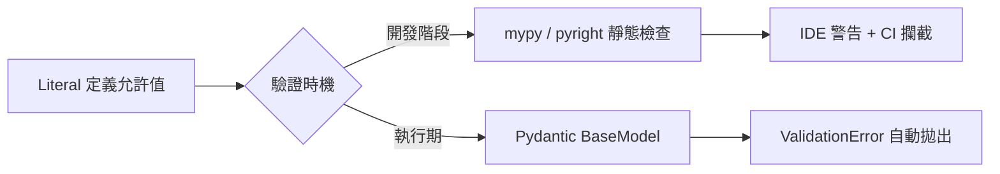

# Python 型別安全實踐: Literal / TypeAlias / Pydantic 執行期驗證

> Updated: 2026-02-24 01:01


## 目錄
- [Python 型別安全實踐: Literal / TypeAlias / Pydantic 執行期驗證](#python-型別安全實踐-literal--typealias--pydantic-執行期驗證)
  - [目錄](#目錄)
  - [1. Literal 型別約束](#1-literal-型別約束)
    - [1.1. 定義與用途](#11-定義與用途)
    - [1.2. 基本語法與範例](#12-基本語法與範例)
    - [1.3. 執行期行為: 不會報錯](#13-執行期行為-不會報錯)
  - [2. TypeAlias 與 type 關鍵字](#2-typealias-與-type-關鍵字)
    - [2.1. TypeAlias 的作用與必要性](#21-typealias-的作用與必要性)
    - [2.2. Python 3.12+ type 語句](#22-python-312-type-語句)
    - [2.3. 三種寫法對比](#23-三種寫法對比)
  - [3. 靜態檢查: mypy](#3-靜態檢查-mypy)
  - [4. 執行期驗證: Pydantic](#4-執行期驗證-pydantic)
    - [4.1. Pydantic 核心概念](#41-pydantic-核心概念)
    - [4.2. Pydantic 搭配 Literal 驗證](#42-pydantic-搭配-literal-驗證)
    - [4.3. 實戰場景範例](#43-實戰場景範例)
  - [5. 型別安全驗證策略總覽](#5-型別安全驗證策略總覽)

---

## 1. Literal 型別約束

### 1.1. 定義與用途

`Literal` 是 Python `typing` 模組提供的型別提示，用來將變數的允許值限定為特定的字面量集合。當一個變數只應該接受固定的幾個值時，`Literal` 比單純標註 `str` 或 `int` 更精確，能讓靜態型別檢查器在開發階段就抓出不合法的傳入值。

適用場景包含: 狀態碼、優先級、排序方向、環境名稱等所有"有限選項"的參數。

### 1.2. 基本語法與範例

```python
from typing import Literal

# 限定字串值
Direction = Literal["north", "south", "east", "west"]

# 限定整數值
HttpStatus = Literal[200, 301, 404, 500]

# 直接用在函式簽名
def move(direction: Literal["north", "south", "east", "west"]) -> None:
    print(f"移動方向: {direction}")
```

與單純 `str` 標註的差異在於: `str` 允許任意字串通過型別檢查，而 `Literal` 會將允許範圍收窄到指定的值。

```python
# str 標註 — 任何字串都合法，檢查器不會擋
def move(direction: str) -> None: ...
move("up")  # 不報錯，但邏輯上是無效值

# Literal 標註 — 只接受指定值
def move(direction: Literal["north", "south", "east", "west"]) -> None: ...
move("up")  # mypy / pyright 報錯
```

### 1.3. 執行期行為: 不會報錯

`Literal` 純粹是型別提示，Python runtime 完全忽略它。無論使用 `Literal`、`TypeAlias` 還是 `type`，傳入不在範圍內的值時程式都會正常執行，不會拋出任何錯誤。

```python
from typing import Literal, TypeAlias

def func1(level: Literal["high", "medium", "low"]) -> None:
    print(f"func1: {level}")

PriorityType: TypeAlias = Literal["high", "medium", "low"]
def func2(level: PriorityType) -> None:
    print(f"func2: {level}")

# Python 3.12+
type Priority = Literal["high", "medium", "low"]
def func3(level: Priority) -> None:
    print(f"func3: {level}")

func1("urgent")  # 輸出: func1: urgent
func2("urgent")  # 輸出: func2: urgent
func3("urgent")  # 輸出: func3: urgent
```

三個函式都正常印出 `urgent`，零報錯。這代表 `Literal` 本身無法在執行期保護你的程式，需要搭配靜態檢查工具或 Pydantic 才能真正攔截非法值。

---

## 2. TypeAlias 與 type 關鍵字

### 2.1. TypeAlias 的作用與必要性

`TypeAlias` 為型別定義建立別名，解決兩個問題: 避免重複撰寫冗長的型別定義，以及明確告知型別檢查器"這是型別別名而非普通變數賦值"。

```python
from typing import Literal, TypeAlias

# 沒有 TypeAlias — 每次都要重複完整定義
def log(message: str, level: Literal["debug", "info", "warning", "error"]) -> None: ...
def filter_logs(level: Literal["debug", "info", "warning", "error"]) -> list: ...

# 有 TypeAlias — 定義一次，到處引用
LogLevel: TypeAlias = Literal["debug", "info", "warning", "error"]
def log(message: str, level: LogLevel) -> None: ...
def filter_logs(level: LogLevel) -> list: ...
```

直接賦值 `PriorityType = Literal["high", "medium", "low"]` 在多數簡單情況下也能運作，但型別檢查器可能將其視為"一個普通變數，值恰好是型別"。在涉及泛型、forward reference 或跨模組匯出等邊界場景時，可能產生誤判或警告。加上 `TypeAlias` 標註可消除這類歧義。

### 2.2. Python 3.12+ type 語句

Python 3.12 引入了 `type` 語句作為內建語法關鍵字，功能等同於 `TypeAlias`，但不需要從 `typing` 模組 import。

```python
# Python 3.10-3.11: 需要 import TypeAlias
from typing import TypeAlias, Literal
LogLevel: TypeAlias = Literal["debug", "info", "warning", "error"]

# Python 3.12+: 內建語法，不需要 import TypeAlias
from typing import Literal
type LogLevel = Literal["debug", "info", "warning", "error"]
```

`type` 語句除了更簡潔，還支援延遲求值(lazy evaluation)，型別定義在被使用時才解析，因此可以自然地做 forward reference，不需要用字串包裹。

```python
# 3.12+ type — 自動延遲求值，不會報 NameError
type Tree = list[Tree]

# 舊寫法 — 必須用字串避免 NameError
from typing import TypeAlias
Tree: TypeAlias = list["Tree"]
```

### 2.3. 三種寫法對比

| 寫法 | 語法 | 需要 import | 型別檢查器識別 | 延遲求值 |
|---|---|---|---|---|
| 直接賦值 | `X = Literal[...]` | 不需要 TypeAlias | 可能誤判為變數 | 否 |
| TypeAlias | `X: TypeAlias = Literal[...]` | `from typing import TypeAlias` | 明確識別為型別別名 | 否 |
| type 語句 | `type X = Literal[...]` | 不需要 TypeAlias | 明確識別為型別別名 | 是 |

簡單腳本省略 `TypeAlias` 通常沒問題，多人協作或大型專案建議使用 `TypeAlias` 或 `type` 語句。

---

## 3. 靜態檢查: mypy

mypy 是 Python 的靜態型別檢查工具，在不執行程式的情況下分析程式碼，找出型別不一致的問題。當搭配 `Literal` 使用時，mypy 能在開發階段就攔截非法值。

```bash
mypy example.py
# error: Argument 1 to "func1" has incompatible type "str";
#   expected "Literal['high', 'medium', 'low']"
```

mypy 只在開發階段產生警告，不會阻止程式執行。如果需要在執行期真正擋住非法值，需要搭配 Pydantic 或手動驗證。

手動驗證可透過 `typing.get_args` 在 runtime 取得 `Literal` 的允許值:

```python
from typing import Literal, get_args

PriorityType = Literal["high", "medium", "low"]

def set_priority(level: PriorityType) -> None:
    valid = get_args(PriorityType)
    if level not in valid:
        raise ValueError(f"必須是 {valid} 其中之一，收到: {level}")
    print(f"設定: {level}")

set_priority("high")     # 設定: high
set_priority("urgent")   # ValueError
```

但這種手動方式在欄位多時會非常冗長，因此實務上更推薦使用 Pydantic。

---

## 4. 執行期驗證: Pydantic

### 4.1. Pydantic 核心概念

Pydantic 是 Python 生態中最主流的執行期資料驗證框架。核心機制是: 用 Python 型別提示定義資料模型(繼承 `BaseModel`)，在建立物件時自動驗證傳入資料是否符合型別約束。不符合就拋出 `ValidationError`，不需要手寫 `if` 判斷。

安裝方式:

```bash
pip install pydantic
```

Pydantic 額外提供自動型別轉換(coercion)功能，例如字串 `"3"` 傳入 `int` 欄位時會自動轉為整數 `3`。

```python
from pydantic import BaseModel

class Order(BaseModel):
    item: str
    quantity: int

order = Order(item="書", quantity="3")  # "3" 自動轉為 int
print(order.quantity, type(order.quantity))
# 3 <class 'int'>
```

與手動驗證的對比:

```python
# 手動驗證 — 每個欄位都要寫判斷
def create_task(data: dict) -> dict:
    if "name" not in data or not isinstance(data["name"], str):
        raise ValueError("name 必須是字串")
    if data.get("priority") not in ("high", "medium", "low"):
        raise ValueError("priority 無效")
    return data

# Pydantic — 宣告即驗證
class Task(BaseModel):
    name: str
    priority: Literal["high", "medium", "low"]

task = Task(**data)  # 一行搞定
```

### 4.2. Pydantic 搭配 Literal 驗證

`Literal` 負責定義"允許哪些值"，Pydantic 負責在執行期強制執行這個約束。兩者搭配是目前 Python 做資料驗證最乾淨的方式。

```python
from typing import Literal
from pydantic import BaseModel

class Task(BaseModel):
    name: str
    priority: Literal["high", "medium", "low"]

# 合法值
task = Task(name="修 bug", priority="high")
print(task)
# name='修 bug' priority='high'

# 非法值 — 自動拋出 ValidationError
task = Task(name="修 bug", priority="urgent")
# pydantic_core._pydantic_core.ValidationError: 1 validation error for Task
# priority
#   Input should be 'high', 'medium' or 'low'
#   [type=literal_error, input_value='urgent', input_type=str]
```

### 4.3. 實戰場景範例

**場景 1: API 請求 — 限定排序方式**

```python
from typing import Literal
from pydantic import BaseModel

class ProductQuery(BaseModel):
    keyword: str
    sort_by: Literal["price", "rating", "newest"]
    order: Literal["asc", "desc"] = "desc"

q = ProductQuery(keyword="手機", sort_by="price")        # OK
q = ProductQuery(keyword="手機", sort_by="popularity")   # ValidationError
```

**場景 2: 設定檔 — 限定環境與日誌等級**

```python
from typing import Literal
from pydantic_settings import BaseSettings

class AppConfig(BaseSettings):
    env: Literal["dev", "staging", "prod"]
    log_level: Literal["debug", "info", "warning", "error"] = "info"

    class Config:
        env_file = ".env"

# .env 內 ENV=dev   -> OK
# .env 內 ENV=local -> ValidationError
```

**場景 3: LLM 結構化輸出 — 限定情緒分類結果**

```python
from typing import Literal
from pydantic import BaseModel

class SentimentResult(BaseModel):
    text: str
    sentiment: Literal["positive", "negative", "neutral"]
    confidence: float

# LLM 回傳合法 JSON
llm_output = {"text": "這產品太棒了", "sentiment": "positive", "confidence": 0.95}
result = SentimentResult(**llm_output)  # OK

# LLM 回傳非法值
bad_output = {"text": "還好", "sentiment": "mixed", "confidence": 0.5}
result = SentimentResult(**bad_output)  # ValidationError
```

搭配 FastAPI 時，Pydantic 模型直接作為 endpoint 的參數型別，框架會自動處理驗證與錯誤回應:

```python
from typing import Literal
from fastapi import FastAPI
from pydantic import BaseModel

app = FastAPI()

class CreateTaskRequest(BaseModel):
    name: str
    priority: Literal["high", "medium", "low"]

@app.post("/tasks")
def create_task(req: CreateTaskRequest):
    return {"message": f"已建立任務: {req.name}, 優先級: {req.priority}"}

# Client 送出 {"name": "修 bug", "priority": "urgent"}
# FastAPI 自動回傳 HTTP 422 Unprocessable Entity
```

---

## 5. 型別安全驗證策略總覽



| 層級 | 工具 | 驗證時機 | 阻止執行 | 適用場景 |
|---|---|---|---|---|
| 型別提示 | Literal + TypeAlias / type | 無(僅標註) | 否 | 所有場景的基礎標註 |
| 靜態檢查 | mypy / pyright | 開發階段 | 否(僅警告) | CI pipeline / IDE 即時回饋 |
| 執行期驗證 | Pydantic | Runtime | 是(拋出例外) | API 輸入 / 外部資料 / 設定檔 |

最佳實踐是三層同時使用: `Literal` 定義約束、mypy 在開發與 CI 階段靜態攔截、Pydantic 在執行期作為最後防線。

---

> 請下載此 Artifact 並放入本地 /drafts 資料夾，隨後啟動 New Chat。