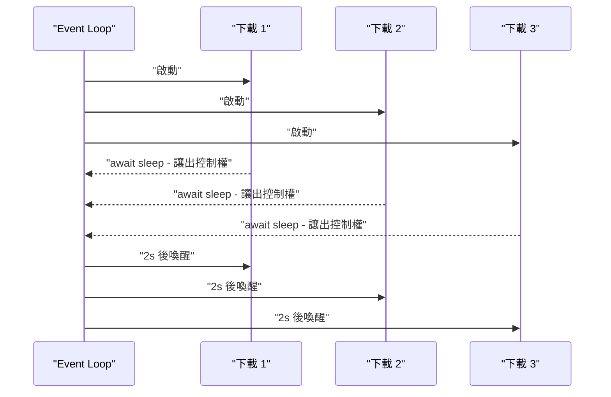
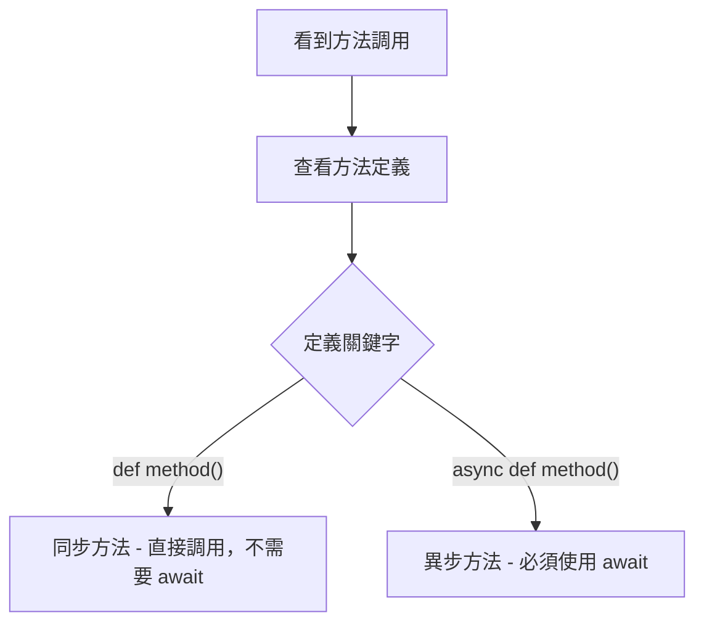
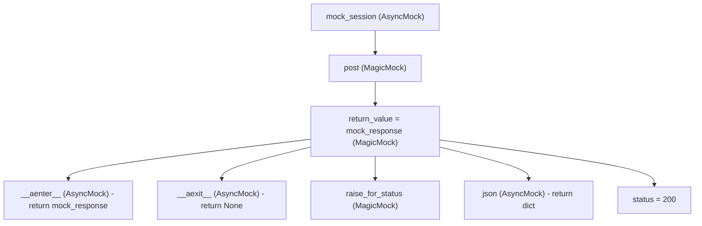
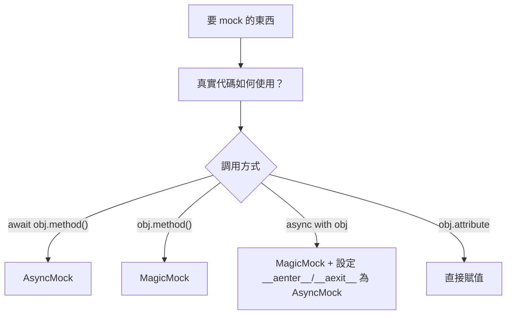
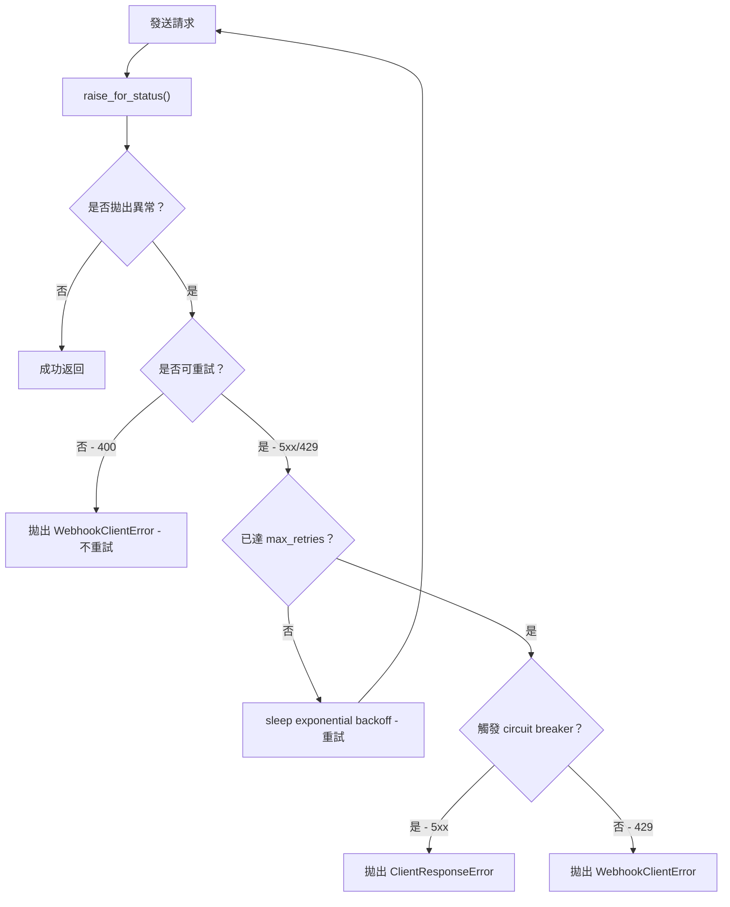

# Python 異步程式設計與 Pytest Mock 測試完全指南

> Updated: 2026-03-10 20:23


## 目錄
- [Python 異步程式設計與 Pytest Mock 測試完全指南](#python-異步程式設計與-pytest-mock-測試完全指南)
  - [目錄](#目錄)
  - [1. 同步與異步基礎](#1-同步與異步基礎)
    - [1.1. 同步（Synchronous）執行模型](#11-同步synchronous執行模型)
    - [1.2. 異步（Asynchronous）執行模型](#12-異步asynchronous執行模型)
    - [1.3. 核心差異對比](#13-核心差異對比)
    - [1.4. 適用場景判斷](#14-適用場景判斷)
  - [2. 物件類型與異步方法](#2-物件類型與異步方法)
    - [2.1. 純同步物件](#21-純同步物件)
    - [2.2. 純異步物件](#22-純異步物件)
    - [2.3. 混合型物件（重點）](#23-混合型物件重點)
    - [2.4. 判斷方法類型的決策流程](#24-判斷方法類型的決策流程)
  - [3. aiohttp 實戰解析](#3-aiohttp-實戰解析)
    - [3.1. ClientSession 與 ClientResponse 的方法類型](#31-clientsession-與-clientresponse-的方法類型)
    - [3.2. 為什麼 raise\_for\_status() 是同步，text() 是異步？](#32-為什麼-raise_for_status-是同步text-是異步)
    - [3.3. 完整 aiohttp 使用範例](#33-完整-aiohttp-使用範例)
  - [4. Pytest Mock 核心概念](#4-pytest-mock-核心概念)
    - [4.1. 為什麼需要 Mock？](#41-為什麼需要-mock)
    - [4.2. MagicMock vs AsyncMock 選擇原則](#42-magicmock-vs-asyncmock-選擇原則)
    - [4.3. return\_value vs side\_effect](#43-return_value-vs-side_effect)
  - [5. Mock 異步上下文管理器](#5-mock-異步上下文管理器)
    - [5.1. 異步上下文管理器原理](#51-異步上下文管理器原理)
    - [5.2. 完整 Mock 結構與設定步驟](#52-完整-mock-結構與設定步驟)
    - [5.3. session.post 兩種 Mock 方式對比](#53-sessionpost-兩種-mock-方式對比)
  - [6. 常見陷阱與決策樹](#6-常見陷阱與決策樹)
    - [6.1. 陷阱：AsyncMock 用於同步方法](#61-陷阱asyncmock-用於同步方法)
    - [6.2. 陷阱：MagicMock 用於異步方法](#62-陷阱magicmock-用於異步方法)
    - [6.3. 陷阱：忘記設定異步上下文管理器](#63-陷阱忘記設定異步上下文管理器)
    - [6.4. Mock 選擇決策樹](#64-mock-選擇決策樹)
  - [7. 完整測試範例：Webhook 重試邏輯](#7-完整測試範例webhook-重試邏輯)
    - [7.1. 被測試函數](#71-被測試函數)
    - [7.2. 測試案例與驗證](#72-測試案例與驗證)
    - [7.3. 執行測試指令](#73-執行測試指令)

---

## 1. 同步與異步基礎

### 1.1. 同步（Synchronous）執行模型

同步執行代表程式在每個操作完成前會完全阻塞（blocking），無法處理其他任務。

```python
import time

def download_file(url):
    print(f"開始下載 {url}")
    time.sleep(2)  # 程式停在此處等待，無法做其他事
    print(f"完成下載 {url}")
    return f"data from {url}"

# 依序執行，總耗時 6 秒
result1 = download_file("http://site1.com")
result2 = download_file("http://site2.com")
result3 = download_file("http://site3.com")
```

執行特徵：一次只能處理一個任務；CPU 在等待 I/O 期間完全閒置；邏輯簡單但效率低。

### 1.2. 異步（Asynchronous）執行模型

異步執行使用 Event Loop 管理多個協程（coroutine），在等待 I/O 時讓出控制權給其他任務，實現並發效果。

```python
import asyncio

async def download_file(url):
    print(f"開始下載 {url}")
    await asyncio.sleep(2)  # 讓出控制權，Event Loop 可調度其他任務
    print(f"完成下載 {url}")
    return f"data from {url}"

async def main():
    # asyncio.gather 並發執行三個協程，總耗時約 2 秒
    results = await asyncio.gather(
        download_file("http://site1.com"),
        download_file("http://site2.com"),
        download_file("http://site3.com"),
    )
    return results

asyncio.run(main())
```

執行流程如下：



### 1.3. 核心差異對比

| 特性 | 同步 (Sync) | 異步 (Async) |
|------|-------------|--------------|
| 函數定義 | `def func()` | `async def func()` |
| 呼叫方式 | `result = func()` | `result = await func()` |
| 返回值 | 直接返回結果 | 返回 coroutine 物件 |
| 等待行為 | 阻塞（blocking） | 非阻塞（non-blocking） |
| 並發能力 | 無法並發 | 可並發執行多任務 |
| 適用場景 | CPU 密集運算 | I/O 密集操作 |

### 1.4. 適用場景判斷

適合異步的場景：HTTP 請求（API 呼叫、webhook）、資料庫查詢、檔案讀寫、任何需要「等待外部資源」的 I/O 操作。

不適合異步的場景：純計算（排序、加密、數學運算）、簡單記憶體操作、單一任務且無並發需求的流程。

---

## 2. 物件類型與異步方法

### 2.1. 純同步物件

所有方法都使用 `def` 定義，呼叫時無需 `await`。

```python
class FileReader:
    def __init__(self, path):
        self.path = path

    def read(self):
        with open(self.path, 'r') as f:
            return f.read()

    def get_size(self):
        import os
        return os.path.getsize(self.path)

reader = FileReader("data.txt")
content = reader.read()    # 不需要 await
size = reader.get_size()   # 不需要 await
```

### 2.2. 純異步物件

所有方法都使用 `async def` 定義，呼叫時必須加上 `await`。

```python
class AsyncFileReader:
    def __init__(self, path):
        self.path = path

    async def read(self):
        import aiofiles
        async with aiofiles.open(self.path, 'r') as f:
            return await f.read()

    async def get_size(self):
        import aiofiles.os
        stat = await aiofiles.os.stat(self.path)
        return stat.st_size

reader = AsyncFileReader("data.txt")
content = await reader.read()    # 必須 await
size = await reader.get_size()   # 必須 await
```

### 2.3. 混合型物件（重點）

同時擁有同步方法（純計算、讀取記憶體屬性）和異步方法（網路 I/O、資料庫操作）。`aiohttp.ClientResponse` 是典型範例。

```python
class MixedObject:
    def __init__(self, value):
        self.value = value

    # 同步方法：讀記憶體，無 I/O
    def get_value(self):
        return self.value

    # 同步方法：純計算，無 I/O
    def validate(self):
        if self.value < 0:
            raise ValueError("Value must be positive")

    # 異步方法：網路請求，有 I/O
    async def fetch_from_api(self):
        import aiohttp
        async with aiohttp.ClientSession() as session:
            async with session.get(f"http://api.com/{self.value}") as resp:
                return await resp.json()

    # 異步方法：資料庫寫入，有 I/O
    async def save_to_db(self):
        await asyncio.sleep(1)
        return "saved"

obj = MixedObject(42)
value = obj.get_value()           # 同步，不需要 await
obj.validate()                    # 同步，不需要 await
data = await obj.fetch_from_api() # 異步，必須 await
result = await obj.save_to_db()   # 異步，必須 await
```

### 2.4. 判斷方法類型的決策流程



---

## 3. aiohttp 實戰解析

### 3.1. ClientSession 與 ClientResponse 的方法類型

`aiohttp.ClientSession` 是純異步物件，所有 HTTP 方法（`get`、`post` 等）和 `close()` 都需要 `await`。

`aiohttp.ClientResponse` 是混合型物件，方法類型取決於操作是否涉及 I/O：

| 方法/屬性 | 類型 | 原因 |
|-----------|------|------|
| `response.status` | 同步屬性 | HTTP header 已載入記憶體 |
| `response.headers` | 同步屬性 | HTTP header 已載入記憶體 |
| `response.url` | 同步屬性 | 記憶體中的請求資訊 |
| `response.raise_for_status()` | 同步方法 | 純計算，讀取已有的 status 值 |
| `await response.text()` | 異步方法 | 需從網路讀取 response body |
| `await response.json()` | 異步方法 | 需從網路讀取並解析 body |
| `await response.read()` | 異步方法 | 需從網路讀取 bytes |

### 3.2. 為什麼 raise_for_status() 是同步，text() 是異步？

`raise_for_status()` 只讀取已存在記憶體中的 `self.status`，進行數值比較後拋出異常，全程無 I/O 操作，因此是同步方法：

```python
# aiohttp 內部實作示意
class ClientResponse:
    def raise_for_status(self):
        if self.status >= 400:  # self.status 已在記憶體中
            raise ClientResponseError(
                request_info=self.request_info,
                history=self.history,
                status=self.status,
            )
```

`text()` 需要從仍在網路連接中的 response body 讀取資料，這是真正的 I/O 操作，因此必須是異步方法：

```python
class ClientResponse:
    async def text(self):
        if self._body is None:
            self._body = await self._read_body()  # 真實的網路 I/O
        return self._body.decode('utf-8')
```

核心原則：判斷一個方法是否需要異步，關鍵在於它是否執行了「需要等待外部資源」的 I/O 操作，而非單純看程式碼複雜度。

### 3.3. 完整 aiohttp 使用範例

```python
import aiohttp
import asyncio

async def fetch_user(user_id):
    async with aiohttp.ClientSession() as session:
        url = f"https://api.example.com/users/{user_id}"

        async with session.get(url) as response:
            # 同步：直接讀取已在記憶體的 status
            if response.status == 404:
                return None

            # 同步：純計算，無 I/O
            response.raise_for_status()

            # 異步：從網路讀取 response body
            data = await response.json()
            return data

user = asyncio.run(fetch_user(123))
```

---

## 4. Pytest Mock 核心概念

### 4.1. 為什麼需要 Mock？

在測試涉及外部 I/O 的函數時，直接發送真實 HTTP 請求會帶來以下問題：速度慢（每次數秒）、依賴外部服務穩定性、難以模擬錯誤情況（503、429 等）、產生不可控的副作用（真實請求被發送）。

Mock 讓測試在完全隔離的環境下執行，可精確控制所有外部依賴的行為：

```python
from unittest.mock import AsyncMock

async def test_send_webhook():
    mock_session = AsyncMock()
    # 完全控制 mock 的行為，不需要真實網路
    mock_session.post.return_value = ...
```

### 4.2. MagicMock vs AsyncMock 選擇原則

選擇依據是真實代碼如何調用這個物件，而非物件本身的名稱：

| 真實代碼的調用方式 | Mock 選擇 | 說明 |
|-------------------|-----------|------|
| `await obj.method()` | `AsyncMock` | 異步方法 |
| `obj.method()` | `MagicMock` | 同步方法 |
| `obj.attribute` | 直接賦值 | 屬性不需要 mock |
| `async with obj` | `MagicMock` + 設定 `__aenter__`/`__aexit__` | 異步上下文管理器 |

MagicMock 基本用法：

```python
from unittest.mock import MagicMock

mock_obj = MagicMock()

# 設定返回值
mock_obj.get_status.return_value = 200
status = mock_obj.get_status()  # 返回 200

# 設定拋出異常
mock_obj.validate.side_effect = ValueError("Error")
mock_obj.validate()  # 拋出 ValueError

# 驗證調用
mock_obj.method(1, 2, key="value")
mock_obj.method.assert_called_once_with(1, 2, key="value")
```

AsyncMock 基本用法：

```python
from unittest.mock import AsyncMock

mock_obj = AsyncMock()

# 設定返回值（需要 await 才能取得）
mock_obj.fetch_data.return_value = {"status": "ok"}
data = await mock_obj.fetch_data()  # 返回 {"status": "ok"}

# 設定拋出異常
mock_obj.connect.side_effect = ConnectionError("Failed")
await mock_obj.connect()  # 拋出 ConnectionError

# 驗證調用（異步方法使用 assert_awaited_once_with）
await mock_obj.method(1, 2)
mock_obj.method.assert_awaited_once_with(1, 2)
```

### 4.3. return_value vs side_effect

`return_value` 設定每次調用時固定返回的值；`side_effect` 設定副作用，可以是異常、函數或序列：

```python
mock = MagicMock()

# return_value：每次都返回同一個值
mock.method.return_value = 42
mock.method()  # 返回 42
mock.method()  # 返回 42

# side_effect 1：拋出異常
mock.method.side_effect = ValueError("Error")
mock.method()  # 拋出 ValueError

# side_effect 2：自訂函數（動態計算返回值）
mock.method.side_effect = lambda x: x * 2
mock.method(21)  # 返回 42

# side_effect 3：序列（每次調用返回不同值，用於測試重試邏輯）
mock.method.side_effect = [1, 2, ValueError("Error")]
mock.method()  # 返回 1
mock.method()  # 返回 2
mock.method()  # 拋出 ValueError
```

---

## 5. Mock 異步上下文管理器

### 5.1. 異步上下文管理器原理

`async with` 語法是以下流程的語法糖：

```python
# 使用
async with session.post(url) as response:
    response.raise_for_status()

# 展開等同於
context_manager = session.post(url)            # 同步返回
response = await context_manager.__aenter__()  # 進入 block
try:
    response.raise_for_status()
finally:
    await context_manager.__aexit__(...)        # 離開 block，釋放連接
```

關鍵點：`session.post()` 本身是同步返回 context manager 物件，但 `__aenter__` 和 `__aexit__` 是異步方法（因為涉及網路連接的建立與釋放）。

### 5.2. 完整 Mock 結構與設定步驟

```python
from unittest.mock import AsyncMock, MagicMock

# Step 1: 創建 mock response（用 MagicMock，因為 response 本身是普通物件）
mock_response = MagicMock()

# Step 2: 設定異步上下文管理器協議
# __aenter__ 是 async def，用 AsyncMock；返回 mock_response 本身（as response 取得的值）
mock_response.__aenter__ = AsyncMock(return_value=mock_response)
# __aexit__ 是 async def，用 AsyncMock；返回 None 表示不壓制異常
mock_response.__aexit__ = AsyncMock(return_value=None)

# Step 3: 設定 response 的各個方法/屬性
mock_response.raise_for_status = MagicMock()                    # 同步方法
mock_response.json = AsyncMock(return_value={"ok": True})       # 異步方法
mock_response.status = 200                                       # 屬性直接賦值

# Step 4: 創建 mock session（用 AsyncMock，因為 session 有異步方法）
mock_session = AsyncMock()

# Step 5: 讓 session.post() 同步返回 mock_response
# 注意：用 MagicMock 而非 AsyncMock，因為真實的 session.post() 不需要 await
mock_session.post = MagicMock(return_value=mock_response)

# 使用
async with mock_session.post(url, json=data) as response:
    response.raise_for_status()           # 呼叫 MagicMock
    result = await response.json()        # await AsyncMock
```

Mock 物件的結構關係如下：



### 5.3. session.post 兩種 Mock 方式對比

這是最容易混淆的設計決策，核心在於是否符合真實的 aiohttp 行為：

```python
mock_client = AsyncMock()

# 方式 1：直接替換（推薦）
mock_client.post = MagicMock(return_value=mock_response)
# mock_client.post 現在是 MagicMock
result = mock_client.post(url)   # 不需要 await，直接得到 mock_response
# 符合真實行為：async with session.post(url) 不需要 await

# 方式 2：設定 return_value（不推薦用於此場景）
mock_client.post.return_value = mock_response
# mock_client.post 仍是 AsyncMock
result = await mock_client.post(url)  # 需要 await 才能得到 mock_response
# 不符合真實行為：真實的 session.post() 不需要 await
```

結論：使用方式 1（`MagicMock(return_value=...)`），因為真實的 `aiohttp.ClientSession.post()` 是同步返回 context manager，不需要 `await`。

---

## 6. 常見陷阱與決策樹

### 6.1. 陷阱：AsyncMock 用於同步方法

```python
error = ClientResponseError(...)

# 錯誤：raise_for_status 是同步方法，用 AsyncMock 會返回 coroutine 而非拋出異常
mock_response.raise_for_status = AsyncMock(side_effect=error)
mock_response.raise_for_status()  # 返回 coroutine，異常不會被拋出！

# 正確：同步方法用 MagicMock
mock_response.raise_for_status = MagicMock(side_effect=error)
mock_response.raise_for_status()  # 立即拋出 ClientResponseError
```

### 6.2. 陷阱：MagicMock 用於異步方法

```python
# 錯誤：session.get() 是異步方法，MagicMock 無法被 await
mock_session = MagicMock()
result = await mock_session.get(url)
# TypeError: object MagicMock can't be used in 'await' expression

# 正確：異步方法用 AsyncMock
mock_session = AsyncMock()
result = await mock_session.get(url)  # 正常執行
```

### 6.3. 陷阱：忘記設定異步上下文管理器

```python
# 錯誤：沒有設定 __aenter__/__aexit__
mock_client.post = MagicMock()
async with mock_client.post(url) as response:
    # TypeError: 'MagicMock' object does not support the asynchronous context manager protocol
    ...

# 正確：完整設定 __aenter__ 和 __aexit__
mock_response = MagicMock()
mock_response.__aenter__ = AsyncMock(return_value=mock_response)
mock_response.__aexit__ = AsyncMock(return_value=None)
mock_client.post = MagicMock(return_value=mock_response)

async with mock_client.post(url) as response:
    # 正常運作
    ...
```

### 6.4. Mock 選擇決策樹



---

## 7. 完整測試範例：Webhook 重試邏輯

### 7.1. 被測試函數

```python
# vlm_worker.py
import aiohttp
from aiohttp import ClientConnectionError, ClientResponseError

async def _send_result_via_hook(client, hook_endpoint, result, msg_id):
    """
    發送結果到 webhook endpoint，包含重試邏輯：
    - 503 錯誤：重試 3 次後拋出 ClientResponseError（觸發 circuit breaker）
    - 429 錯誤：重試 3 次後拋出 WebhookClientError（不觸發 circuit breaker）
    - 400 錯誤：不重試，直接拋出 WebhookClientError
    """
    max_retries = 3

    for attempt in range(1, max_retries + 1):
        try:
            async with client.post(hook_endpoint, json=result) as response:
                response.raise_for_status()
                return  # 成功

        except (ClientConnectionError, ClientResponseError) as e:
            if not _is_retryable(e):
                raise WebhookClientError(f"Non-retryable error: {e}") from e

            if attempt == max_retries:
                if _should_trigger_circuit_breaker(e):
                    raise e  # 5xx 錯誤，觸發 circuit breaker
                else:
                    raise WebhookClientError(f"Exhausted retries: {e}") from e

            await asyncio.sleep(0.5 * (2 ** (attempt - 1)))  # Exponential backoff
```

重試流程如下：



### 7.2. 測試案例與驗證

輔助函數：

```python
from aiohttp import ClientResponseError, RequestInfo
from yarl import URL

def create_client_response_error(url, status, message):
    """輔助函數：創建帶有完整 RequestInfo 的 ClientResponseError"""
    request_info = RequestInfo(
        url=URL(url),
        method="POST",
        headers={},
        real_url=URL(url)
    )
    return ClientResponseError(
        request_info=request_info,
        history=(),
        status=status,
        message=message
    )
```

測試案例 1 - 503 錯誤觸發 Circuit Breaker：

```python
import pytest
from unittest.mock import AsyncMock, MagicMock, patch

@pytest.mark.asyncio
async def test_webhook_503_triggers_circuit_breaker():
    error_503 = create_client_response_error("http://hook.com", 503, "Service Unavailable")

    mock_response = MagicMock()
    mock_response.__aenter__ = AsyncMock(return_value=mock_response)
    mock_response.__aexit__ = AsyncMock(return_value=None)
    mock_response.raise_for_status = MagicMock(side_effect=error_503)

    mock_client = AsyncMock()
    mock_client.post = MagicMock(return_value=mock_response)

    with patch("vlm_worker.sleep", new_callable=AsyncMock):
        with pytest.raises(ClientResponseError) as exc:
            await _send_result_via_hook(mock_client, "http://hook.com", {"data": "test"}, "msg-123")

        assert exc.value.status == 503
    # 執行流程：3 次嘗試，每次拋出 503，最後一次觸發 circuit breaker
```

測試案例 2 - 429 錯誤不觸發 Circuit Breaker：

```python
@pytest.mark.asyncio
async def test_webhook_429_does_not_trigger_circuit_breaker():
    error_429 = create_client_response_error("http://hook.com", 429, "Too Many Requests")

    mock_response = MagicMock()
    mock_response.__aenter__ = AsyncMock(return_value=mock_response)
    mock_response.__aexit__ = AsyncMock(return_value=None)
    mock_response.raise_for_status = MagicMock(side_effect=error_429)

    mock_client = AsyncMock()
    mock_client.post = MagicMock(return_value=mock_response)

    with patch("vlm_worker.sleep", new_callable=AsyncMock):
        with pytest.raises(WebhookClientError):  # 非 ClientResponseError
            await _send_result_via_hook(mock_client, "http://hook.com", {"data": "test"}, "msg-123")
    # 3 次重試後拋出 WebhookClientError，不觸發 circuit breaker
```

測試案例 3 - 400 錯誤不重試：

```python
@pytest.mark.asyncio
async def test_webhook_400_no_retry():
    error_400 = create_client_response_error("http://hook.com", 400, "Bad Request")

    mock_response = MagicMock()
    mock_response.__aenter__ = AsyncMock(return_value=mock_response)
    mock_response.__aexit__ = AsyncMock(return_value=None)
    mock_response.raise_for_status = MagicMock(side_effect=error_400)

    mock_client = AsyncMock()
    mock_client.post = MagicMock(return_value=mock_response)

    with pytest.raises(WebhookClientError):
        await _send_result_via_hook(mock_client, "http://hook.com", {"data": "test"}, "msg-123")

    # 關鍵驗證：400 是不可重試錯誤，post 只被調用 1 次
    assert mock_client.post.call_count == 1
```

測試案例 4 - 成功情況：

```python
@pytest.mark.asyncio
async def test_webhook_success():
    mock_response = MagicMock()
    mock_response.__aenter__ = AsyncMock(return_value=mock_response)
    mock_response.__aexit__ = AsyncMock(return_value=None)
    mock_response.raise_for_status = MagicMock()  # 不拋出異常
    mock_response.status = 200

    mock_client = AsyncMock()
    mock_client.post = MagicMock(return_value=mock_response)

    await _send_result_via_hook(mock_client, "http://hook.com", {"data": "test"}, "msg-123")

    # 驗證請求參數與調用次數
    mock_client.post.assert_called_once_with("http://hook.com", json={"data": "test"})
    mock_response.raise_for_status.assert_called_once()
```

### 7.3. 執行測試指令

```bash
# 執行單一測試
pytest tests/test_vlm_worker.py::test_webhook_503_triggers_circuit_breaker -v

# 執行全部測試
pytest tests/test_vlm_worker.py -v

# 執行測試並輸出覆蓋率報告
pytest tests/test_vlm_worker.py --cov=vlm_worker --cov-report=term
```

後續任務：

- 為 `_is_retryable()` 和 `_should_trigger_circuit_breaker()` 補充單元測試
- 使用 `pytest-asyncio` 的 `asyncio_mode = "auto"` 簡化 `@pytest.mark.asyncio` 標記
- 考慮使用 `aioresponses` 套件作為更高層次的 aiohttp mock 方案
- 為重試的 exponential backoff 時間間隔補充邊界條件測試