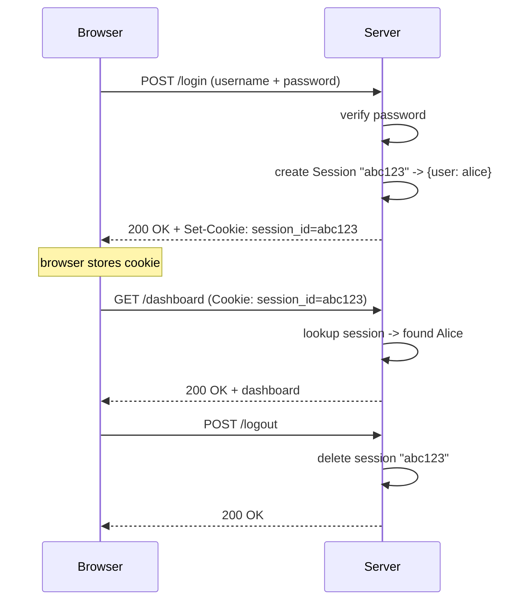
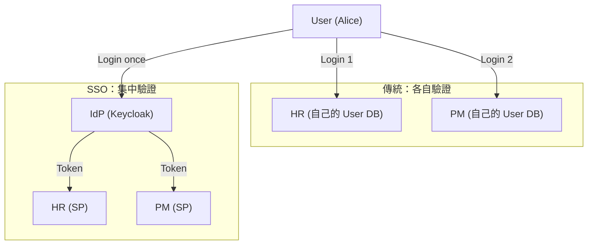
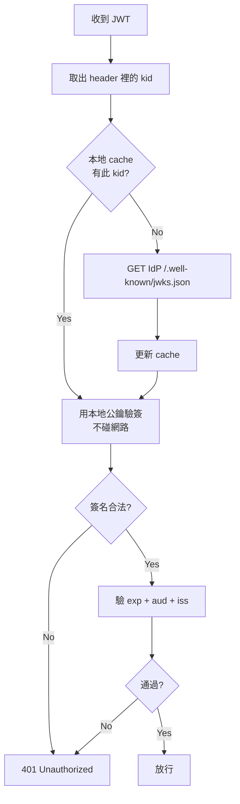
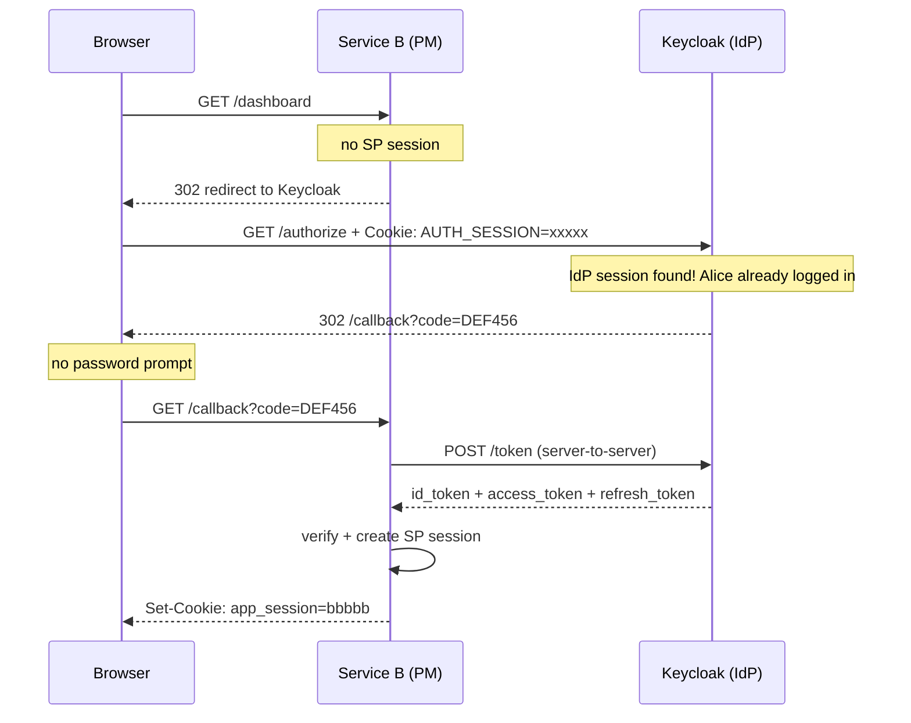
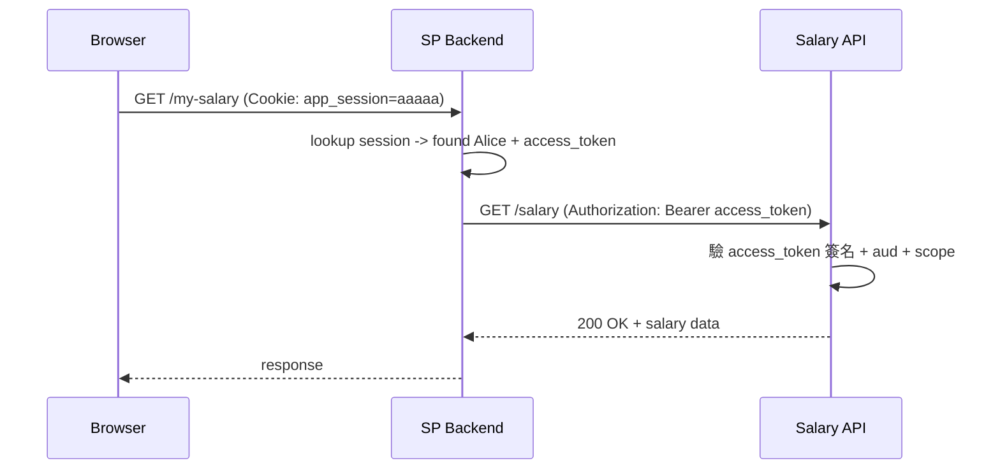
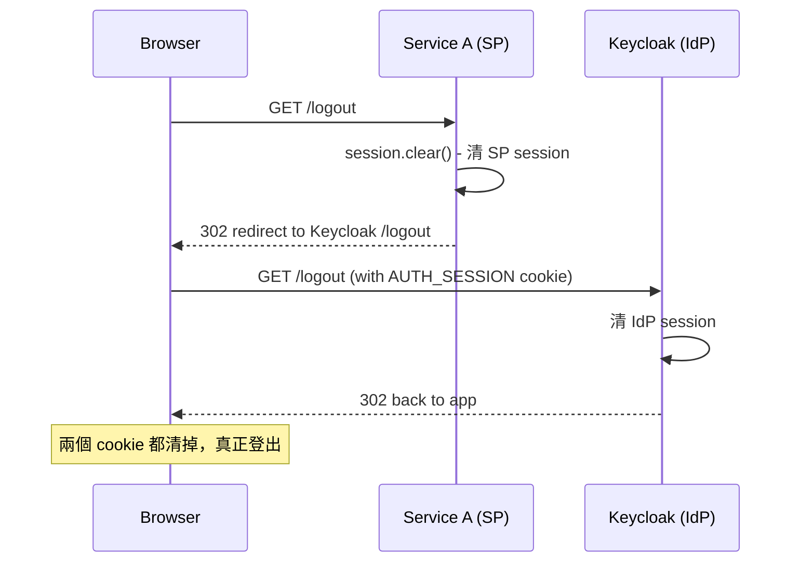
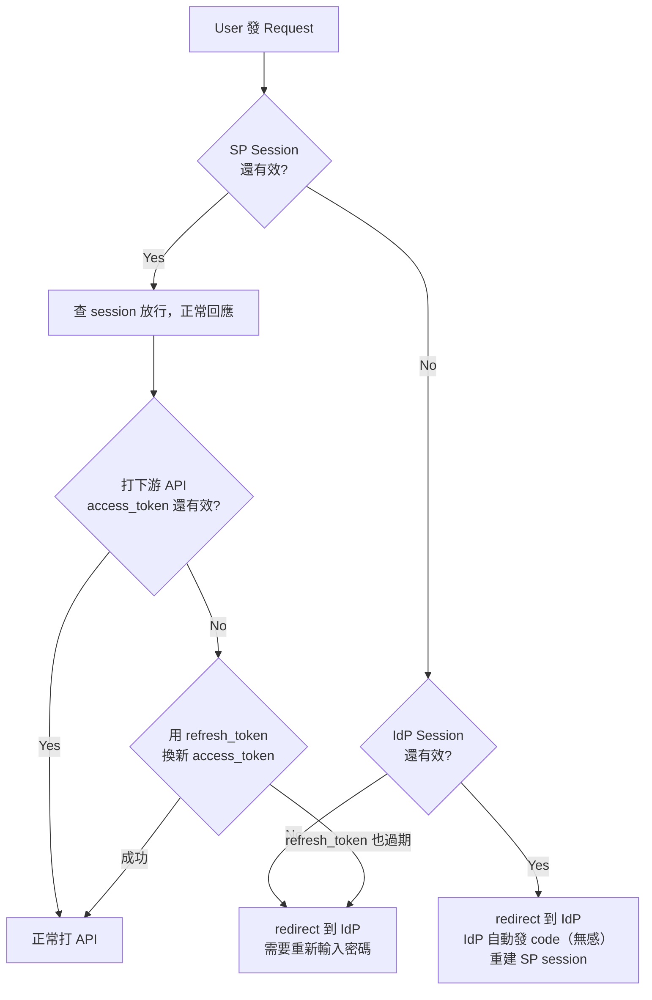
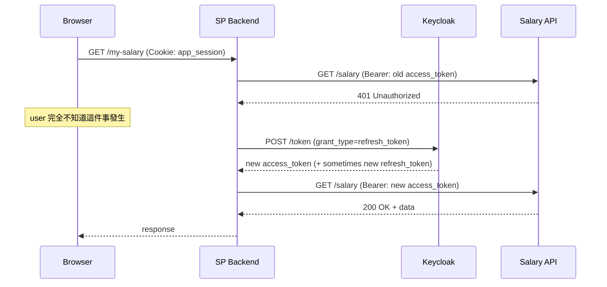
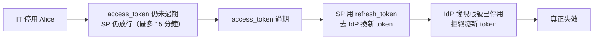
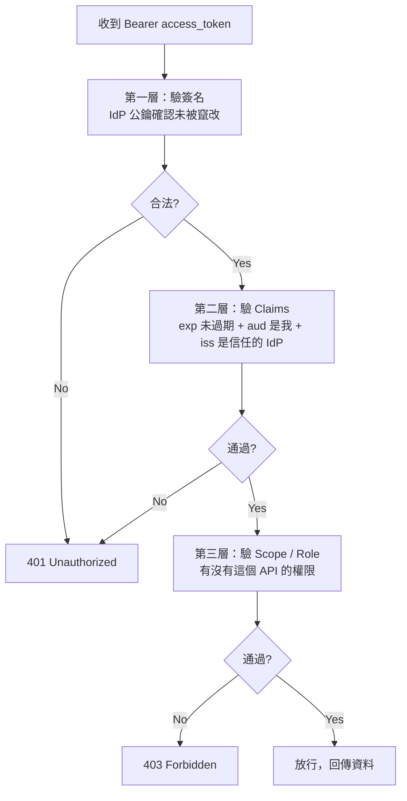

# Web Authentication: Traditional Session vs SSO 完整入門指南

> Updated: 2026-03-20 18:50


## 目錄
- [1. 基礎概念：為什麼需要 Authentication](#1-基礎概念為什麼需要-authentication)
    - [1.1. HTTP 是無狀態的](#11-http-是無狀態的)
    - [1.2. Cookie 是什麼](#12-cookie-是什麼)
    - [1.3. Session 是什麼](#13-session-是什麼)
- [2. 傳統登入：Session-Based Auth](#2-傳統登入session-based-auth)
    - [2.1. 完整流程](#21-完整流程)
    - [2.2. FastAPI 範例](#22-fastapi-範例)
    - [2.3. 痛點](#23-痛點)
- [3. SSO 的誕生](#3-sso-的誕生)
    - [3.1. 核心角色](#31-核心角色)
    - [3.2. 三種 Token 分清楚](#32-三種-token-分清楚)
    - [3.3. JWT 結構與驗簽](#33-jwt-結構與驗簽)
- [4. SSO 完整流程](#4-sso-完整流程)
    - [4.1. 第一次登入](#41-第一次登入)
    - [4.2. 第二個服務登入（SSO 生效）](#42-第二個服務登入sso-生效)
    - [4.3. 用 access_token 打其他 API](#43-用-access_token-打其他-api)
    - [4.4. Logout](#44-logout)
    - [4.5. FastAPI 範例](#45-fastapi-範例)
- [5. 過期處理：各種 Expired 場景](#5-過期處理各種-expired-場景)
    - [5.1. 各層有效期](#51-各層有效期)
    - [5.2. 各種過期場景的處理方式](#52-各種過期場景的處理方式)
    - [5.3. access_token 過期：Refresh 流程](#53-access_token-過期refresh-流程)
    - [5.4. 帳號被強制停用](#54-帳號被強制停用)
- [6. 其他 Service 如何驗證 access_token](#6-其他-service-如何驗證-access_token)
- [7. 傳統登入 vs SSO：怎麼選](#7-傳統登入-vs-sso怎麼選)

---

## 1. 基礎概念：為什麼需要 Authentication

### 1.1. HTTP 是無狀態的

**HTTP 協議本身沒有記憶**。每一個 Request 對 Server 來說都是陌生人，就算你剛剛才登入，下一個 Request 到來 Server 完全不認識你。

```http
GET /dashboard HTTP/1.1
Host: hr.company.com
# Server 看到這個，完全不知道是誰送來的
```

Authentication 要解決的問題：**如何讓 Server 在無狀態的協議上，辨識「這個 Request 是已登入的 Alice 發來的」**。

### 1.2. Cookie 是什麼

Cookie 是存在瀏覽器的純文字 `key=value` 字串，存在 **HTTP Header**，不是 Body。

最重要的特性：**瀏覽器每次發 Request，自動把對應 domain 的 Cookie 放進 Header**，不需要任何程式碼主動處理。

```http
# Server 命令瀏覽器存 Cookie（Response Header）
HTTP/1.1 200 OK
Set-Cookie: session_id=abc123; HttpOnly; Secure; SameSite=Lax

# 瀏覽器之後每次 Request 自動帶上（Request Header）
GET /dashboard HTTP/1.1
Cookie: session_id=abc123
```

重點：**Cookie 只是一個 ID，本身不存任何用戶資料**。

多個 Cookie 共存時，同一行用分號隔開，瀏覽器依據 domain 嚴格隔離，`hr.company.com` 的 Cookie 不會被送到 `pm.company.com`：

```http
Cookie: session_id=abc123; theme=dark; lang=zh-TW
```

### 1.3. Session 是什麼

Session 是存在 **Server 端**的真實用戶資料，以 Cookie 裡的 ID 作為 key。

```
瀏覽器 Cookie:    session_id = "abc123"      (只是 ID)
                        |
                        v
Server Session Store:
  "abc123" -> { user: "alice", role: "admin", expires: "..." }
```

現實類比：Cookie 是號碼牌，Session Store 是廚房的記事本。

---

## 2. 傳統登入：Session-Based Auth

### 2.1. 完整流程



### 2.2. FastAPI 範例

```python
# pip install fastapi uvicorn itsdangerous
from fastapi import FastAPI, Request, HTTPException
from starlette.middleware.sessions import SessionMiddleware
from pydantic import BaseModel

app = FastAPI()
app.add_middleware(SessionMiddleware, secret_key="your-secret-key")

USERS = {"alice": "password123"}

class LoginRequest(BaseModel):
    username: str
    password: str

@app.post("/login")
def login(body: LoginRequest, request: Request):
    if USERS.get(body.username) != body.password:
        raise HTTPException(status_code=401, detail="Invalid credentials")

    # 寫入 server-side session
    request.session["user"] = body.username
    # FastAPI 自動 Set-Cookie: session=<signed_value>
    return {"message": f"Welcome {body.username}"}

@app.get("/dashboard")
def dashboard(request: Request):
    if not request.session.get("user"):
        raise HTTPException(status_code=401, detail="Not logged in")
    return {"user": request.session["user"]}

@app.post("/logout")
def logout(request: Request):
    request.session.clear()  # server 刪除 session
    return {"message": "Logged out"}
```

### 2.3. 痛點

假設公司有 HR、PM、Expense 三個系統：

| 問題 | 說明 |
|---|---|
| 多次登入 | 每個系統各自登入，3 個系統輸入 3 次密碼 |
| 密碼分散 | 每個系統各自存密碼，任一個被攻破都洩漏 |
| 帳號難管理 | 員工離職要去每個系統各自停用，容易漏掉 |
| 維運成本高 | 新增系統要重新開發一套 Auth 邏輯 |

---

## 3. SSO 的誕生

SSO（Single Sign-On）核心思想：引入一個**中心化的 Identity Provider（IdP）**，用戶只向它證明身份一次，所有其他系統信任它的背書。

現實類比：公司大樓門禁卡。刷一次卡進大樓，就能進所有你有權限的房間。

### 3.1. 核心角色

**IdP（Identity Provider）**：身份提供者，負責驗證密碼、管理帳號、簽發 Token。常見實作：Keycloak（自架）、Auth0（SaaS）。

**SP（Service Provider）**：你的 HR、PM 等應用系統。它們不驗密碼，只驗 IdP 簽發的 Token。



### 3.2. 三種 Token 分清楚

IdP 在登入成功後**一次發三個 Token**，全部都是 JWT 格式，全部存在 SP backend，但用途完全不同：

| Token | 用途 | 誰用 | 何時用 |
|---|---|---|---|
| `id_token` | 證明**你是誰**（用戶身份） | SP backend | Login 時讀一次，之後不再用 |
| `access_token` | 證明**你可以做什麼**（API 權限） | SP backend 打其他 API 時帶上 | 每次呼叫下游 API |
| `refresh_token` | 換新的 access_token | SP backend | access_token 過期時 |

```
Keycloak → SP backend：
{
  "id_token":      "eyJ...",   // SP 用來建立 session
  "access_token":  "eyJ...",   // SP 打其他 API 時帶上
  "refresh_token": "eyJ..."    // access_token 過期時換新的
}
```

**id_token 的生命週期**：SP 收到後，讀出用戶資料存進 session，之後 id_token 就功成身退，不再使用，過不過期都無所謂。

**access_token 的生命週期**：SP 存起來，每次代表 Alice 去打其他 API 時帶著，5 ~ 15 分鐘後過期，用 refresh_token 換新的。

### 3.3. JWT 結構與驗簽

JWT 是三段用 `.` 連接的字串，每段都是 base64 編碼：

```json
// Header（演算法 + Key ID）
{
  "alg": "RS256",
  "kid": "key-2024-v2"   // 用哪把 key 簽的
}

// Payload（內容不同取決於是 id_token 還是 access_token）
// id_token 關注用戶身份：
{
  "sub":   "alice@company.com",
  "name":  "Alice Chen",
  "email": "alice@company.com",
  "iss":   "https://auth.company.com",  // 誰簽的
  "aud":   "hr-system",                 // 給誰用（SP 名稱）
  "exp":   1716000000
}

// access_token 關注授權範圍：
{
  "sub":   "alice@company.com",
  "scope": "salary:read profile:read",
  "iss":   "https://auth.company.com",
  "aud":   "salary-api",                // 給誰用（目標 API 名稱）
  "exp":   1716000000
}

// Signature = RS256(header + payload, IdP 私鑰)
```

`aud`（Audience）非常重要：HR 系統的 token，`aud = hr-system`。薪資 API 收到這個 token 必須**拒絕**，因為 aud 不是自己。**Token 不是萬用鑰匙**。

**驗簽流程**：IdP 不需要被詢問，SP 或下游 API 用 IdP 的公鑰自己驗：



---

## 4. SSO 完整流程

### 4.1. 第一次登入

```mermaid
sequenceDiagram
    participant B as Browser
    participant SP as Service A (HR)
    participant K as Keycloak (IdP)

    B->>SP: GET /dashboard
    Note over SP: no SP session
    SP-->>B: 302 redirect to Keycloak + state=XYZ

    B->>K: GET /authorize (no IdP cookie)
    K-->>B: login page

    Note over B: Alice inputs password

    B->>K: POST credentials
    K->>K: verify + create IdP Session
    K-->>B: 302 /callback?code=ABC123
            Set-Cookie: AUTH_SESSION=xxxxx

    Note over B: stores AUTH_SESSION cookie

    B->>SP: GET /callback?code=ABC123
    SP->>K: POST /token (code + client_secret) [server-to-server]
    K-->>SP: id_token + access_token + refresh_token

    SP->>SP: verify id_token (用 IdP 公鑰驗簽)
    SP->>SP: 讀出用戶資料，建立 SP session
    SP->>SP: 存 access_token + refresh_token

    SP-->>B: 302 /dashboard + Set-Cookie: app_session=aaaaa

    B->>SP: GET /dashboard (Cookie: app_session=aaaaa)
    SP->>SP: lookup SP session -> found Alice
    SP-->>B: 200 OK
```

`code` 為什麼不直接換成 token？因為換 token 需要 `client_secret`（SP 向 Keycloak 註冊的密鑰），這個 secret 只能在 server 端使用，不能暴露給瀏覽器。`code` 本身沒有任何價值，被截走也無法使用。

### 4.2. 第二個服務登入（SSO 生效）



瀏覽器帶著 IdP 的 `AUTH_SESSION` cookie 到 Keycloak，Keycloak 認出已登入，直接發 code，用戶不需要重新輸入密碼。這就是 SSO 的核心魔法。

### 4.3. 用 access_token 打其他 API

SP backend 拿著 access_token 代表 Alice 去打下游 API，browser 不知道這件事發生：



```python
# SP backend 打下游 API
import requests

def get_salary(access_token: str):
    response = requests.get(
        "https://salary-api.company.com/salary",
        headers={
            # access_token 放在 Authorization header
            "Authorization": f"Bearer {access_token}"
        }
    )
    return response.json()
```

### 4.4. Logout

Logout 必須清除兩層 Session，只清 SP session 是不夠的。IdP cookie 還在的話，下次點登入會立刻自動登入成功：



### 4.5. FastAPI 範例

```python
# pip install fastapi uvicorn authlib httpx starlette
from fastapi import FastAPI, Request
from fastapi.responses import RedirectResponse
from starlette.middleware.sessions import SessionMiddleware
from authlib.integrations.starlette_client import OAuth

app = FastAPI()
app.add_middleware(SessionMiddleware, secret_key="your-app-secret")
oauth = OAuth()

oauth.register(
    name="keycloak",
    client_id="hr-system",
    client_secret="s3cr3t",
    server_metadata_url=(
        "https://keycloak.company.com/realms/myrealm"
        "/.well-known/openid-configuration"
    ),
    client_kwargs={"scope": "openid profile email"},
)

@app.get("/login")
async def login(request: Request):
    # 把 browser redirect 到 Keycloak 登入頁
    return await oauth.keycloak.authorize_redirect(
        request, "https://hr.company.com/callback"
    )

@app.get("/callback")
async def callback(request: Request):
    # Authlib 自動處理 server-to-server token exchange + JWT 驗簽
    token = await oauth.keycloak.authorize_access_token(request)

    userinfo = token["userinfo"]  # 從 id_token 解出

    # 建立 SP session，存用戶資料 + access_token
    request.session["user"] = {
        "name":  userinfo["name"],
        "email": userinfo["email"],
    }
    request.session["access_token"]  = token["access_token"]
    request.session["refresh_token"] = token["refresh_token"]

    return RedirectResponse("/dashboard")

@app.get("/dashboard")
async def dashboard(request: Request):
    user = request.session.get("user")
    if not user:
        return RedirectResponse("/login")
    return {"message": f"Hello {user['name']}"}

@app.get("/logout")
async def logout(request: Request):
    request.session.clear()  # 清 SP session
    # 通知 Keycloak 也清 IdP session
    return RedirectResponse(
        "https://keycloak.company.com/realms/myrealm"
        "/protocol/openid-connect/logout"
        "?redirect_uri=https://hr.company.com"
    )
```

---

## 5. 過期處理：各種 Expired 場景

### 5.1. 各層有效期

| | 典型有效期 | 過期後 |
|---|---|---|
| access_token (JWT) | 5 ~ 15 分鐘 | 用 refresh_token 換新的 |
| refresh_token | 幾小時 ~ 幾天 | 重新走完整登入流程 |
| SP Session | 30 分鐘 ~ 幾小時 | redirect 到 IdP |
| IdP Session | 8 ~ 24 小時 | 需重新輸入密碼 |
| id_token | 幾分鐘（不重要） | 不需處理，用完就丟 |

### 5.2. 各種過期場景的處理方式



### 5.3. access_token 過期：Refresh 流程



```python
import requests

def call_salary_api(session):
    access_token  = session["access_token"]
    refresh_token = session["refresh_token"]

    response = requests.get(
        "https://salary-api.company.com/salary",
        headers={"Authorization": f"Bearer {access_token}"}
    )

    if response.status_code == 401:
        # access_token 過期，用 refresh_token 換新的
        new_tokens = requests.post(
            "https://keycloak.company.com/realms/myrealm"
            "/protocol/openid-connect/token",
            data={
                "grant_type":    "refresh_token",
                "refresh_token": refresh_token,
                "client_id":     "hr-system",
                "client_secret": "s3cr3t",
            }
        )

        if new_tokens.status_code == 200:
            # 更新 session 裡存的 token，重試
            session["access_token"] = new_tokens.json()["access_token"]
            return call_salary_api(session)
        else:
            # refresh_token 也過期，叫 user 重新登入
            raise Exception("session_expired")

    return response.json()
```

### 5.4. 帳號被強制停用

JWT 是 stateless 的，SP 驗簽只看簽名和 `exp`，**不會即時問 IdP 帳號是否還有效**。所以停用帳號後有一個短暫的失效窗口：



若需要更即時的撤銷，有三種方案：

| 方案 | 失效速度 | 代價 |
|---|---|---|
| 短 exp + refresh_token（預設） | 分鐘級 | 幾乎沒有 |
| Revocation List（黑名單） | 秒 ~ 分鐘 | SP 需定期同步 |
| Token Introspection（每次問 IdP） | 即時 | 每個 request 多一次 HTTP call |

---

## 6. 其他 Service 如何驗證 access_token

下游 API（例如 Salary API）收到 access_token 時，**自己驗，不需要問 SP**，分三層：

```python
from jose import jwt, JWTError
import requests

# 啟動時從 IdP 拿公鑰（之後 cache，不是每次都拿）
JWKS = requests.get(
    "https://keycloak.company.com/realms/myrealm"
    "/.well-known/jwks.json"
).json()

def verify_access_token(token: str):
    try:
        payload = jwt.decode(
            token,
            JWKS,
            algorithms=["RS256"],
            audience="salary-api",   # 驗 aud：這個 token 是發給我的嗎？
            issuer="https://keycloak.company.com/realms/myrealm"  # 驗 iss
        )
        # exp 在 decode 時自動驗，過期會 raise JWTError

        # 第三層：驗 scope（有沒有存取薪資的權限）
        if "salary:read" not in payload.get("scope", ""):
            raise Exception("Insufficient scope")

        return payload

    except JWTError:
        raise Exception("Invalid token")
```

三層驗證的意義：



---

## 7. 傳統登入 vs SSO：怎麼選

| 情境 | 建議 |
|---|---|
| 個人專案、單一服務 | 傳統 Session 登入，簡單夠用 |
| 公司內部多個系統 | SSO，員工只需一組帳號 |
| 需要接第三方登入（Login with Google） | OIDC，你是 SP，Google 是 IdP |
| 法規要求集中帳號管控（金融、醫療） | SSO 幾乎是強制要求 |

現實中大多數有規模的公司是**混合的**：內部系統用 Keycloak 做 SSO，某些老系統還跑著傳統 session，全部並存。