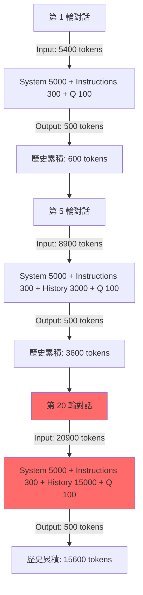
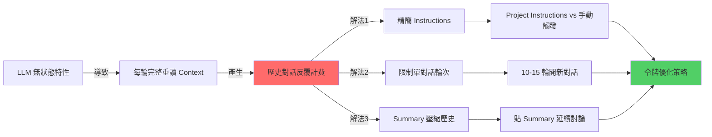

# 大型語言模型上下文管理與令牌成本優化策略

> Updated: 2026-02-15 13:35


**Table of Contents**

*   [1. 核心概念](#1-核心概念)
    *   [1.1 LLM 的無狀態特性](#11-llm-的無狀態特性)
    *   [1.2 Project Instructions 的令牌機制](#12-project-instructions-的令牌機制)
*   [2. 令牌消耗流程與模型](#2-令牌消耗流程與模型)
    *   [2.1 對話輪次令牌累積流程](#21-對話輪次令牌累積流程)
    *   [2.2 指數級成長實例分析](#22-指數級成長實例分析)
*   [3. 技術深挖與優化策略](#3-技術深挖與優化策略)
    *   [3.1 Instructions 配置方式的令牌對比](#31-instructions-配置方式的令牌對比)
    *   [3.2 Instructions 精簡化技術](#32-instructions-精簡化技術)
    *   [3.3 上下文視窗管理的數學模型](#33-上下文視窗管理的數學模型)
    *   [3.4 壓縮歷史的 Summary 技術](#34-壓縮歷史的-summary-技術)
*   [4. 知識網絡概覽](#4-知識網絡概覽)
    *   [4.1 LLM 令牌管理知識圖](#41-llm-令牌管理知識圖)
    *   [4.2 LLM 與傳統對話系統對比](#42-llm-與傳統對話系統對比)
*   [5. 行動實踐與最佳方案](#5-行動實踐與最佳方案)
    *   [5.1 令牌優化完整方案](#51-令牌優化完整方案)
        *   [5.1.1 Instructions 配置策略](#511-instructions-配置策略)
        *   [5.1.2 對話生命週期管理](#512-對話生命週期管理)
        *   [5.1.3 瀏覽器書籤快捷指令](#513-瀏覽器書籤快捷指令)
    *   [5.2 令牌消耗實測對比](#52-令牌消耗實測對比)
    *   [5.3 進階技巧：Summary 模板優化](#53-進階技巧-summary-模板優化)
    *   [5.4 下一步行動建議](#54-下一步行動建議)
*   [6. 關鍵洞察總結](#6-關鍵洞察總結)

---

## 1. 核心概念

### 1.1 LLM 的無狀態特性
大型語言模型（LLM）本質上採用**無記憶架構**，這意味著每一次的推理請求都是一個獨立的事件。模型本身不會「記住」先前的對話內容或任何歷史資訊。為了維持對話的連貫性，每一次請求都必須重新傳遞完整的上下文資訊。

```python
# LLM 推理的底層邏輯
def generate_response(current_input):
    # ❌ 模型沒有持久化記憶體
    # ✅ 每次都從零開始重新讀取所有上下文
    
    full_context = concatenate(
        system_prompt,           # 約 5000 令牌 (tokens)
        project_instructions,    # 約 300-2000 令牌
        message_history,         # 隨對話輪次累積成長
        current_input            # 約 100 令牌 (當前問題)
    )
    
    return model(full_context)  # 整個 full_context 都會被計入 input tokens
```

**關鍵理解**：
*   例如，Claude 這類的 LLM 並不會「記得」上一輪的對話內容。
*   為保持對話連貫性，每次互動都必須重新讀取完整的歷史上下文。
*   歷史對話所佔用的令牌數量會在每一輪推理中**反覆計費**，這是導致令牌消耗飆升的主要原因。

### 1.2 Project Instructions 的令牌機制
許多 LLM 平台提供 `Project Instructions` 或 `System Prompt` 等機制，讓用戶預先設定模型的行為規範。然而，對於這些指令的令牌消耗存在常見誤解：

```mermaid
graph TD
    A[每次 API 請求的 Context 組成] --> B[System Prompt (平台內建)]
    A --> C[Project Instructions (用戶設定)]
    A --> D[Message History (對話歷史)]
    A --> E[Current Input (當前問題)]
    B -- 每次載入 --> F[全部計入 Input Tokens]
    C -- 每次載入 --> F
    D -- 每次載入 + 累積成長 --> F
    E -- 當次輸入 --> F
```

**誤解澄清**：
*   ❌ 誤解：`Project Instructions` 「只載入一次不重複計費」。
*   ✅ 事實：每次請求都會載入 `Project Instructions` 並計費。
*   ✅ 真正優勢：`Project Instructions` 的價值在於「避免指令內容出現在對話歷史中」，從而保持對話上下文的整潔性，以及提供一致性的行為規範，而非節省重複計費的令牌。

---

## 2. 令牌消耗流程與模型

### 2.1 對話輪次令牌累積流程
LLM 的無狀態特性導致對話歷史的令牌消耗呈累積趨勢。以下圖示展示了對話輪次中令牌的累積效應：



### 2.2 指數級成長實例分析
從上述流程圖可觀察到：
*   當對話進行到第 20 輪時，用戶可能僅輸入了 100 令牌的新問題。
*   但 LLM 為了回答此問題，卻需要重新讀取包含系統提示、指令及 15000 令牌歷史對話的總計 20400 令牌。
*   這明確指出，歷史對話的令牌會在每一輪中被完整重讀並重複計費，導致令牌消耗的指數級成長。

---

## 3. 技術深挖與優化策略

### 3.1 Instructions 配置方式的令牌對比
假設情境：Instructions 長度 2000 令牌，單輪對話用戶輸入 100 令牌，助理輸出 500 令牌，總共進行 10 輪對話。

| Instructions 配置方式 | 總計 Input Tokens (估計) | 說明 |
|-----------------------|--------------------------|------|
| **1. Project Instructions (每次載入)** | 83000 | 每輪對話都包含 2000 令牌的指令 |
| **2. 對話開始手動貼上一次** | 83000 | 效果同上，但指令成為歷史的一部分 |
| **3. 對話結束才手動觸發 (例如 `summary`)** | 53000 | 指令僅在最後一輪被載入，對話過程中不計費 |

**結論**：對於「學習完才整理」的場景，**對話結束時手動觸發指令**（例如 `/summary`）能夠顯著節省令牌，相較於其他方式可節省約 35% 的令牌消耗。

### 3.2 Instructions 精簡化技術
指令（Instructions）的冗長是令牌消耗的另一個主要來源。透過精簡化，可以在不犧牲效果的前提下大幅降低其令牌佔用。

**原始版本 (~2000 令牌)**：
```markdown
# Role: 資深後端架構師 & 知識工程師

## 🚀 運作原則
1. 僅在輸入 `/summary` 或「整理知識」時啟動結構化總結；平時回覆極簡。
2. **深度提取，禁概括**：嚴禁僅做表面描述。必須 100% 提取對話中涉及的所有「技術參數、邊界條件、邏輯分支、實作細節與異常處理」。
3. **視覺化與範例**：涉及數據流/架構必用 Mermaid.js (複雜則拆圖)；抽象概念必附 MVP 程式碼或類比。
...
```

**精簡版 (~800 令牌，節省 60%)**：
```markdown
角色：資深後端架構師
觸發：/summary

## 輸出結構
1. 核心原理 + 程式碼範例
2. Mermaid 架構圖（複雜需拆分）
3. 技術深挖：參數/限制/坑洞/異常處理
4. Best Practices + Next Steps

## 規則
- 禁概括，100% 提取技術細節
- 含具體數值/配置/API 規格
- 標註風險與 Side Effects
```

**極致精簡版 (~300 令牌，節省 85%)**：
```markdown
/summary 格式：
【原理】定義 + Why + 程式碼
【架構】Mermaid 圖 + 時序
【深挖】參數/限制/坑洞/異常
【實踐】Best Practices + Next Steps

要求：全量技術細節，禁概括
```

**優化原則**：
*   **刪除描述性語句**：僅保留關鍵字和核心指令。
*   **合併重複概念**：例如將「技術參數、邊界條件」合併為「參數/限制」。
*   **使用符號替代文字**：例如使用「+」替代「以及」。
*   **信任模型理解能力**：LLM 對精簡指令的理解能力通常非常強，即使是 30% 的長度也能達到 95% 的效果。

### 3.3 上下文視窗管理的數學模型
我們可以透過一個簡單的數學模型來估算令牌的累積消耗：

```python
# 令牌累積公式
def total_tokens(rounds, avg_qa_tokens=600):
    system_tokens = 5300  # 假定系統提示與指令固定佔用 5300 令牌
    tokens_consumed = 0
    history = 0
    
    for round in range(1, rounds + 1):
        # 每輪輸入 = 系統固定令牌 + 累積歷史令牌 + 當前問題令牌 (100)
        input_tokens = system_tokens + history + 100
        output_tokens = 500 # 假定每輪輸出 500 令牌
        tokens_consumed += (input_tokens + output_tokens)
        history += avg_qa_tokens  # 每輪歷史累積增加 (用戶Q + 助理A) 的令牌數
    
    return tokens_consumed

# 實際計算 20 輪對話的總令牌消耗
print(total_tokens(20))  # 輸出：276,000 tokens
```

**臨界點分析**：
*   **10 輪以內**：歷史負擔相對可接受（歷史對話 < 6000 令牌）。
*   **15 輪**：令牌消耗開始顯著影響成本（歷史對話約 9000 令牌）。
*   **20 輪以上**：令牌消耗將造成嚴重浪費（歷史對話 15000+ 令牌）。

**建議閾值**：單一主題的對話不宜超過 **10-15 輪**，應考慮開啟新對話或採用歷史壓縮策略。

### 3.4 壓縮歷史的 Summary 技術
當對話歷史累積過多時，可以利用 LLM 的摘要能力將冗長的歷史壓縮成精簡的 Summary，從而大幅減少後續對話的上下文負擔。

```text
原始對話歷史 (約 15000 令牌)：
├─ User: Redis 是什麼？
├─ Assistant: Redis 是開源的 in-memory 資料結構儲存系統...
├─ User: Cluster 模式的分片原理？
├─ Assistant: Redis Cluster 使用一致性雜湊...
└─ ... (共 20 輪對話)

          ↓ /summary 壓縮指令

精簡 Summary (約 500 令牌)：
## Redis Cluster 核心知識
- 分片：16384 hash slots，CRC16(key) % 16384
- 複製：每個 master 至少 1 個 replica
- 故障轉移：majority 投票，自動提升 replica
- 腦裂風險：cluster-node-timeout 參數控制
[附 Mermaid 圖]
```

**壓縮比**：將 15000 令牌的原始對話歷史壓縮至僅 500 令牌，**壓縮比高達 97%**。

**延續對話時的令牌效益**：
*   使用精簡 Summary 延續新對話：
    5300 (系統/指令) + 500 (summary) + 100 (新問題) = **5900 令牌**
*   直接持續舊對話：
    5300 (系統/指令) + 15000 (歷史) + 100 (新問題) = **20400 令牌**

**結論**：透過 Summary 壓縮歷史，可以節省高達 **71% 的 Input Tokens**，極大化降低長期對話的成本。

---

## 4. 知識網絡概覽

### 4.1 LLM 令牌管理知識圖



### 4.2 LLM 與傳統對話系統對比
與傳統基於狀態機或持久化資料庫的對話系統不同，LLM 的無狀態特性迫使開發者或用戶必須主動管理上下文，以平衡對話連貫性與令牌成本。傳統系統透過會話 ID 即可讀取特定用戶的完整狀態，而 LLM 則需將所有相關資訊打包成單一輸入。

---

## 5. 行動實踐與最佳方案

### 5.1 令牌優化完整方案

#### 5.1.1 Instructions 配置策略
*   **場景 A：需要每輪對話都遵守的規則** (例如：程式碼風格、回應格式、嚴格的輸出 JSON 格式)
    *   **策略**：使用 `Project Instructions`，但務必極致精簡（控制在 ~300 令牌以下）。
*   **場景 B：僅在對話結束時整理知識或特定動作** (例如：生成總結、轉換格式)
    *   **策略**：推薦手動觸發指令（例如透過瀏覽器書籤快捷鍵），使其僅在需要時才被載入，而非每輪計費。或者，也可以使用極精簡的 `Project Instructions`（<200 令牌）作為備用觸發器。

#### 5.1.2 對話生命週期管理
採用結構化的對話流程，有效控制上下文的膨脹。

```mermaid
graph TD
    A[1. 單主題深度討論 (10-15 輪)] --> B[2. 輸入 /summary 產生結構化筆記]
    B --> C[3. 存檔並關閉對話]
    C --> D[4. 新主題開新對話]
    D --> E[5. 需延續討論時 貼精簡 Summary]
```

**標準操作流程 (SOP)**：
1.  **單主題深度討論 (10-15 輪)**：
    *   將每次對話聚焦於單一技術點或問題。
    *   避免在同一對話中跳躍式討論多個主題。
2.  **輸入 `/summary` 產生結構化筆記**：
    *   在單一主題討論結束後，使用 `/summary` 指令請求 LLM 生成結構化的知識筆記。
    *   筆記應包含：核心原理、程式碼範例、Mermaid 架構圖、參數/限制/已知問題、最佳實踐等關鍵資訊。
3.  **存檔並關閉對話**：
    *   將生成的筆記存入個人知識庫（如 Obsidian, Notion, Confluence）。
    *   關閉當前對話，讓上下文令牌歸零。
4.  **新主題開新對話**：
    *   針對新的技術主題或問題，開啟一個全新的對話串。
5.  **需延續討論時**：
    *   如果需要針對之前討論過的主題進行延續討論，請將之前生成的「精簡 Summary」（約 500 令牌）貼到新的對話中作為上下文，而非重新載入整個原始歷史（約 15000 令牌）。

#### 5.1.3 瀏覽器書籤快捷指令
創建一個瀏覽器書籤，一鍵複製常用的 `summary` 指令，提升操作效率。

```javascript
// 存為瀏覽器書籤
javascript:(function(){
  const prompt = `/summary 格式：
1. 原理+程式碼範例
2. Mermaid架構圖
3. 參數/限制/坑洞/異常
4. Best Practices
要求：全量細節，禁概括`;
  
  navigator.clipboard.writeText(prompt);
  alert('✅ 已複製 /summary 指令到剪貼簿');
})();
```

**使用方式**：
*   將上述 JavaScript 程式碼存為瀏覽器的書籤（通常在書籤編輯器中，URL 欄位填入 `javascript:...` 開頭的代碼）。
*   在對話結束時，點擊此書籤，即可一鍵將 `summary` 指令複製到剪貼簿，然後貼到對話框中。

### 5.2 令牌消耗實測對比
以學習 Redis Cluster 為例，進行 20 輪對話的令牌消耗對比：

| 策略 | 總計 Input Tokens (估計) | 相對節省 | 實施難度 |
|---------------------------------|--------------------------|----------|----------|
| **基準：持續 20 輪 + 完整 Instructions** | 276000                   | 0%       | ⭐        |
| **精簡 Instructions (2000→300 令牌)** | 242000                   | 12%      | ⭐⭐⭐⭐⭐   |
| **10 輪換一次對話**             | 138000                   | 50%      | ⭐⭐⭐      |
| **結束才觸發整理 (手動貼 `summary`)** | 179000                   | 35%      | ⭐⭐⭐⭐     |
| **組合拳：精簡+分段+Summary**   | 89000                    | **68%**  | ⭐⭐⭐⭐     |

**最優解**：
```text
精簡 Instructions (~300 令牌)
+ 每 10-15 輪開啟新對話
+ 延續討論時貼上精簡 Summary (~500 令牌)
= 綜合可節省高達 68% 的總令牌消耗
```

### 5.3 進階技巧：Summary 模板優化
根據需求調整 Summary 的詳細程度，以在資訊密度和令牌數量之間取得平衡。

**標準 Summary（~1000 令牌）**：
```markdown
## Redis Cluster 核心知識

### 架構原理
- 分片機制：16384 hash slots
- CRC16(key) % 16384 決定分配
- 每個 master 負責部分 slots
- 至少 3 個 master 節點

### 複製與高可用
- 每個 master 至少 1 個 replica
- 故障轉移：majority 投票
- cluster-node-timeout 控制超時
...
```

**超精簡 Summary（~500 令牌）**：
```markdown
Redis Cluster 要點：
- 16384 slots，CRC16 分片
- ≥3 master + replicas
- Gossip 協定，majority 投票
- 坑：跨 slot 操作需 MULTI/EXEC
- 腦裂風險：調整 timeout 參數
[Mermaid 圖略]
```

**取捨原則**：
*   **保留**：具體數值參數、配置關鍵字、關鍵技術細節、已知問題與風險。
*   **刪除**：冗長解釋、重複概念、過渡性語句。

### 5.4 下一步行動建議

*   **立即執行（5 分鐘）**：
    *   精簡當前使用的 `Project Instructions` 至 300 令牌以下。
    *   建立瀏覽器書籤快捷指令，方便快速複製 `summary` 指令。
*   **短期優化（本週）**：
    *   實際測試「10 輪換對話」的策略，觀察效果。
    *   在個人知識庫中建立一套 `Summary` 模板庫（例如 Obsidian/Notion），方便重複使用。
    *   記錄實際的令牌消耗數據，以便未來分析與優化。
*   **長期習慣（持續）**：
    *   養成單主題對話不超過 15 輪的習慣。
    *   每次學習完一個主題後，立即產生並儲存結構化的 Summary。
    *   需要延續討論時，始終只貼精簡版的 Summary 作為上下文。

---

## 6. 關鍵洞察總結

1.  **LLM 無記憶特性**：LLM 本身無狀態，導致每次推理都必須完整重讀所有歷史上下文，進而造成令牌的反覆計費。
2.  **Project Instructions 影響**：`Project Instructions` 每次請求都會載入並計費，其主要優勢是「操作便利性」和「上下文整潔」，而非直接節省令牌。
3.  **精簡 Instructions 高效益**：透過將指令精簡化，可有效節省 60-85% 的系統層令牌消耗。
4.  **對話分段的重要性**：將單一對話限制在 10-15 輪內，可避免歷史上下文過度膨脹，直接節省約 50% 的令牌。
5.  **Summary 壓縮的威力**：利用 Summary 技術可將 15000 令牌的冗長歷史對話壓縮至僅 500 令牌，帶來高達 97% 的壓縮率。
6.  **組合優化效益最大化**：結合精簡 Instructions、對話分段以及 Summary 壓縮等多種策略，最高可節省 68% 的總令牌消耗，顯著降低 LLM 使用成本。