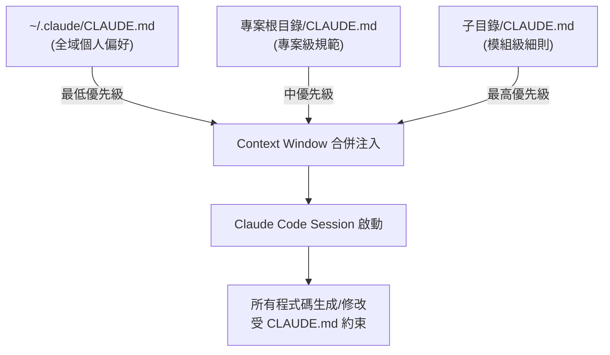

# CLAUDE.md 專案上下文配置指南：AI 編程工具的智慧協作核心

> Updated: 2026-02-16 13:56


## 目錄
- [1. 定義與核心概念](#1-定義與核心概念)
  - [1.1. CLAUDE.md 是什麼？](#11-claudemd-是什麼)
  - [1.2. 為什麼 CLAUDE.md 存在？](#12-為什麼-claudemd-存在)
  - [1.3. 實務範例](#13-實務範例)
- [2. 架構與載入機制](#2-架構與載入機制)
  - [2.1. CLAUDE.md 載入層級與優先級](#21-claudemd-載入層級與優先級)
  - [2.2. 載入時序步驟說明](#22-載入時序步驟說明)
- [3. 內容撰寫指南與技術深挖](#3-內容撰寫指南與技術深挖)
  - [3.1. 核心內容區塊](#31-核心內容區塊)
  - [3.2. 撰寫原則與最佳實踐](#32-撰寫原則與最佳實踐)
  - [3.3. 風險控管與常見坑洞](#33-風險控管與常見坑洞)
- [4. 知識網絡與同類工具](#4-知識網絡與同類工具)
- [5. 行動實踐與後續步驟](#5-行動實踐與後續步驟)
  - [5.1. 推薦最佳實踐](#51-推薦最佳實踐)
  - [5.2. 建議後續步驟](#52-建議後續步驟)

## 1. 定義與核心概念

### 1.1. CLAUDE.md 是什麼？

CLAUDE.md 是 Anthropic Claude Code（Anthropic 的命令列 AI 編程工具）所使用的專案級上下文配置文件。它本質上是一個 Markdown 格式的檔案，通常放置在專案的根目錄或特定子目錄中。其主要用途是為 Claude Code 提供專案的背景資訊、偏好設定與操作指令，使其在執行程式碼生成、修改或推理任務時，能自動讀取並理解專案的上下文。

這個檔案就像是一份「專案說明書」或「系統提示詞」，讓 Claude Code 在每次啟動時都能快速獲取所需的專案知識，避免重複溝通成本。

### 1.2. 為什麼 CLAUDE.md 存在？

Claude Code 採用無狀態設計，每次啟動都是一個全新的 Session，不具備跨 Session 的持久記憶能力。這意味著，如果沒有 CLAUDE.md，開發者必須在每次與 Claude Code 互動時，重複描述專案架構、技術棧、程式碼慣例、團隊規範等背景資訊。

CLAUDE.md 解決了這個根本問題，它將這些「重複性上下文」固化為一個可被版本控制的檔案，實現一次撰寫、每次自動載入的效果。這使得 Claude Code 能夠像一位熟悉專案的新進工程師一樣，快速進入狀況，提高協作效率與程式碼品質。

### 1.3. 實務範例

以下是一個典型的 CLAUDE.md 檔案範例，展示了如何簡潔而具體地定義專案的各方面資訊：

```markdown
# CLAUDE.md

## Project
SaaS billing dashboard — Next.js 14 (App Router) + TypeScript + Supabase

## Commands
- `npm run dev` — start dev server
- `npm run test` — run vitest
- `npm run lint` — eslint check

## Style
- Use named exports, not default exports
- Prefer server components; use "use client" only when necessary
- Tailwind for styling, no CSS modules

## Important
- Never modify files in `/lib/legacy/`
- All API routes require auth middleware
```

這個範例之所以有效，是因為它將每個區塊都定義為可操作的指令或明確的規範，而不是模糊的描述。例如，「Commands」讓 Claude 知道如何自行驗證修改結果，「Important」則設定了明確的禁區邊界，以防止潛在的破壞性操作。

## 2. 架構與載入機制

### 2.1. CLAUDE.md 載入層級與優先級

CLAUDE.md 的載入機制支援多層級配置，其優先級由低到高依序為：全域設定 < 專案根目錄設定 < 子目錄設定。高優先級的設定會覆蓋低優先級的同名設定。



### 2.2. 載入時序步驟說明

Claude Code 在啟動時，會依循一套固定的時序來掃描並載入 CLAUDE.md 檔案，以建構完整的上下文：

1.  **Session 初始化**：使用者在終端機執行 `claude` 命令，啟動 Claude Code Session。
2.  **全域掃描**：系統首先檢查並讀取當前使用者家目錄下的 `~/.claude/CLAUDE.md` 檔案（如果存在）。這個檔案通常用於載入個人跨專案的偏好設定，例如偏好的程式語言、通用的程式碼風格或回覆格式等。
3.  **專案根掃描**：接著，Claude Code 會讀取當前工作目錄（專案根目錄）下的 `CLAUDE.md` 檔案。此檔案用於定義專案層級的規範，如專案概述、主要技術棧、團隊約定等。
4.  **子目錄掃描**：如果操作的目標檔案位於某個子目錄中，且該子目錄本身包含一個 `CLAUDE.md` 檔案，則會額外載入這些模組級別的細節指引。
5.  **上下文合併**：所有層級（全域、專案級、模組級）的 CLAUDE.md 內容將被合併注入到 Claude 的 Context Window 中。此時，較高優先級的設定（例如子目錄的設定）會覆蓋較低優先級的設定（例如專案根目錄的設定），專案根目錄的設定又會覆蓋全域設定。
6.  **Session Ready**：Claude Code 帶著這些完整的上下文開始接收使用者的任務指令，並據此執行程式碼生成、修改或推理行為。

## 3. 內容撰寫指南與技術深挖

### 3.1. 核心內容區塊

一個高效的 CLAUDE.md 檔案通常會包含以下六個核心內容區塊，這些區塊為 Claude Code 提供了不同維度的專案上下文：

-   **專案概述 (Project Overview)**：
    *   明確說明專案的目的、功能、主要技術棧 (例如：「Next.js + TypeScript + Prisma + PostgreSQL」)。
    *   幫助 Claude 快速理解專案的宏觀背景。
-   **常用指令 (Commands)**：
    *   列出專案的建構、測試、部署等常用命令 (例如：`npm run build`, `npm test`, `pytest -x`)。
    *   讓 Claude 知道如何自行驗證其修改，或如何執行常見的開發任務。
-   **程式碼風格與慣例 (Code Style & Conventions)**：
    *   定義程式碼的命名規則、檔案組織方式、import 順序、是否使用分號、偏好的設計模式等。
    *   確保 Claude 產生的程式碼符合團隊的風格指南。
-   **架構說明 (Architecture Description)**：
    *   解釋目錄結構的意義、關鍵模組之間的關係、資料流向等。
    *   幫助 Claude 理解專案的內部運作邏輯，做出更合理的修改。
-   **注意事項與地雷 (Important Notes & Pitfalls)**：
    *   標示不應修改的檔案或目錄 (例如：`/lib/legacy/`)、已知的 workaround、容易踩坑的地方。
    *   作為保護機制，防止 Claude 進行破壞性或不當的操作。
-   **工作流程偏好 (Workflow Preferences)**：
    *   指定特定的開發流程規則 (例如：「修改後一定要跑測試」、「commit message 使用 conventional commits 格式」、「不要自動刪除註解」)。
    *   引導 Claude 遵循團隊的開發流程規範。

### 3.2. 撰寫原則與最佳實踐

撰寫 CLAUDE.md 時，應遵循以下原則以最大化其效益並確保清晰度：

-   **簡潔優先**：CLAUDE.md 的內容會佔用 Context Window 的 Token 額度。冗長的內容會壓縮 Claude 處理實際程式碼的空間，可能導致效能下降。因此，內容應盡量精煉，直指重點。
-   **具體可操作**：避免使用模糊的描述，例如「保持程式碼整潔」。應提供具體可執行的規則，例如：「函式不超過 30 行」、「變數命名使用 camelCase」、「所有 API 路由都需要驗證中介軟體」。
-   **分層管理**：善用多層級的載入機制。全域檔案 (`~/.claude/CLAUDE.md`) 放置個人偏好，專案根目錄檔案放置團隊規範，而子目錄檔案則用於定義特定模組的特殊規則。避免將所有內容堆疊在單一檔案中。
-   **版本控制**：將 CLAUDE.md 納入 Git 等版本控制系統。這樣可以確保團隊成員共享同一份 AI 協作規範，並在 Pull Request (PR) 中對其變更進行審查。
-   **80/20 原則**：優先寫入那 20% 最常被違反或最關鍵的規則，例如特定的 import 慣例、禁止操作的檔案或目錄。這些規則能帶來最大的效益。
-   **附帶驗證指令**：在「Commands」區塊中提供測試 (`npm run test`) 與 Lint (`npm run lint`) 指令。這使 Claude 能夠在完成修改後，自行驗證其程式碼是否符合測試和風格規範。
-   **定期修剪與更新**：專案會演進，CLAUDE.md 的內容也需要隨之更新。建議每月或每個 Sprint 回顧一次檔案內容，刪除過時的規則，新增必要的指引，保持檔案的精煉和時效性。

### 3.3. 風險控管與常見坑洞

在使用 CLAUDE.md 時，需注意以下潛在風險和常見的錯誤：

-   **過長的 CLAUDE.md**：如果檔案內容過於冗長，會佔用大量的 Context Window 空間，從而擠壓 Claude 處理實際程式碼邏輯的有效上下文。這可能導致 Claude 在處理大型檔案或複雜任務時，效果明顯下降。建議嚴格控制檔案長度，並將最重要的規則放在前面。
-   **模糊指令**：提供「注意效能」這類籠統的指令，不如提供具體可操作的建議，例如：「SQL 查詢必須有索引 (index)，禁止使用 `SELECT *`」。模糊的指令會讓 Claude 自行解讀，結果可能不可控且不符預期。
-   **過時內容**：專案在演進過程中，若忘記同步更新 CLAUDE.md，會導致 Claude 依據過期的規則生成或修改程式碼，產生不合時宜或錯誤的結果。務必將 CLAUDE.md 的維護納入日常的程式碼審查 (Code Review) 流程中。
-   **層級衝突管理不當**：當子目錄的 CLAUDE.md 與根目錄的 CLAUDE.md 規則發生矛盾時，如果開發者不清楚其覆蓋關係，可能會產生混淆或意外行為。應明確意識到高優先級設定會覆蓋低優先級設定的原則。

## 4. 知識網絡與同類工具

CLAUDE.md 本質上體現了「AI 編程助手」領域的一個通用模式：將專案的上下文與規範固化為檔案，以便 AI 能夠自動讀取並據此進行程式碼的生成與修改。這解決了 AI 工具無狀態、無記憶的限制。

儘管各個 AI 編程工具在實現形式上可能有所不同（例如檔案名稱、檔案格式、載入機制、配置語法等），但它們解決的核心問題都是一致的：為 AI 提供持續且一致的專案上下文，使其能更高效、精準地協助開發者工作。CLAUDE.md 可被視為這類「AI 專案配置文件」中的一個典型代表。

## 5. 行動實踐與後續步驟

### 5.1. 推薦最佳實踐

為有效利用 CLAUDE.md，建議遵循以下實踐：

-   **版本控制**：將 `CLAUDE.md` 檔案納入 Git 等版本控制系統中，確保團隊成員共享統一的 AI 協作規範，並在 Pull Request 中審查其變更。
-   **80/20 原則**：優先將專案中那 20% 最常被違反或最關鍵的程式碼規則寫入 `CLAUDE.md`，以獲得最大的投資報酬率。這可能包括特定的 import 順序、命名慣例或禁止操作的檔案/目錄。
-   **提供驗證指令**：在 `Commands` 區塊中，務必提供專案的測試 (`npm run test`) 和 Lint (`npm run lint`) 指令。這樣 Claude 就能在完成程式碼修改後，自行執行這些指令來驗證其變更是否正確且符合規範。
-   **定期審視與修剪**：定期（例如每月或每個 Sprint 結束後）回顧 `CLAUDE.md` 的內容。移除任何過時的規則，並根據專案的最新狀態和團隊的學習經驗，新增或優化指引，保持檔案的精煉和有效性。

### 5.2. 建議後續步驟

如果你是第一次使用 CLAUDE.md，可以從以下步驟開始：

-   **建立檔案**：在現有專案的根目錄中建立一個 `CLAUDE.md` 檔案。
-   **初步填充**：從「Project Overview」和「Commands」這兩個區塊開始填寫，提供專案的基本資訊和常用操作指令。
-   **融入團隊風格**：將團隊現有的程式碼風格指南 (Code Style Guide) 中的關鍵點精煉後，寫入 `Code Style` 區塊。
-   **處理特殊模組**：針對專案中具有特殊規則的子模組（例如：遺留程式碼 `legacy code`、核心函式庫 `core library`），考慮建立子目錄級別的 `CLAUDE.md` 檔案以提供更精細的指引。
-   **設定個人偏好**：在 `~/.claude/CLAUDE.md` 中設定你的個人全域偏好，例如偏好的回覆語言（繁體中文）、習慣的 commit message 格式等。
-   **納入工作流程**：將 `CLAUDE.md` 的維護和更新納入團隊的「Definition of Done」檢查清單中，確保其內容能隨專案同步更新。