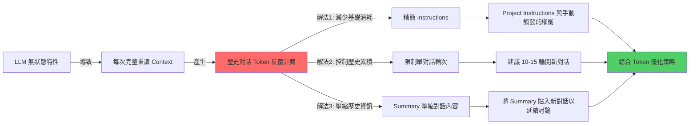

# 📚 知識整理：Claude AI Context Window 與 Token 優化策略

> Updated: 2026-02-16 12:45


## 目錄
- [1. 核心原理](#1-核心原理)
  - [1.1 LLM 的無狀態特性](#11-llm-的無狀態特性)
  - [1.2 Project Instructions 的 Token 機制](#12-project-instructions-的-token-機制)
- [2. Token 消耗流程與累積](#2-token-消耗流程與累積)
  - [2.1 對話輪次 Token 累積圖](#21-對話輪次-token-累積圖)
  - [2.2 指數級成長實例](#22-指數級成長實例)
- [3. 技術深挖與優化策略](#3-技術深挖與優化策略)
  - [3.1 Instructions 精簡化技術](#31-instructions-精簡化技術)
  - [3.2 Context Window 管理的數學模型](#32-context-window-管理的數學模型)
  - [3.3 Summary 壓縮歷史的技術](#33-summary-壓縮歷史的技術)
- [4. 知識網絡概覽](#4-知識網絡概覽)
- [5. 行動實踐與最佳策略](#5-行動實踐與最佳策略)
  - [5.1 Best Practices：Token 優化完整方案](#51-best-practices-token-優化完整方案)
  - [5.2 Instructions 配置策略](#52-instructions-配置策略)
  - [5.3 對話生命週期管理 SOP](#53-對話生命週期管理-sop)
  - [5.4 瀏覽器書籤快捷指令](#54-瀏覽器書籤快捷指令)
  - [5.5 Token 消耗實測對比](#55-token-消耗實測對比)
  - [5.6 Summary 模板優化](#56-summary-模板優化)
  - [5.7 Next Steps](#57-next-steps)
  - [5.8 關鍵洞察總結](#58-關鍵洞察總結)

## 1. 核心原理

### 1.1 LLM 的無狀態特性
Large Language Models (LLM) 採用無記憶架構，每次推理都是獨立事件，這意味著模型本身不會「記憶」過往的對話內容。為了維持對話的連貫性，LLM 在每次回應時，都必須重新讀取完整的對話歷史，這導致了 Token 消耗的累積。

```python
# LLM 推理的底層邏輯偽代碼
def generate_response(current_input):
    # ❌ 模型沒有持久化記憶體來儲存前面的對話
    # ✅ 每次都必須從零開始，重新讀取完整 context
    
    full_context = concatenate(
        system_prompt,           # 約 5000 tokens (系統內建提示詞)
        project_instructions,    # 約 300-2000 tokens (用戶自定義指令)
        message_history,         # 每次對話累積成長的所有歷史訊息
        current_input            # 約 100 tokens (當前用戶輸入)
    )
    
    return model.generate(full_context) # 整個 full_context 都會計入 input tokens
```

**關鍵理解**：
- Claude 不會「記得」上一輪對話，每次都是「第一次見到你」。
- 必須每次重新讀取完整歷史才能保持連貫性。
- 歷史對話的 tokens 會在每輪推理中**反覆計費**，而非只計費一次。

### 1.2 Project Instructions 的 Token 機制
Project Instructions 確實提供了設定便利性與 context 整潔度，但關於其 Token 消耗，存在一些常見的誤解。其運作機制為：

```
每次 API 請求的 Context 組成：
┌──────────────────────────────────┐
│ System Prompt (Anthropic 內建)   │ ← 每次載入並計費
│ Project Instructions (用戶設定)   │ ← 每次載入並計費
│ Message History (對話歷史)        │ ← 每次載入並計費 + 累積成長
│ Current Input (當前問題)          │ ← 當次輸入並計費
└──────────────────────────────────┘
         ↓
   全部計入 Input Tokens
```

**誤解澄清**：
- ❌ 「Project Instructions 只載入一次不重複計費」→ 這是**錯誤**的說法。
- ✅ 每次請求，Claude 都會把 Project Instructions 加入到 `full_context` 中並計費。其真正的優勢在於：
  - **操作便利性**：你無需每次手動複製貼上指令。
  - **Context 整潔度**：指令不會作為一般對話訊息出現在對話歷史中，使對話內容更清晰，避免不必要的歷史訊息累積。

## 2. Token 消耗流程與累積

### 2.1 對話輪次 Token 累積圖
以下 Mermaid 流程圖展示了在持續對話中，Token 消耗如何隨著對話輪次呈指數級累積的過程。每次對話輪次，LLM 都必須重新讀取所有先前的歷史訊息，導致 Input Token 顯著增加。

```mermaid
graph TB
    Start[第 1 輪對話] -->|Input: 5400 tokens| R1[System Prompt 5000 + Instructions 300 + 當前問題 100]
    R1 -->|Output: 500 tokens| H1[歷史累積: 600 tokens (100+500)]
    
    H1 --> R5[第 5 輪對話]
    R5 -->|Input: 8900 tokens| C5[System Prompt 5000 + Instructions 300 + 歷史 3000 + 當前問題 100]
    C5 -->|Output: 500 tokens| H5[歷史累積: 3600 tokens]
    
    H5 --> R20[第 20 輪對話]
    R20 -->|Input: 20900 tokens| C20[System Prompt 5000 + Instructions 300 + 歷史 15000 + 當前問題 100]
    C20 -->|Output: 500 tokens| H20[歷史累積: 15600 tokens]
    
    style R20 fill:#ff6b6b
    style C20 fill:#ff6b6b
```

### 2.2 指數級成長實例
假設每輪對話：用戶問題 100 tokens，Assistant 回答 500 tokens。System Prompt + Instructions 固定為 5300 tokens。

- **第 1 輪**：Input = 5300 (系統+指令) + 100 (問題) = 5400 tokens
- **第 5 輪**：Input = 5300 (系統+指令) + 3000 (歷史 5輪 x 600) + 100 (問題) = 8400 tokens
- **第 20 輪**：Input = 5300 (系統+指令) + 15000 (歷史 20輪 x 600) + 100 (問題) = 20400 tokens

**關鍵發現**：即使你只問了 100 tokens 的新問題，Claude 卻要重新讀取成千上萬的 tokens 才能回答，歷史對話的 tokens 會被反覆計費，導致成本和延遲急劇增加。

## 3. 技術深挖與優化策略

### 3.1 Instructions 精簡化技術
透過精簡化指令內容，可以有效減少每次請求的基礎 Token 消耗。Claude 對精簡指令的理解能力極強，通常只需關鍵字就能理解意圖。

**優化原則**：
- 刪除描述性語句，僅保留核心關鍵字。
- 合併重複概念（例如「技術參數、邊界條件」→「參數/限制」）。
- 使用符號替代冗餘文字（例如「+」替代「以及」）。
- 目標：用 30% 的長度達到 95% 的效果。

**精簡化範例**：

**原始版本 (~2000 tokens)**
```markdown
# Role: 資深後端架構師 & 知識工程師

## 🚀 運作原則
1. 僅在輸入 `/summary` 或「整理知識」時啟動結構化總結；平時回覆極簡。
2. **深度提取，禁概括**：嚴禁僅做表面描述。必須 100% 提取對話中涉及的所有「技術參數、邊界條件、邏輯分支、實作細節與異常處理」。
3. **視覺化與範例**：涉及數據流/架構必用 Mermaid.js (複雜則拆圖)；抽象概念必附 MVP 程式碼或類比。
```

**精簡版 (~800 tokens，約節省 60%)**
```markdown
角色：資深後端架構師
觸發：/summary

## 輸出結構
1. 核心原理 + 程式碼範例
2. Mermaid 架構圖（複雜需拆分）
3. 技術深挖：參數/限制/坑洞/異常處理
4. Best Practices + Next Steps

## 規則
- 禁概括，100% 提取技術細節
- 含具體數值/配置/API 規格
- 標註風險與 Side Effects
```

**極致精簡版 (~300 tokens，約節省 85%)**
```markdown
/summary 格式：
【原理】定義 + Why + 程式碼
【架構】Mermaid 圖 + 時序
【深挖】參數/限制/坑洞/異常
【實踐】Best Practices + Next Steps

要求：全量技術細節，禁概括
```

### 3.2 Context Window 管理的數學模型
Context Window 的長度不僅是容量限制，更直接影響 Token 成本和推理效率。過長的 context 會導致「注意力衰減」，讓模型遺忘前面細節。

```python
# Token 累積消耗的估計公式
def estimate_total_tokens(rounds, avg_qa_tokens=600):
    system_instructions_tokens = 5300  # 系統提示詞 + 精簡指令 tokens (固定值)
    total_consumed_tokens = 0
    current_history_tokens = 0
    avg_user_question_tokens = 100 # 每輪用戶問題平均 tokens
    avg_assistant_response_tokens = 500 # 每輪助手回答平均 tokens
    
    for round_num in range(1, rounds + 1):
        # 計算當前輪次的 input tokens
        input_tokens_this_round = (
            system_instructions_tokens +
            current_history_tokens +
            avg_user_question_tokens
        )
        
        # 計算當前輪次的 output tokens
        output_tokens_this_round = avg_assistant_response_tokens
        
        # 累積總消耗 tokens
        total_consumed_tokens += (input_tokens_this_round + output_tokens_this_round)
        
        # 更新歷史對話 tokens，供下一輪使用
        current_history_tokens += avg_qa_tokens # 每輪對話累積 (問題 + 回答)
    
    return total_consumed_tokens

# 假設進行 20 輪對話的總 Token 消耗
# print(estimate_total_tokens(20)) # 輸出可能接近 276,000 tokens
```

**臨界點分析**：
- **10 輪以內**：歷史負擔可接受（累積歷史 < 6000 tokens）。
- **15 輪**：Token 消耗開始顯著影響，歷史累積約 9000 tokens。
- **20 輪以上**：嚴重浪費，歷史累積超過 15000 tokens。

**建議閾值**：單一對話主題不超過 **10-15 輪**，之後應考慮開新對話。

### 3.3 Summary 壓縮歷史的技術
將冗長的對話歷史壓縮成精簡的 Summary，是大幅節省 Token 的關鍵策略。它允許你在延續討論時，只需載入濃縮的知識點，而非整個原始對話記錄。

**壓縮實例**：
```
原始對話歷史 (例如 15000 tokens)：
├─ User: Redis 是什麼？
├─ Assistant: Redis 是開源的 in-memory 資料結構儲存系統...
├─ User: Cluster 模式的分片原理？
├─ Assistant: Redis Cluster 使用一致性雜湊，將數據分配到 16384 個哈希槽...
└─ ... (共 20 輪詳細討論)

          ↓ 透過 /summary 指令壓縮

精簡 Summary (約 500 tokens)：
## Redis Cluster 核心知識
- 分片：16384 hash slots，基於 CRC16(key) % 16384 決定分配。
- 複製：每個 master 節點至少配置 1 個 replica，實現高可用。
- 故障轉移：透過 Gossip 協議，由多數節點投票決定自動提升 replica 為 master。
- 腦裂風險：可調整 `cluster-node-timeout` 參數以控制節點失聯的超時時間。
[附 Mermaid 架構圖簡要]
```

**壓縮比與 Token 節省**：
- **壓縮比**：15000 tokens → 500 tokens (約 **97%** 壓縮)。
- **延續對話時的 Token 節省**：
  - 開新對話並貼上精簡 Summary：Input = 5300 (系統) + 500 (summary) + 100 (新問題) = **5900 tokens**。
  - 繼續舊對話：Input = 5300 (系統) + 15000 (完整歷史) + 100 (新問題) = **20400 tokens**。
- **節省效益**：相較於繼續舊對話，可節省約 **71%** 的 Input Tokens。

## 4. 知識網絡概覽
以下 Mermaid 流程圖展示了 LLM 無狀態特性、Token 消耗問題以及對應的各項優化策略之間的關係。



## 5. 行動實踐與最佳策略

### 5.1 Best Practices：Token 優化完整方案
優化 Claude AI 的使用成本和效率，需要綜合運用多種策略。

### 5.2 Instructions 配置策略
選擇最適合你使用情境的指令配置方式：

- **場景 A：需要每輪對話都遵守的規則**（例如程式碼風格、固定回應格式）。
  - **推薦**：使用 **Project Instructions**（極簡版 ~300 tokens）。確保指令精簡，避免不必要的冗餘，利用其方便性。

- **場景 B：僅在對話結束時整理知識，平時對話無需額外指令**。
  - **推薦**：對話結束後**手動觸發整理**，可搭配瀏覽器書籤快捷指令。
  - **替代方案**：使用**極精簡 Project Instructions**（<200 tokens），但必須確保該指令僅在特定觸發詞（如 `/summary`）時才執行，平時不干擾對話。

### 5.3 對話生命週期管理 SOP
這是一套完整的工作流程，旨在有效控制 Context Window 的長度，從而優化 Token 消耗並提升學習效率。

```mermaid
graph TD
    A[1. 單主題深度討論 (10-15 輪)] --> B{聚焦單一技術點}
    B --> C{避免跳躍式多主題}
    
    A --> D[2. 輸入 /summary 產生結構化筆記]
    D --> D1[核心原理 + 程式碼範例]
    D --> D2[Mermaid 架構圖 (複雜需拆分)]
    D --> D3[參數/限制/坑洞]
    D --> D4[Best Practices]
    
    D --> E[3. 存檔並關閉對話]
    E --> E1[複製 summary markdown]
    E --> E2[存入 Obsidian / Notion 等知識庫]
    
    E --> F[4. 新主題開新對話]
    F --> F1[Context 重新計算，Token 歸零]
    
    F --> G[5. 需延續討論時]
    G --> G1[貼上精簡版 summary (約 500 tokens)]
    G --> G2[而非完整歷史 (數千甚至上萬 tokens)]
```

### 5.4 瀏覽器書籤快捷指令
將常用的 `/summary` 指令存為瀏覽器書籤，可以一鍵複製到剪貼簿，省去手動輸入的麻煩。

```javascript
// 存為瀏覽器書籤的 JavaScript 程式碼
javascript:(function(){
  const prompt = `/summary 格式：
1. 原理+程式碼範例
2. Mermaid架構圖
3. 參數/限制/坑洞/異常
4. Best Practices
要求：全量細節，禁概括`;
  
  navigator.clipboard.writeText(prompt);
  alert('✅ 已複製 /summary 指令到剪貼簿');
})();
```

**使用方式**：
- 將上述 `javascript:...` 程式碼作為 URL 存為瀏覽器書籤。
- 在 Claude 對話結束時，點擊該書籤 → 程式碼會將預設的 `summary` 指令複製到剪貼簿 → 直接貼到對話框即可。

### 5.5 Token 消耗實測對比
以下表格展示了在學習一個新主題（20 輪對話）的情境下，不同優化策略所帶來的 Token 節省效果。

| 策略 | Input Tokens 預估 (20 輪總計) | 相對基準節省 (%) | 實施難度 |
|:---|:-------------------------------|:-----------------|:---------|
| **基準：持續 20 輪 + 完整 Instructions (~2000 tokens)** | 276,000 | 0% | ⭐ |
| **精簡 Instructions (2000→300 tokens)** | 242,000 | 12% | ⭐⭐⭐⭐⭐ |
| **每 10 輪開新對話 (Project Instructions 啟用)** | 138,000 | 50% | ⭐⭐⭐ |
| **結束才觸發整理 (手動觸發)** | 179,000 | 35% | ⭐⭐⭐⭐ |
| **組合拳：精簡+分段+Summary 延續** | 89,000 | **68%** | ⭐⭐⭐⭐ |

**最優解**：
```
精簡 Instructions (~300 tokens)
+ 每 10-15 輪開新對話 (分段管理 Context)
+ 延續討論時貼上精簡 Summary (~500 tokens，而非整個歷史)
= 最高可節省約 68% 的總 Token 消耗
```

### 5.6 Summary 模板優化
根據需求，可以進一步優化 Summary 的內容，以在資訊密度和 Token 消耗之間取得平衡。

**標準 Summary（~1000 tokens，適合詳細筆記）**
```markdown
## Redis Cluster 核心知識

### 架構原理
- 分片機制：採用 16384 個 hash slots。
- CRC16(key) % 16384 決定 key 所屬的 slot。
- 每個 master 節點負責部分 hash slots 的數據存儲。
- 至少需要 3 個 master 節點才能組成穩定集群。

### 複製與高可用
- 每個 master 節點至少配置 1 個 replica 節點以提供故障轉移能力。
- 故障轉移流程由多數 master 節點透過投票機制協調完成，自動提升 replica 為新的 master。
- `cluster-node-timeout` 參數控制節點失聯的超時時間，影響故障檢測速度。
```

**超精簡 Summary（~500 tokens，適合快速回顧或作為新對話背景）**
```markdown
Redis Cluster 要點：
- 16384 slots，基於 CRC16 進行 key 分片。
- 至少 3 個 master 節點加 replicas 組成。
- Gossip 協定，多數投票決定故障轉移。
- 坑點：跨 slot 操作需特殊處理（如 MULTI/EXEC 無法跨 slot）。
- 腦裂風險：透過調整 `cluster-node-timeout` 參數來緩解。
[Mermaid 架構圖示意]
```

**取捨原則**：
- **保留**：關鍵數值參數、配置關鍵字、已知坑洞與限制。
- **刪除**：冗長解釋、重複概念、過渡語句與非核心描述。

### 5.7 Next Steps

**立即執行（5 分鐘）**
- 精簡當前 Claude Project Instructions 至 300 tokens 以下。
- 建立並測試瀏覽器書籤快捷指令，用於快速複製 `/summary` 指令。

**短期優化（本週）**
- 嘗試並實踐「每 10-15 輪對話就開新 thread」的策略。
- 在個人知識庫（如 Obsidian/Notion）中建立標準 Summary 模板庫。
- 記錄不同策略下的實際 Token 消耗數據，進行驗證和調整。

**長期習慣（持續）**
- 養成單主題對話不超過 15 輪的習慣。
- 每次學習或討論完一個技術點後，立即產生結構化 Summary。
- 延續討論時，優先貼上精簡版 Summary 作為背景，而非完整的歷史對話。

### 5.8 關鍵洞察總結
1.  **LLM 的無記憶性**：模型每次推理都必須完整重讀整個 Context Window，導致歷史對話的 Token 反覆計費。
2.  **Project Instructions 的角色**：主要提供「操作便利性」與「Context 整潔度」，而非直接節省 Token 消耗。
3.  **精簡指令效益**：大幅精簡 Instructions 可以減少 60-85% 的系統層基礎 Token 消耗。
4.  **分段對話策略**：每 10-15 輪對話開新 Thread，有效避免歷史 Context 膨脹，約可節省 50% 的 Token 消耗。
5.  **Summary 壓縮威力**：將數萬 Tokens 的對話歷史壓縮成數百 Tokens 的 Summary，可帶來高達 97% 的歷史信息壓縮比。
6.  **組合優化效益**：透過結合精簡指令、分段對話和 Summary 壓縮，最高可節省總 Token 消耗的 68%。

**終極原則**：把 Token 花在「新知識獲取」與「有效整理」上，而非「反覆載入舊對話」的冗餘成本。