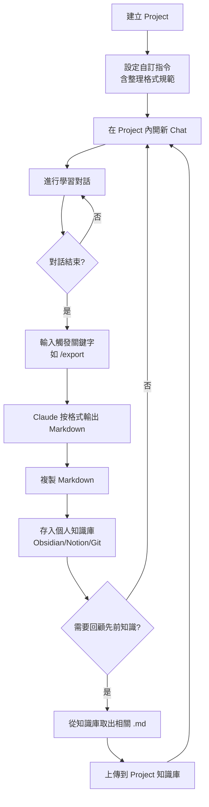
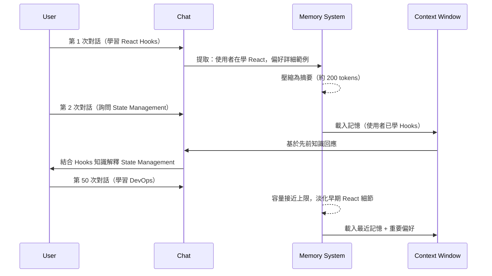

- [Claude.ai Projects 知識整理工作流完整指南](#claudeai-projects-知識整理工作流完整指南)
  - [📌 核心原理 (Core Concepts)](#-核心原理-core-concepts)
    - [Claude.ai 的三大上下文管理機制](#claudeai-的三大上下文管理機制)
    - [實務範例：觸發式知識整理系統](#實務範例觸發式知識整理系統)
  - [📐 架構流程 (Architecture \& Flow)](#-架構流程-architecture--flow)
    - [Projects + 自訂指令 + 外部儲存的完整工作流](#projects--自訂指令--外部儲存的完整工作流)
    - [Memory 運作時序](#memory-運作時序)
    - [步驟說明](#步驟說明)
  - [🔍 技術深挖 (Technical Deep Dive)](#-技術深挖-technical-deep-dive)
    - [Projects 自訂指令的技術細節](#projects-自訂指令的技術細節)
    - [Memory 的容量管理機制](#memory-的容量管理機制)
    - [外部儲存方案的技術考量](#外部儲存方案的技術考量)
  - [🔗 知識網絡 (Knowledge Graph)](#-知識網絡-knowledge-graph)
    - [跨工具的上下文管理機制對比](#跨工具的上下文管理機制對比)
    - [與其他知識管理工具的整合架構](#與其他知識管理工具的整合架構)
  - [🛠️ 行動實踐 (Actionable Insights)](#️-行動實踐-actionable-insights)
    - [Best Practices](#best-practices)
    - [風險控管 — 常見坑洞](#風險控管--常見坑洞)
    - [Next Steps](#next-steps)
  - [🎯 關鍵決策樹](#-關鍵決策樹)

# Claude.ai Projects 知識整理工作流完整指南

## 📌 核心原理 (Core Concepts)

### Claude.ai 的三大上下文管理機制

**1. Projects（專案）**

Projects 是 Claude.ai 的工作空間容器，一個 Project 可包含多個 chats、自訂指令（Custom Instructions）、和知識庫檔案。

**運作邏輯：**
- Project 內所有對話共享同一份自訂指令和上傳的知識庫文件
- 每次開新 chat 時自動載入這些上下文
- 自訂指令在 System Prompt 層級生效，優先級高於對話內容

**與 CLAUDE.md 的類比：**
- Projects 的自訂指令類似於 Claude Code 的 CLAUDE.md
- 差異在於 CLAUDE.md 作用於 CLI 環境，Projects 作用於 claude.ai 網頁端
- 兩者都是「將重複性上下文固化為配置，實現一次撰寫、每次自動載入」

**2. Memory（記憶功能）**

Memory 是跨對話的持久化記憶系統，自動提取並保存使用者偏好、學習進度、重要資訊。

**運作機制：**
- Claude 在對話中識別值得記住的資訊（偏好、習慣、已學知識）
- 將其壓縮為高度精簡的摘要（非逐字記錄）
- 在下次對話時自動載入到 context window

**Token 消耗：**
- 每次對話額外消耗 500-2000 tokens（相當於 1-2 頁背景資訊）
- Memory 內容是精簡摘要，不是完整對話紀錄
- 隨著對話累積，較舊的記憶會被自動淡化或淘汰

**容量管理機制（推測）：**
- 時間衰減：較舊的記憶權重降低
- 重要性評分：使用者明確要求記住的內容權重較高
- 存取頻率：經常被引用的記憶更不容易被淘汰

**3. Styles（風格設定）**

全局的回應風格預設，可跨所有對話和 Projects 套用。適合設定固定寫作風格（正式/技術性/簡潔）、特定領域術語偏好、一致的溝通方式。

### 實務範例：觸發式知識整理系統

在 Project 的自訂指令中設定觸發關鍵字（如 `/export`, `整理`, `總結`），當輸入這些關鍵字時，Claude 自動按照預設格式輸出 Markdown 整理。

**範例自訂指令：**

當我說「整理」、「總結」或「/export」時，請將本次對話整理成以下 Markdown 格式：

標題使用主題名稱，包含日期和領域標籤。內容分為核心概念（關鍵概念列點）、重點筆記（詳細說明）、相關知識（與其他主題的連結）、程式碼範例（如有）、待辦行動項目（可實踐的下一步）、以及標籤分類。

**為什麼這樣有效：**
- 關鍵字觸發機制讓整理動作標準化，避免每次手動描述格式需求
- Markdown 格式確保可直接複製到任何筆記系統（Obsidian、Notion、純文字編輯器）
- 結構化區塊強制 Claude 完整提取所有重要資訊，不會遺漏細節

---

## 📐 架構流程 (Architecture & Flow)

### Projects + 自訂指令 + 外部儲存的完整工作流

### Memory 運作時序

### 步驟說明

**初始設定階段（一次性）：**

1. 建立 Project 並命名（如「後端技術學習」「前端框架研究」）
2. 進入 Project Settings 找到 Custom Instructions 區塊
3. 貼上知識整理格式規範（包含觸發關鍵字和輸出結構）
4. 決定是否開啟 Memory 功能（Settings → Features → Memory）

**日常使用循環：**

1. 在 Project 內開新 chat，針對特定主題學習或討論
2. 對話過程中 Claude 自動遵循自訂指令的行為規範
3. 對話結束時輸入觸發關鍵字（如 `/export` 或 `整理`）
4. Claude 輸出格式化的 Markdown 整理內容
5. 複製 Markdown 內容存入個人知識庫（本地資料夾、Git repo、Obsidian vault、Notion database）
6. 下次需要討論相關主題時，從知識庫取出先前整理的 .md 文件上傳回 Project 知識庫

**Memory 的自動運作（如有開啟）：**

Memory 在背景自動提取重要資訊，無需手動操作。在新對話啟動時自動載入到 context。使用者可在 Settings → Memory 查看、編輯和刪除記憶內容。

---

## 🔍 技術深挖 (Technical Deep Dive)

### Projects 自訂指令的技術細節

**注入層級與優先級：**

自訂指令在 System Prompt 層級生效，優先級高於對話內容。類似於 Claude Code 的 CLAUDE.md，但作用於 claude.ai 網頁端。每次對話啟動時自動載入，不需在每次對話中重複描述相同的規範。

**Token 消耗管理：**

自訂指令本身會佔用 context window 的 token 額度。建議控制在 500-1000 tokens 內（約 1-2 頁文字）。過長的自訂指令會壓縮實際對話可用的 context 空間，導致對話後期 Claude 開始遺忘前面的內容。

**撰寫最佳實踐：**

使用明確的觸發關鍵字（如 `/export`, `整理`, `總結`）而非模糊描述。避免「保持專業」這類抽象指令，改用具體規則（如「使用學術語氣，附上參考文獻格式」「函式命名用 camelCase」）。將格式範本直接寫入指令中，確保輸出一致性。

### Memory 的容量管理機制

**記憶淘汰策略（推測機制）：**

Memory 有上限但 Anthropic 未公開具體數字。當接近上限時，系統根據時間衰減（較舊的記憶權重降低）、重要性評分（使用者明確要求記住的內容權重較高）、存取頻率（經常被引用的記憶更不容易被淘汰）等因素自動淘汰記憶。

**多 Project 場景下的效能退化：**

當單一 Project 下有 100+ 對話且涵蓋多個子領域時，會出現以下現象：

前 20 個對話時記憶細節清晰、完整保留。21-50 個對話開始摘要化、保留關鍵點。51-100 個對話早期細節大量淡化、僅保留核心概念。100+ 對話可能出現知識碎片化、跨主題連結弱化。

**風險控管：**

記憶污染問題：不相關主題的記憶互相干擾（例如學習 Python 時混入 Marketing 策略的記憶）。過度依賴 Memory：當早期記憶被淡化後，無法有效檢索先前學習的內容。Token 浪費：若 Memory 累積大量不重要資訊，每次對話都在消耗無效 token。

### 外部儲存方案的技術考量

**Markdown + Git 方案（推薦用於技術學習）：**

建立資料夾結構按領域分類（如 backend/、frontend/、devops/）。檔案命名規範採用 `YYYY-MM-DD-主題-子主題.md` 格式，便於時間排序和主題檢索。使用 Git 進行版本控制，每次知識更新時 commit，重要里程碑用 tag 標記。

**Obsidian 整合（進階知識網絡）：**

使用 YAML Front Matter 做元資料管理（日期、標籤、分類、狀態）。利用 Dataview 插件自動產生知識地圖和統計儀表板。雙向連結實現知識網絡，Graph View 視覺化知識結構。

**Notion 整合（注意限制）：**

Notion API 對 Markdown 的支援有以下限制：清單最多 2 層深度（第 3 層會導入失敗）。單一文字 block 不超過 2000 字元（過長需拆分段落）。不支援部分 Markdown 語法（如 Mermaid 圖表、部分 HTML 標籤）。建議先在 Markdown 編輯器調整格式再匯入 Notion。

---

## 🔗 知識網絡 (Knowledge Graph)

### 跨工具的上下文管理機制對比

| 機制 | 作用範圍 | 持久性 | Token 消耗 | 適用場景 |
|------|---------|--------|-----------|---------|
| Projects 自訂指令 | Project 內所有 chats | 持久（手動設定） | 固定消耗（指令長度） | 標準化輸出格式、工作流規範 |
| Memory | 全局或 Project 內 | 自動持久化 | 每次 500-2000 tokens | 記住使用者偏好、學習進度 |
| Styles | 全局（所有對話） | 持久（手動設定） | 固定消耗（風格描述長度） | 一致的寫作風格、語氣 |
| 知識庫文件（上傳） | 單一 Project | 手動管理 | 按需載入（文件大小） | 參考資料、先前整理的筆記 |
| CLAUDE.md（Claude Code） | CLI 專案級 | 持久（檔案） | 每次自動載入 | 程式碼生成規範、專案架構說明 |

### 與其他知識管理工具的整合架構

Claude.ai Projects 作為知識生成端，負責對話式學習和結構化整理。外部工具（Obsidian/Notion）作為知識存儲和檢索端，負責長期保存、搜尋和視覺化。Git 作為版本控制和備份層，追蹤知識演進歷史。三者結合形成完整的個人知識管理系統（Personal Knowledge Management, PKM）。

**工作流範例：**

在 Claude.ai Project 中學習某主題並用 `/export` 整理成 Markdown。將 Markdown 存入本地 Git repository 並 commit。同時匯入 Obsidian 建立雙向連結，或上傳 Notion 建立 database 關聯。定期用 Git push 備份到 GitHub/GitLab。可選：用 CI/CD 自動發佈到個人網站或部落格。

---

## 🛠️ 行動實踐 (Actionable Insights)

### Best Practices

**Project 結構設計（按學習領域分層）：**

避免單一 Project 包含過多不相關主題，建議按領域建立獨立 Projects（如「Backend 技術」「Frontend 框架」「DevOps 實踐」「系統設計」「商業分析」）。每個 Project 專注一個大領域，減少 Memory 污染和上下文混淆。

**自訂指令的撰寫原則：**

使用具體觸發詞（如 `/export`, `/summary`）而非模糊描述。將完整 Markdown 結構範本直接寫入指令中。包含驗證規則（如「確保每個區塊都有內容，不可留空」「程式碼必須包含註解」）。設定多個同義觸發詞避免打錯字導致整理失敗。

**Memory 使用策略：**

輕度學習場景（偶爾問問題、主題分散）不開 Memory，每次對話獨立，節省 token。深度學習場景（長期專注某領域）開啟 Memory，但定期在 Settings 中檢視和精簡記憶內容。混合策略（推薦）：Memory 記住偏好和風格，具體知識用文件保存。

**外部儲存的命名規範：**

採用 `YYYY-MM-DD-主題-子主題.md` 格式（如 `2026-02-16-nodejs-stream-performance.md`）。日期前綴便於時間排序和追蹤學習歷程。主題-子主題結構便於資料夾分類和搜尋。

**定期回顧與重構：**

每月回顧 Project 自訂指令，刪除過時規則、優化格式範本。每季整理知識庫，合併相似主題、更新過時內容、刪除不再需要的筆記。使用 Git tag 標記重要里程碑（如「完成 React 基礎學習」「系統設計課程結束」）。

### 風險控管 — 常見坑洞

**坑洞 1：自訂指令過長導致 Context 不足**

症狀：對話到後期 Claude 開始遺忘前面的內容，回答品質下降。

解決方案：壓縮自訂指令到 500 tokens 以內，只保留最核心規則。將詳細範例和說明文件上傳到 Project 知識庫而非寫入自訂指令。

**坑洞 2：Memory 累積無效資訊**

症狀：Claude 記住了大量不重要的細節（如某次隨口提到的偏好），實際有用的知識反而被淡化。

解決方案：定期進入 Settings → Memory 手動檢視和刪除無關記憶。在對話中明確告知 Claude「這不需要記住」來避免污染。

**坑洞 3：忘記從知識庫載入先前筆記**

症狀：討論進階主題時 Claude 不知道你已經學過基礎，重複解釋已知概念。

解決方案：建立「前置知識檢查清單」，在開新 chat 討論進階主題前先上傳相關基礎筆記。在自訂指令中加入「若使用者提到已學過的概念，請先確認是否需要回顧」。

**坑洞 4：Markdown 格式不相容於目標系統**

症狀：匯入 Notion 時格式跑掉、清單層級錯誤、Mermaid 圖表無法顯示。

解決方案：在自訂指令中明確限制格式（如「清單最多 2 層」「避免使用 Mermaid，改用文字描述流程」「單段落不超過 1800 字元」）。針對不同目標系統準備不同的格式範本。

**坑洞 5：過度依賴單一觸發詞**

症狀：打錯字（如打成 `/exprot`）或忘記關鍵字導致整理失敗，需要重新描述需求。

解決方案：在自訂指令中設定多個同義觸發詞（「整理」或「總結」或「/export」或「/summary」都能觸發相同行為）。

### Next Steps

**立即執行（5 分鐘內）：**

建立第一個 Project，選擇你最常學習的領域命名。進入 Project Settings → Custom Instructions，貼上本文提供的基礎範本並根據需求微調。決定是否開啟 Memory（建議先不開，觀察一週後再決定）。

**短期優化（1 週內）：**

建立本地知識庫資料夾結構，按領域分類（如 `knowledge-base/backend/`、`knowledge-base/frontend/`）。完成第一次「學習 → 整理 → 儲存」完整流程，驗證工作流是否順暢。測試從知識庫取出舊筆記上傳回 Project 的效果，確認 Claude 能否有效利用先前知識。

**中期精進（1 個月內）：**

根據使用體驗調整自訂指令格式，刪除不必要的區塊、增加常用的區塊。建立 Git repository 做版本控制，每次知識更新都 commit 並寫清楚 commit message。選擇一個主力工具（Obsidian 或 Notion）深度整合，建立知識檢索和視覺化系統。

**長期系統化（持續執行）：**

每月回顧並重構知識庫，合併相似主題、更新過時內容、刪除不再需要的筆記。建立知識地圖（使用 Obsidian Graph View 或 Notion Relations 功能）視覺化知識網絡。探索自動化工具（如用 Python 腳本自動從 Claude 匯出、格式化、提交到 Git）。

---

## 🎯 關鍵決策樹

**我該不該開 Memory？**

如果需要 Claude 記住你的學習進度和偏好，則進一步判斷：學習主題是否跨越多個不相關領域？如果是，建議分多個 Projects 每個開 Memory 避免記憶污染；如果否，單一 Project 加 Memory 即可。如果不需要跨對話記憶，則不開 Memory，用文件管理知識更可控。

**我該用幾個 Projects？**

根據學習領域數量決定：1-2 個領域用單一或兩個 Project。3-5 個領域按領域分 Projects（如 Backend、Frontend、DevOps 各一個）。5+ 個領域考慮更粗粒度分類（如「技術類」vs「商業類」）避免 Projects 過多難以管理。

**我該用什麼工具存儲？**

根據需求選擇：需要跨裝置同步選 Notion（雲端原生）或 Obsidian + Sync 服務；不需要同步選純本地 Markdown + Git。需要強大的知識連結選 Obsidian（雙向連結、圖譜視覺化）；不需要複雜連結選 Notion（Database 查詢、模板系統）或純資料夾分類。