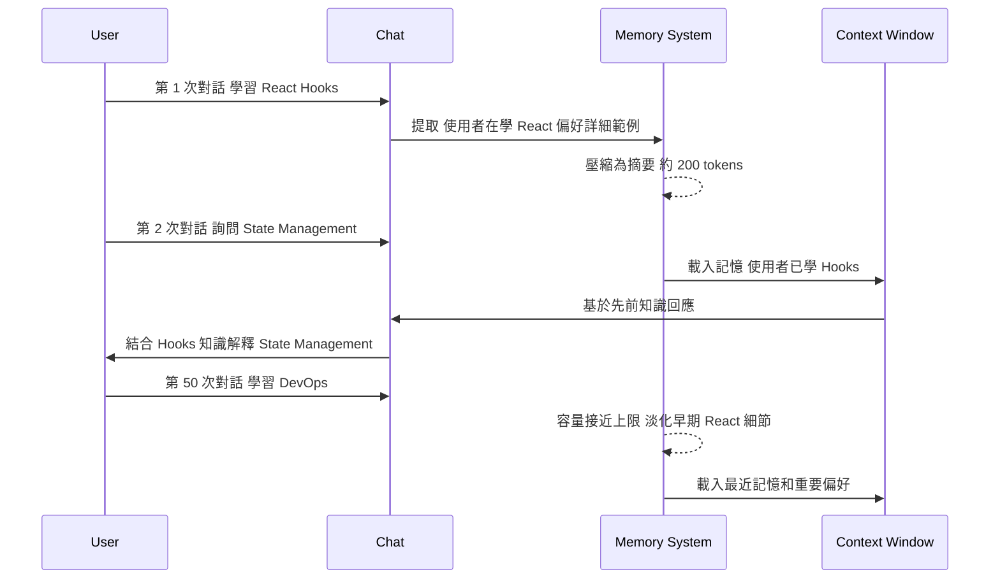

# Claude.ai Projects 知識整理工作流完整指南

> Updated: 2026-02-17 02:50


## 目錄
- [Claude.ai Projects 知識整理工作流完整指南](#claudeai-projects-知識整理工作流完整指南)
  - [目錄](#目錄)
  - [1. 核心原理與運作機制](#1-核心原理與運作機制)
    - [1.1. Projects 的定義與底層邏輯](#11-projects-的定義與底層邏輯)
    - [1.2. 三大上下文管理機制](#12-三大上下文管理機制)
    - [1.3. 觸發式知識整理系統實作](#13-觸發式知識整理系統實作)
  - [2. 架構設計與工作流程](#2-架構設計與工作流程)
    - [2.1. 完整工作流架構](#21-完整工作流架構)
    - [2.2. Memory 運作時序](#22-memory-運作時序)
    - [2.3. 三階段使用流程](#23-三階段使用流程)
  - [3. 技術實作與深度分析](#3-技術實作與深度分析)
    - [3.1. Projects 自訂指令技術細節](#31-projects-自訂指令技術細節)
    - [3.2. Memory 容量管理機制](#32-memory-容量管理機制)
    - [3.3. 外部儲存方案設計](#33-外部儲存方案設計)
  - [4. 知識網絡與工具整合](#4-知識網絡與工具整合)
    - [4.1. 上下文管理機制對比](#41-上下文管理機制對比)
    - [4.2. 同類技術橫向比較](#42-同類技術橫向比較)
    - [4.3. PKM 系統整合架構](#43-pkm-系統整合架構)
  - [5. 最佳實踐與風險控管](#5-最佳實踐與風險控管)
    - [5.1. 五大最佳實踐](#51-五大最佳實踐)
    - [5.2. 常見坑洞與解決方案](#52-常見坑洞與解決方案)
    - [5.3. 執行路線圖](#53-執行路線圖)

## 1. 核心原理與運作機制

### 1.1. Projects 的定義與底層邏輯

Claude.ai Projects 是 Claude.ai 網頁版的工作空間容器系統，一個 Project 可包含多個 chats、自訂指令（Custom Instructions）和知識庫檔案。本質上是將「重複性上下文」固化為配置，實現一次設定、每次自動載入的效果。

**解決的根本問題：**

Claude.ai 的每個 chat 本質上是無狀態的獨立對話。沒有 Projects 和自訂指令，使用者必須在每次對話中重複描述期望的輸出格式、工作流程、專業領域背景等資訊。Projects 將這些「上下文規範」固化為配置檔，讓 Project 內的所有對話自動遵循相同的行為準則。

**運作機制：**

Projects 的自訂指令在每次對話啟動時被注入到 System Prompt 層級，優先級高於對話內容。使用者可在自訂指令中設定觸發關鍵字（如 `/export`、`整理`、`總結`），當輸入這些關鍵字時，Claude 自動按照預設格式輸出結構化內容。這個機制類似於 Claude Code 的 CLAUDE.md，但作用於 claude.ai 網頁端。

### 1.2. 三大上下文管理機制

**Projects 自訂指令 (Custom Instructions)**

作用範圍為 Project 內所有 chats。持久性為手動設定後持續生效。Token 消耗為固定消耗（指令長度），建議控制在 500-1000 tokens 內。適用場景包括標準化輸出格式、工作流規範、觸發式行為（如關鍵字整理）。

注入層級：自訂指令在 System Prompt 層級生效，優先級高於對話內容。每次對話啟動時自動載入，不需在每次對話中重複描述相同的規範。

**Memory (記憶功能)**

作用範圍為全局（跨 Projects）或 Project 內。持久性為自動持久化，系統自動提取和淡化記憶。Token 消耗為每次對話額外 500-2000 tokens。適用場景為記住使用者偏好、學習進度、工作風格。

運作機制：Claude 在對話中識別值得記住的資訊（偏好、習慣、已學知識），將其壓縮為高度精簡的摘要（非逐字記錄），在下次對話時自動載入到 context window。

容量管理：Memory 有上限但未公開具體數字。接近上限時根據時間衰減（較舊的記憶權重降低）、重要性評分（使用者明確要求記住的內容權重較高）、存取頻率（經常被引用的記憶更不容易被淘汰）等因素自動淘汰記憶。

**Styles (風格設定)**

作用範圍為全局（所有對話）。持久性為手動設定後持續生效。Token 消耗為固定消耗（風格描述長度）。適用場景為一致的寫作風格、語氣、專業術語偏好。

### 1.3. 觸發式知識整理系統實作

在 Project 的自訂指令中設定觸發關鍵字和輸出格式範本。當使用者輸入「整理」、「總結」或 `/summary` 時，Claude 自動將本次對話整理成預定義的 Markdown 格式，包含 YAML frontmatter、目錄、核心概念、技術深挖、最佳實踐等結構化內容。

**為什麼這樣有效：**

關鍵字觸發機制讓整理動作標準化，避免每次手動描述格式需求。Markdown 格式確保可直接複製到任何筆記系統（Obsidian、Notion、純文字編輯器）。結構化區塊強制 Claude 完整提取所有重要資訊，不會遺漏細節。格式範本直接寫在自訂指令中，確保輸出一致性。YAML frontmatter 提供結構化元資料，便於後續檢索和分類。

## 2. 架構設計與工作流程

### 2.1. 完整工作流架構


### 2.2. Memory 運作時序



### 2.3. 三階段使用流程

**初始設定階段（一次性）：**

建立 Project 並命名（如「後端技術學習」或「前端框架研究」）。進入 Project Settings 找到 Custom Instructions 區塊，貼上知識整理格式規範（包含觸發關鍵字和輸出結構）。決定是否開啟 Memory 功能（Settings → Features → Memory）。

**日常使用循環：**

在 Project 內開新 chat，針對特定主題學習或討論。對話過程中 Claude 自動遵循自訂指令的行為規範。對話結束時輸入觸發關鍵字（如 `/summary` 或「整理」）。Claude 輸出格式化的 Markdown 整理內容。下載或複製 Markdown 內容存入個人知識庫（本地資料夾、Git repo、Obsidian vault、Notion database）。下次需要討論相關主題時，從知識庫取出先前整理的文件上傳回 Project 知識庫。

**Memory 的自動運作（如有開啟）：**

Memory 在背景自動提取重要資訊，無需手動操作。在新對話啟動時自動載入到 context。使用者可在 Settings → Memory 查看、編輯和刪除記憶內容。

## 3. 技術實作與深度分析

### 3.1. Projects 自訂指令技術細節

**Token 消耗管理：**

自訂指令本身會佔用 context window 的 token 額度。建議控制在 500-1000 tokens 內（約 1-2 頁文字）。過長的自訂指令會壓縮實際對話可用的 context 空間，導致對話後期 Claude 開始遺忘前面的內容。

**撰寫最佳實踐：**

使用明確的觸發關鍵字（如 `/export`、`整理`、`總結`、`/summary`）而非模糊描述。避免「保持專業」這類抽象指令，改用具體規則（如「使用學術語氣，附上參考文獻格式」或「函式命名用 camelCase」）。將格式範本直接寫入指令中，確保輸出一致性。設定多個同義觸發詞避免打錯字導致整理失敗。

**關鍵限制與規避方法：**

自訂指令無法直接「被看見」。Claude 不會主動告訴使用者「我正在遵循哪些 Custom Instructions」，這些指令是在後台注入到 System Prompt 的。如果發現 Claude 沒有按照指令執行，需要在對話中明確提醒或重新開啟新 chat 測試。

### 3.2. Memory 容量管理機制

**記憶淘汰策略：**

當單一 Project 下有 100+ 對話且涵蓋多個子領域時，會出現效能退化現象。前 20 個對話時記憶細節清晰、完整保留。21-50 個對話開始摘要化、保留關鍵點。51-100 個對話早期細節大量淡化、僅保留核心概念。100+ 對話可能出現知識碎片化、跨主題連結弱化。

**風險控管：**

記憶污染問題指不相關主題的記憶互相干擾（例如學習 Python 時混入 Marketing 策略的記憶）。過度依賴 Memory 會導致當早期記憶被淡化後，無法有效檢索先前學習的內容。Token 浪費發生在 Memory 累積大量不重要資訊時，每次對話都在消耗無效 token。

### 3.3. 外部儲存方案設計

**Markdown + Git 方案（推薦用於技術學習）：**

建立資料夾結構按領域分類（如 backend/、frontend/、devops/）。檔案命名規範採用 `YYYY-MM-DD-主題-子主題.md` 格式，便於時間排序和主題檢索。使用 Git 進行版本控制，每次知識更新時 commit，重要里程碑用 tag 標記。

範例資料夾結構：

```text
knowledge-base/
├── backend/
│   ├── 2026-02-15-nodejs-streams.md
│   ├── 2026-02-16-database-indexing.md
├── frontend/
│   ├── 2026-02-10-react-performance.md
├── devops/
│   ├── 2026-02-12-docker-networking.md
├── templates/
│   └── knowledge-summary-template.md
```

**Obsidian 整合（進階知識網絡）：**

使用 YAML Front Matter 做元資料管理（日期、標籤、分類、狀態）。利用 Dataview 插件自動產生知識地圖和統計儀表板。雙向連結實現知識網絡，Graph View 視覺化知識結構。

YAML Front Matter 範例：

```yaml
---
date: 2026-02-16
tags: [backend, nodejs, streams]
category: learning
status: completed
related: [[nodejs-basics]], [[async-patterns]]
---
```

**Notion 整合（注意限制）：**

Notion API 對 Markdown 的支援有限制。清單最多 2 層深度（第 3 層會導入失敗）。單一文字 block 不超過 2000 字元（過長需拆分段落）。不支援部分 Markdown 語法（如 Mermaid 圖表、部分 HTML 標籤）。建議先在 Markdown 編輯器調整格式再匯入 Notion。

## 4. 知識網絡與工具整合

### 4.1. 上下文管理機制對比

| 機制 | 作用範圍 | 持久性 | Token 消耗 | 適用場景 |
|------|---------|--------|-----------|---------|
| Projects 自訂指令 | Project 內所有 chats | 持久（手動設定） | 固定消耗（指令長度） | 標準化輸出格式、工作流規範 |
| Memory | 全局或 Project 內 | 自動持久化 | 每次 500-2000 tokens | 記住使用者偏好、學習進度 |
| Styles | 全局（所有對話） | 持久（手動設定） | 固定消耗（風格描述長度） | 一致的寫作風格、語氣 |
| 知識庫文件（上傳） | 單一 Project | 手動管理 | 按需載入（文件大小） | 參考資料、先前整理的筆記 |
| CLAUDE.md（Claude Code） | CLI 專案級 | 持久（檔案） | 每次自動載入 | 程式碼生成規範、專案架構說明 |

### 4.2. 同類技術橫向比較

CLAUDE.md 作用於 Claude Code (CLI)，持久性為檔案存在即生效，適用於專案級程式碼生成規範。System Prompt 作用於 Claude API，持久性為單次 session，適用於 API 層級的行為控制。claude.ai User Preferences 作用於 claude.ai 網頁版，跨對話持久，適用於個人對話風格偏好。Memory 作用於 claude.ai 網頁版，跨對話持久，自動學習使用者偏好。.cursorrules 作用於 Cursor IDE，持久性為檔案，適用於 Cursor 專案級規範。.github/copilot-instructions.md 作用於 GitHub Copilot，持久性為檔案，適用於 Copilot 專案級規範。

**關鍵洞察：**

Projects 自訂指令本質上是「AI 助手上下文管理」領域的通用模式，將重複性上下文固化為配置讓 AI 讀取。各工具的實現形式不同（檔名、格式、載入機制），但解決的核心問題一致：消除 AI 的無狀態限制，讓 AI 記住專案或領域的特定規範。

### 4.3. PKM 系統整合架構

Claude.ai Projects 作為知識生成端，負責對話式學習和結構化整理。外部工具（Obsidian 或 Notion）作為知識存儲和檢索端，負責長期保存、搜尋和視覺化。Git 作為版本控制和備份層，追蹤知識演進歷史。三者結合形成完整的個人知識管理系統 (Personal Knowledge Management, PKM)。

整合工作流範例：在 Claude.ai Project 中學習某主題並用 `/summary` 整理成 Markdown。將 Markdown 存入本地 Git repository 並 commit。同時匯入 Obsidian 建立雙向連結，或上傳 Notion 建立 database 關聯。定期用 Git push 備份到 GitHub 或 GitLab。可選：用 CI/CD 自動發佈到個人網站或部落格。

## 5. 最佳實踐與風險控管

### 5.1. 五大最佳實踐

**Project 結構設計：**

避免單一 Project 包含過多不相關主題。建議按領域建立獨立 Projects，例如 Backend 技術、Frontend 框架、DevOps 實踐、系統設計、商業分析。每個 Project 專注一個大領域，減少 Memory 污染和上下文混淆。

**自訂指令的撰寫原則：**

使用具體觸發詞（如 `/export`、`/summary`）而非模糊描述。將完整 Markdown 結構範本直接寫入指令中，包含 YAML frontmatter、目錄、章節編號等。包含驗證規則（如「確保每個區塊都有內容，不可留空」或「程式碼必須包含註解」）。設定多個同義觸發詞避免打錯字導致整理失敗。

**Memory 使用策略：**

輕度學習場景（偶爾問問題、主題分散）不開 Memory，每次對話獨立，節省 token。深度學習場景（長期專注某領域）開啟 Memory，但定期在 Settings 中檢視和精簡記憶內容。混合策略（推薦）：Memory 記住偏好和風格，具體知識用文件保存。

**外部儲存的命名規範：**

採用 `YYYY-MM-DD-主題-子主題.md` 格式（如 `2026-02-16-nodejs-stream-performance.md`）。日期前綴便於時間排序和追蹤學習歷程。主題-子主題結構便於資料夾分類和搜尋。

**定期回顧與重構：**

每月回顧 Project 自訂指令，刪除過時規則、優化格式範本。每季整理知識庫，合併相似主題、更新過時內容、刪除不再需要的筆記。使用 Git tag 標記重要里程碑（如「完成 React 基礎學習」或「系統設計課程結束」）。

### 5.2. 常見坑洞與解決方案

**過長的自訂指令導致 Context 不足：**

症狀為對話到後期 Claude 開始遺忘前面的內容，回答品質下降。解決方案是壓縮自訂指令到 500 tokens 以內，只保留最核心規則。將詳細範例和說明文件上傳到 Project 知識庫而非寫入自訂指令。

**Memory 累積無效資訊：**

症狀為 Claude 記住了大量不重要的細節（如某次隨口提到的偏好），實際有用的知識反而被淡化。解決方案是定期進入 Settings → Memory 手動檢視和刪除無關記憶。在對話中明確告知 Claude「這不需要記住」來避免污染。

**忘記從知識庫載入先前筆記：**

症狀為討論進階主題時 Claude 不知道你已經學過基礎，重複解釋已知概念。解決方案是建立「前置知識檢查清單」，在開新 chat 討論進階主題前先上傳相關基礎筆記。

**Markdown 格式不相容於目標系統：**

症狀為匯入 Notion 時格式跑掉、清單層級錯誤、Mermaid 圖表無法顯示。解決方案是在自訂指令中明確限制格式（如「清單最多 2 層」、「單段落不超過 1800 字元」）。針對不同目標系統準備不同的格式範本。

**自訂指令未生效或執行不一致：**

症狀為輸入觸發關鍵字後 Claude 沒有按照預期格式輸出，或需要多次提醒才執行。解決方案是在新 chat 中測試指令是否生效。如果在長對話中發現問題，可明確提醒 Claude「請嚴格按照 Project Instructions 執行」。

### 5.3. 執行路線圖

**立即執行（5 分鐘內）：**

建立第一個 Project，選擇你最常學習的領域命名。進入 Project Settings → Custom Instructions，貼上基礎範本並根據需求微調。決定是否開啟 Memory（建議先不開，觀察一週後再決定）。

**短期優化（1 週內）：**

建立本地知識庫資料夾結構，按領域分類（如 `knowledge-base/backend/`、`knowledge-base/frontend/`）。完成第一次「學習 → 整理 → 儲存」完整流程，驗證工作流是否順暢。測試從知識庫取出舊筆記上傳回 Project 的效果，確認 Claude 能否有效利用先前知識。

**中期精進（1 個月內）：**

根據使用體驗調整自訂指令格式，刪除不必要的區塊、增加常用的區塊。建立 Git repository 做版本控制，每次知識更新都 commit 並寫清楚 commit message。選擇一個主力工具（Obsidian 或 Notion）深度整合，建立知識檢索和視覺化系統。

**長期系統化（持續執行）：**

每月回顧並重構知識庫，合併相似主題、更新過時內容、刪除不再需要的筆記。建立知識地圖（使用 Obsidian Graph View 或 Notion Relations 功能）視覺化知識網絡。探索自動化工具（如用 Python 腳本自動從 Claude 匯出、格式化、提交到 Git）。