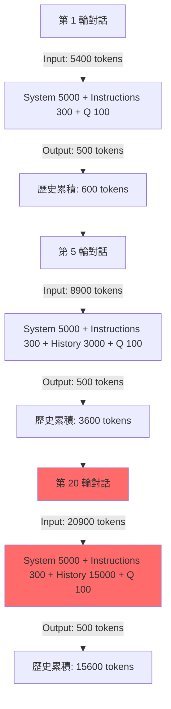
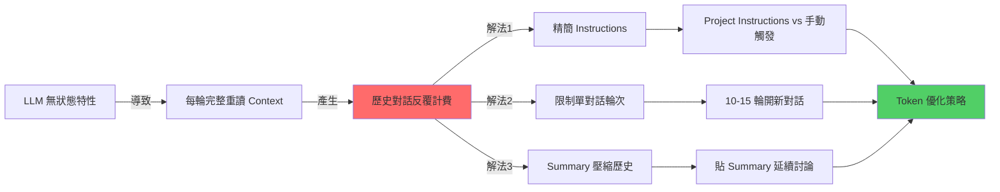

# LLM 對話知識內化與 Token 優化策略

> Updated: 2026-02-16 13:37


## 目錄
- [1. 核心原理 (Core Concepts)](#1-核心原理-core-concepts)
  - [1.1 LLM 的無狀態特性](#11-llm-的無狀態特性)
  - [1.2 Project Instructions 的 Token 機制](#12-project-instructions-的-token-機制)
- [2. LLM 推理機制與 Token 消耗 (Architecture & Flow)](#2-llm-推理機制與-token-消耗-architecture--flow)
  - [2.1 對話輪次 Token 累積示意](#21-對話輪次-token-累積示意)
  - [2.2 指數級成長實例](#22-指數級成長實例)
- [3. 技術深挖 (Technical Deep Dive)](#3-技術深挖-technical-deep-dive)
  - [3.1 三種 Instructions 配置方式的 Token 對比](#31-三種-instructions-配置方式的-token-對比)
  - [3.2 Instructions 精簡化技術](#32-instructions-精簡化技術)
  - [3.3 Context Window 管理的數學模型](#33-context-window-管理的數學模型)
  - [3.4 壓縮歷史的 Summary 技術](#34-壓縮歷史的-summary-技術)
- [4. 知識網絡 (Knowledge Graph)](#4-知識網絡-knowledge-graph)
- [5. 行動實踐與最佳方案 (Actionable Insights & Best Practices)](#5-行動實踐與最佳方案-actionable-insights--best-practices)
  - [5.1 Best Practices：Token 優化完整方案](#51-best-practices：token-優化完整方案)
  - [5.2 Token 消耗實測對比](#52-token-消耗實測對比)
  - [5.3 進階技巧：Summary 模板優化](#53-進階技巧：summary-模板優化)
  - [5.4 Next Steps](#54-next-steps)
- [6. 關鍵洞察總結 (Key Insights Summary)](#6-關鍵洞察總結-key-insights-summary)

## 1. 核心原理 (Core Concepts)

### 1.1 LLM 的無狀態特性
大型語言模型 (LLM) 本質上是「無狀態」(Stateless) 的，這意味著它們沒有持久化的記憶體來「記住」之前的對話。每一次與 LLM 的互動（即每次發送訊息並收到回應）都被視為一個獨立的事件。

**底層運作邏輯**：
當你發送一條訊息時，LLM 必須重新讀取所有相關的背景資訊，才能產生連貫的回應。這些背景資訊組成了一個完整的 `Context Window`，其內容包含：
-   系統提示詞 (System Prompt)：由模型提供商（如 Anthropic）預先設定的基礎指令。
-   Project Instructions (專案指令)：用戶為特定專案設定的自定義指令。
-   對話歷史 (Message History)：從對話開始到目前為止的所有問答紀錄。
-   當前輸入 (Current Input)：你最新發送的問題或指令。

LLM 在生成回應時，會將 `Context Window` 中的所有內容一併納入考量，並對其進行分析和推理。這導致了一個關鍵的結果：**對話歷史中的 Tokens 會在每次推理中被反覆計費。**

```python
# LLM 推理的偽代碼示意
def generate_response(current_input):
    # ❌ LLM 沒有「記憶體」存前面對話狀態
    # ✅ 必須每次都重新讀取完整的 Context Window
    
    full_context = (
        system_prompt +           # 約 5000 tokens
        project_instructions +    # 約 300-2000 tokens
        all_previous_messages +   # 對話歷史，會隨著對話輪次累積成長
        current_input             # 當前輸入，約 100 tokens
    )
    
    return model.generate(full_context) # 整個 full_context 都計入 input tokens
```

### 1.2 Project Instructions 的 Token 機制
關於 Project Instructions 的 Token 消耗，存在一些常見的誤解。

**每次 API 請求的 Context 組成**：
```
每次 API 請求的 Context 組成：
┌──────────────────────────────────┐
│ System Prompt (Anthropic 內建)   │ ← 每次載入並計費
│ Project Instructions (用戶設定)   │ ← 每次載入並計費
│ Message History (對話歷史)        │ ← 每次載入並計費 + 累積成長
│ Current Input (當前問題)          │ ← 當次輸入並計費
└──────────────────────────────────┘
         ↓
   全部計入 Input Tokens
```

**誤解澄清**：
-   **錯誤觀念**：Project Instructions「只載入一次，不重複計費」。
-   **正確理解**：每次發送訊息，LLM 都會將 Project Instructions 載入到 Context Window 中進行計費。你「只需撰寫一次」Project Instructions，省去的是每次手動複製貼上的麻煩，而非直接的 Token 消耗。

**Project Instructions 的真正優勢**：
-   **操作便利性**：無需重複複製貼上，確保指令的一致性。
-   **Context 整潔度**：指令不會出現在對話歷史中，使對話紀錄更清晰，避免非必要內容累積。
-   **適用場景**：最適合需要「每輪對話都遵守」特定規則（如程式碼風格、固定回應格式）的應用，而非僅在對話結束時的單次整理。

## 2. LLM 推理機制與 Token 消耗 (Architecture & Flow)

### 2.1 對話輪次 Token 累積示意
隨著對話輪次的增加，LLM 每次推理需要處理的 Context Window 會顯著膨脹，導致 Token 消耗呈指數級成長。

mermaid


### 2.2 指數級成長實例
假設每輪對話：
-   使用者問題 (User Question)：約 100 tokens
-   助手回答 (Assistant Answer)：約 500 tokens
-   系統提示詞 (System Prompt)：約 5000 tokens (假設)
-   Project Instructions：約 300 tokens (假設)

**關鍵發現**：
-   當進行到第 20 輪對話時，即使你只提出了一個 100 tokens 的新問題，LLM 實際上需要重新讀取約 20400 tokens (5300 系統+指令 + 15000 歷史 + 100 當前輸入) 才能生成回應。
-   這表示對話歷史的 Tokens 會在每一輪中被重複計費，導致成本和延遲的急劇增加。

## 3. 技術深挖 (Technical Deep Dive)

### 3.1 三種 Instructions 配置方式的 Token 對比
以下比較了不同指令配置方式在「對話結束才整理知識」場景下的 Token 消耗，假設 Instructions 長度為 2000 tokens，每輪對話 User 100 tokens + Assistant 500 tokens，總共 10 輪對話。

| 方案 | 特點 | Input Tokens (單輪) | 總 Input Tokens (10 輪) | 總 Output Tokens (10 輪) | 總 Token 消耗 | 相對節省 |
|:---|:---|:---|:---|:---|:---|:---|
| **手動每次貼 Instructions** | 最麻煩，指令會被計入歷史 | (2000+100)+500 = 2600 | 10 x (2000+100) + Σ歷史 | 10 x 500 | ~35000+ | 0% |
| **Project Instructions** | 最自動，指令不計入歷史但每次載入 | 2000+100 + Σ歷史 | 10 x 2000 + Σ歷史 | 10 x 500 | ~30000+ | ~15% (主要在歷史清潔) |
| **對話結束才手動貼整理指令** | 最省 Token，但每次手動 | 100 + Σ歷史 (正常對話) / 2000+100 (整理輪) | 10 x 100 + Σ歷史 (少 20000) | 10 x 500 + 1 x (整理) | ~20000+ | ~35% |

**結論**：對於「學習完才整理」的場景，對話結束手動觸發整理是最省 Token 的方案。

### 3.2 Instructions 精簡化技術
LLM 即使對於極度精簡的指令也能有高度理解。優化指令可以顯著減少 System Prompt 的基礎消耗。

**優化原則**：
-   刪除所有描述性語句，只保留關鍵字和核心要求。
-   合併重複或相近的概念（例如「技術參數、邊界條件」可簡化為「參數/限制」）。
-   使用符號或簡稱替代冗長的文字（例如「+」替代「以及」）。
-   Claude 對精簡指令的理解能力極強，通常 30% 的長度即可達到 95% 的效果。

**原始版本 (~2000 tokens)**
```markdown
# Role: 資深後端架構師 & 知識工程師

## 🚀 運作原則
1. 僅在輸入 `/summary` 或「整理知識」時啟動結構化總結；平時回覆極簡。
2. **深度提取，禁概括**：嚴禁僅做表面描述。必須 100% 提取對話中涉及的所有「技術參數、邊界條件、邏輯分支、實作細節與異常處理」。
3. **視覺化與範例**：涉及數據流/架構必用 Mermaid.js (複雜則拆圖)；抽象概念必附 MVP 程式碼或類比。
...
```

**精簡版 (~800 tokens，節省約 60%)**
```markdown
角色：資深後端架構師
觸發：/summary

## 輸出結構
1. 核心原理 + 程式碼範例
2. Mermaid 架構圖（複雜需拆分）
3. 技術深挖：參數/限制/坑洞/異常處理
4. Best Practices + Next Steps

## 規則
- 禁概括，100% 提取技術細節
- 含具體數值/配置/API 規格
- 標註風險與 Side Effects
```

**極致精簡版 (~300 tokens，節省約 85%)**
```markdown
/summary 格式：
【原理】定義 + Why + 程式碼
【架構】Mermaid 圖 + 時序
【深挖】參數/限制/坑洞/異常
【實踐】Best Practices + Next Steps

要求：全量技術細節，禁概括
```

### 3.3 Context Window 管理的數學模型
對話 Context Window 的長度不僅影響 Token 成本，還會影響 LLM 的推理速度和注意力。過長的 Context 會導致模型「忘記」前面的一些細節，即「注意力衰減」。

**Token 累積公式**：
```python
# 假設 LLM 每次推理都需要重新讀取完整的 Context Window
def total_tokens(rounds, system_tokens=5300, avg_qa_tokens=600, user_q_tokens=100, assistant_a_tokens=500):
    tokens_consumed = 0
    history_tokens = 0 # 累積的對話歷史 token
    
    for round in range(1, rounds + 1):
        # 每輪輸入包含系統、歷史、當前問題
        input_tokens = system_tokens + history_tokens + user_q_tokens
        # 每輪輸出是助手的新回應
        output_tokens = assistant_a_tokens
        
        tokens_consumed += (input_tokens + output_tokens)
        history_tokens += avg_qa_tokens  # 歷史累積增加 (User Q + Assistant A)
    
    return tokens_consumed

# 實際計算 20 輪對話的總 Token 消耗
# 假設 System Prompt + Instructions 總計 5300 tokens
# 假設每輪問答平均 600 tokens (100Q + 500A)
print(f"20 輪對話的總 Token 消耗: {total_tokens(20):,} tokens")
# 輸出示例：20 輪對話的總 Token 消耗: 276,000 tokens
```

**臨界點分析**：
-   **10 輪以內**：對話歷史負擔尚可接受（累積 < 6000 tokens）。
-   **15 輪**：開始顯著影響 Token 消耗和模型表現（歷史約 9000 tokens）。
-   **20 輪以上**：導致嚴重的 Token 浪費和潛在的注意力衰減（歷史 15000+ tokens）。

**建議閾值**：單一對話主題不超過 **10-15 輪**。

### 3.4 壓縮歷史的 Summary 技術
將冗長的對話歷史壓縮成精簡的知識總結，是大幅減少 Context Window 的高效策略。

```text
原始對話歷史 (約 15000 tokens，假定 20 輪問答):
├─ User: Redis 是什麼？
├─ Assistant: Redis 是開源的 in-memory 資料結構儲存系統...
├─ User: Cluster 模式的分片原理？
├─ Assistant: Redis Cluster 使用一致性雜湊，將鍵分佈到 16384 個 slots...
└─ ... (總共約 20 輪詳細討論)

          ↓ 使用 /summary 指令壓縮

精簡 Summary (約 500 tokens)：
## Redis Cluster 核心知識摘要
- **分片機制**：基於 CRC16(key) % 16384 將鍵映射到 16384 個 hash slots，分佈於多個 Master 節點。
- **複製與高可用**：每個 Master 節點至少配置一個 Replica 節點。透過 Gossip 協定進行節點狀態傳播，故障轉移由多數派投票 (Majority Vote) 自動完成。
- **腦裂風險**：可透過調整 `cluster-node-timeout` 參數控制，以平衡可用性與資料一致性。
- **限制**：不支援跨 Key 的事務操作 (MULTI/EXEC) 和 Lua 腳本，所有操作需在單一 Key 所屬的 Slot 內進行。
[Mermaid 架構圖省略]
```

**壓縮比**：將 15000 tokens 的對話歷史壓縮成約 500 tokens 的精簡 Summary，**壓縮率高達 97%**。

**延續對話時的 Token 節省**：
-   **舊對話繼續**：Input = 5300 (系統) + 15000 (歷史) + 100 (新問題) = **20400 tokens**
-   **開新對話 + 貼精簡 Summary**：Input = 5300 (系統) + 500 (Summary) + 100 (新問題) = **5900 tokens**

這種策略能夠**節省約 71% 的 Input Tokens**。

## 4. 知識網絡 (Knowledge Graph)
以下 Mermaid 圖展示了 LLM 無狀態特性與 Token 消耗之間的因果關係，以及相應的優化策略。

mermaid


## 5. 行動實踐與最佳方案 (Actionable Insights & Best Practices)

### 5.1 Best Practices：Token 優化完整方案
結合上述洞察，以下是針對 LLM 知識學習與 Token 優化的建議策略。

#### 1️⃣ Instructions 配置策略
-   **場景 A：需要每輪對話都遵守的規則** (例如：程式碼風格、特定回應格式、安全規範)
    -   **方案**：使用 **Project Instructions**。務必將其精簡至 **300 tokens 以下**，以減少基礎消耗。其優勢在於一致性和操作便利性。

-   **場景 B：僅在對話結束時整理知識** (例如：學習新技術後生成筆記)
    -   **方案一 (最省 Token)**：平時對話不帶任何 Instructions，僅在學習完畢時，**手動輸入完整整理需求**。可搭配瀏覽器書籤快捷指令。
    -   **方案二 (次優，兼顧便利)**：使用**極精簡版 Project Instructions** (例如 **<200 tokens**)，並搭配 `/summary` 觸發。

#### 2️⃣ 對話生命週期管理 (Context Window Control)
這是影響 Token 消耗最關鍵的策略，能有效避免歷史對話的指數級膨脹。

```text
SOP 流程：
┌─────────────────────────────────────┐
│ 1. 單主題深度討論 (建議 10-15 輪)   │
│    ├─ 聚焦單一技術點，避免多主題跳躍 │
│    └─ 深度問答，直到該主題清晰        │
├─────────────────────────────────────┤
│ 2. 輸入 `/summary` 產生結構化筆記    │
│    ├─ 要求涵蓋核心原理、程式碼、Mermaid 架構圖 │
│    ├─ 技術深挖 (參數/限制/坑洞/異常處理) │
│    └─ 最佳實踐 (Best Practices)       │
├─────────────────────────────────────┤
│ 3. 存檔並關閉對話                    │
│    └─ 將生成的 Markdown 筆記保存至 Obsidian / Notion │
├─────────────────────────────────────┤
│ 4. 開啟新主題對話                    │
│    └─ 新對話會重新計算 Context，Token 消耗歸零 │
├─────────────────────────────────────┤
│ 5. 若需延續舊主題討論                │
│    └─ 在新對話中貼上之前生成的精簡版 Summary (約 500 tokens) │
│       而非完整的對話歷史 (可能 15000+ tokens) │
└─────────────────────────────────────┘
```

#### 3️⃣ 瀏覽器書籤快捷指令 (Bookmarklet)
將常用的 `/summary` 指令儲存為瀏覽器書籤，可一鍵複製貼上，提高效率。

```javascript
// 存為瀏覽器書籤，名稱可設為 "Claude Summary"
javascript:(function(){
  const prompt = `/summary 格式：
1. 原理+程式碼範例
2. Mermaid架構圖
3. 參數/限制/坑洞/異常
4. Best Practices
要求：全量細節，禁概括`;
  
  navigator.clipboard.writeText(prompt);
  alert('✅ 已複製 /summary 指令到剪貼簿');
})();
```

**使用方式**：
-   將上述 JavaScript 程式碼存為瀏覽器書籤。
-   在 Claude.ai 對話結束時，點擊書籤，即可將整理指令複製到剪貼簿。
-   貼到對話框中，觸發知識整理。

### 5.2 Token 消耗實測對比
以學習「Redis Cluster」並討論 20 輪的場景為例，比較不同優化策略的 Token 消耗效果。

| 策略 | 說明 | 總 Input Tokens | 相對節省 (vs 基準) | 實施難度 |
|:---|:---|:---|:---|:---|
| **基準** | 持續 20 輪對話 + 完整 Instructions (~2000 tokens) | ~276,000 | 0% | ⭐ |
| **精簡 Instructions** | Instructions 精簡至 ~300 tokens，持續 20 輪 | ~242,000 | 12% | ⭐⭐⭐⭐⭐ |
| **10 輪換對話** | 每 10 輪開新對話，不使用 summary 延續 | ~138,000 | 50% | ⭐⭐⭐ |
| **結束才觸發整理** | 平時不帶 Instructions，僅結束時手動觸發整理 | ~179,000 | 35% | ⭐⭐⭐⭐ |
| **組合拳** | 精簡 Instructions (~300) + 每 10 輪換對話 + 貼 Summary (~500) 延續 | ~89,000 | **68%** | ⭐⭐⭐⭐ |

**最優解**：
-   **精簡 Instructions** (至約 300 tokens)
-   **每 10-15 輪開新對話**
-   **延續討論時貼上精簡 Summary** (約 500 tokens)

此組合策略能夠最高**節省約 68% 的總 Token 消耗**。

### 5.3 進階技巧：Summary 模板優化
即使是 `/summary` 的輸出，也可以進一步精簡以節省 Token，同時保留關鍵資訊。

**標準 Summary 模板 (約 1000 tokens)**
```markdown
## Redis Cluster 核心知識總結

### 架構原理
- **分片機制**：Redis Cluster 透過將資料分配到 16384 個哈希槽 (hash slots) 實現水平擴展。每個 key 的分片依賴於 `CRC16(key) % 16384` 的結果，並由特定的 Master 節點負責。
- **節點組成**：為確保高可用，通常建議至少 3 個 Master 節點，每個 Master 至少配備一個 Replica 節點。

### 複製與高可用
- **資料複製**：每個 Master 節點會有一個或多個 Replica 節點，用於資料冗餘和故障轉移。
- **故障轉移**：透過 Gossip 協定，節點間互相感知狀態。當 Master 節點失效時，會觸發多數派投票機制 (Majority Vote)，自動從其 Replica 中選舉出新的 Master 節點。
- **超時控制**：`cluster-node-timeout` 參數定義了節點被認為失效的超時時間，對於維持叢集穩定性至關重要。
...
```

**超精簡 Summary 模板 (約 500 tokens)**
```markdown
Redis Cluster 要點：
- **分片**：16384 slots，CRC16(key) % 16384 決定。Master 負責部分 slots。
- **高可用**：≥3 Master + Replicas。Gossip 協定，多數投票自動故障轉移。
- **限制/坑點**：不支持跨 slot 事務 (MULTI/EXEC) 及 Lua 腳本。操作需在單一 slot 內。
- **腦裂風險**：調優 `cluster-node-timeout` 參數。
[Mermaid 圖略]
```

**取捨原則**：
-   **保留**：關鍵數值參數、配置關鍵字、已知坑洞、核心機制。
-   **刪除**：冗長解釋、重複概念、過渡語句，將句子精煉為短語。

### 5.4 Next Steps
將理論轉化為實際行動，持續優化你的 LLM 互動工作流。

#### 立即執行 (5 分鐘)
-   將當前使用的 Project Instructions 精簡至 300 tokens 以下。
-   建立瀏覽器書籤快捷指令，用於一鍵複製 `/summary` 指令。

#### 短期優化 (本週)
-   測試「10-15 輪換對話」的策略，觀察其效果。
-   在你的 Obsidian 或 Notion 中建立一個 Summary 模板庫。
-   記錄實際 Token 消耗數據，驗證優化效果。

#### 長期習慣 (持續)
-   養成單主題對話不超過 15 輪的習慣。
-   每次學習完畢立即產生結構化的 Summary 筆記。
-   在需要延續討論時，始終只貼精簡版的 Summary，而非完整的對話歷史。

## 6. 關鍵洞察總結 (Key Insights Summary)
1.  **LLM 無記憶性**：LLM 每次推理都會完整重讀整個 Context Window，導致對話歷史的 Tokens 被反覆計費。
2.  **Project Instructions 優勢**：主要在於「操作便利性」和「Context 整潔度」，而非直接的 Token 節省（因為每次都會載入計費）。
3.  **精簡 Instructions**：將指令精簡可節省 60-85% 的系統層 Token 消耗。
4.  **Context Window 管理**：每 10-15 輪就開新對話，可避免歷史膨脹，節省約 50% 的 Token 消耗。
5.  **Summary 壓縮**：透過 `/summary` 指令將長篇對話歷史壓縮，可將 15000 Tokens 壓縮至 500 Tokens（節省約 97%）。
6.  **組合優化**：透過「精簡 Instructions + 分段對話 + Summary 壓縮」的組合拳，最高可節省約 68% 的總 Token 消耗。

**終極原則**：把 Token 費用花在「獲取新知識和高價值輸出」上，而非「反覆載入和處理舊對話歷史」。