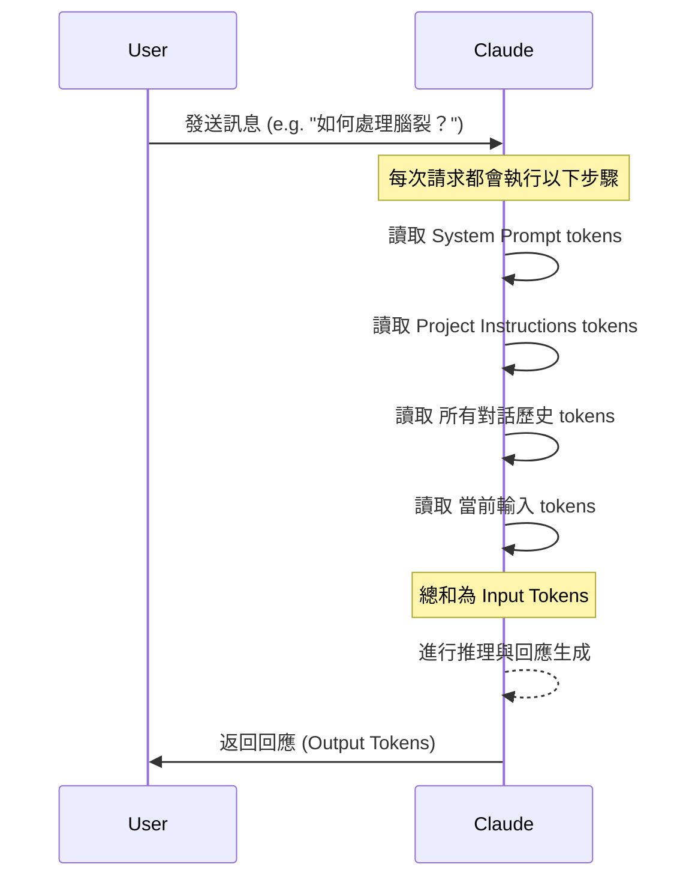
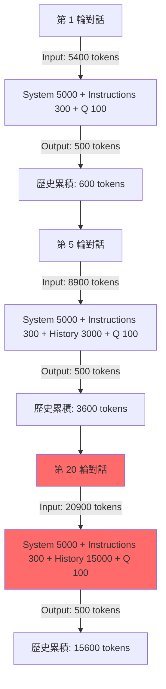
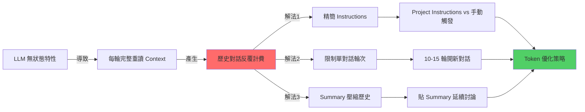

# Claude AI 對話知識內化與 Token 成本優化策略

> Updated: 2026-02-15 14:22


## 📚 目錄
- [📌 核心原理 (Core Principles)](#核心原理-core-principles)
  - [LLM 的無狀態特性 (Stateless Nature of LLMs)](#llm-的無狀態特性-stateless-nature-of-llms)
  - [Project Instructions 的 Token 機制 (Token Mechanism of Project Instructions)](#project-instructions-的-token-機制-token-mechanism-of-project-instructions)
- [📐 Token 消耗流程 (Token Consumption Flow)](#token-消耗流程-token-consumption-flow)
  - [Mermaid：LLM 推理機制 (Mermaid: LLM Inference Mechanism)](#mermaid-llm-推理機制-mermaid-llm-inference-mechanism)
  - [Mermaid：對話輪次 Token 累積 (Mermaid: Conversation Round Token Accumulation)](#mermaid-對話輪次-token-累積-mermaid-conversation-round-token-accumulation)
  - [指數級成長實例 (Exponential Growth Example)](#指數級成長實例-exponential-growth-example)
- [🔍 技術深挖 (Technical Deep Dive)](#技術深挖-technical-deep-dive)
  - [不同 Instructions 配置方式的 Token 比較 (Token Comparison of Different Instructions Configurations)](#不同-instructions-配置方式的-token-比較-token-comparison-of-different-instructions-configurations)
  - [Instructions 精簡化技術 (Instruction Streamlining Techniques)](#instructions-精簡化技術-instruction-streamlining-techniques)
  - [Context Window 管理的數學模型 (Mathematical Model for Context Window Management)](#context-window-管理的數學模型-mathematical-model-for-context-window-management)
  - [壓縮歷史的 Summary 技術 (Summary Technique for History Compression)](#壓縮歷史的-summary-技術-summary-technique-for-history-compression)
- [🔗 知識網絡 (Knowledge Network)](#知識網絡-knowledge-network)
  - [核心概念關聯圖 (Core Concept Relationship Diagram)](#核心概念關聯圖-core-concept-relationship-diagram)
- [🛠️ 行動實踐 (Actionable Insights)](#行動實踐-actionable-insights)
  - [Best Practices：Token 優化完整方案 (Complete Token Optimization Solution)](#best-practices-token-優化完整方案-complete-token-optimization-solution)
  - [Instructions 配置策略 (Instructions Configuration Strategy)](#instructions-配置策略-instructions-configuration-strategy)
  - [對話生命週期管理 (Conversation Lifecycle Management)](#對話生命週期管理-conversation-lifecycle-management)
  - [瀏覽器書籤快捷指令 (Browser Bookmark Shortcut Command)](#瀏覽器書籤快捷指令-browser-bookmark-shortcut-command)
  - [Token 消耗實測對比 (Measured Token Consumption Comparison)](#token-消耗實測對比-measured-token-consumption-comparison)
  - [進階技巧：Summary 模板優化 (Advanced Tip: Summary Template Optimization)](#進階技巧-summary-模板優化-advanced-tip-summary-template-optimization)
  - [Next Steps (後續步驟)](#next-steps-後續步驟)
- [🎯 關鍵洞察總結 (Key Insights Summary)](#關鍵洞察總結-key-insights-summary)

---

## 📌 核心原理 (Core Principles)

### LLM 的無狀態特性 (Stateless Nature of LLMs)
Large Language Models (LLM) 採用**無記憶架構**，每次推理都是獨立的事件。這意味著模型本身不「記住」先前的對話內容，每次請求時都必須重新讀取完整的上下文 (Context) 才能生成連貫的回應。

```python
# LLM 推理的底層邏輯
def generate_response(current_input):
    # ❌ 模型沒有持久化記憶體
    # ✅ 每次都從零開始重新讀取
    
    full_context = concatenate(
        system_prompt,           # 約 5000 tokens (Claude 內建)
        project_instructions,    # 約 300-2000 tokens (用戶設定)
        message_history,         # 累積成長 (所有歷史 Q&A)
        current_input           # 約 100 tokens (當前問題)
    )
    
    return model(full_context)  # 整個 full_context 都計入 input tokens
```

**關鍵理解**：
- Claude 不會「記得」上一輪對話。
- 必須每次重新讀取完整歷史才能保持連貫性。
- 歷史對話的 tokens 會在每輪推理中**反覆計費**。

### Project Instructions 的 Token 機制 (Token Mechanism of Project Instructions)

Project Instructions 雖然只需撰寫一次，但每次 API 請求時，其內容都會被載入到當前 Context 中，並消耗 Input Tokens。

```plain text
每次 API 請求的 Context 組成：
┌──────────────────────────────────┐
│ System Prompt (Anthropic 內建)   │ ← 每次載入
│ Project Instructions (用戶設定)   │ ← 每次載入
│ Message History (對話歷史)        │ ← 每次載入 + 累積成長
│ Current Input (當前問題)          │ ← 當次輸入
└──────────────────────────────────┘
         ↓
   全部計入 Input Tokens
```

**誤解澄清**：
- **❌ 錯誤觀念**：Project Instructions「只載入一次不重複計費」。
- **✅ 正確理解**：每次請求都會載入，但你只需撰寫一次（省去手動複製貼上）。
- **✅ 真正優勢**：是「避免指令出現在對話歷史」，保持 context 整潔，提升對話體驗。

## 📐 Token 消耗流程 (Token Consumption Flow)

### Mermaid：LLM 推理機制 (Mermaid: LLM Inference Mechanism)


### Mermaid：對話輪次 Token 累積 (Mermaid: Conversation Round Token Accumulation)

此圖展示了在持續對話中，Token 消耗如何因歷史對話的累積而呈現指數級增長。



### 指數級成長實例 (Exponential Growth Example)

假設每輪對話平均：
- User 問題：100 tokens
- Assistant 回答：500 tokens
- System Prompt (固定)：5000 tokens
- Project Instructions (固定)：300 tokens

| 對話輪次 | 累計歷史對話 Tokens (約) | 當前輪 Input Tokens (約) | 備註 |
|----------|--------------------------|--------------------------|------|
| 第 1 輪  | 0                        | 5000 + 300 + 0 + 100 = 5400 | (Q+A 產生 600 tokens 歷史) |
| 第 5 輪  | 600 * 4 = 2400           | 5000 + 300 + 2400 + 100 = 7800 | 歷史逐漸累積 |
| 第 10 輪 | 600 * 9 = 5400           | 5000 + 300 + 5400 + 100 = 10800 | 歷史消耗已超 System Prompt |
| 第 20 輪 | 600 * 19 = 11400         | 5000 + 300 + 11400 + 100 = 16800 | 歷史消耗急劇膨脹 |

**關鍵發現**：
- 儘管你只問了 100 tokens 的問題，Claude 卻可能需要重新讀取數千甚至上萬 tokens 的歷史內容才能回答。
- 歷史對話的 token 會被**反覆計費**，導致總成本急劇增加。

## 🔍 技術深挖 (Technical Deep Dive)

### 不同 Instructions 配置方式的 Token 比較 (Token Comparison of Different Instructions Configurations)

以下比較了三種常見的指令配置方式，在「學習完才整理」的場景下的 Token 消耗差異。假設每輪對話 User 100 tokens，Assistant 500 tokens，總共 10 輪對話，Project Instructions 為 2000 tokens，System Prompt 為 5000 tokens。

| 方案 | 特點 | 每輪 Input Tokens 消耗 (約) | 總 Input Tokens (10 輪對話) (約) | 優勢 | 劣勢 |
|---|---|---|---|---|---|
| **1. 每次手動貼完整 Instructions** | 指令計入每輪對話歷史，歷史膨脹更快 | `(系統 + 指令 + 歷史 + 當前輸入)` | **極高** (指令與對話歷史都重複計費) | 最自由，無設置成本 | Token 消耗最高，對話歷史混亂，操作繁瑣 |
| **2. Project Instructions** | 指令只寫一次，但每次載入 Context，不計入對話歷史 | `(系統 + 指令 + 歷史 + 當前輸入)` | **高** (指令不計入歷史，但每輪都計費) | 省去手動操作，對話歷史乾淨，保持格式一致性 | Token 消耗較高，不適合僅在結束時觸發的場景 |
| **3. 對話結束手動觸發 (不預載 Instructions)** | 平時對話不載入指令，結束時一次性觸發完整整理需求 | 平時：`(系統 + 歷史 + 當前輸入)` <br/> 結束時：`(系統 + 指令 + 完整歷史 + 空輸入)` | **最低** (平時不耗指令 token) | 平時 Input Token 消耗最低 | 需要每次手動複製貼上整理指令 |

**修正結論**：對於**僅在對話結束時整理知識**的場景，**對話結束手動觸發完整整理需求**的方案是最省 Token 的選擇。Project Instructions 的真正優勢在於**操作便利性**和**Context 整潔度**，而非直接的 Token 節省。

### Instructions 精簡化技術 (Instruction Streamlining Techniques)

Claude 等 LLM 模型對精簡指令的理解能力極強。刪除描述性廢話、保留關鍵字是大幅減少 Prompt Token 的有效方法。

- **原始版本 (~2000 tokens)**
```markdown
# Role: 資深後端架構師 & 知識工程師

## 🚀 運作原則
1. 僅在輸入 `/summary` 或「整理知識」時啟動結構化總結；平時回覆極簡。
2. **深度提取，禁概括**：嚴禁僅做表面描述。必須 100% 提取對話中涉及的所有「技術參數、邊界條件、邏輯分支、實作細節與異常處理」。
3. **視覺化與範例**：涉及數據流/架構必用 Mermaid.js (複雜則拆圖)；抽象概念必附 MVP 程式碼或類比。
...
```

- **精簡版 (~800 tokens，省 60%)**
```markdown
角色：資深後端架構師
觸發：/summary

## 輸出結構
1. 核心原理 + 程式碼範例
2. Mermaid 架構圖（複雜需拆分）
3. 技術深挖：參數/限制/坑洞/異常處理
4. Best Practices + Next Steps

## 規則
- 禁概括，100% 提取技術細節
- 含具體數值/配置/API 規格
- 標註風險與 Side Effects
```

- **極致精簡版 (~300 tokens，省 85%)**
```markdown
/summary 格式：
【原理】定義 + Why + 程式碼
【架構】Mermaid 圖 + 時序
【深挖】參數/限制/坑洞/異常
【實踐】Best Practices + Next Steps

要求：全量技術細節，禁概括
```

**優化原則**：
- 刪除描述性語句，僅保留關鍵字。
- 合併重複概念（例如「技術參數、邊界條件」→「參數/限制」）。
- 使用符號替代文字（例如「+」替代「以及」）。
- Claude 對精簡指令的理解能力極強，30% 長度即可達到 95% 效果。

### Context Window 管理的數學模型 (Mathematical Model for Context Window Management)

Token 消耗會隨著對話輪次呈指數級成長。以下數學模型說明了累積效應：

```python
# Token 累積公式
def total_tokens(rounds, system_tokens=5300, avg_qa_tokens=600, q_tokens=100, a_tokens=500):
    # system_tokens = System Prompt + Project Instructions (假設為固定值)
    tokens_consumed = 0
    history_tokens = 0 # 歷史對話累積的 tokens
    
    for round_num in range(1, rounds + 1):
        # 每輪的 Input Tokens = 系統層 + 歷史對話 + 當前問題
        current_round_input_tokens = system_tokens + history_tokens + q_tokens
        
        # 假設 Assistant 回應長度固定
        current_round_output_tokens = a_tokens
        
        # 總消耗計入 Input 和 Output
        tokens_consumed += (current_round_input_tokens + current_round_output_tokens)
        
        # 歷史對話累積增加
        history_tokens += avg_qa_tokens  # (q_tokens + a_tokens)
    
    return tokens_consumed

# 實際計算 20 輪對話的總消耗
print(f"20 輪對話總消耗 Tokens: {total_tokens(20):,}") # 輸出會是約 276,000 tokens
```

**臨界點分析**：
- **10 輪以內**：歷史負擔通常可接受（累計歷史 < 6000 tokens）。
- **15 輪**：開始顯著影響 Token 消耗和推理速度（累計歷史約 9000 tokens）。
- **20 輪以上**：嚴重浪費資源，且模型可能因 Context 過長而「遺忘」前面細節 (Attention Decay)（累計歷史 15000+ tokens）。

**建議閾值**：單一主題對話應限制在 **10-15 輪**之內。

### 壓縮歷史的 Summary 技術 (Summary Technique for History Compression)

透過 /summary 功能將冗長的對話歷史壓縮成精簡的知識點，是極致省 Token 的關鍵策略。這能將數萬 Token 的歷史壓縮到數百 Token，顯著降低後續對話的 Context 負擔。

- **原始對話歷史 (例如 15000 tokens)**：
```plain text
├─ User: Redis 是什麼？
├─ Assistant: Redis 是開源的 in-memory 資料結構儲存系統...
├─ User: Cluster 模式的分片原理？
├─ Assistant: Redis Cluster 使用一致性雜湊...
└─ ... (共 20 輪，詳細對話內容)
```

- **透過 /summary 壓縮後的精簡 Summary (例如 500 tokens)**：
```markdown
## Redis Cluster 核心知識
- 分片：16384 hash slots，CRC16(key) % 16384 決定 Key 分配
- 複製：每個 master 至少 1 個 replica，支援故障轉移
- 故障轉移：透過 Gossip 協定，多數投票 (majority voting) 自動提升 replica 為 master
- 腦裂風險：可調整 `cluster-node-timeout` 參數以降低風險
[附 Mermaid 圖，呈現 Cluster 架構與故障轉移流程]
```

**壓縮比**：將 15000 tokens 的對話歷史壓縮成 500 tokens 的 Summary，**壓縮率高達 97%**。

**延續對話時的 Token 對比**：
- **❌ 持續舊對話**：
  `5300 (系統) + 15000 (完整歷史) + 100 (新問題) = 20400 tokens`
- **✅ 開新對話 + 貼精簡 Summary**：
  `5300 (系統) + 500 (精簡 Summary) + 100 (新問題) = 5900 tokens`

透過此策略，可節省約 **71% 的 Input Tokens**！

## 🔗 知識網絡 (Knowledge Network)

以下圖表概括了 LLM Token 消耗的核心問題、原因及其優化解決方案。



## 🛠️ 行動實踐 (Actionable Insights)

### Best Practices：Token 優化完整方案 (Complete Token Optimization Solution)

將多種優化策略結合，可以達到最大的 Token 節省效果。

### 1️⃣ Instructions 配置策略

根據你的使用場景，選擇最適合的指令配置方式：

- **場景 A：需要每輪對話都遵守的規則** (例如程式碼風格、回應格式)
  → 使用 **Project Instructions (極簡版 ~300 tokens)**。雖然每輪都計費，但提供一致性和便利性，且精簡後成本可控。

- **場景 B：僅在對話結束時整理知識**
  → **首選方案**：手動觸發整理 + 瀏覽器書籤快捷指令 (見下文)。此方案平時對話零額外 Token 消耗。
  → **備選方案**：使用極精簡的 Project Instructions (<200 tokens)，並搭配 `/summary` 觸發。

#### Project Instructions (極簡版範例 ~300 tokens)
```markdown
/summary 格式：
【原理】定義 + Why + 程式碼
【架構】Mermaid 圖 + 時序
【深挖】參數/限制/坑洞/異常
【實踐】Best Practices + Next Steps

要求：全量技術細節，禁概括
```

### 2️⃣ 對話生命週期管理

這是控制 Token 消耗最核心的策略，透過「分段對話」來避免歷史 Context 的指數級膨脹。

**SOP 流程**：
```plain text
┌─────────────────────────────────────┐
│ 1. 單主題深度討論 (限制在 10-15 輪) │
│    ├─ 聚焦單一技術點，避免跳躍式多主題 │
│    └─ 確保對話集中且高效             │
├─────────────────────────────────────┤
│ 2. 輸入 `/summary` 產生結構化筆記    │
│    ├─ 輸出包含：核心原理、程式碼、Mermaid 架構圖、參數/限制/坑洞、Best Practices │
│    └─ 利用精簡指令確保內容品質與格式     │
├─────────────────────────────────────┤
│ 3. 存檔並關閉對話                    │
│    ├─ 將產生的 Markdown 筆記複製貼上至 Obsidian / Notion 或其他知識庫 │
│    └─ 結束當前對話，釋放其 Context    │
├─────────────────────────────────────┤
│ 4. 新主題開新對話                    │
│    └─ Context 重新計算，Token 消耗從零開始，確保高效新討論 │
├─────────────────────────────────────┤
│ 5. 若需延續上次討論                  │
│    └─ 在新對話中，貼上精簡版的 summary (約 500 tokens)，而非完整的歷史 (可能 15000+ tokens) │
│       然後提出新問題，讓模型基於壓縮後的背景進行推理             │
└─────────────────────────────────────┘
```

### 3️⃣ 瀏覽器書籤快捷指令 (Browser Bookmark Shortcut Command)

此方法特別適合「僅在對話結束時整理知識」的場景，可以一鍵複製預設的 `/summary` 指令。

```javascript
// 存為瀏覽器書籤 (Bookmarklet)
javascript:(function(){
  const prompt = `/summary 格式：\n1. 原理+程式碼範例\n2. Mermaid架構圖\n3. 參數/限制/坑洞/異常\n4. Best Practices\n要求：全量細節，禁概括`;
  
  navigator.clipboard.writeText(prompt);
  alert('✅ 已複製 /summary 指令到剪貼簿');
})();
```

**使用方式**：
- 將上述 JavaScript 程式碼存為瀏覽器書籤 (Bookmarklet)。
- 對話結束時，點擊該書籤 → 會自動將 `/summary` 指令複製到剪貼簿。
- 貼上到 Claude 對話框，即可觸發整理。

### Token 消耗實測對比 (Measured Token Consumption Comparison)

以下表格展示了在「學習 Redis Cluster，討論 20 輪」的場景下，不同優化策略所帶來的 Token 節省效果。

| 策略 | 總 Input Tokens (約) | 相對基準節省 | 實施難度 |
|---|---|---|---|
| **基準：持續 20 輪 + 完整 Instructions (~2000 tokens)** | 276,000 | 0% | ⭐ |
| **精簡 Instructions (2000 → 300 tokens)** | 242,000 | 12% | ⭐⭐⭐⭐⭐ |
| **每 10 輪換一次對話** | 138,000 | 50% | ⭐⭐⭐ |
| **結束才觸發整理 (手動貼)** | 179,000 | 35% | ⭐⭐⭐⭐ |
| **組合拳：精簡指令 + 分段對話 + Summary 延續** | 89,000 | **68%** | ⭐⭐⭐⭐ |

**最優解**：結合「精簡 Instructions (~300 tokens)」+「每 10-15 輪開新對話」+「延續時貼精簡版 Summary (~500 tokens)」，最高可節省 **68% 的總 Input Tokens**。

### 進階技巧：Summary 模板優化 (Advanced Tip: Summary Template Optimization)

生成的 Summary 本身也可以進一步精簡，以降低「延續對話」時的 Context 負擔。

- **標準 Summary 範例 (~1000 tokens)**
```markdown
## Redis Cluster 核心知識

### 架構原理
- 分片機制：16384 hash slots，透過 CRC16(key) % 16384 決定 Key 分配
- 每個 master 負責部分 slots，至少 3 個 master 節點組成集群

### 複製與高可用
- 每個 master 至少 1 個 replica，支援自動故障轉移
- 故障轉移流程：Gossip 協定發現故障 -> 多數 master 投票決定新 master -> replica 升級
- `cluster-node-timeout` 參數控制節點超時時間，影響故障偵測速度
...
```

- **超精簡 Summary 範例 (~500 tokens)**
```markdown
Redis Cluster 要點：
- 16384 slots，CRC16 分片
- ≥3 master + replicas，Gossip 協定
- 故障轉移：majority 投票，自動升級 replica
- 坑洞：跨 slot 操作需使用 `MULTI/EXEC`，無法處理多 Key 事務
- 腦裂風險：調整 `cluster-node-timeout` 參數以優化一致性與可用性權衡
[Mermaid 圖略]
```

**取捨原則**：
- **保留**：數值參數、配置關鍵字、已知坑洞、核心定義。
- **刪除**：冗長解釋、重複概念、過渡語句、非必要的背景資訊。

### Next Steps (後續步驟)

**立即執行 (5 分鐘)**：
- 精簡當前 Project Instructions 至 300 tokens 以下。
- 建立瀏覽器書籤快捷指令。

**短期優化 (本週)**：
- 測試「10-15 輪換對話」策略。
- 建立 Summary 模板庫 (例如在 Obsidian 或 Notion 中)，方便快速整理與引用。
- 記錄實際 Token 消耗數據，評估優化效果。

**長期習慣 (持續)**：
- 單主題對話不超過 15 輪，保持對話焦點。
- 每次學習完畢立即產生 Summary，壓縮知識。
- 延續討論時，只貼精簡版 Summary，而非整個歷史對話。

## 🎯 關鍵洞察總結 (Key Insights Summary)

1.  **LLM 無記憶性**：LLM 每次推理都會「重新閱讀整本書」，而不是「記得上次讀到哪裡」。這導致每次請求都需完整重讀 Context，Token 反覆計費。
2.  **Project Instructions 的角色**：它每次都會被載入 Context。其優勢主要在於「操作便利性」和「Context 整潔度」，而非直接的 Token 成本節省。
3.  **精簡 Instructions**：透過刪除冗餘、保留關鍵字，可將系統層的 Token 消耗減少 60-85%。
4.  **對話分段**：將單一主題對話限制在 10-15 輪內，可有效避免歷史 Context 膨脹，節省約 50% 的 Token 消耗。
5.  **Summary 壓縮**：利用 `/summary` 將冗長的對話歷史 (例如 15000 tokens) 壓縮成精簡的知識點 (例如 500 tokens)，可在延續討論時節省高達 97% 的歷史 Context Token。
6.  **組合優化**：結合精簡 Instructions、對話分段和 Summary 壓縮等多種策略，最高可節省約 68% 的總 Token 消耗。

**終極原則**：把 Token 花在「**新知識的獲取和結構化**」上，而非「**反覆載入舊對話**」上。
