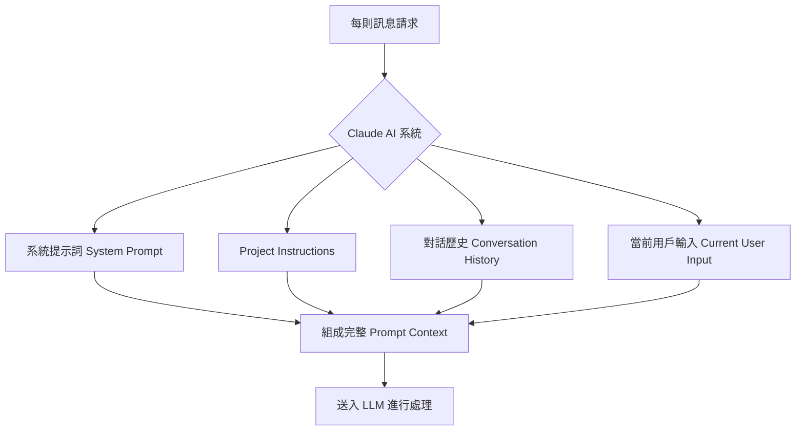
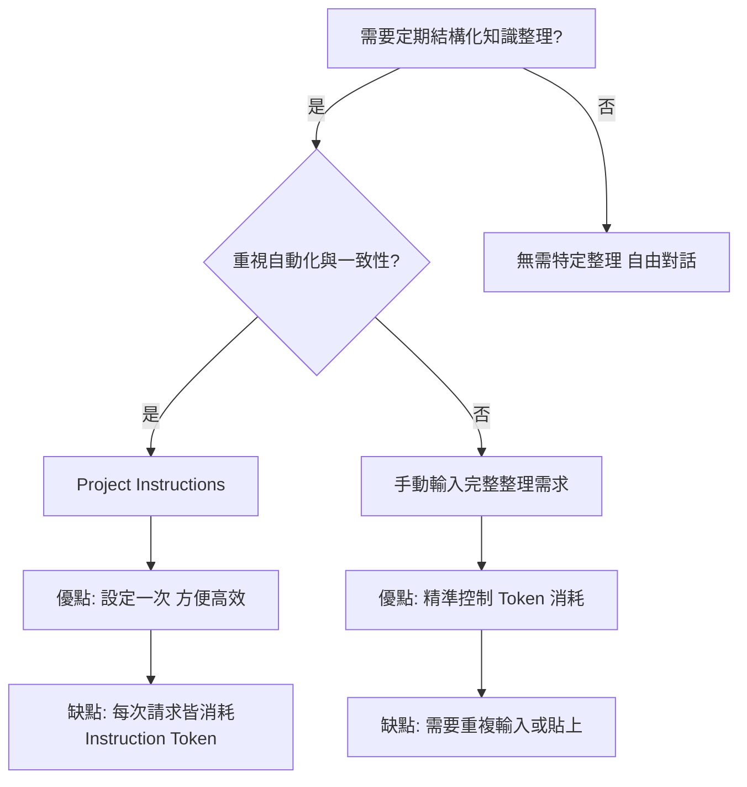

# 內容整理：利用 Claude AI 進行深度知識內化與效率優化

> Updated: 2026-02-15 11:41


本文深入探討如何利用 Claude AI 進行對話式學習後的知識整理與內化，並詳細比較不同方案在自動化程度與 Token 消耗上的差異，旨在提供資深技術架構師與知識管理專家一套高效且精準的實踐方法。

## 目錄

*   [1. 前言](#1-前言)
*   [2. Claude AI 知識整理方案比較](#2-claude-ai-知識整理方案比較)
    *   [2.1 Custom Instructions (個人指令)](#21-custom-instructions-個人指令)
    *   [2.2 Project Knowledge (專案知識)](#22-project-knowledge-專案知識)
    *   [2.3 Styles 功能 (風格設定)](#23-styles-功能-風格設定)
*   [3. 實戰技巧與自動化觸發](#3-實戰技巧與自動化觸發)
    *   [3.1 自動化觸發器](#31-自動化觸發器)
    *   [3.2 Artifacts 輸出](#32-artifacts-輸出)
    *   [3.3 記憶系統](#33-記憶系統)
*   [4. Token 消耗機制深度解析](#4-token-消耗機制深度解析)
    *   [4.1 Claude AI 的 Context 組成](#41-claude-ai-的-context-組成)
    *   [4.2 Project Instructions Token 消耗的真相](#42-project-instructions-token-消耗的真相)
    *   [4.3 方案間 Token 消耗對比](#43-方案間-token-消耗對比)
*   [5. 學習場景下的最佳策略](#5-學習場景下的最佳策略)
    *   [5.1 推薦策略：Project Instructions + 精簡觸發 (修正版)](#51-推薦策略-project-instructions-精簡觸發-修正版)
    *   [5.2 極致省 Token 技巧](#52-極致省-token-技巧)
    *   [5.3 最終考量與建議](#53-最終考量與建議)
*   [6. 結論](#6-結論)

---

## <a id="1-前言"></a>1. 前言

在使用 AI 進行知識學習與探索的過程中，如何將對話中零散的資訊高效地整理成結構化知識，是提升學習效率的關鍵。本文將聚焦於 Claude AI 平台，探討其提供的各種功能與實戰技巧，並特別針對 `Project Instructions` 的 Token 消耗機制進行深入剖析與修正，以協助讀者選擇最適合自身場景的知識整理策略。

## <a id="2-claude-ai-知識整理方案比較"></a>2. Claude AI 知識整理方案比較

Claude AI 提供了多種工具來輔助知識整理與對話行為設定。以下是對主要方案的比較：

### <a id="21-custom-instructions-個人指令"></a>2.1 Custom Instructions (個人指令)

*   **說明**：在 Claude.ai 的設定中啟用此功能，貼入你的角色定義或整理要求。一旦設定，每次對話都會自動套用這些指令。
*   **優點**：設定簡單，跨所有對話生效，可搭配觸發詞（如 `/summary`）使用。
*   **缺點**：每次對話都會將指令加入 Context，增加 Token 消耗。不適合僅在特定時機才需整理的場景。

### <a id="22-project-knowledge-專案知識"></a>2.2 Project Knowledge (專案知識)

*   **說明**：在 Claude.ai 中為特定主題建立專屬 `Project`，並在該 `Project Instructions` 中貼入完整的角色設定與整理要求。所有在該 Project 下的對話會自動繼承此規則。
*   **優點**：為特定主題提供高度自動化與一致性，避免重複設定。適合針對某一特定領域進行深度學習和知識沉澱。
*   **缺點**：與 Custom Instructions 類似，Project Instructions 也會在每次請求時被載入到 Context 中，消耗 Token。這點在後續 Token 消耗深度解析中會詳細澄清。

### <a id="23-styles 功能-風格設定"></a>2.3 Styles 功能 (風格設定)

*   **說明**：此功能允許用戶設定 AI 的輸出風格偏好（例如：幽默、專業、簡潔等）。
*   **優點**：快速調整 AI 的語氣和表達方式。
*   **缺點**：僅限於文字風格調整，無法控制複雜的邏輯觸發或結構化內容生成，不適用於知識整理任務。

## <a id="3-實戰技巧與自動化觸發"></a>3. 實戰技巧與自動化觸發

除了上述核心設定外，還有一些實戰技巧可以提升知識整理的效率：

### <a id="31-自動化觸發器"></a>3.1 自動化觸發器

可以在對話末尾加入特定的觸發詞或短語，指示 Claude 執行整理任務。例如：

```plain text
在每次對話末尾加入：
"本次討論涉及 [技術領域]，請用 /summary 格式整理"
```

搭配 `Custom Instructions` 或 `Project Instructions` 中定義的 `/summary` 格式，可以實現半自動化的整理流程。

### <a id="32-artifacts 輸出"></a>3.2 Artifacts 輸出

要求 Claude 將整理結果以 `Markdown artifact` 的形式輸出。這方便使用者直接複製內容到 Obsidian、Notion 或其他知識管理工具中，保持格式的完整性。

### <a id="33-記憶系統"></a>3.3 記憶系統

啟用 Claude 的 `Memory` 功能 (在 `Settings → Memory` 中)，Claude 會跨對話記住你的偏好格式和指示。這有助於在長期互動中維持輸出的一致性。

## <a id="4-token-消耗機制深度解析"></a>4. Token 消耗機制深度解析

關於 `Project Instructions` 是否「省 Token」的討論存在一些誤解。本節將徹底澄清 Claude AI 的 Token 消耗真相。

### <a id="41-claude-ai-的-context-組成"></a>4.1 Claude AI 的 Context 組成

理解 Token 消耗的關鍵在於了解 Claude AI 每次處理訊息時，其 `Context`（即模型所能「看到」的輸入）是如何組成的。無論是哪種指令類型，每次請求的完整 Context 都會包含以下元素：



如圖所示，`Project Instructions`（或 `Custom Instructions`）會**每次**都被載入到完整的 `Prompt Context` 中，與 `系統提示詞`、`對話歷史` 和 `當前輸入` 一同送入大型語言模型 (LLM) 進行處理。這意味著，這些指令的 Token 數量會**每次請求都計算在內**。

### <a id="42-project-instructions-token-消耗的真相"></a>4.2 Project Instructions Token 消耗的真相

之前可能存在的錯誤觀念是認為 `Project Instructions` 或 `Custom Instructions` 「只載入一次」或「不重複計費」。

*   **錯誤說法**：「指令只載入一次」→ 這指的是你**只需撰寫一次**指令，無需每次手動複製貼上。
*   **正確理解**：「指令每次都會計算」→ 實際上，每次向 Claude 發送訊息時，後端都會將你的 `Project Instructions` 或 `Custom Instructions` 讀取出來，並將其與其他 Context 內容（系統提示詞、對話歷史、當前輸入）合併，形成一個完整的 Prompt 送給模型。因此，**Project Instructions 的 Token 數量，每次請求都會被消耗**。

### <a id="43-方案間 Token 消耗對比"></a>4.3 方案間 Token 消耗對比

假設 `Project Instructions` 或 `Custom Instructions` 的內容約為 2000 tokens：

| 方案                   | 設定指令            | 平時對話 (不觸發整理)   | 觸發整理 (如 `/summary`) | 總 Token 消耗 (每次請求)                                       |
| :--------------------- | :------------------ | :---------------------- | :----------------------- | :------------------------------------------------------------- |
| **手動輸入完整需求**   | 無                  | 最少 (僅對話歷史+當前輸入) | 較多 (對話歷史+當前輸入+完整整理指令)                        | `當前輸入` + `對話歷史` (整理時額外含指令 Token)              |
| **Custom Instructions**| 於設定中預載        | 較多 (指令 + 對話歷史 + 當前輸入) | 最多 (指令 + 對話歷史 + 當前輸入 + 觸發詞)                 | `指令` + `當前輸入` + `對話歷史`                              |
| **Project Instructions**| 於 Project 中預載   | 較多 (指令 + 對話歷史 + 當前輸入) | 最多 (指令 + 對話歷史 + 當前輸入 + 觸發詞)                 | `指令` + `當前輸入` + `對話歷史`                              |

從 Token 消耗的角度來看：

*   `Custom Instructions` 和 `Project Instructions` 在**每次對話**時都會增加 `指令 Token` 的消耗，即使沒有觸發整理功能。
*   如果僅在對話結束時才需要整理，那麼**每次手動輸入完整的整理需求** (或透過書籤快捷貼上) 反而是最省 Token 的方案，因為平時對話不會額外消耗指令的 Token。

## <a id="5-學習場景下的最佳策略"></a>5. 學習場景下的最佳策略

針對「藉由對話學習知識，對話完後整理」的場景，以下是基於 Token 消耗與便利性的最佳策略建議。

### <a id="51-推薦策略：Project Instructions + 精簡觸發-修正版"></a>5.1 推薦策略：Project Instructions + 精簡觸發 (修正版)

儘管 `Project Instructions` 不會省 Token，但它的真正優勢在於**便利性與一致性**。對於頻繁進行某類知識學習，且不介意每次對話多消耗少量 Token 以換取高度自動化的用戶，這仍然是一個很好的選擇。

**推薦設定方式**：

將核心角色定義與整理要求放入 `Project Instructions` 中，並設計一個精簡的觸發詞。

```plain text
# Project Instructions (精簡版 ~1500 tokens)
你是資深後端架構師。當用戶輸入 /summary 時，
按以下格式整理對話知識：

## 輸出結構
1. 核心原理 + 程式碼範例
2. Mermaid 架構圖
3. 技術深挖（參數/限制/坑洞）
4. Best Practices

## 要求
- 禁止概括，100% 提取技術細節
- 複雜流程必拆分 Mermaid 圖
- 附 MVP 程式碼或類比
```

**實際使用流程**：

1.  **平時對話**：正常進行知識交流，此時 `Project Instructions` 的 Token 會被計入，但你無需額外動作。
2.  **學習完畢**：在對話末尾輸入 `/summary`，Claude 便會根據預設的格式進行整理。
3.  **優勢**：確保每次整理的格式高度一致，且避免手動複製貼上長篇指令的麻煩。對於長期且主題明確的知識學習，其帶來的便利性價值通常高於增加的 Token 成本。

### <a id="52-極致省 Token 技巧"></a>5.2 極致省 Token 技巧

如果用戶對 Token 成本極度敏感，且整理頻率不高，則可以放棄自動化，選擇手動觸發完整整理需求。

**操作流程**：

1.  **平時對話**：不帶任何預載的指令，僅消耗對話內容 Token。
2.  **學習完畢**：手動輸入完整的整理需求。為了提高效率，可以將這段文字存為瀏覽器書籤，需要時一鍵貼上。

**快捷文字範例**：

```plain text
# 存為書籤快捷文字範例
以資深架構師視角整理本次對話技術知識：
1. 核心原理 + 程式碼範例
2. Mermaid 架構圖（複雜需拆分）
3. 技術深挖（參數/限制/坑洞）
4. Best Practices
要求：100% 提取細節，禁止概括
```

### <a id="53-最終考量與建議"></a>5.3 最終考量與建議

選擇哪種策略取決於你的優先級：

*   **重視自動化與一致性**：選擇 `Project Instructions` (儘管會消耗 Token)。其「省去每次複製貼上的麻煩」和「確保格式一致性」的優勢，在知識管理上效率更高。
*   **重視 Token 成本最小化**：選擇手動貼上完整整理需求，或僅在必要時才手動撰寫。這對於不常需要結構化整理，或整理需求多變的場景更為經濟。

以下流程圖可輔助決策：



## <a id="6-結論"></a>6. 結論

有效的知識內化不僅關乎工具的選擇，更在於對其底層機制（如 Token 消耗）的精準理解。雖然 `Project Instructions` 並非最省 Token 的方案，但其提供的「設定便利性」和「格式一致性」對於長期、系統性的知識管理場景而言，仍是極具價值的。讀者應根據自身的實際需求和優先級，靈活運用這些策略，以最大化 Claude AI 在知識學習與整理中的效用。