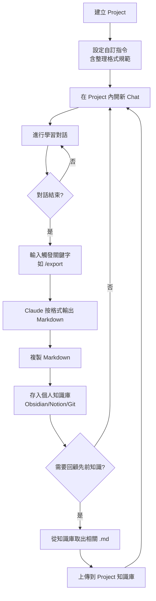
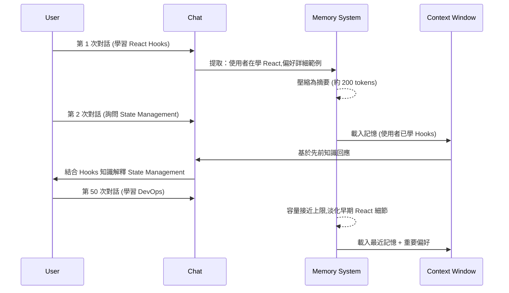
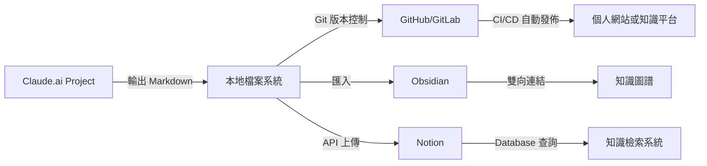
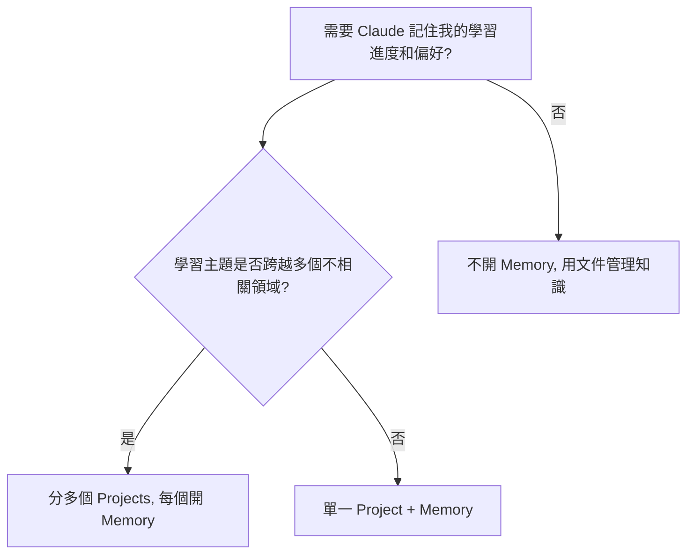
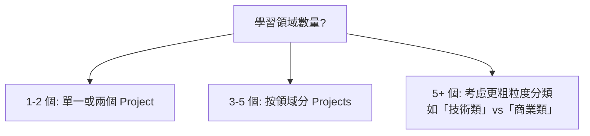

# Claude.ai 智慧助手知識管理工作流與最佳實踐

> Updated: 2026-02-16 15:10


## 目錄
- [1. 核心原理](#1-核心原理)
  - [1.1 Claude.ai 的三大上下文管理機制](#11-claudeai-的三大上下文管理機制)
  - [1.2 實務範例：觸發式知識整理系統](#12-實務範例觸發式知識整理系統)
- [2. 架構流程](#2-架構流程)
  - [2.1 Projects + 自訂指令 + 外部儲存的完整工作流](#21-projects--自訂指令--外部儲存的完整工作流)
  - [2.2 Memory 運作時序](#22-memory-運作時序)
  - [2.3 步驟說明](#23-步驟說明)
- [3. 技術深挖](#3-技術深挖)
  - [3.1 Projects 自訂指令的技術細節](#31-projects-自訂指令的技術細節)
  - [3.2 Memory 的容量管理機制](#32-memory-的容量管理機制)
  - [3.3 外部儲存方案的技術考量](#33-外部儲存方案的技術考量)
- [4. 知識網絡與跨工具整合](#4-知識網絡與跨工具整合)
  - [4.1 跨工具整合與知識網絡](#41-跨工具整合與知識網絡)
- [5. 行動實踐](#5-行動實踐)
  - [5.1 Best Practices](#51-best-practices)
  - [5.2 風險控管 — 常見坑洞](#52-風險控管--常見坑洞)
  - [5.3 Next Steps](#53-next-steps)
- [6. 關鍵決策樹](#6-關鍵決策樹)

## 1. 核心原理

本節將深入探討 Claude.ai 在個人知識管理 (PKM) 中扮演的關鍵角色，特別是其三大核心上下文管理機制：Projects、Memory 和 Styles，以及如何利用這些機制建立一套高效的知識整理工作流。

### 1.1 Claude.ai 的三大上下文管理機制

Claude.ai 提供強大的上下文管理功能，讓使用者能更有效率地進行學習與知識整理。這主要透過 Projects、Memory 和 Styles 三個層面實現。

-   **Projects (專案)**
    -   **定義**：Claude.ai 的工作空間容器，一個 Project 可包含多個 chats、自訂指令和知識庫檔案。
    -   **運作邏輯**：Project 內所有對話共享同一份「自訂指令 (Custom Instructions)」和上傳的知識庫文件。每次開啟新的 chat 時，這些共享上下文會自動載入。
    -   **底層原理**：自訂指令在每次對話啟動時被注入到 System Prompt 層級，這使得它們對 Claude 的所有回應行為具有高優先級的影響力。

-   **Memory (記憶功能)**
    -   **定義**：跨對話的持久化記憶系統，旨在自動提取並保存使用者偏好、學習進度、以及重要資訊，以供後續對話參考。
    -   **運作邏輯**：
        -   **Token 消耗**：每次對話會額外消耗約 500-2000 tokens (相當於 1-2 頁背景資訊)，用於載入和更新記憶。
        -   **容量管理**：Memory 設有上限，但具體數字未公開。當記憶接近上限時，系統會自動淘汰較舊或不重要的記憶。

-   **Styles (風格設定)**
    -   **定義**：全局的回應風格預設，可跨所有對話和 Projects 套用。
    -   **適用場景**：用於設定固定的寫作風格（例如：正式、技術性、簡潔）、偏好的特定領域術語，或確保一致的溝通方式。

### 1.2 實務範例：觸發式知識整理系統

透過在 Project 的「自訂指令 (Custom Instructions)」中預先設定結構化的輸出格式，可以實現自動化的知識整理。以下是一個 Markdown 格式的範例指令：

```markdown
## 知識整理專家模式

當我說「整理」、「總結」或「/export」時，請將本次對話整理成 Markdown：

---
# [主題名稱]
**日期：** YYYY-MM-DD  
**領域：** [技術/商業/其他]

## 📚 核心概念
[關鍵概念列點]

## 💡 重點筆記
[詳細說明]

## 🔗 相關知識
[與其他主題的連結]

## 💻 程式碼/範例
[如有程式碼]

## ⚡ 待辦/行動項目
- [ ] [可實踐的下一步]

## 🏷️ 標籤
`#tag1` `#tag2`
---
```

**這種設定方式的有效性體現在以下幾個方面：**

-   **關鍵字觸發機制**：預設的觸發詞（如「整理」、「總結」、「/export」）使整理動作標準化，確保在需要時能即時啟動。
-   **Markdown 格式輸出**：直接輸出為 Markdown 格式，確保內容可以直接複製到任何支援 Markdown 的筆記系統（如 Obsidian, Notion, 純文本編輯器）。
-   **結構化區塊**：明確定義的標題和區塊（核心概念、重點筆記、相關知識等）強制 Claude 提取對話中的所有重要資訊，並以清晰的結構呈現，避免遺漏。

## 2. 架構流程

本節將深入探討 Claude.ai 在個人知識管理 (PKM) 中扮演的關鍵角色，特別是其三大核心上下文管理機制：Projects、Memory 和 Styles，以及如何利用這些機制建立一套高效的知識整理工作流。

### 2.1 Projects + 自訂指令 + 外部儲存的完整工作流

以下流程圖展示了如何結合 Claude.ai 的 Projects 與自訂指令，並整合外部知識儲存方案，建立一個完整的知識管理循環。



### 2.2 Memory 運作時序

Memory 功能在對話中自動運作，理解使用者的學習進度和偏好，並在後續對話中利用這些記憶來提供更精準的回應。以下時序圖展示了 Memory 的運作方式。



### 2.3 步驟說明

完整的知識整理工作流可分為初始設定與日常使用兩個階段：

**1. 初始設定階段 (一次性)**

-   **建立 Project**：在 Claude.ai 中建立一個新的 Project，並給予清晰的命名，例如「後端技術學習」。
-   **設定自訂指令**：
    -   進入該 Project 的 Settings。
    -   選擇 Custom Instructions。
    -   貼上預先定義好的知識整理格式規範（參考上述範例）。
-   **開啟 Memory 功能 (可選)**：
    -   進入 Settings → Features → Memory。
    -   決定是否開啟 Memory 功能，建議先不開啟，觀察一週後再根據實際使用體驗決定。

**2. 日常使用循環**

-   **開啟新對話**：在所選 Project 內開啟一個新的 chat，針對特定主題進行學習和討論。
-   **自動遵循指令**：在對話過程中，Claude 會自動遵循自訂指令中設定的行為規範和輸出格式要求。
-   **觸發整理**：當對話結束，需要整理知識時，輸入預設的觸發關鍵字（例如 `/export`）。
-   **輸出與儲存**：Claude 會輸出格式化的 Markdown 整理內容。複製這些內容並儲存到個人的知識庫系統中（如 Obsidian, Notion, 或 Git repository）。
-   **回顧與載入**：下次需要參考或基於先前知識進行討論時，從個人知識庫中取出相關的 Markdown 文件，並將其上傳回目前的 Project，作為新的上下文。

**3. Memory 的自動運作 (如有開啟)**

-   **背景提取**：Memory 會在背景自動提取對話中的重要資訊，無需使用者手動操作。
-   **自動載入**：在新對話啟動時，先前保存的記憶會自動載入到 Claude 的上下文 (context) 中，影響其回應。
-   **管理記憶**：使用者可以在 Settings → Memory 中查看和管理已儲存的記憶內容。

## 3. 技術深挖

本節將深入探討 Claude.ai 的技術細節，包括 Projects 自訂指令的注入層級與 Token 消耗、Memory 的容量管理機制，以及外部儲存方案的技術考量。

### 3.1 Projects 自訂指令的技術細節

自訂指令是 Claude.ai 提供的一個強大功能，用於細緻地控制 AI 的行為和輸出。

-   **注入層級**：
    -   自訂指令在 `System Prompt` 層級生效，這意味著它們的優先級高於一般對話內容。
    -   其作用類似於 Claude Code 中的 `CLAUDE.md` 文件，但適用於 claude.ai 網頁端的使用。
    -   指令會在每次對話啟動時自動載入，無需在每個新對話中重複描述。

-   **Token 消耗**：
    -   自訂指令本身會佔用 Claude 的上下文視窗 (context window) 的 tokens。
    -   **建議**：將自訂指令的長度控制在 500-1000 tokens 內（約 1-2 頁文字），以避免過度消耗上下文空間，影響實際對話可用的 tokens 數量。

-   **最佳實踐**：
    -   **明確觸發關鍵字**：使用明確且不模糊的觸發關鍵字，例如 `/export`、`整理`、`總結`，以確保整理動作的精確觸發。
    -   **避免模糊指令**：避免使用「保持專業」等模糊指令，改用具體規則，例如「使用學術語氣，並附上參考文獻連結」。
    -   **直接嵌入格式範本**：將所需的輸出格式範本（如 Markdown 結構）直接寫入自訂指令中，確保每次輸出的格式一致性。

### 3.2 Memory 的容量管理機制

Claude.ai 的 Memory 功能旨在跨對話維護上下文，但其背後有一套智慧的容量管理機制。

-   **記憶淘汰策略 (推測機制)**：
    -   **時間衰減**：較舊的記憶會隨著時間權重降低，逐漸被淡化。
    -   **重要性評分**：Claude 會自行判斷資訊的關鍵性。例如，使用者明確要求記住的內容會被賦予較高的權重，不容易被淘汰。
    -   **存取頻率**：經常被引用或重新提及的記憶，其權重會增加，因此更不容易被淘汰。

-   **多 Project 場景下的問題與風險控管**：
    -   **情境**：在單一 Project 下進行了 100+ 次對話，涵蓋了多個不相關的子領域 (例如：前端開發、後端架構、市場行銷)。
    -   **風險**：
        -   **記憶污染 (Memory Pollution)**：不相關主題的記憶可能會互相干擾，導致 Claude 在回應時混淆不同領域的知識。
        -   **過度依賴 Memory**：若過度依賴 Memory，當早期學習內容因記憶淘汰策略被淡化後，可能導致無法有效檢索或利用這些知識。
        -   **Token 浪費**：如果 Memory 累積了大量不重要或過時的資訊，每次對話載入這些無效記憶都會消耗寶貴的 tokens，降低對話效率。

### 3.3 外部儲存方案的技術考量

將 Claude.ai 產生的知識內容儲存到外部系統，是建立個人知識庫的關鍵步驟。以下是一些常見方案的技術考量：

-   **Markdown + Git 方案**：
    -   利用 Markdown 文件的通用性，配合 Git 進行版本控制。
    -   **優點**：去中心化、易於備份、強大的版本追溯能力、可與 CI/CD 流程整合。
    -   **資料夾結構範例**：
    ```text
    knowledge-base/
    ├── backend/
    │   ├── 2026-02-15-nodejs-streams.md
    │   ├── 2026-02-16-database-indexing.md
    ├── frontend/
    │   ├── 2026-02-10-react-performance.md
    ├── templates/
    │   └── knowledge-summary-template.md
    ```

-   **Obsidian 整合 (進階)**：
    -   Obsidian 是一款強大的本地優先 Markdown 知識管理工具。
    -   **優點**：支援雙向連結、圖譜視圖、豐富的插件生態。
    -   **元資料管理**：可使用 YAML Front Matter 嵌入結構化元資料，以便後續搜尋和篩選。
    -   **示例 YAML Front Matter**：
    ```yaml
    ---
date: 2026-02-16
tags: [backend, nodejs, streams]
category: learning
status: completed
related: [[nodejs-basics]], [[async-patterns]]
---
    ```
    -   **知識網絡**：利用 Dataview 插件自動產生知識地圖或動態列表。

-   **Notion 整合 (注意限制)**：
    -   Notion 是一款靈活的雲端協作工具，具備強大的資料庫功能。
    -   **限制**：Notion API 對 Markdown 的支援有限，尤其是在複雜的格式和巢狀清單方面。
    -   **建議**：從 Claude.ai 導出的 Markdown 內容，建議先在本地 Markdown 編輯器中進行調整和驗證格式，確保符合 Notion 的匯入規範後再上傳。

## 4. 知識網絡與跨工具整合

### 4.1 跨工具整合與知識網絡

將 Claude.ai 與其他知識管理工具整合，可以建立一個更強大、更有彈性的個人知識管理系統 (PKM)。以下展示了這種整合的架構與流程：



**關鍵洞察**：

-   **Claude Projects**：最適合定位為「知識生成端」，利用 AI 的能力快速理解、提煉和整理資訊。
-   **外部工具 (Obsidian/Notion)**：作為「知識儲存和檢索端」，提供結構化的儲存、視覺化的連結和高效的搜尋功能。
-   **Git**：作為「版本控制和備份層」，確保知識內容的歷史可追溯性與安全性。
-   **整合效益**：三者結合形成一個完整的個人知識管理系統 (PKM)，實現知識的生成、儲存、檢索、連結與發佈的閉環。

## 5. 行動實踐

### 5.1 Best Practices

要最大化 Claude.ai 在知識管理中的效益，應遵循以下最佳實踐：

1.  **Project 結構設計 (按學習領域分層)**
    -   避免單一 Project 包含過多不相關的主題，這有助於減少 Memory 污染。
    -   每個 Project 應專注於一個較大的領域或學習方向。
    ```text
    📁 Backend 技術
    📁 Frontend 框架
    📁 DevOps 實踐
    📁 系統設計
    📁 商業分析
    ```

2.  **自訂指令的撰寫原則**
    -   **具體觸發詞**：使用 `/export`、`/summary` 等清晰的指令，避免模糊不清的表達。
    -   **格式範本化**：直接在指令中提供完整的 Markdown 結構範本，確保 Claude 輸出內容的一致性。
    -   **包含驗證規則**：例如，要求「確保每個區塊都有內容，不可留空」，以提高輸出品質。

3.  **Memory 使用策略**
    -   **輕度學習場景**：如果知識點獨立且不需長期記憶，可以不開啟 Memory，讓每次對話保持獨立。
    -   **深度學習場景**：對於需要長期跟蹤學習進度或累積經驗的主題，可開啟 Memory。但需定期在 Settings 中檢視和精簡記憶內容。
    -   **混合策略**：讓 Memory 記住個人偏好和風格，而具體的知識內容則透過文件形式保存。

4.  **外部儲存的命名規範**
    -   採用清晰一致的命名規範，便於檔案管理和搜尋。
    ```text
    YYYY-MM-DD-主題-子主題.md
    例如：2026-02-16-nodejs-stream-performance.md
    例如：2026-02-15-react-usememo-optimization.md
    ```
    -   日期前綴便於時間排序。
    -   「主題-子主題」結構便於資料夾分類和快速識別內容。

5.  **定期回顧與重構**
    -   **每月**：回顧 Project 自訂指令，刪除過時或不再需要的規則。
    -   **每季**：整理個人知識庫，合併相似主題，更新過時內容，確保知識庫的活性與精確性。
    -   **Git tag**：使用 Git tag 標記重要里程碑或知識庫的關鍵版本。

### 5.2 風險控管 — 常見坑洞

在使用 Claude.ai 進行知識管理時，可能會遇到一些常見問題，以下提供其症狀與解決方案：

1.  **坑洞 1：自訂指令過長導致 Context 不足**
    -   **症狀**：對話進行到後期時，Claude 開始遺忘前面討論的內容，或無法完全遵守所有指令。
    -   **解決**：將自訂指令壓縮到 500 tokens 以內，只保留最核心的規則和最重要的格式範本。

2.  **坑洞 2：Memory 累積無效資訊**
    -   **症狀**：Claude 記住了大量不重要的細節，導致實際有用的知識被淡化，或在不相關的對話中提供誤導性資訊。
    -   **解決**：定期進入 `Settings → Memory` 手動刪除無關或過時的記憶內容。

3.  **坑洞 3：忘記從知識庫載入先前筆記**
    -   **症狀**：在討論進階主題時，Claude 似乎不知道你已經學過基礎知識，重複解釋或提供不符合進度的回應。
    -   **解決**：建立一個「前置知識檢查清單」，在每次開啟新 chat 開始深入討論前，先上傳相關的歷史 Markdown 筆記作為上下文。

4.  **坑洞 4：Markdown 格式不相容於目標系統**
    -   **症狀**：從 Claude.ai 導出的 Markdown 內容，匯入 Notion 或其他系統時，格式會跑掉，特別是清單層級或特殊語法 (如 Mermaid) 可能出錯。
    -   **解決**：在自訂指令中明確限制格式規範（例如「清單最多 2 層」，「避免使用 Mermaid 或複雜的 HTML 標籤」），或使用本地編輯器進行二次調整。

5.  **坑洞 5：過度依賴單一觸發詞**
    -   **症狀**：因打錯字或忘記關鍵字，導致整理指令無法被正確觸發，需要重複輸入。
    -   **解決**：在自訂指令中設定多個同義觸發詞（例如：`整理 | 總結 | /export | /summary`），提高觸發的彈性與容錯性。

### 5.3 Next Steps

以下是分階段的行動計畫，幫助你逐步建立和優化基於 Claude.ai 的知識管理系統：

**立即執行 (5 分鐘)**

-   [ ] 建立你的第一個 Project，選擇你最常學習或關注的領域。
-   [ ] 設定基礎自訂指令，可以複製本文的範例並根據個人需求微調。
-   [ ] 決定是否開啟 Memory 功能（建議先不開，觀察一週後再根據需求決定）。

**短期優化 (1 週內)**

-   [ ] 建立本地知識庫的資料夾結構（例如，按照領域分類）。
-   [ ] 完成第一次完整的「學習 → 整理 → 儲存」流程，體驗整套工作流。
-   [ ] 測試從知識庫取出舊筆記並上傳回 Project 的效果，評估其對對話品質的影響。

**中期精進 (1 個月內)**

-   [ ] 根據實際使用體驗，調整和優化自訂指令的格式與內容。
-   [ ] 建立一個 Git repository，開始對知識庫進行版本控制。
-   [ ] 將知識庫整合到你主力使用的工具中（Obsidian 或 Notion，選擇一個）。

**長期系統化 (持續)**

-   [ ] 每月定期回顧並重構知識庫，保持其整潔與最新。
-   [ ] 建立知識地圖，利用 Obsidian 的 Graph View 或 Notion 的 Relation 功能，視覺化知識之間的連結。
-   [ ] 探索自動化工具，例如使用 Python 腳本自動從 Claude 導出內容到 Git 倉庫，提升效率。

## 6. 關鍵決策樹

本節提供一系列決策樹，幫助你根據自身需求，快速判斷 Claude.ai 相關功能的最佳配置。

### 我該不該開 Memory？



### 我該用幾個 Projects？



### 我該用什麼工具存儲？

```mermaid
graph TD
    J[需要跨裝置同步?] --> K{是: Notion (雲端) 或 Obsidian + Sync}
    J --> L{否: 純本地 Markdown + Git}
    K --> M{需要強大的知識連結?}
    L --> M
    M -- 是 --> N["Obsidian (雙向連結、圖譜)"]
    M -- 否 --> O["Notion (Database 查詢) 或純資料夾"]
```