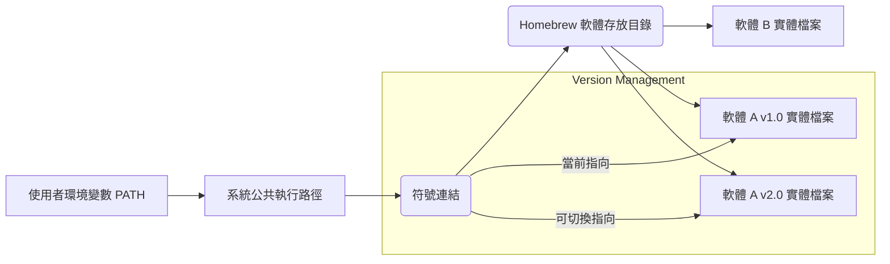
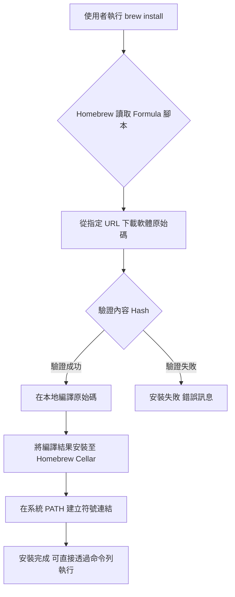
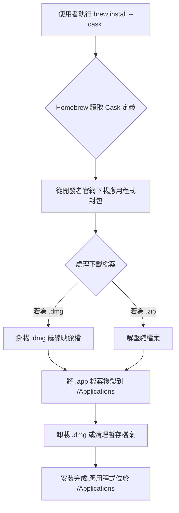

# Homebrew 軟體包管理：核心原理、Formula 與 Cask 實踐指南

> Updated: 2026-02-15 01:35


Homebrew 作為 macOS 和 Linux 上的套件管理工具，旨在極大簡化軟體的安裝與管理流程。無論是圖形使用者介面 (GUI) 的應用程式（如 Google Chrome, Discord），還是命令列介面 (CLI) 的開發工具（如 Git, Node.js），Homebrew 都提供了一站式的解決方案，省去了繁瑣的官方網站搜尋與手動安裝步驟。本指南將深入解析 Homebrew 的運作原理、軟體分類、實戰操作及常用管理指令。

## 目錄
*   [1. 核心概念：Homebrew 運作原理](#1-核心概念homebrew-運作原理)
    *   [1.1. 路徑管理：實體檔案與符號連結 (Symlink)](#11-路徑管理實體檔案與符號連結-symlink)
    *   [1.2. 設計優勢](#12-設計優勢)
*   [2. 軟體分類：Formula 與 Cask](#2-軟體分類formula-與-cask)
    *   [2.1. Formula：命令列工具](#21-formula命令列工具)
    *   [2.2. Cask：圖形化應用程式](#22-cask圖形化應用程式)
*   [3. 實戰操作](#3-實戰操作)
    *   [3.1. 安裝 Homebrew](#31-安裝-homebrew)
    *   [3.2. 軟體安裝範例](#32-軟體安裝範例)
*   [4. 常用管理指令速查表](#4-常用管理指令速查表)
*   [5. 進階應用：Homebrew Bundle](#5-進階應用homebrew-bundle)
*   [6. 參考資料](#6-參考資料)

## 1. 核心概念：Homebrew 運作原理

Homebrew 透過一套精巧的機制來管理系統上的軟體，其核心在於「分層管理」與「符號連結」。這種設計使得軟體安裝既能保持系統路徑的整潔，又能提供高度的靈活性。

### 1.1. 路徑管理：實體檔案與符號連結 (Symlink)

Homebrew 會將所有安裝的軟體檔案存放於一個專屬的「實體存放目錄」（通常位於 `/opt/homebrew` 或 `/usr/local/Cellar`）。在 macOS 上，對於 Apple Silicon 晶片，預設路徑為 `/opt/homebrew`；對於 Intel 晶片，預設路徑為 `/usr/local/Cellar`。

為了讓系統能夠找到這些軟體，Homebrew 會在系統的公共執行路徑（如 `/usr/local/bin` 或 `/opt/homebrew/bin`，這通常是 `$PATH` 環境變數中的路徑）中建立指向這些實體檔案的「符號連結」（Symbolic Link，簡稱 Symlink）。當使用者在終端機執行軟體命令時，實際上是透過 `$PATH` 中的公共路徑找到 Symlink，再由 Symlink 導向 Homebrew 管理的實體檔案。



### 1.2. 設計優勢

這種分層管理與符號連結的設計帶來了多項關鍵優勢：

*   **版本控制彈性**：
    *   Homebrew 允許同時安裝同一軟體的多個版本於 `Cellar` 目錄中。例如，您可以同時擁有 Python 3.9 和 Python 3.10。
    *   透過調整公共執行路徑中的符號連結，可以輕鬆切換當前活躍的軟體版本，而無需手動修改 `$PATH` 或進行複雜的環境配置。這對於開發者需要測試不同版本相容性時非常有用。
*   **純淨卸載 (Clean Uninstallation)**：
    *   由於軟體實體檔案集中存放在 `Cellar`，卸載軟體只需移除其在 `Cellar` 中的對應目錄及其在公共路徑中的符號連結即可。
    *   這避免了傳統手動安裝軟體時可能遺留的散亂檔案、設定檔或空目錄等「殘餘垃圾」，確保系統環境的整潔。
*   **避免系統衝突**：
    *   Homebrew 安裝的軟體預設不會與 macOS 系統內建的軟體產生衝突，因為它們被隔離在 Homebrew 的專屬路徑下。這降低了因軟體依賴或版本不相容而導致系統不穩定的風險。

## 2. 軟體分類：Formula 與 Cask

Homebrew 將其管理的軟體分為兩大類：`Formula` 和 `Cask`，以適應不同類型的應用程式。

### 2.1. Formula：命令列工具

*   **對象**：主要用於安裝沒有圖形使用者介面 (GUI)，需要在終端機中執行的命令列工具、函式庫或程式語言運行環境。這些軟體通常需要從原始碼編譯。
*   **例子**：`git` (版本控制系統), `wget` (網路下載器), `python` (程式語言環境), `node` (Node.js 運行環境), `tree` (文件夾結構顯示工具)。
*   **背後原理**：每個 `Formula` 都是一個 Ruby 腳本，描述了如何獲取、編譯和安裝特定軟體。當你執行 `brew install <formula>` 時，Homebrew 會執行以下步驟：



*   **範例**：
    *   安裝 `git`：
        ```bash
        brew install git
        ```
    *   安裝 `python`：
        ```bash
        brew install python
        ```
    *   安裝 `tree`：
        ```bash
        brew install tree
        ```

### 2.2. Cask：圖形化應用程式

*   **對象**：用於安裝具有圖形使用者介面的 macOS 應用程式。這些應用程式通常以 `.dmg` 磁碟映像檔、`.pkg` 安裝包或 `.zip` 壓縮包形式發布，原本需要手動下載、拖曳安裝或執行安裝程序。
*   **例子**：`google-chrome` (網頁瀏覽器), `visual-studio-code` (程式碼編輯器), `spotify` (音樂播放器), `slack` (通訊軟體), `discord` (語音/文字聊天)。
*   **背後原理**：`Cask` 更像是簡化版的自動化安裝腳本，專為處理 GUI 應用程式的安裝流程設計。當你執行 `brew install --cask <cask>` 時，Homebrew 會執行以下步驟：



*   **範例**：
    *   安裝 `Google Chrome`：
        ```bash
        brew install --cask google-chrome
        ```
    *   安裝 `Visual Studio Code`：
        ```bash
        brew install --cask visual-studio-code
        ```
    *   安裝 `Discord`：
        ```bash
        brew install --cask discord
        ```

## 3. 實戰操作

### 3.1. 安裝 Homebrew

打開終端機 (Terminal) 應用程式，並複製貼上 Homebrew 官方網站提供的安裝指令。此指令會自動下載並執行安裝腳本。

```bash
/bin/bash -c "$(curl -fsSL https://raw.githubusercontent.com/Homebrew/install/HEAD/install.sh)"
```

安裝過程中，系統可能會要求輸入使用者密碼以授權相關操作。安裝完成後，Homebrew 會提示是否需要設定 `PATH` 環境變數（例如，將 `/opt/homebrew/bin` 或 `/usr/local/bin` 加入 `$PATH`），確保 `brew` 命令可以在任何路徑下執行。請務必按照提示完成此步驟，通常是將一段配置指令加入您的 shell 設定檔（如 `~/.zprofile`, `~/.bash_profile`, `~/.config/fish/config.fish` 等），然後重新載入 shell 環境。

### 3.2. 軟體安裝範例

根據您要安裝的軟體類型，選擇對應的指令：

*   **安裝命令列工具 (Formula)**：
    ```bash
    brew install <軟體名稱>
    # 例如：
    brew install node
    brew install gcc
    ```
*   **安裝圖形化應用程式 (Cask)**：
    ```bash
    brew install --cask <應用程式名稱>
    # 例如：
    brew install --cask firefox
    brew install --cask iterm2
    ```

## 4. 常用管理指令速查表

以下是一些 Homebrew 日常維護中最常用的指令，建議收藏以備不時之需：

*   **搜尋軟體**：`brew search <關鍵字>` - 搜尋可用的 Formula 和 Cask。
*   **查看軟體資訊**：`brew info <軟體名稱>` / `brew info --cask <應用程式名稱>` - 顯示軟體的詳細資訊，如版本、依賴、安裝路徑等。
*   **更新 Homebrew 本身**：`brew update` - 更新 Homebrew 的 `Formula` 和 `Cask` 定義資料庫。
*   **升級所有已安裝軟體**：`brew upgrade` - 升級所有已安裝且有新版本的 `Formula` 和 `Cask`。
*   **升級特定軟體**：`brew upgrade <軟體名稱>` / `brew upgrade --cask <應用程式名稱>` - 升級指定的軟體。
*   **卸載軟體 (Formula)**：`brew uninstall <軟體名稱>` - 卸載 `Formula` 軟體。
*   **卸載軟體 (Cask)**：`brew uninstall --cask <應用程式名稱>` - 卸載 `Cask` 應用程式。
*   **清理舊版本軟體及暫存檔**：`brew cleanup` - 清理不再使用的舊版本軟體、過期的暫存檔和鎖定文件，釋放磁碟空間。
*   **列出所有已安裝的 Formula**：`brew list`
*   **列出所有已安裝的 Cask**：`brew list --cask`
*   **檢查系統問題**：`brew doctor` - 診斷 Homebrew 安裝和環境中可能存在的問題。
*   **驗證 Homebrew 環境**：`brew config` - 顯示 Homebrew 的配置信息。

## 5. 進階應用：Homebrew Bundle

`Homebrew Bundle` 是一個非常實用的功能，特別適合於開發環境的初始化和管理。

*   **功能描述**：利用 `brew bundle` 指令可以將所有已安裝的 `Formula`、`Cask` 和甚至 `Mac App Store` 應用程式（如果配置了 MAS）記錄到一個名為 `Brewfile` 的文件中。
*   **使用情境**：
    *   **新電腦設定**：當您購買新電腦或需要重新設置開發環境時，只需將 `Brewfile` 複製到新機器上，然後執行 `brew bundle`。Homebrew 將自動按照 `Brewfile` 中的定義安裝所有軟體，確保開發環境的一致性。
    *   **環境共享**：在團隊開發中，可以將 `Brewfile` 納入版本控制，確保所有團隊成員的開發環境擁有一致的軟體依賴。
*   **操作步驟**：
    1.  **生成 Brewfile**：在當前環境下執行以下命令，將當前所有已安裝的 Homebrew 軟體生成到 `Brewfile`。
        ```bash
        brew bundle dump
        ```
        這將在當前目錄下生成一個 `Brewfile` 文件，內容類似：
        ```
        # Brewfile
        tap "homebrew/cask"
        tap "homebrew/core"
        brew "git"
        brew "node"
        brew "python"
        cask "google-chrome"
        cask "visual-studio-code"
        # mas "Xcode", id: 497799835 # 如果配置了 mas
        ```
    2.  **還原環境**：在一個新的或目標環境中，將 `Brewfile` 放置在希望執行的目錄下，然後執行：
        ```bash
        brew bundle install
        ```
        Homebrew 將會讀取 `Brewfile` 並自動安裝其中定義的所有軟體。

## 6. 參考資料

*   [Homebrew 官方網站 (繁體中文)](https://brew.sh/index_zh-tw)
*   [Homebrew GitHub Repository](https://github.com/Homebrew/brew)
*   [Homebrew Cask GitHub Repository](https://github.com/Homebrew/homebrew-cask)