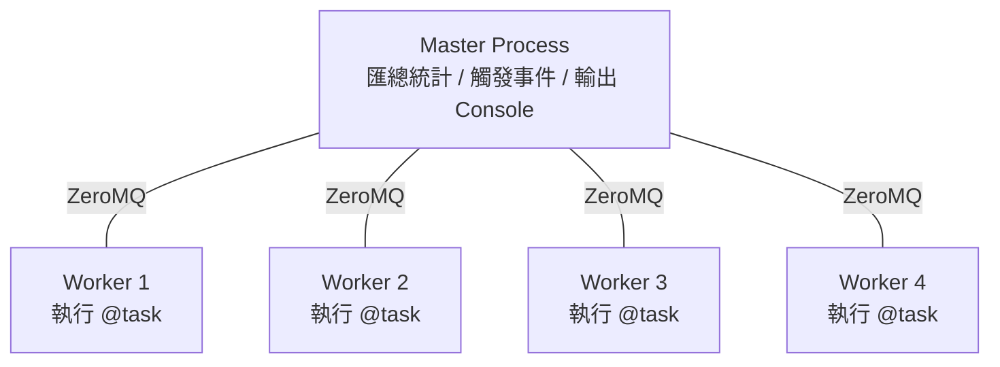
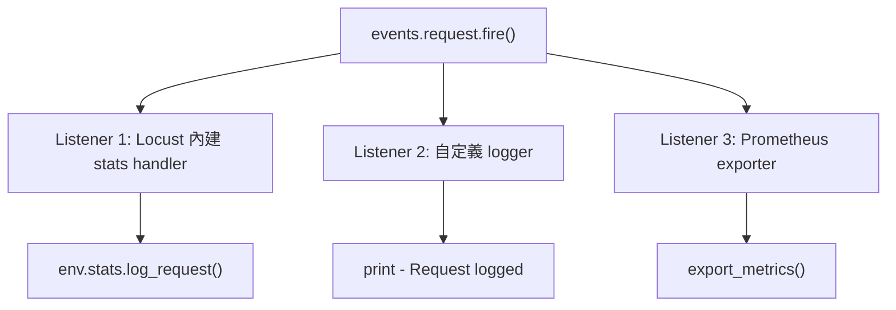
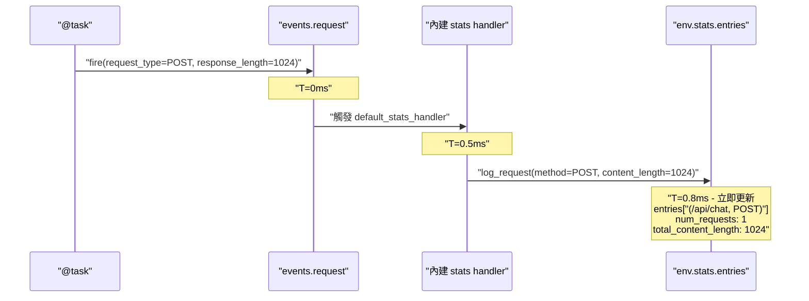
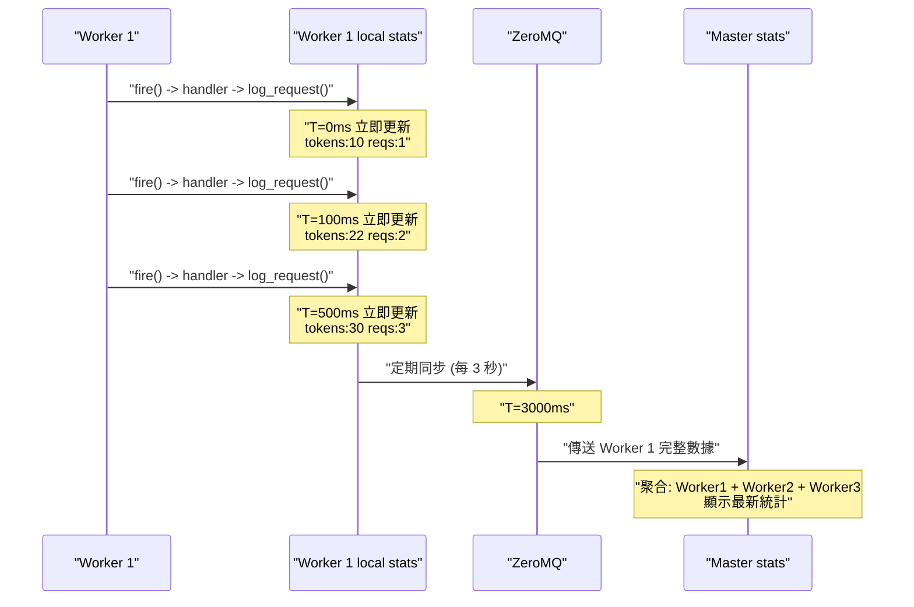
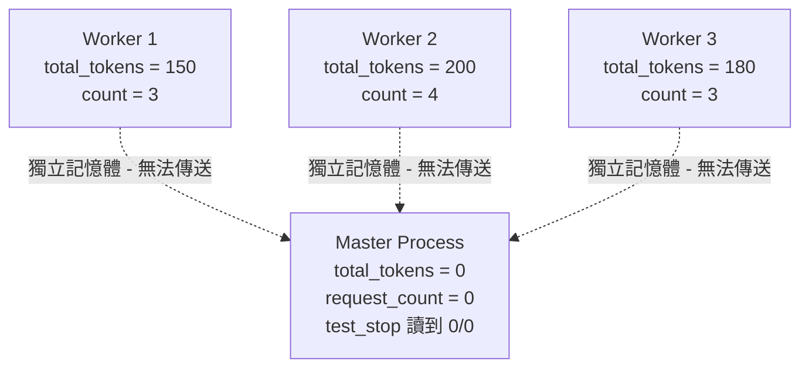
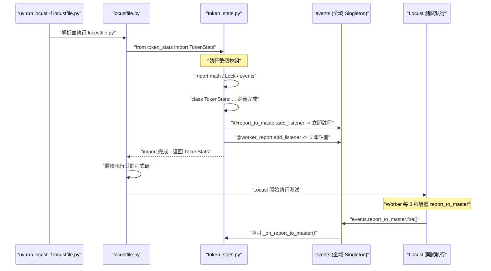
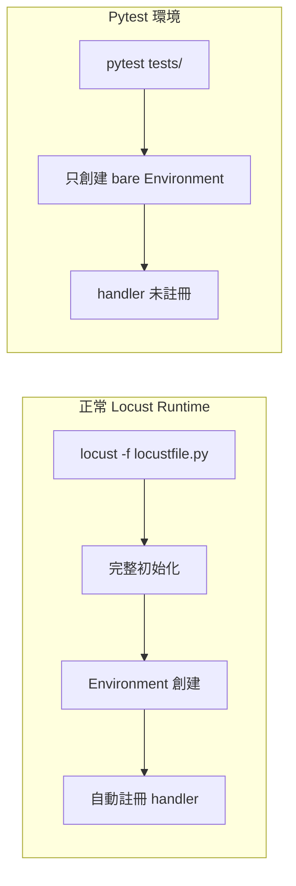
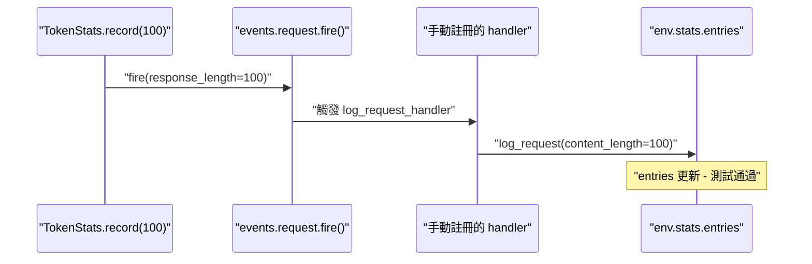

# Locust Event System 與 Multi-Process 底層機制

> Updated: 2026-02-26 21:13


## 目錄
- [1. Multi-Process 模式基礎](#1-multi-process-模式基礎)
    - [1.1. 架構概述](#11-架構概述)
    - [1.2. 為什麼需要 Multi-Process](#12-為什麼需要-multi-process)
    - [1.3. Master 與 Worker 的職責分工](#13-master-與-worker-的職責分工)
- [2. Event System 底層機制](#2-event-system-底層機制)
    - [2.1. Environment 自動註冊機制](#21-environment-自動註冊機制)
    - [2.2. events.request.fire() vs env.stats.log_request()](#22-eventsrequestfire-vs-envstatslogrequest)
    - [2.3. 單機模式下的完整事件鏈路](#23-單機模式下的完整事件鏈路)
    - [2.4. Multi-Process 模式下的事件鏈路](#24-multi-process-模式下的事件鏈路)
- [3. 自定義指標在 Multi-Process 下的失效問題](#3-自定義指標在-multi-process-下的失效問題)
    - [3.1. Class Variable 的記憶體隔離](#31-class-variable-的記憶體隔離)
    - [3.2. 內建指標為何能正確匯總](#32-內建指標為何能正確匯總)
- [4. EventHook 內部實現與 Decorator 自動註冊](#4-eventhook-內部實現與-decorator-自動註冊)
    - [4.1. EventHook 簡化版原始碼](#41-eventhook-簡化版原始碼)
    - [4.2. Python Import 觸發模組級程式碼執行](#42-python-import-觸發模組級程式碼執行)
    - [4.3. 完整啟動時間軸](#43-完整啟動時間軸)
- [5. Pytest 環境的 Handler 註冊](#5-pytest-環境的-handler-註冊)
    - [5.1. 問題: 為什麼測試需要手動註冊 handler](#51-問題-為什麼測試需要手動註冊-handler)
    - [5.2. 不手動註冊的後果](#52-不手動註冊的後果)
    - [5.3. 正確的 Fixture 寫法](#53-正確的-fixture-寫法)

## 1. Multi-Process 模式基礎

### 1.1. 架構概述

Locust 提供 `--processes N` 選項啟動多個 worker processes:

```bash
locust --processes 4
```

這會啟動兩種角色:

- **Master Process (1 個)**: 負責協調、匯總統計數據、觸發事件監聽器 (如 `test_stop`)、定期在 console 輸出統計表
- **Worker Processes (N 個)**: 實際執行 `@task` 測試任務，透過 ZeroMQ 將統計數據回報給 Master



### 1.2. 為什麼需要 Multi-Process

單一 Python process 受限於 GIL (Global Interpreter Lock)，無法真正平行利用多核 CPU。Multi-process 模式可以提升 RPS (每秒請求數)、模擬更大併發量、充分利用多核 CPU 資源。

### 1.3. Master 與 Worker 的職責分工

在 Multi-Process 模式下，所有進程都會載入 locustfile.py 並執行模組級程式碼（包含所有 `@events.xxx.add_listener` 的 Decorator 註冊），但各角色實際執行的邏輯由 `isinstance(environment.runner, WorkerRunner)` 守衛來區分:

**Master Process (協調者):**

- 執行 `@events.test_start.add_listener` -- 負責初始化邏輯（如 fetch VLM version）
- 執行 `@events.test_stop.add_listener` -- 負責 export 最終報告
- 執行 `@events.worker_report.add_listener` -- 接收並聚合 Worker 數據
- 不執行 `@task` 方法
- 不呼叫 `TokenStats.record()`

**Worker Process (實際執行者):**

- 執行 `@task` 方法 -- 發送 HTTP 請求並收集結果
- 呼叫 `TokenStats.record()` -- 記錄 token 數到本地計數器
- 執行 `@events.report_to_master.add_listener` -- 定期發送 token delta 給 Master
- 執行 `@events.test_start.add_listener` -- 但透過 WorkerRunner 檢查跳過初始化
- 執行 `@events.test_stop.add_listener` -- 但透過 WorkerRunner 檢查跳過 export

WorkerRunner 守衛的典型寫法:

```python
@events.test_stop.add_listener
def export_custom_stats(environment, **kwargs):
    if isinstance(environment.runner, WorkerRunner):
        return  # Worker 直接跳過
    # 以下只有 Master 會執行
    total_tokens = TokenStats.get_total(environment)
    # ... export 邏輯
```

## 2. Event System 底層機制

在理解 multi-process 下自定義指標的問題之前，需要先搞清楚 Locust 統計系統的底層運作方式。

### 2.1. Environment 自動註冊機制

當你創建 Locust Environment 時，Locust 內部會自動註冊一個 **內建 stats handler**，負責將事件轉換成統計數據:

```python
from locust.env import Environment
env = Environment(user_classes=[MyUser])
```

Locust 內部自動執行的簡化版邏輯:

```python
class Environment:
    def __init__(self):
        self.stats = RequestStats()

        # 自動註冊內建 stats handler
        def default_stats_handler(**kwargs):
            self.stats.log_request(
                method=kwargs['request_type'],
                name=kwargs['name'],
                response_time=kwargs['response_time'],
                content_length=kwargs['response_length']
            )

        events.request.add_listener(default_stats_handler)
```

這個自動註冊的 handler 是整個統計系統的核心 -- 它將 Event System 的事件 "橋接" 到 Stats 層。

### 2.2. events.request.fire() vs env.stats.log_request()

這兩個 API 是 Locust 統計系統的兩層抽象，理解它們的差異是理解後續所有設計的前提。

**`events.request.fire()`** 是事件層 -- 它將事件發布到 Pub/Sub 事件系統，觸發所有已註冊的 listeners:

```python
events.request.fire(
    request_type="POST",
    name="/api/chat",
    response_time=150,
    response_length=1024,
    exception=None,
    context={}
)
```

**`env.stats.log_request()`** 是數據層 -- 它直接寫入統計數據，不經過事件系統:

```python
env.stats.log_request(
    method="POST",
    name="/api/chat",
    response_time=150,
    content_length=1024
)
```

兩者的關係是: `fire()` 觸發 listener，listener 內部呼叫 `log_request()`。

| 比較項目 | `events.request.fire()` | `env.stats.log_request()` |
|------|------|------|
| 性質 | 發布事件到事件系統 (Pub/Sub) | 直接寫入統計數據 |
| 觸發對象 | 所有已註冊的 listeners | 無 - 直接操作 `env.stats.entries` |
| Multi-process 支援 | 支援跨 Worker 聚合 | 只在當前 process 生效 |
| 使用場景 | 業務邏輯中記錄請求 | 在 listener 內部實現 / 測試時直接模擬 |



### 2.3. 單機模式下的完整事件鏈路

在單 process 模式下，從 `fire()` 到統計更新是**立即完成**的 (毫秒級):



整條鏈路在 1ms 內完成，`fire()` -> handler 觸發 -> `log_request()` -> stats 更新，全部是同步執行。

### 2.4. Multi-Process 模式下的事件鏈路

Multi-process 模式下多了一個 "定期同步" 的步驟。每個 Worker 內部的事件鏈路跟單機一樣是立即完成的，差別在於 Worker 的本地 stats 需要定期 (預設每 3 秒) 透過 ZeroMQ 傳送給 Master:



Master 端的聚合邏輯簡化版:

```python
def on_worker_stats_report(msg):
    worker_stats = msg['data']
    for key, stats in worker_stats.items():
        if key not in master_stats:
            master_stats[key] = StatsEntry()
        master_stats[key].num_requests += stats['num_requests']
        master_stats[key].total_content_length += stats['total_content_length']
```

關鍵時間節點匯總:

| 階段 | 動作 | 延遲 |
|------|------|------|
| `events.request.fire()` | 觸發 handler | 立即 (<1ms) |
| `env.stats.log_request()` | 更新 Worker 本地 stats | 立即 |
| Worker -> Master 發送 | 透過 ZeroMQ 傳輸 | 定期 (預設 3 秒) |
| Master 聚合 | 合併所有 Worker 數據 | 接收後立即 |

## 3. 自定義指標在 Multi-Process 下的失效問題

### 3.1. Class Variable 的記憶體隔離

理解了底層機制後，就能看出問題所在。在單 process 模式下，用 class variable 累加自定義指標是可行的:

```python
class LoadTestUser(HttpUser):
    total_tokens = 0
    request_count = 0

    @task
    def test_api(self):
        response = self.client.post("/api/chat", json={...})
        LoadTestUser.total_tokens += count_tokens(response.json().get("message", ""))
        LoadTestUser.request_count += 1

@events.test_stop.add_listener
def print_stats(environment, **kwargs):
    token_avg = LoadTestUser.total_tokens / LoadTestUser.request_count
    print(f"Average tokens: {token_avg}")
```

但在 multi-process 模式下，Python 每個 process 擁有**獨立的記憶體空間**。Worker 各自累加自己的 `total_tokens`，但 Master 從未執行 `@task`，所以 Master 上的 class variable 永遠是 0。當 `test_stop` 事件在 Master 上觸發時，讀到的值就是 0，導致 `0 / 0` 錯誤。



根本原因: class variable 的修改只發生在各 Worker 的 local 記憶體中，沒有經過 Event System，自然不會被 ZeroMQ 同步到 Master。

### 3.2. 內建指標為何能正確匯總

對比之下，Locust 內建的統計指標 (RPS / Latency / num_requests) 之所以能正確匯總，是因為它們走的是第 2 章描述的完整鏈路: `self.client.post()` 內部自動觸發 `events.request.fire()` -> 內建 handler 將數據寫入 Worker 本地 stats -> ZeroMQ 定期同步到 Master -> Master 聚合。

| 方式 | 是否經過 Event System | Multi-Process 支援 |
|------|------|------|
| `LoadTestUser.total_tokens += x` | 否 - 只修改 local 記憶體 | 不支援 |
| `events.request.fire(...)` | 是 - 走完整事件鏈路 | 支援 |

## 4. EventHook 內部實現與 Decorator 自動註冊

### 4.1. EventHook 簡化版原始碼

Locust 的事件系統基於一個簡單的 Pub/Sub 實現。每個事件（如 `report_to_master`、`worker_report`、`request`）都是一個 `EventHook` 實例，內部維護一個 `_listeners` 列表:

```python
# locust/events.py 簡化版
class EventHook:
    def __init__(self):
        self._listeners = []

    def add_listener(self, func):
        """註冊監聽器，返回原函數（支援作為 Decorator 使用）"""
        self._listeners.append(func)
        return func

    def fire(self, **kwargs):
        """觸發事件，依序呼叫所有已註冊的監聽器"""
        for listener in self._listeners:
            listener(**kwargs)
```

`add_listener` 返回原函數這個設計使其可以作為 Decorator 使用: `@events.report_to_master.add_listener` 等價於先定義函數再呼叫 `events.report_to_master.add_listener(func)`。

### 4.2. Python Import 觸發模組級程式碼執行

一個常見的疑問: `locustfile.py` 中只有 `from token_stats import TokenStats`，為什麼模組底部的 `@events.report_to_master.add_listener` 和 `@events.worker_report.add_listener` 會被執行？

這是 Python import 機制的核心行為: **`import` 會執行整個模組的程式碼，無論你只 import 其中的哪一部分**。

```python
# 以下三種寫法都會執行整個 token_stats.py:
from token_stats import TokenStats          # 只取 TokenStats
import token_stats                          # 取整個模組
from token_stats import TokenStats, reset   # 取多個名稱
```

Decorator 的本質是函數呼叫語法糖。`@events.report_to_master.add_listener` 在模組被 import 時**立即執行** `add_listener()`，將函數註冊到全域事件系統:

```python
# Decorator 語法
@events.report_to_master.add_listener
def _on_report_to_master(client_id, data):
    ...

# 等價於
def _on_report_to_master(client_id, data):
    ...
_on_report_to_master = events.report_to_master.add_listener(_on_report_to_master)
# add_listener() 在模組載入時立即執行，不是函數被呼叫時
```

### 4.3. 完整啟動時間軸



關鍵時間點: Decorator 註冊發生在模組載入階段，遠早於測試開始。`events` 是全域 Singleton，任何模組中的註冊都會影響同一個事件系統。

## 5. Pytest 環境的 Handler 註冊

### 5.1. 問題: 為什麼測試需要手動註冊 handler

在正常的 Locust runtime (`locust -f locustfile.py`) 中，Locust 會做完整初始化，包括自動註冊內建 stats handler。但在 Pytest 環境中，你只是創建了一個 bare `Environment` 物件，沒有經過 Locust 的完整啟動流程:



### 5.2. 不手動註冊的後果

如果測試中不手動註冊 handler，`events.request.fire()` 會發送事件，但沒有任何 listener 接收，數據不會寫入 stats:

```python
def test_record_accumulates_tokens(locust_environment):
    env = locust_environment

    TokenStats.record(100)
    # 內部執行 events.request.fire(...)
    # 但沒有 listener -> 事件被丟棄

    stats = env.stats.entries.get(TokenStats.STATS_KEY)
    assert stats is None  # 測試失敗! 統計數據不存在
```

注意: 此章節的範例適用於 V1 方案（使用 `events.request.fire()`）。V2 方案的 `record()` 不經過事件系統，直接寫入 class variable，測試時只需在測試前呼叫 `TokenStats.reset()` 清理狀態即可。

### 5.3. 正確的 Fixture 寫法

V1 方案的測試 fixture -- 手動模擬 Locust 內建的 handler 行為:

```python
@pytest.fixture
def locust_environment():
    env = Environment(user_classes=[DummyUser])

    # 手動模擬 Locust 內建行為
    def log_request_handler(
        request_type, name, response_time, response_length,
        exception, context, **kwargs
    ):
        env.stats.log_request(
            method=request_type,
            name=name,
            response_time=response_time,
            content_length=response_length,
        )

    events.request.add_listener(log_request_handler)
    yield env
    events.request.remove_listener(log_request_handler)  # Cleanup
```

註冊後的流程恢復正常:



注意 fixture 結束時必須呼叫 `remove_listener()` 清理，否則 handler 會殘留影響其他測試案例。
