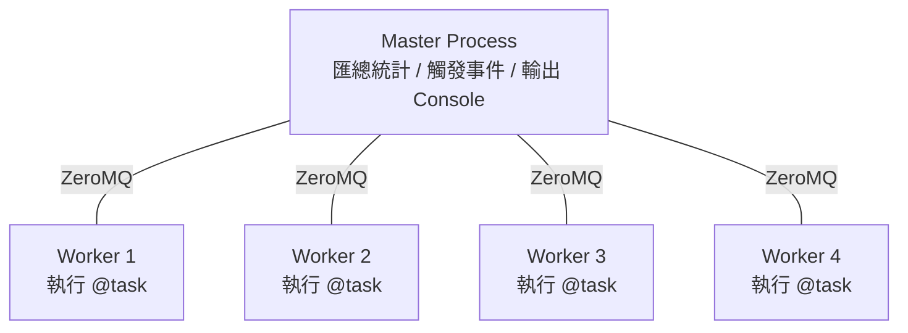
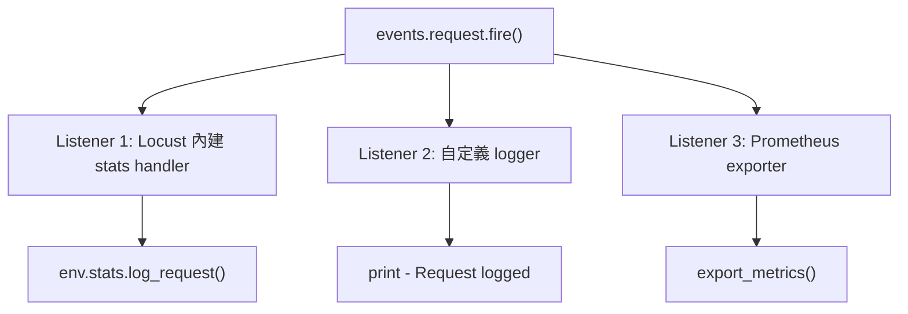
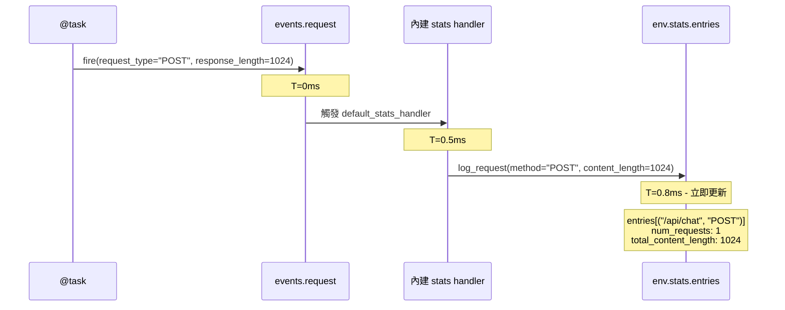
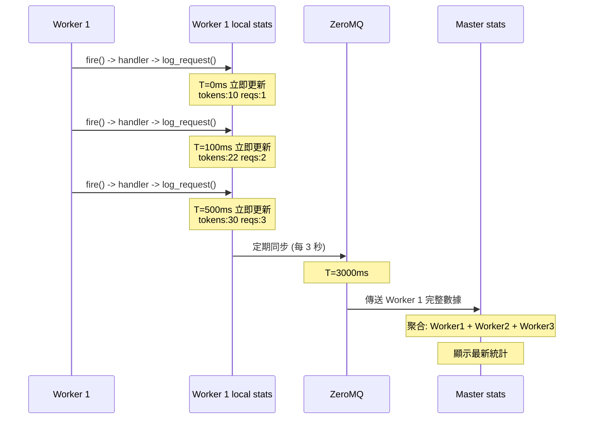
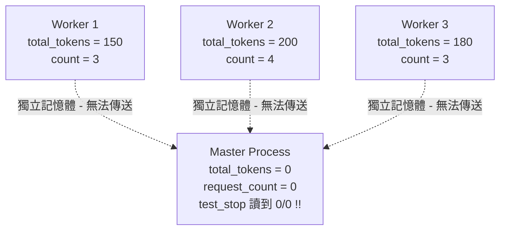
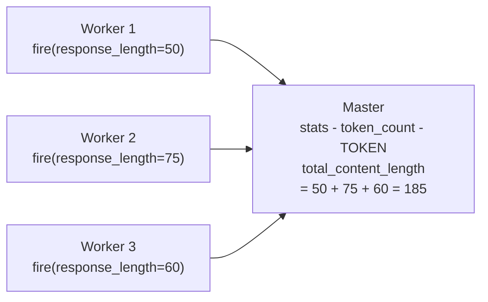
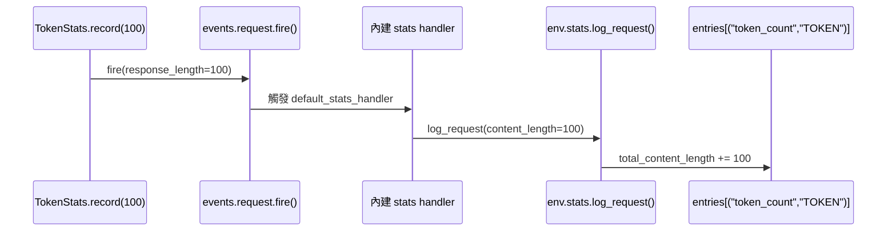
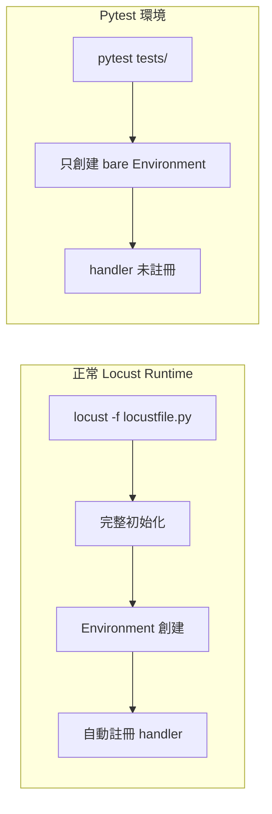
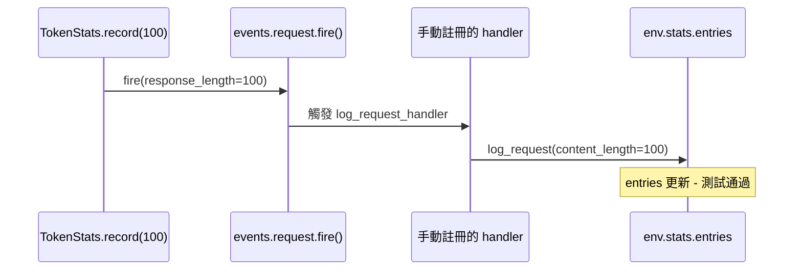

# Locust Multi-Process 自定義指標統計與 Event System 深度解析

> Updated: 2026-02-26 01:10


## 目錄
- [Locust Multi-Process 自定義指標統計與 Event System 深度解析](#locust-multi-process-自定義指標統計與-event-system-深度解析)
  - [目錄](#目錄)
  - [1. Multi-Process 模式基礎](#1-multi-process-模式基礎)
    - [1.1. 架構概述](#11-架構概述)
    - [1.2. 為什麼需要 Multi-Process](#12-為什麼需要-multi-process)
  - [2. Locust Event System 底層機制](#2-locust-event-system-底層機制)
    - [2.1. Environment 自動註冊機制](#21-environment-自動註冊機制)
    - [2.2. events.request.fire() vs env.stats.log\_request()](#22-eventsrequestfire-vs-envstatslog_request)
    - [2.3. 單機模式下的完整事件鏈路](#23-單機模式下的完整事件鏈路)
    - [2.4. Multi-Process 模式下的事件鏈路](#24-multi-process-模式下的事件鏈路)
  - [3. 自定義指標在 Multi-Process 下的失效問題](#3-自定義指標在-multi-process-下的失效問題)
    - [3.1. Class Variable 的記憶體隔離](#31-class-variable-的記憶體隔離)
    - [3.2. 內建指標為何能正確匯總](#32-內建指標為何能正確匯總)
  - [4. 解決方案: 虛擬 Stats Entry](#4-解決方案-虛擬-stats-entry)
    - [4.1. 核心概念](#41-核心概念)
    - [4.2. Stats Entry Key 結構](#42-stats-entry-key-結構)
    - [4.3. environment.stats.entries 的詳細結構](#43-environmentstatsentries-的詳細結構)
    - [4.4. 為什麼選用 response\_length](#44-為什麼選用-response_length)
  - [5. TokenStats 模組實作](#5-tokenstats-模組實作)
    - [5.1. 完整模組程式碼](#51-完整模組程式碼)
    - [5.2. 設計考量: 為什麼用 fire() 而非 log\_request()](#52-設計考量-為什麼用-fire-而非-log_request)
    - [5.3. 資料儲存與讀取流程](#53-資料儲存與讀取流程)
    - [5.4. 整合到 locustfile](#54-整合到-locustfile)
    - [5.5. 事件監聽器讀取數據](#55-事件監聽器讀取數據)
    - [5.6. 完整使用範例](#56-完整使用範例)
  - [6. Aggregated 行污染與處理策略](#6-aggregated-行污染與處理策略)
    - [6.1. 問題成因](#61-問題成因)
    - [6.2. 處理方案比較](#62-處理方案比較)
    - [6.3. 推薦做法: test\_stop 時先讀後刪](#63-推薦做法-test_stop-時先讀後刪)
  - [7. Pytest 環境的 Handler 註冊](#7-pytest-環境的-handler-註冊)
    - [7.1. 問題: 為什麼測試需要手動註冊 handler](#71-問題-為什麼測試需要手動註冊-handler)
    - [7.2. 不手動註冊的後果](#72-不手動註冊的後果)
    - [7.3. 正確的 Fixture 寫法](#73-正確的-fixture-寫法)
  - [8. 進階注意事項與 Pitfalls](#8-進階注意事項與-pitfalls)
    - [8.1. ZeroMQ 同步延遲](#81-zeromq-同步延遲)
    - [8.2. total\_content\_length 只支援整數](#82-total_content_length-只支援整數)
    - [8.3. Race Condition 前提](#83-race-condition-前提)
    - [8.4. 多指標擴展 Pattern](#84-多指標擴展-pattern)

## 1. Multi-Process 模式基礎

### 1.1. 架構概述

Locust 提供 `--processes N` 選項啟動多個 worker processes:

```bash
locust --processes 4
```

這會啟動兩種角色:

- **Master Process (1 個)**: 負責協調、匯總統計數據、觸發事件監聽器 (如 `test_stop`)、定期在 console 輸出統計表
- **Worker Processes (N 個)**: 實際執行 `@task` 測試任務，透過 ZeroMQ 將統計數據回報給 Master



### 1.2. 為什麼需要 Multi-Process

單一 Python process 受限於 GIL (Global Interpreter Lock)，無法真正平行利用多核 CPU。Multi-process 模式可以提升 RPS (每秒請求數)、模擬更大併發量、充分利用多核 CPU 資源。

## 2. Locust Event System 底層機制

在理解 multi-process 下自定義指標的問題之前，需要先搞清楚 Locust 統計系統的底層運作方式。

### 2.1. Environment 自動註冊機制

當你創建 Locust Environment 時，Locust 內部會自動註冊一個 **內建 stats handler**，負責將事件轉換成統計數據:

```python
from locust.env import Environment
env = Environment(user_classes=[MyUser])
```

Locust 內部自動執行的簡化版邏輯:

```python
class Environment:
    def __init__(self):
        self.stats = RequestStats()

        # 自動註冊內建 stats handler
        def default_stats_handler(**kwargs):
            self.stats.log_request(
                method=kwargs['request_type'],
                name=kwargs['name'],
                response_time=kwargs['response_time'],
                content_length=kwargs['response_length']
            )

        events.request.add_listener(default_stats_handler)
```

這個自動註冊的 handler 是整個統計系統的核心 -- 它將 Event System 的事件 "橋接" 到 Stats 層。

### 2.2. events.request.fire() vs env.stats.log_request()

這兩個 API 是 Locust 統計系統的兩層抽象，理解它們的差異是理解後續所有設計的前提。

**`events.request.fire()`** 是事件層 -- 它將事件發布到 Pub/Sub 事件系統，觸發所有已註冊的 listeners:

```python
events.request.fire(
    request_type="POST",
    name="/api/chat",
    response_time=150,
    response_length=1024,
    exception=None,
    context={}
)
```

**`env.stats.log_request()`** 是數據層 -- 它直接寫入統計數據，不經過事件系統:

```python
env.stats.log_request(
    method="POST",
    name="/api/chat",
    response_time=150,
    content_length=1024
)
```

兩者的關係是: `fire()` 觸發 listener，listener 內部呼叫 `log_request()`。

| 比較項目 | `events.request.fire()` | `env.stats.log_request()` |
|------|------|------|
| 性質 | 發布事件到事件系統 (Pub/Sub) | 直接寫入統計數據 |
| 觸發對象 | 所有已註冊的 listeners | 無 - 直接操作 `env.stats.entries` |
| Multi-process 支援 | 支援跨 Worker 聚合 | 只在當前 process 生效 |
| 使用場景 | 業務邏輯中記錄請求 | 在 listener 內部實現 / 測試時直接模擬 |



### 2.3. 單機模式下的完整事件鏈路

在單 process 模式下，從 `fire()` 到統計更新是**立即完成**的 (毫秒級):



整條鏈路在 1ms 內完成，`fire()` → handler 觸發 → `log_request()` → stats 更新，全部是同步執行。

### 2.4. Multi-Process 模式下的事件鏈路

Multi-process 模式下多了一個 "定期同步" 的步驟。每個 Worker 內部的事件鏈路跟單機一樣是立即完成的，差別在於 Worker 的本地 stats 需要定期 (預設每 3 秒) 透過 ZeroMQ 傳送給 Master:



Master 端的聚合邏輯簡化版:

```python
def on_worker_stats_report(msg):
    worker_stats = msg['data']
    for key, stats in worker_stats.items():
        if key not in master_stats:
            master_stats[key] = StatsEntry()
        master_stats[key].num_requests += stats['num_requests']
        master_stats[key].total_content_length += stats['total_content_length']
```

關鍵時間節點匯總:

| 階段 | 動作 | 延遲 |
|------|------|------|
| `events.request.fire()` | 觸發 handler | 立即 (<1ms) |
| `env.stats.log_request()` | 更新 Worker 本地 stats | 立即 |
| Worker -> Master 發送 | 透過 ZeroMQ 傳輸 | 定期 (預設 3 秒) |
| Master 聚合 | 合併所有 Worker 數據 | 接收後立即 |

## 3. 自定義指標在 Multi-Process 下的失效問題

### 3.1. Class Variable 的記憶體隔離

理解了底層機制後，就能看出問題所在。在單 process 模式下，用 class variable 累加自定義指標是可行的:

```python
class LoadTestUser(HttpUser):
    total_tokens = 0
    request_count = 0

    @task
    def test_api(self):
        response = self.client.post("/api/chat", json={...})
        LoadTestUser.total_tokens += count_tokens(response.json().get("message", ""))
        LoadTestUser.request_count += 1

@events.test_stop.add_listener
def print_stats(environment, **kwargs):
    token_avg = LoadTestUser.total_tokens / LoadTestUser.request_count
    print(f"Average tokens: {token_avg}")
```

但在 multi-process 模式下，Python 每個 process 擁有**獨立的記憶體空間**。Worker 各自累加自己的 `total_tokens`，但 Master 從未執行 `@task`，所以 Master 上的 class variable 永遠是 0。當 `test_stop` 事件在 Master 上觸發時，讀到的值就是 0，導致 `0 / 0` 錯誤。



根本原因: class variable 的修改只發生在各 Worker 的 local 記憶體中，沒有經過 Event System，自然不會被 ZeroMQ 同步到 Master。

### 3.2. 內建指標為何能正確匯總

對比之下，Locust 內建的統計指標 (RPS / Latency / num_requests) 之所以能正確匯總，是因為它們走的是第 2 章描述的完整鏈路: `self.client.post()` 內部自動觸發 `events.request.fire()` → 內建 handler 將數據寫入 Worker 本地 stats → ZeroMQ 定期同步到 Master → Master 聚合。

| 方式 | 是否經過 Event System | Multi-Process 支援 |
|------|----------|-------------------|
| `LoadTestUser.total_tokens += x` | 否 - 只修改 local 記憶體 | 不支援 |
| `events.request.fire(...)` | 是 - 走完整事件鏈路 | 支援 |

## 4. 解決方案: 虛擬 Stats Entry

### 4.1. 核心概念

既然 Locust 會自動同步 `events.request.fire()` 的數據，就借用這個機制: 創建一個**虛擬的請求類型**，把自定義指標塞進 `response_length` 欄位，讓 Locust 幫你做跨 process 匯總:

```python
events.request.fire(
    request_type="TOKEN",        # 自定義類型
    name="token_count",          # stats entry 名稱
    response_time=0,             # 不影響 latency 統計
    response_length=token_count, # 關鍵: 用此欄位記錄 token 數
    exception=None,
    context={},
)
```

### 4.2. Stats Entry Key 結構

Locust 使用 `(name, method)` tuple 作為 stats entry 的唯一 key。注意 `request_type` 對應 tuple 的**第二個**元素 (method)，`name` 對應**第一個**元素:

```python
events.request.fire(
    request_type="TOKEN",   # -> tuple 第二個元素 (method)
    name="token_count",     # -> tuple 第一個元素 (name)
    ...
)
# Locust 創建的 key = ("token_count", "TOKEN")
```

因此正確的 key 寫法:

- 正確: `STATS_KEY = ("token_count", "TOKEN")`
- 錯誤: `STATS_KEY = "token_count"`

### 4.3. environment.stats.entries 的詳細結構

`environment.stats.entries` 是一個特殊的字典 (EntriesDict)，Key 是 `(name, method)` tuple，Value 是 `StatsEntry` 物件:

```python
environment.stats.entries = {
    ("/api/chat", "POST"): StatsEntry(
        name="/api/chat",
        method="POST",
        num_requests=100,
        total_content_length=5000,
    ),
    ("token_count", "TOKEN"): StatsEntry(
        name="token_count",
        method="TOKEN",
        total_content_length=530,
    ),
}
```

三種存取方式的差異:

```python
# 1. keys() - 獲得 tuple keys
for key in environment.stats.entries.keys():
    print(key)       # ("/api/chat", "POST") - tuple
    print(key[0])    # "/api/chat" - name
    print(key[1])    # "POST" - method

# 2. values() - 獲得 StatsEntry 物件
for stats in environment.stats.entries.values():
    print(stats.name)    # "/api/chat" - string 屬性
    print(stats.method)  # "POST" - string 屬性

# 3. items() - 獲得 (key, value) pair
for key, stats in environment.stats.entries.items():
    print(key)          # ("/api/chat", "POST") - tuple
    print(stats.name)   # "/api/chat" - string
```

實際應用中常用 `values()` 搭配 generator 查找特定 entry:

```python
chat_api_stats = next(
    (s for s in environment.stats.entries.values() if "/api/chat" in s.name),
    None,
)
```

這段程式碼能正常運作是因為: `values()` 返回的是 `StatsEntry` 物件，`s.name` 是字串屬性，`"/api/chat" in s.name` 是合法的字串比對。

驗證兩種取值方式等價:

```python
env.stats.log_request(method='POST', name='/api/chat', response_time=100, content_length=500)

stats1 = env.stats.entries[('/api/chat', 'POST')]       # 用 tuple key
stats2 = next((s for s in env.stats.entries.values() if s.name == '/api/chat'), None)

print(type(stats1))        # <class 'locust.stats.StatsEntry'>
print(stats1.name)         # '/api/chat'
print(stats1.method)       # 'POST'
print(stats1 == stats2)    # True - 同一個物件
```

### 4.4. 為什麼選用 response_length

Locust 的 `StatsEntry` 會自動匯總的屬性中，`total_content_length` (由 `response_length` 累加而成) 最適合用來承載自定義數值:

| StatsEntry 屬性 | 說明 | 適用性 |
|------|------|------|
| `num_requests` | 請求次數 - 自動 +1 | 已被真實 API 統計占用 |
| `total_response_time` | 累加所有 response_time | 會影響 latency 統計 |
| `total_content_length` | 累加所有 response_length | 適合承載自定義數值 |

數據同步流程:



## 5. TokenStats 模組實作

### 5.1. 完整模組程式碼

建立 `locust/token_stats.py`:

```python
"""Token statistics module for multi-process Locust aggregation."""

from locust import events
from locust.env import Environment


class TokenStats:
    """處理 token 統計的 class，支援 multi-process 模式。"""

    STATS_KEY = ("token_count", "TOKEN")

    @staticmethod
    def record(token_count: int) -> None:
        """記錄 token 數量，透過 events.request.fire() 實現跨 process 同步。"""
        events.request.fire(
            request_type="TOKEN",
            name="token_count",
            response_time=0,
            response_length=token_count,
            exception=None,
            context={},
        )

    @staticmethod
    def get_total(environment: Environment) -> int:
        """從 Master 的匯總數據中取得總 token 數。"""
        stats = environment.stats.entries.get(TokenStats.STATS_KEY)
        return stats.total_content_length if stats else 0

    @staticmethod
    def get_average(environment: Environment) -> float:
        """計算平均每個請求的 token 數。

        從真實 API 的 stats entry 取得 num_requests 作為分母，
        用 TOKEN entry 的 total_content_length 作為分子。
        """
        total_tokens = TokenStats.get_total(environment)
        chat_api_stats = next(
            (s for s in environment.stats.entries.values()
             if "/api/chat" in s.name),
            None,
        )
        total_requests = chat_api_stats.num_requests if chat_api_stats else 0
        return total_tokens / total_requests if total_requests > 0 else 0.0

    @staticmethod
    def remove_from_console(environment: Environment) -> None:
        """從 stats entries 中刪除 TOKEN entry，避免污染最終報告。"""
        if TokenStats.STATS_KEY in environment.stats.entries:
            del environment.stats.entries[TokenStats.STATS_KEY]
```

設計重點:

- `@staticmethod`: 不需要實例化，直接 `TokenStats.record()` 即可呼叫
- `STATS_KEY` 常數: 確保 tuple key 的一致性
- `get_average()`: 從真實 API 的 `num_requests` 取得分母，而非用 TOKEN entry 自己的 `num_requests`
- `remove_from_console()`: 刪除 TOKEN entry 防止最終報告被污染

### 5.2. 設計考量: 為什麼用 fire() 而非 log_request()

**方案 A -- 直接使用 `env.stats.log_request()` (不採用):**

```python
# 問題方案
def record(token_count: int, env: Environment):
    env.stats.log_request(
        method="TOKEN",
        name="token_count",
        response_time=0,
        content_length=token_count
    )
```

- 需要傳入 `env` 參數，增加耦合
- Multi-process 模式下只在當前 Worker 生效，因為 `log_request()` 直接寫入 local stats，不經過事件系統
- Master 無法聚合跨 Worker 的數據

**方案 B -- 使用 `events.request.fire()` (採用):**

```python
# 現行方案
@staticmethod
def record(token_count: int):
    events.request.fire(...)
```

- 不需要傳入 `env`，因為 `events` 是全域模組
- Locust 內建 handler 自動處理 `fire()` → `log_request()` 的轉換
- Multi-process 模式下自動跨 Worker 聚合
- 符合 Locust 的設計哲學: 業務邏輯只管 fire 事件，底層同步交給框架

### 5.3. 資料儲存與讀取流程

記錄 100 個 tokens 時的完整資料流:



讀取時直接從 `env.stats.entries` 取值:

```python
total = TokenStats.get_total(env)
# -> env.stats.entries[("token_count", "TOKEN")].total_content_length

average = TokenStats.get_average(env)
# -> total_content_length / chat_api_stats.num_requests
```

### 5.4. 整合到 locustfile

```python
from token_stats import TokenStats

class LoadTestUser(HttpUser):
    # 不再需要 class-level 的 total_tokens 和 request_count

    @task
    def test_chat_api_endpoint(self):
        response = self.client.post("/api/chat", json={...})
        message = response.json().get("message", "")
        TokenStats.record(self.token_length(message))
```

### 5.5. 事件監聽器讀取數據

```python
@events.test_stop.add_listener
def export_custom_stats(environment, **kwargs):
    total_tokens = TokenStats.get_total(environment)
    token_avg = TokenStats.get_average(environment)

    # 先讀完數據，再刪除 entry
    TokenStats.remove_from_console(environment)

    print(f"Total Tokens: {total_tokens}")
    print(f"Avg Tokens: {token_avg:.2f}")
```

### 5.6. 完整使用範例

```python
import tiktoken
from locust import HttpUser, task, events
from token_stats import TokenStats


class MyLoadTestUser(HttpUser):
    encoding = tiktoken.get_encoding("cl100k_base")

    def token_length(self, text: str) -> int:
        return len(self.encoding.encode(text))

    @task
    def test_api(self):
        response = self.client.post("/api/chat", json={
            "prompt": "Hello, world!"
        })
        if response.status_code == 200:
            message = response.json().get("message", "")
            TokenStats.record(self.token_length(message))


@events.test_stop.add_listener
def print_token_stats(environment, **kwargs):
    total_tokens = TokenStats.get_total(environment)
    avg_tokens = TokenStats.get_average(environment)
    TokenStats.remove_from_console(environment)

    print("=" * 60)
    print("Token Statistics")
    print("=" * 60)
    print(f"Total Tokens: {total_tokens}")
    print(f"Average Tokens per Request: {avg_tokens:.2f}")
    print("=" * 60)
```

修改前 console 輸出 (TOKEN 行多餘):

```text
Type     Name              # reqs    Avg    Min    Max   Median   req/s
POST     /api/chat             10   1234    800   2000     1200    2.50
TOKEN    token_count           10      0      0      0        0    2.50
         Aggregated            20    617      0   2000      600    5.00
```

修改後 console 輸出 (TOKEN 行已隱藏):

```text
Type     Name              # reqs    Avg    Min    Max   Median   req/s
POST     /api/chat             10   1234    800   2000     1200    2.50
         Aggregated            10   1234    800   2000     1200    2.50
============================================================
Token Statistics
============================================================
Total Tokens: 530
Average Tokens per Request: 53.00
============================================================
```

## 6. Aggregated 行污染與處理策略

### 6.1. 問題成因

Master 預設每 **2 秒**在 console 印出一次統計表，最底下的 "Aggregated" 行會合併**所有** stats entries。虛擬 TOKEN entry 的 `response_time=0` 會拉低整體平均回應時間，`num_requests` 也會被灌水:

```text
真實 Avg = (1234 * 10) / 10           = 1234ms
被污染 Avg = (1234 * 10 + 0 * 10) / 20 = 617ms  <- 被拉低一半
```

`num_requests` 從 10 膨脹到 20，`Min` 被拉到 0，都是因為 TOKEN entry 被計入 Aggregated。

注意: 印統計表的是 **Master**，Worker 只負責跑 task 和回報數據，不會印統計表。Web UI 模式同理，即時統計也是 Master 匯總後呈現。

### 6.2. 處理方案比較

| 方案 | 做法 | 優點 | 缺點 |
|------|------|------|------|
| test_stop 先讀後刪 | 在 `test_stop` 中先讀取再刪除 entry | 簡單 - 最終報告乾淨 | 過程中 Aggregated 被污染 |
| stats_printer 事件 | 每次印統計表前刪除 TOKEN entry | 過程中也乾淨 | 刪除後數據遺失 - 後續 worker 回報會重建 entry 但累計值被清空 - 最終讀不到完整數據 |
| send_message 自行通訊 | 不用 fire - 改用 runner.send_message() | 完全不污染 stats | 實作複雜度高 - 需自行處理序列化和匯總邏輯 |

### 6.3. 推薦做法: test_stop 時先讀後刪

**最務實的方案**是接受測試過程中 Aggregated 行會被污染 (即時數據本來就只是監控參考用，不影響最終結果)，在 `test_stop` 時先讀完數據再刪除 entry:

```python
@events.test_stop.add_listener
def export_stats(environment, **kwargs):
    # 1. 先讀取 (此時數據完整)
    total_tokens = TokenStats.get_total(environment)
    avg_tokens = TokenStats.get_average(environment)

    # 2. 再刪除 (最終報告不會有 TOKEN 行)
    TokenStats.remove_from_console(environment)

    print(f"Total Tokens: {total_tokens}")
    print(f"Avg Tokens: {avg_tokens:.2f}")
```

`stats_printer` 方案不可行的原因: 每次印之前刪掉 TOKEN entry，但後續 Worker 回報數據時 Locust 會重新建立這個 entry，累計值卻已被清空。反覆刪除 → 重建的循環會導致最終 `test_stop` 時讀到的數據不完整。

## 7. Pytest 環境的 Handler 註冊

### 7.1. 問題: 為什麼測試需要手動註冊 handler

在正常的 Locust runtime (`locust -f locustfile.py`) 中，Locust 會做完整初始化，包括自動註冊內建 stats handler。但在 Pytest 環境中，你只是創建了一個 bare `Environment` 物件，沒有經過 Locust 的完整啟動流程:



### 7.2. 不手動註冊的後果

如果測試中不手動註冊 handler，`TokenStats.record()` 內部的 `events.request.fire()` 會發送事件，但沒有任何 listener 接收，數據不會寫入 stats:

```python
def test_record_accumulates_tokens(locust_environment):
    env = locust_environment

    TokenStats.record(100)
    # 內部執行 events.request.fire(...)
    # 但沒有 listener -> 事件被丟棄

    stats = env.stats.entries.get(TokenStats.STATS_KEY)
    assert stats is None  # 測試失敗! 統計數據不存在
```

### 7.3. 正確的 Fixture 寫法

手動模擬 Locust 內建的 handler 行為:

```python
@pytest.fixture
def locust_environment():
    env = Environment(user_classes=[DummyUser])

    # 手動模擬 Locust 內建行為
    def log_request_handler(
        request_type, name, response_time, response_length,
        exception, context, **kwargs
    ):
        env.stats.log_request(
            method=request_type,
            name=name,
            response_time=response_time,
            content_length=response_length,
        )

    events.request.add_listener(log_request_handler)
    yield env
    events.request.remove_listener(log_request_handler)  # Cleanup
```

註冊後的流程恢復正常:



注意 fixture 結束時必須呼叫 `remove_listener()` 清理，否則 handler 會殘留影響其他測試案例。

## 8. 進階注意事項與 Pitfalls

### 8.1. ZeroMQ 同步延遲

Worker 的數據約每 3 秒透過 ZeroMQ 同步到 Master。如果測試時間很短 (例如 5 秒)，最後一批 Worker 的數據可能還沒完全同步到 Master 就結束了，導致最終統計有誤差。短時間測試的結果應視為近似值。

### 8.2. total_content_length 只支援整數

`response_length` 在 Locust 內部會被轉為 int 累加到 `total_content_length`。如果需要記錄浮點數指標 (例如 cost per token 為 0.003)，需要先乘以倍數 (如 x1000) 再在讀取時除回來。

### 8.3. Race Condition 前提

單一 Worker 內部是基於 **gevent 協程**運作，不是真正的 multi-thread，所以同一個 Worker 內不會有 race condition。但如果有人在 Worker 裡使用了 Python 原生的 `threading` 模組而非 gevent，就可能產生競爭條件。

### 8.4. 多指標擴展 Pattern

如果需要同時追蹤多個指標 (如 input tokens / output tokens / latency breakdown)，為每個指標建立獨立的虛擬 stats entry 比全部塞進同一個 entry 更乾淨:

```python
events.request.fire(
    request_type="INPUT_TOKEN",
    name="input_tokens",
    response_time=0,
    response_length=input_count,
    exception=None, context={},
)
events.request.fire(
    request_type="OUTPUT_TOKEN",
    name="output_tokens",
    response_time=0,
    response_length=output_count,
    exception=None, context={},
)
```

對應的 STATS_KEY 分別為 `("input_tokens", "INPUT_TOKEN")` 和 `("output_tokens", "OUTPUT_TOKEN")`，可以個別讀取和管理。