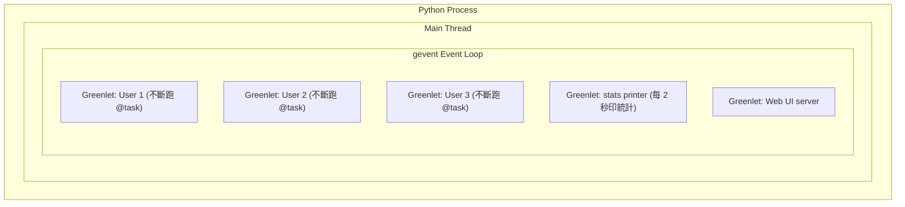

# Locust 基礎概念與執行模型

> Updated: 2026-02-27 10:42


## 目錄
- [Locust 基礎概念與執行模型](#locust-基礎概念與執行模型)
  - [目錄](#目錄)
  - [1. Locust 是什麼](#1-locust-是什麼)
  - [2. 核心概念](#2-核心概念)
    - [2.1. User](#21-user)
    - [2.2. Task](#22-task)
    - [2.3. wait\_time](#23-wait_time)
    - [2.4. Load 設定](#24-load-設定)
  - [3. 執行模型概覽](#3-執行模型概覽)
    - [3.1. Single Process 模式](#31-single-process-模式)
    - [3.2. Multi-Process 模式](#32-multi-process-模式)
  - [4. 統計指標術語](#4-統計指標術語)
    - [4.1. RPS 與 Throughput](#41-rps-與-throughput)
    - [4.2. Response Time 的各種百分位數](#42-response-time-的各種百分位數)
    - [4.3. Current RPS 為什麼會跳動](#43-current-rps-為什麼會跳動)

## 1. Locust 是什麼

Locust（蝗蟲）是一個用 Python 編寫的負載測試工具。它用大量虛擬使用者模擬真實使用行為，對 API 或 Web 系統進行壓力測試，量測系統的性能與穩定性。

與其他負載測試工具（如 JMeter）的最大差異是: 測試腳本就是 Python 程式碼，不需要 GUI 或 XML 設定，可以直接用程式邏輯控制使用者行為。

## 2. 核心概念

### 2.1. User

```python
from locust import HttpUser

class MyUser(HttpUser):
    host = "https://api.example.com"
```

跑 Locust 時，Locust 會找出**繼承自 `User`（包含 `HttpUser` 等子類）**的 class，並根據設定（users 數量、spawn rate、weight）建立多個該 class 的 instance 作為虛擬使用者。每個 instance 都有自己獨立的狀態（cookies、session 等）。

### 2.2. Task

```python
from locust import HttpUser, task

class MyUser(HttpUser):
    @task
    def get_home(self):
        self.client.get("/")

    @task(3)
    def post_chat(self):
        self.client.post("/api/chat", json={"prompt": "hello"})
```

一個 `@task` 代表一個使用者行為（例如打一支 API）。每個虛擬使用者 instance 會**不斷重複執行**該 class 中定義的 `@task`，根據權重隨機選擇。上面的例子中 `post_chat` 的權重是 3，`get_home` 是 1，所以 `post_chat` 被執行的機率大約是 `get_home` 的 3 倍。

`@task` 是 instance method，所以 `self.client` 是每個虛擬使用者自己的 HTTP client。

### 2.3. wait_time

```python
from locust import HttpUser, task, between, constant

class MyUser(HttpUser):
    wait_time = between(1, 5)   # 每次 task 之間等 1~5 秒
    # wait_time = constant(3)   # 每次 task 之間固定等 3 秒
```

`wait_time` 控制每個使用者在兩次 `@task` 執行之間的等待時間。這會直接影響 RPS:

| wait_time | 10 個 User | 預估 RPS |
|------|------|------|
| `constant(0)` | 不等待，瘋狂打 | 非常高（受限於 response time） |
| `constant(3)` | 每次等 3 秒 | 約 10 / 3 = 3.33 |
| `between(1, 5)` | 隨機等 1~5 秒 | 約 10 / 3 = 3.33（平均） |

設定適當的 `wait_time` 可以模擬真實使用者行為 -- 真實使用者不會毫不停歇地連續點擊。

### 2.4. Load 設定

壓力測試的三個核心參數:

- **Number of users (concurrency)**: 同時有多少虛擬使用者在線
- **Spawn rate**: 每秒新增幾個虛擬使用者（爬升速度）
- **Run time**: 測試跑多久

```bash
locust -f locustfile.py --users 100 --spawn-rate 10 --run-time 5m
```

這會在 10 秒內爬升到 100 個使用者，然後持續跑 5 分鐘。

## 3. 執行模型概覽

Locust 使用 **gevent**（Python 協程庫）實現並發。深入的底層機制（協作式排程、為什麼不需要 Lock、記憶體隔離）請參考 "Locust 執行模型底層: gevent 協作式排程與 Multi-Process 架構"。

### 3.1. Single Process 模式

```bash
locust -f locustfile.py
```

一個 Python process，一個 main thread，裡面用 gevent 跑多個 greenlets（輕量級協程）。每個 User instance 就是一個 greenlet:



Greenlet 不是 OS thread，也不是 process，而是 gevent 在 Python 層面實現的輕量級協程。一個 process 可以輕鬆跑上千個 greenlets，這就是 Locust 能用單一 process 模擬大量使用者的原因。

### 3.2. Multi-Process 模式

```bash
locust -f locustfile.py --processes 4
```

啟動 1 個 Master + N 個 Worker，每個都是獨立的 Python process:

- **Master**: 不跑 `@task`，負責協調、匯總統計、提供 Web UI
- **Worker**: 各自跑一部分 User greenlets，透過 ZeroMQ 回報統計給 Master

假設 100 個 Users、4 個 Workers，Master 會平均分配每個 Worker 約 25 個 User。Total Users = sum(每個 Worker 的 greenlets)。

## 4. 統計指標術語

### 4.1. RPS 與 Throughput

Throughput（吞吐量）代表系統的處理能力，常見的衡量方式:

- **RPS (Requests Per Second)**: 伺服器每秒能處理多少個 HTTP 請求
- **TPS (Transactions Per Second)**: 若一個業務操作包含多個請求，以完成的完整業務數量為準
- **Bytes/sec**: 每秒傳輸的流量大小

RPS 的理論計算: `Total RPS = 總用戶數 / (平均回應時間 + wait_time)`

### 4.2. Response Time 的各種百分位數

| 指標 | 意義 | 用途 |
|------|------|------|
| Average | 所有請求耗時的平均值 | 整體表現概覽，但容易受極端值影響 |
| p50 (Median) | 50% 的請求低於此值 | 代表 "典型使用者" 的體驗 |
| p90 | 90% 的請求低於此值 | 評估壓力下的穩定性 |
| Max | 測試期間最慢的一次請求 | 觀察是否有嚴重卡頓（GC、DB lock） |

如果 Average 遠高於 p50，代表系統存在少數回應非常慢的 "長尾" 請求，拉高了平均值。效能優化時通常優先觀察 p90 或 p95。

### 4.3. Current RPS 為什麼會跳動

Locust 的 Current RPS 是一個滾動更新的數字，不會精確等於理論值。跳動的原因:

**時間差 (Phase Shift):** 100 個使用者雖然都設定 `wait_time = 3`，但它們進入等待和發送請求的時間點是分散的。如果某個採樣窗口剛好涵蓋了較多使用者同時結束等待的瞬間，RPS 就會衝高。

**伺服器響應抖動 (Response Jitter):** 即使平均響應是 10ms，某一波請求如果因為網路或資料庫稍慢變成 50ms，會推遲這批使用者下一次發送的時間，導致後續 RPS 忽高忽低。

如果需要精確的平均 RPS: 將 Total Requests 除以測試實際運行的總秒數，或增加測試時間讓波動被平滑化。若需要 RPS 極度穩定，可以使用 `constant_pacing` 取代 `constant`，它會自動扣除 API 響應時間，維持固定的發送間隔。
