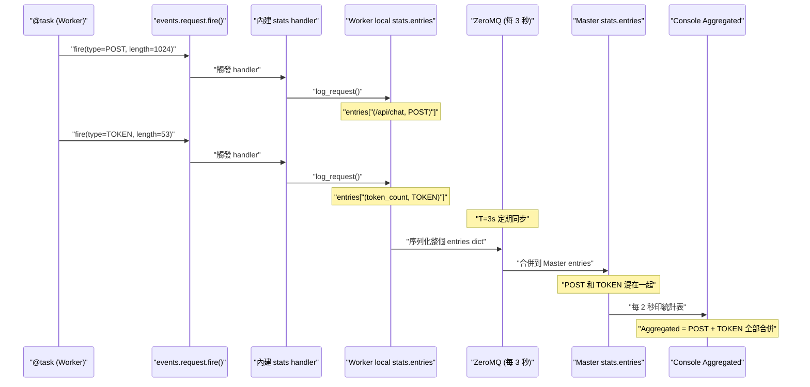
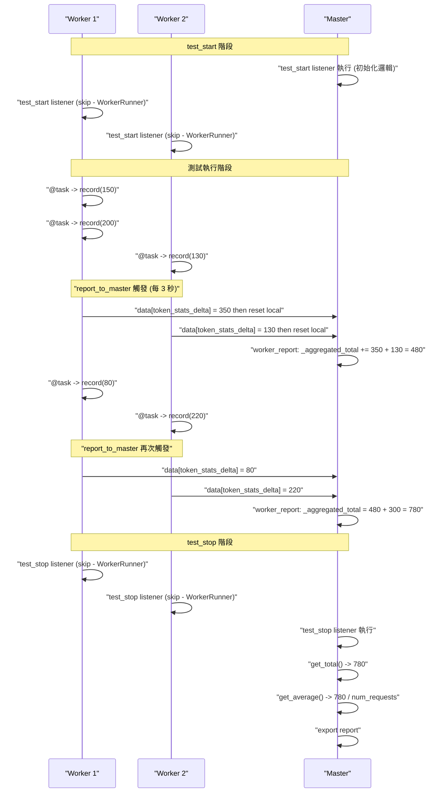
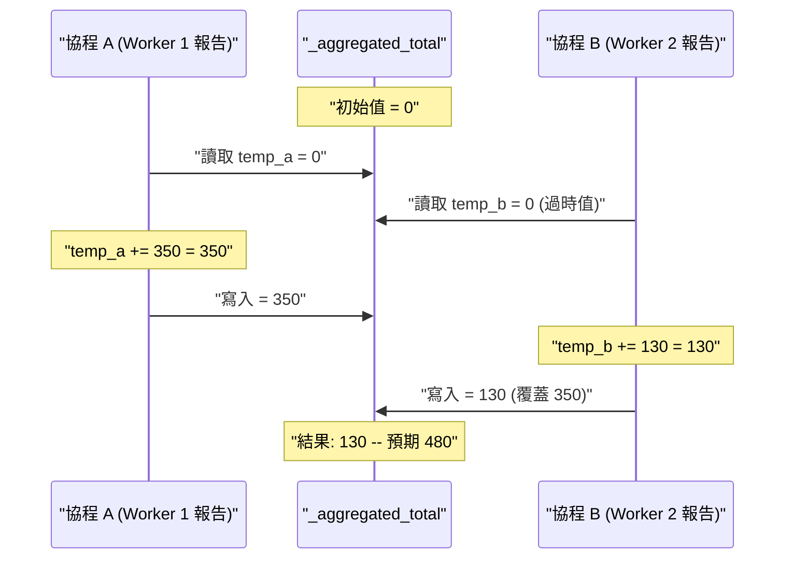

# Locust 自定義指標跨進程聚合: 從 V1 到 V2

> Updated: 2026-02-26 21:13


## 目錄
- [1. V1 方案: 虛擬 Stats Entry](#1-v1-方案-虛擬-stats-entry)
    - [1.1. 核心概念](#11-核心概念)
    - [1.2. Stats Entry Key 結構](#12-stats-entry-key-結構)
    - [1.3. environment.stats.entries 的詳細結構](#13-environmentstatsentries-的詳細結構)
    - [1.4. 為什麼選用 response_length](#14-為什麼選用-response_length)
    - [1.5. V1 TokenStats 模組實作](#15-v1-tokenstats-模組實作)
- [2. V1 的致命缺陷: Aggregated 統計污染](#2-v1-的致命缺陷-aggregated-統計污染)
    - [2.1. 污染現象與數值影響](#21-污染現象與數值影響)
    - [2.2. remove_from_console 無法根治的原因](#22-remove_from_console-無法根治的原因)
- [3. V2 方案: report_to_master 自定義聚合](#3-v2-方案-report_to_master-自定義聚合)
    - [3.1. 核心概念與事件機制](#31-核心概念與事件機制)
    - [3.2. 數據流時序: Delta 增量同步](#32-數據流時序-delta-增量同步)
    - [3.3. V2 TokenStats 完整模組實作](#33-v2-tokenstats-完整模組實作)
    - [3.4. locustfile 整合方式](#34-locustfile-整合方式)
    - [3.5. 完整資料流: 從啟動到輸出報告](#35-完整資料流-從啟動到輸出報告)
- [4. 關鍵設計決策深度解析](#4-關鍵設計決策深度解析)
    - [4.1. 為什麼發送 Delta 而非累計總數](#41-為什麼發送-delta-而非累計總數)
    - [4.2. Thread Safety: 兩把 Lock 的必要性](#42-thread-safety-兩把-lock-的必要性)
    - [4.3. Runner 類型判斷與單多進程相容](#43-runner-類型判斷與單多進程相容)
    - [4.4. report_to_master 與 worker_report 的觸發時序](#44-report_to_master-與-worker_report-的觸發時序)
- [5. V1 vs V2 方案全面比較](#5-v1-vs-v2-方案全面比較)
    - [5.1. 功能與正確性對比](#51-功能與正確性對比)
    - [5.2. Console 輸出對比](#52-console-輸出對比)
- [6. 進階注意事項與 Pitfalls](#6-進階注意事項與-pitfalls)
    - [6.1. ZeroMQ 同步延遲](#61-zeromq-同步延遲)
    - [6.2. total_content_length 只支援整數](#62-total_content_length-只支援整數)
    - [6.3. Race Condition 前提](#63-race-condition-前提)
    - [6.4. 多指標擴展 Pattern](#64-多指標擴展-pattern)

## 1. V1 方案: 虛擬 Stats Entry

前置知識: 本篇假設你已理解 Locust Event System 的運作機制（`fire()` vs `log_request()`、Multi-Process 事件鏈路、class variable 記憶體隔離問題）。如果尚未閱讀，請先參考 "Locust Event System 與 Multi-Process 底層機制"。

**V1 一句話總結:** 建立虛擬的 Stats Entry，透過 `events.request.fire()` 把 token count 塞進 `response_length`，借用 Locust 內建的 stats 同步機制來跨 Worker 聚合。問題是 ZeroMQ 同步整個 `stats.entries` dict 不區分真實與虛擬 entry，導致計算 token 的 `fire()` 也被當成真實 request，Aggregated 統計被污染（requests 翻倍、latency 腰斬）。

**V2 一句話總結:** 將 token 數據存在 TokenStats class 的 class variable 中，透過 `report_to_master` / `worker_report` 事件在 Worker-Master 定期通訊中附帶自定義 delta 數據。因為完全不經過 `stats.entries`，Aggregated 統計只包含真實 HTTP 請求，不會被污染。

### 1.1. 核心概念

既然 Locust 會自動同步 `events.request.fire()` 的數據，就借用這個機制: 創建一個**虛擬的請求類型**，把自定義指標塞進 `response_length` 欄位，讓 Locust 幫你做跨 process 匯總:

```python
events.request.fire(
    request_type="TOKEN",        # 自定義類型
    name="token_count",          # stats entry 名稱
    response_time=0,             # 不影響 latency 統計
    response_length=token_count, # 關鍵: 用此欄位記錄 token 數
    exception=None,
    context={},
)
```

### 1.2. Stats Entry Key 結構

Locust 使用 `(name, method)` tuple 作為 stats entry 的唯一 key。注意 `request_type` 對應 tuple 的**第二個**元素 (method)，`name` 對應**第一個**元素:

```python
events.request.fire(
    request_type="TOKEN",   # -> tuple 第二個元素 (method)
    name="token_count",     # -> tuple 第一個元素 (name)
    ...
)
# Locust 創建的 key = ("token_count", "TOKEN")
```

因此正確的 key 寫法:

- 正確: `STATS_KEY = ("token_count", "TOKEN")`
- 錯誤: `STATS_KEY = "token_count"`

### 1.3. environment.stats.entries 的詳細結構

`environment.stats.entries` 是一個特殊的字典 (EntriesDict)，Key 是 `(name, method)` tuple，Value 是 `StatsEntry` 物件:

```python
environment.stats.entries = {
    ("/api/chat", "POST"): StatsEntry(
        name="/api/chat",
        method="POST",
        num_requests=100,
        total_content_length=5000,
    ),
    ("token_count", "TOKEN"): StatsEntry(
        name="token_count",
        method="TOKEN",
        total_content_length=530,
    ),
}
```

三種存取方式的差異:

```python
# 1. keys() - 獲得 tuple keys
for key in environment.stats.entries.keys():
    print(key)       # ("/api/chat", "POST") - tuple
    print(key[0])    # "/api/chat" - name
    print(key[1])    # "POST" - method

# 2. values() - 獲得 StatsEntry 物件
for stats in environment.stats.entries.values():
    print(stats.name)    # "/api/chat" - string 屬性
    print(stats.method)  # "POST" - string 屬性

# 3. items() - 獲得 (key, value) pair
for key, stats in environment.stats.entries.items():
    print(key)          # ("/api/chat", "POST") - tuple
    print(stats.name)   # "/api/chat" - string
```

實際應用中常用 `values()` 搭配 generator 查找特定 entry:

```python
chat_api_stats = next(
    (s for s in environment.stats.entries.values() if "/api/chat" in s.name),
    None,
)
```

驗證兩種取值方式等價:

```python
env.stats.log_request(method='POST', name='/api/chat', response_time=100, content_length=500)

stats1 = env.stats.entries[('/api/chat', 'POST')]       # 用 tuple key
stats2 = next((s for s in env.stats.entries.values() if s.name == '/api/chat'), None)

print(type(stats1))        # <class 'locust.stats.StatsEntry'>
print(stats1.name)         # '/api/chat'
print(stats1.method)       # 'POST'
print(stats1 == stats2)    # True - 同一個物件
```

### 1.4. 為什麼選用 response_length

Locust 的 `StatsEntry` 會自動匯總的屬性中，`total_content_length` (由 `response_length` 累加而成) 最適合用來承載自定義數值:

| StatsEntry 屬性 | 說明 | 適用性 |
|------|------|------|
| `num_requests` | 請求次數 - 自動 +1 | 已被真實 API 統計占用 |
| `total_response_time` | 累加所有 response_time | 會影響 latency 統計 |
| `total_content_length` | 累加所有 response_length | 適合承載自定義數值 |

### 1.5. V1 TokenStats 模組實作

```python
"""Token statistics module for multi-process Locust aggregation (V1)."""

from locust import events
from locust.env import Environment


class TokenStats:
    """處理 token 統計的 class，支援 multi-process 模式。"""

    STATS_KEY = ("token_count", "TOKEN")

    @staticmethod
    def record(token_count: int) -> None:
        """記錄 token 數量，透過 events.request.fire() 實現跨 process 同步。"""
        events.request.fire(
            request_type="TOKEN",
            name="token_count",
            response_time=0,
            response_length=token_count,
            exception=None,
            context={},
        )

    @staticmethod
    def get_total(environment: Environment) -> int:
        """從 Master 的匯總數據中取得總 token 數。"""
        stats = environment.stats.entries.get(TokenStats.STATS_KEY)
        return stats.total_content_length if stats else 0

    @staticmethod
    def get_average(environment: Environment) -> float:
        """計算平均每個請求的 token 數。"""
        total_tokens = TokenStats.get_total(environment)
        chat_api_stats = next(
            (s for s in environment.stats.entries.values()
             if "/api/chat" in s.name),
            None,
        )
        total_requests = chat_api_stats.num_requests if chat_api_stats else 0
        return total_tokens / total_requests if total_requests > 0 else 0.0

    @staticmethod
    def remove_from_console(environment: Environment) -> None:
        """從 stats entries 中刪除 TOKEN entry，避免污染最終報告。"""
        if TokenStats.STATS_KEY in environment.stats.entries:
            del environment.stats.entries[TokenStats.STATS_KEY]
```

設計重點:

- `@staticmethod`: 不需要實例化，直接 `TokenStats.record()` 即可呼叫
- `STATS_KEY` 常數: 確保 tuple key 的一致性
- `get_average()`: 從真實 API 的 `num_requests` 取得分母，而非用 TOKEN entry 自己的 `num_requests`
- `remove_from_console()`: 刪除 TOKEN entry 防止最終報告被污染

V1 方案中 `fire()` 優於 `log_request()` 的原因: `log_request()` 直接寫入 local stats 不經過事件系統，Multi-process 下 Master 無法聚合跨 Worker 的數據。而 `fire()` 走完整事件鏈路，Locust 內建 handler 自動處理跨 Worker 聚合。

## 2. V1 的致命缺陷: Aggregated 統計污染

### 2.1. 污染現象與數值影響

V1 方案雖然成功實現了跨 Worker 聚合，但產生了嚴重的副作用。要理解問題根源，先看 V1 的完整資料流:



關鍵在於: ZeroMQ 同步的是**整個 `stats.entries` dict**，不區分哪些是真實 HTTP 請求、哪些是虛擬 entry。`(token_count, TOKEN)` 跟 `(/api/chat, POST)` 一起被搬到 Master，一起被算進 Aggregated。

Locust Console 統計表底部的 "Aggregated" 行會合併**所有** stats entries，虛擬 TOKEN entry 導致多項統計數值被嚴重扭曲。

V1 的 Console 輸出:

```text
Type    Name            # reqs    50%    90%    ...
POST    /api/chat       22,122    2.5s   3.8s   ...
TOKEN   token_count     22,122    0ms    0ms    ...
        Aggregated      44,244    1.25s  1.9s   ...
```

| 統計項目 | 真實值 | 被污染後的值 | 影響原因 |
|------|------|------|------|
| num_requests | 22,122 | 44,244 (翻倍) | TOKEN 的 fire() 也被計為一次 request |
| Avg Latency | 2.5s | 1.25s (腰斬) | TOKEN 的 response_time=0 拉低平均值 |
| Min Latency | 800ms | 0ms | TOKEN entry 成為最小值 |
| RPS | 正確值 | 翻倍 | 多計了虛擬 request |

具體計算: 假設真實 API 有 10 個請求，平均 latency 為 1234ms，TOKEN entry 同樣產生 10 個虛擬 request（response_time=0），則 Aggregated 平均值 = `(1234 * 10 + 0 * 10) / 20 = 617ms`，被拉低一半。

### 2.2. remove_from_console 無法根治的原因

V1 嘗試用 `remove_from_console()` 在 `test_stop` 時刪除 TOKEN entry，但這只能清理最終報告。測試過程中 Master 每 2 秒印一次統計表，Aggregated 始終被污染。

如果改在 `stats_printer` 事件中每次印之前刪除，會產生更嚴重的問題: 後續 Worker 回報數據時 Locust 會重新建立 TOKEN entry，但累計值已被清空。反覆 "刪除 -> 重建" 的循環會導致 `test_stop` 時讀到的 token 數據不完整。

這個根本性的缺陷催生了 V2 方案。

## 3. V2 方案: report_to_master 自定義聚合

### 3.1. 核心概念與事件機制

V2 方案完全繞過 Locust 的內建 stats 系統，改用 Locust 提供的自定義數據聚合機制: `report_to_master` 和 `worker_report` 兩個事件。這對事件允許開發者在 Worker-Master 定期通訊中附帶自定義數據，既利用了 Locust 的定期同步通道，又不會干擾內建統計。

| 事件 | 觸發時機 | 執行位置 | 用途 |
|------|------|------|------|
| `report_to_master` | Worker 準備發送報告給 Master 時（每 3 秒） | Worker process | 將自定義數據附加到 `data` dict |
| `worker_report` | Master 接收到 Worker 報告時 | Master process | 讀取並聚合 Worker 發送的數據 |

核心差異: V1 把 token 數據塞進 `env.stats.entries`（與內建統計共用同一個數據池），V2 把 token 數據存在獨立的 class variable 中，完全與內建統計解耦。

### 3.2. 數據流時序: Delta 增量同步

每次 `report_to_master` 觸發時，Worker 發送的是自上次報告以來的**增量 (delta)**，而非累計總數，發送後立即重置本地計數器。這是避免 Master 重複累加的關鍵設計。

以 Worker 1 為例的完整時序:

| 時間 | Worker 動作 | _local_total | 發送給 Master | Master _aggregated_total |
|------|------|------|------|------|
| t=0s | record(50) | 50 | - | 0 |
| t=1s | record(60) | 110 | - | 0 |
| t=2s | record(40) | 150 | - | 0 |
| t=3s | report_to_master 觸發 | 0 (重置) | delta=150 | 150 |
| t=4s | record(80) | 80 | - | 150 |
| t=5s | record(120) | 200 | - | 150 |
| t=6s | report_to_master 觸發 | 0 (重置) | delta=200 | 350 |

### 3.3. V2 TokenStats 完整模組實作

```python
"""Token statistics module for multi-process Locust aggregation (V2)."""

import math
from threading import Lock
from locust import events
from locust.env import Environment


class TokenStats:
    """Token stats using worker_report for aggregation."""

    # Worker 本地計數器（每個 worker process 獨立）
    _local_total: int = 0
    _local_lock = Lock()

    # Master 聚合計數器
    _aggregated_total: int = 0
    _aggregated_lock = Lock()

    @staticmethod
    def record(token_count: int | float) -> None:
        """Record token count locally (per worker)."""
        if not isinstance(token_count, (int, float)) or isinstance(
            token_count, bool
        ):
            raise TypeError(
                f"token_count must be int or float, got {type(token_count).__name__}"
            )
        if not math.isfinite(token_count):
            raise ValueError(f"token_count must be finite, got {token_count}")
        if token_count < 0:
            raise ValueError(f"token_count must be >= 0, got {token_count}")

        with TokenStats._local_lock:
            TokenStats._local_total += int(token_count)

    @staticmethod
    def _get_local_delta_and_reset() -> int:
        """Get local accumulated tokens and reset."""
        with TokenStats._local_lock:
            delta = TokenStats._local_total
            TokenStats._local_total = 0
            return delta

    @staticmethod
    def _add_to_aggregated(delta: int) -> None:
        """Add delta to master's aggregated total."""
        with TokenStats._aggregated_lock:
            TokenStats._aggregated_total += delta

    @staticmethod
    def get_total(environment: Environment) -> int:
        """Get total token count (auto-detect runner type)."""
        from locust.runners import MasterRunner, LocalRunner

        if isinstance(environment.runner, MasterRunner):
            with TokenStats._aggregated_lock:
                return TokenStats._aggregated_total
        elif isinstance(environment.runner, LocalRunner):
            with TokenStats._local_lock:
                return TokenStats._local_total
        else:
            with TokenStats._local_lock:
                return TokenStats._local_total

    @staticmethod
    def get_request_count(
        environment: Environment, endpoint_name: str = "/api/chat"
    ) -> int:
        """Get total request count for a specific endpoint."""
        api_stats = next(
            (
                s
                for s in environment.stats.entries.values()
                if s.name == endpoint_name
            ),
            None,
        )
        return api_stats.num_requests if api_stats else 0

    @staticmethod
    def get_average(
        environment: Environment, endpoint_name: str = "/api/chat"
    ) -> float:
        """Calculate average tokens per request."""
        total_tokens = TokenStats.get_total(environment)
        total_requests = TokenStats.get_request_count(
            environment, endpoint_name
        )
        return total_tokens / total_requests if total_requests > 0 else 0.0

    @staticmethod
    def reset() -> None:
        """Reset all counters (useful for testing)."""
        with TokenStats._local_lock:
            TokenStats._local_total = 0
        with TokenStats._aggregated_lock:
            TokenStats._aggregated_total = 0


# === Event Listeners (模組載入時自動註冊) ===

@events.report_to_master.add_listener
def _on_report_to_master(client_id, data):
    """Worker -> Master: 發送累積的 token 增量。

    觸發時機: Worker 每 3 秒向 Master 發送報告時
    執行位置: Worker process
    """
    delta = TokenStats._get_local_delta_and_reset()
    data["token_stats_delta"] = delta


@events.worker_report.add_listener
def _on_worker_report(client_id, data):
    """Master: 接收並聚合 Worker 的 token 增量。

    觸發時機: Master 接收到 Worker 報告時
    執行位置: Master process
    """
    delta = data.get("token_stats_delta", 0)
    if delta > 0:
        TokenStats._add_to_aggregated(delta)
```

與 V1 的關鍵差異:

- `record()` 不再呼叫 `events.request.fire()`，改為直接累加到 `_local_total`
- 新增 `_get_local_delta_and_reset()` 實現原子的 "取值並重置" 操作
- `get_total()` 根據 Runner 類型自動判斷讀取 local 或 aggregated 計數器
- 移除了 `STATS_KEY` 和 `remove_from_console()`，因為不再寫入 stats entries
- 新增 input validation（型別、有限值、非負檢查）與 `reset()` 方法

### 3.4. locustfile 整合方式

```python
# locustfile.py
from locust import HttpUser, task, events
from locust.runners import WorkerRunner
from token_stats import TokenStats


class MyLoadTestUser(HttpUser):
    @task
    def test_api(self):
        response = self.client.post("/api/chat", json={...})
        if response.status_code == 200:
            message = response.json().get("message", "")
            TokenStats.record(self.token_length(message))


@events.test_stop.add_listener
def export_custom_stats(environment, **kwargs):
    """Export statistics when test stops (master process only)."""
    if isinstance(environment.runner, WorkerRunner):
        return  # Worker 直接跳過

    token_avg = TokenStats.get_average(environment)
    total_tokens = TokenStats.get_total(environment)
    total_requests = TokenStats.get_request_count(environment)

    # 不再需要 remove_from_console()
    print("=" * 60)
    print("Token Statistics")
    print(f"  Total Tokens: {total_tokens}")
    print(f"  Total Requests: {total_requests}")
    print(f"  Average Tokens per Request: {token_avg:.2f}")
    print("=" * 60)
```

### 3.5. 完整資料流: 從啟動到輸出報告

以下是 Multi-Process 模式下，從測試開始到最終輸出報告的完整資料流:



## 4. 關鍵設計決策深度解析

### 4.1. 為什麼發送 Delta 而非累計總數

如果 Worker 每次 `report_to_master` 時發送累計總數而非增量，Master 會在每個報告週期重複累加已經計入的數據:

```python
# 錯誤做法: 發送累計總數
@events.report_to_master.add_listener
def on_report(client_id, data):
    data["token_total"] = TokenStats._local_total  # 不重置
    # Master 會重複累加相同數據!
```

以 Worker 1 為例: t=3s 發送 total=250，t=6s 發送 total=330。Master 累加得到 250+330=580，但實際只有 330 個 token。

```python
# 正確做法: 發送增量並重置
@events.report_to_master.add_listener
def on_report(client_id, data):
    delta = TokenStats._get_local_delta_and_reset()  # 取值並重置
    data["token_delta"] = delta
    # Master 累加的是新增量，避免重複計算
```

`_get_local_delta_and_reset()` 將 "讀取" 和 "重置" 放在同一把 Lock 保護下，確保這兩步操作是原子的，不會在中間被其他協程插入新的 `record()` 導致數據遺失。

### 4.2. Thread Safety: 兩把 Lock 的必要性

V2 方案使用了兩把獨立的 Lock: `_local_lock` 保護 Worker 本地計數器，`_aggregated_lock` 保護 Master 聚合計數器。

**`_local_lock` 的保護場景:** Locust Worker 內部基於 gevent 協程運作。協程在 I/O 切換點可能交錯執行，`_local_total += int(token_count)` 涉及讀取、加法、寫入三個步驟，中間可能被其他協程插入:

```python
# 無 Lock 的 Race Condition
# 初始: _local_total = 100
# 協程 A: temp_a = _local_total -> 100
# [協程切換]
# 協程 B: temp_b = _local_total -> 100 (讀到過時值)
# 協程 B: _local_total = 100 + 30 = 130
# [協程切換]
# 協程 A: _local_total = 100 + 50 = 150 (覆蓋 B 的結果)
# 結果: 150 (預期 180，遺失 30)
```

**`_aggregated_lock` 的保護場景:** `_add_to_aggregated()` 雖然只在 Master 上被呼叫，但 Master 是用 gevent 處理網路 I/O 的。當多個 Worker 的報告幾乎同時到達時，Master 會 spawn 多個協程並發處理:

```python
# Locust Master 內部 (簡化)
def on_zmq_message(raw):
    data = deserialize(raw)
    gevent.spawn(events.worker_report.fire, data=data)  # 每個報告一個協程
```

假設 4 個 Worker 都在第 3 秒發送報告，Master 幾乎同時收到 4 個 ZeroMQ message，就會有 4 個協程並發執行 `_on_worker_report`，每個都會呼叫 `_add_to_aggregated`。協程雖然不是真正的多線程，但 `+=` 操作不是原子的（讀取 -> 加法 -> 寫入），gevent 可能在讀取和寫入之間切換到另一個協程:



加上 Lock 後，協程 B 必須等協程 A 釋放鎖才能讀取，讀到的是最新值 350，加上 130 得到正確的 480。Lock 保護的不是 "多個進程"，而是**同一個 Master 進程內多個並發協程**同時修改 `_aggregated_total` 的情況。

| Lock | 保護對象 | 並發來源 | 風險等級 |
|------|------|------|------|
| `_local_lock` | Worker 本地計數器 | 多個 HTTP 請求協程同時呼叫 `record()` | 中等 |
| `_aggregated_lock` | Master 聚合計數器 | 同一 Master 內多個協程並發處理 Worker 報告 | 高 |

兩把 Lock 的效能影響均為納秒級，屬於防禦性編程的最佳實踐。

### 4.3. Runner 類型判斷與單多進程相容

`get_total()` 透過檢查 `environment.runner` 的類型來決定讀取哪個計數器:

```python
from locust.runners import MasterRunner, LocalRunner

if isinstance(environment.runner, MasterRunner):
    return TokenStats._aggregated_total    # 多進程: 讀聚合值
elif isinstance(environment.runner, LocalRunner):
    return TokenStats._local_total         # 單進程: 讀本地值
```

在單進程模式 (`LocalRunner`) 下，`report_to_master` 和 `worker_report` 事件不會被觸發，數據始終留在 `_local_total` 中。在多進程模式下，Worker 的 `_local_total` 會被定期清空（delta 發送後重置），Master 的數據在 `_aggregated_total` 中。同一份程式碼在兩種模式下都能正確運作。

### 4.4. report_to_master 與 worker_report 的觸發時序

一個常見的疑慮是: `report_to_master` listener 取走 delta 並重置 `_local_total` 後，Worker 可能馬上又有新的 `record()` 進來，數據會不會錯？

答案是不會，因為這是**同一條 pipeline 的兩端**，整個流程是同步且有順序的:

```python
# Worker 端 (Locust 框架內部)
def send_report():
    data = {}
    events.report_to_master.fire(data=data)  # 1. listener 執行: 取 delta 重置 local
    zmq_socket.send(serialize(data))          # 2. 打包送出 (data 已包含 delta)
    # 3. 之後新的 record() 累加到已重置的 _local_total，屬於下一輪

# Master 端 (Locust 框架內部)
def receive_report(raw_message):
    data = deserialize(raw_message)           # 4. 收到完整的 data dict
    events.worker_report.fire(data=data)      # 5. listener 從 data 讀取 delta
```

步驟 1 和步驟 2 之間沒有協程切換點，`_get_local_delta_and_reset()` 在步驟 1 就把值取走並重置了。步驟 2 只是把已經準備好的 `data` dict 送出去。後續新進來的 `record()` 累加的是下一輪的 delta，會在下一次 3 秒週期時才被送出。`data` dict 的完整性由 ZeroMQ 的訊息傳輸保證。

## 5. V1 vs V2 方案全面比較

### 5.1. 功能與正確性對比

| 面向 | V1: events.request.fire() | V2: report_to_master / worker_report |
|------|------|------|
| 聚合方式 | 借用 Locust 內建 request 統計機制 | 自定義 Worker-Master 通訊 |
| 影響 Aggregated | 導致 requests 翻倍、latency/RPS 全錯 | 完全獨立，不影響任何內建統計 |
| 程式碼複雜度 | 約 30 行 | 約 80 行 |
| 正確性 | 數據正確但報告被污染 | 正確且無副作用 |
| 單進程支援 | 支援 | 支援（透過 Runner 類型判斷） |
| 多進程支援 | 聚合正常但污染統計 | 聚合正常且不污染 |
| Thread Safety | 依賴 Locust 內建處理 | 自行管理兩把 Lock |
| Input Validation | 無 | 型別、有限值、非負檢查 |
| 清理需求 | 需要 remove_from_console() | 不需要任何清理 |

### 5.2. Console 輸出對比

**V1 輸出（Aggregated 被污染）:**

```text
Type    Name            # reqs    50%    90%    ...
POST    /api/chat       22,122    2.5s   3.8s   ...
TOKEN   token_count     22,122    0ms    0ms    ...
        Aggregated      44,244    1.25s  1.9s   ...
```

**V2 輸出（完全正確）:**

```text
Type    Name            # reqs    50%    90%    ...
POST    /api/chat       22,122    2.5s   3.8s   ...
        Aggregated      22,122    2.5s   3.8s   ...

============================================================
Token Statistics
  Total Tokens: 10,771,240
  Total Requests: 22,122
  Average Tokens per Request: 487.30
============================================================
```

## 6. 進階注意事項與 Pitfalls

### 6.1. ZeroMQ 同步延遲

Worker 的數據約每 3 秒透過 ZeroMQ 同步到 Master。如果測試時間很短 (例如 5 秒)，最後一批 Worker 的數據可能還沒完全同步到 Master 就結束了，導致最終統計有誤差。短時間測試的結果應視為近似值。此限制同時影響 V1（stats entries 同步）和 V2（report_to_master delta 同步）。

### 6.2. total_content_length 只支援整數

此限制僅影響 V1 方案。`response_length` 在 Locust 內部會被轉為 int 累加到 `total_content_length`。如果需要記錄浮點數指標 (例如 cost per token 為 0.003)，需要先乘以倍數 (如 x1000) 再在讀取時除回來。V2 方案因為自行管理數據，可以直接處理浮點數（在 `record()` 中已包含 `int()` 轉換，如需浮點精度可移除）。

### 6.3. Race Condition 前提

單一 Worker 內部是基於 **gevent 協程**運作，不是真正的 multi-thread，所以同一個 Worker 內不會有 race condition。但如果有人在 Worker 裡使用了 Python 原生的 `threading` 模組而非 gevent，就可能產生競爭條件。V2 方案透過 `threading.Lock` 提供了額外的安全保障。

### 6.4. 多指標擴展 Pattern

如果需要同時追蹤多個指標 (如 input tokens / output tokens / latency breakdown)，V1 和 V2 的擴展方式不同。

**V1 擴展:** 為每個指標建立獨立的虛擬 stats entry:

```python
events.request.fire(
    request_type="INPUT_TOKEN",
    name="input_tokens",
    response_time=0,
    response_length=input_count,
    exception=None, context={},
)
events.request.fire(
    request_type="OUTPUT_TOKEN",
    name="output_tokens",
    response_time=0,
    response_length=output_count,
    exception=None, context={},
)
```

**V2 擴展:** 在同一個 data dict 中附加多個 key:

```python
@events.report_to_master.add_listener
def _on_report_to_master(client_id, data):
    data["input_token_delta"] = InputTokenStats._get_local_delta_and_reset()
    data["output_token_delta"] = OutputTokenStats._get_local_delta_and_reset()
```

V2 的擴展不會產生額外的虛擬 stats entry，因此無論追蹤多少指標都不會污染 Aggregated 統計。
